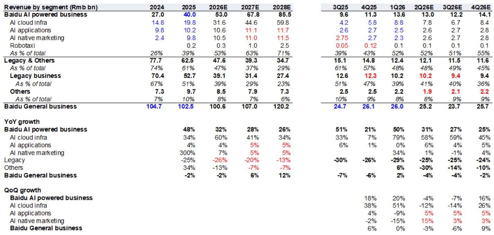
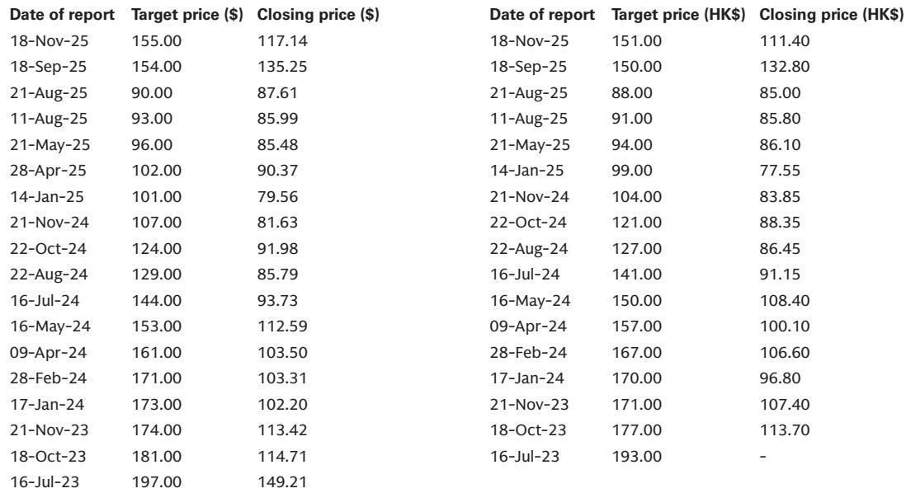
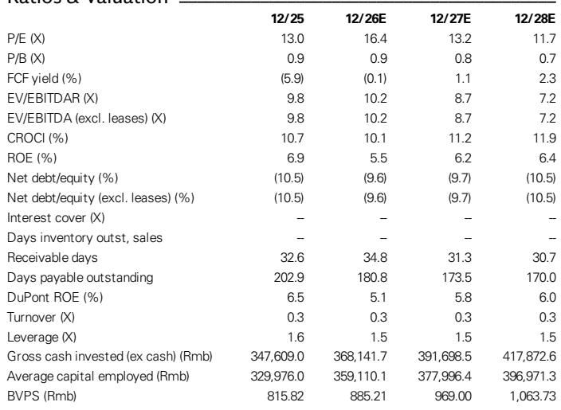

# 百度AI云正在重塑公司，其速度超越财报所能反映

百度2026年第二季度展望显示，公司正处于一个多数头条数字难以体现的转折点。百度核心业务收入预计同比下降4%至252亿元人民币，主要受广告收入下滑21%的影响。但同期数据显示，AI云基础设施收入同比激增58%，其中GPU云业务实现三位数增长。这两条轨迹之间的张力并非过渡期的注脚，而是公司核心的战略现实。

市场目前将百度定价为一家带有AI选项的传统广告业务公司。这种框架正在过时。到2026年底，AI驱动业务预计将占总收入的53%，高于2024年的26%。广告业务曾是其主导引擎，但将首次降至百度核心业务收入的50%以下。业务构成的转变速度超过了损益表所能反映的信号，而研究启示正源于这种转变，而非总体数字。

但转型也伴随着成本。百度正在2026年下半年加速AI模型训练投入，特别是在GPU采购和计算资源方面，以缩小与国内领先同行的差距。百度核心业务运营利润在第一季度稳定在同比下降19%后，预计第二季度仅温和改善至下降18%，随后随着AI支出增加而再次下滑。2026年全年预测显示百度核心业务运营利润下降3%。增长故事与利润率故事正朝相反方向拉扯，短期结果取决于观察者更看重哪股力量。

## AI云基础设施已成为主要增长引擎，在收入和利润率轨迹上均超越同行

预测中最引人注目的数据点是2026年第二季度AI云基础设施收入同比增长58%，其中GPU云业务预计保持三位数增长。这并非单季度异常。2026年全年AI云基础设施收入预估为316亿元人民币，高于2025年的198亿元，年增长60%。到2028年，预测达到598亿元，较2025年基数增长两倍以上。

这一轨迹的战略意义不仅在于增长率，更在于其背后的利润率机制。GPU云服务利润率高于传统项目制云合同，随着其在AI云总收入中占比提升，该板块整体盈利能力逐季改善。报告明确指出，这种结构转变是AI云利润率扩张的主要驱动力，同时传统项目制业务盈利能力也在提升。这意味着百度的云业务不仅是在规模增长，更是在向结构性更高利润率的模式演进。

这一动态对百度整体研究框架至关重要，因为AI云板块现已足够大，能够影响公司整体盈利能力。2026年第一季度，AI驱动业务贡献了总收入的52%。到2026年第四季度，这一比例预计将达到55%。转折点已经过去。问题在于云业务利润率的改善速度能否抵消AI投入支出带来的利润率拖累。

## 广告业务在相对规模和结构性占比上均呈收缩，其对整体业务的拖累随时间递减

2026年第二季度广告收入同比下降21%幅度较大，但更重要的数字是结构性趋势。随着AI工具的普及，用户行为变化正在侵蚀传统搜索广告，而百度在AI搜索转型举措上尚未展现突破。宏观环境也带来一定影响。这些因素短期内均不太可能逆转。

然而，广告下滑的战略意义正随其在总收入中占比下降而减弱。2025年，传统业务仍占总收入的51%。到2026年，这一数字预计降至39%，到2028年降至23%。广告板块在相对规模上收缩，但其在收入组合中的权重下降更快。这形成了一种数学动态：广告对总收入增长的拖累每季度都在逐步减小。

报告估计，2026年广告占百度核心业务收入的比例已降至50%以下，低于2025年的60%以上。这一转变改变了观察者的计算方式。一个占收入40%的板块下滑21%，对总收入的影响远小于该板块占60%时的同等下滑。公司实际上是在通过增长而非修复问题，来摆脱传统业务的困扰。

## 加速AI模型训练投入将抑制短期运营利润复苏，尽管云业务利润率改善

预测中最微妙的张力在于云业务利润率的逐季改善与AI模型训练支出的刻意增加之间的平衡。百度核心业务运营利润预计在第二季度稳定在同比下降18%，较第一季度的19%降幅有所改善。改善源于云业务利润率提升和持续的成本控制。但这一轨迹并非直线延续。

公司正在2026年下半年加大AI模型训练投入，特别是GPU采购和额外计算资源。报告明确指出，这些投入旨在帮助百度在AI竞赛中追赶国内领先同行。支出并非可选，而是竞争所需。但它直接带来成本：随着支出增加，对盈利的影响将在下半年逐步显现，2026年全年百度核心业务运营利润预测为下降3%。

这形成了观察者必须权衡的战略张力。云业务利润率在改善，但推动这一增长的AI投入支出也在压制短期盈利能力。两者相互关联。驱动利润率改善的GPU云增长，依赖于同样推动投入支出的GPU采购。公司实际上是在投资于能产生最高利润率收入流的资产基础，但这些资产的折旧和运营成本在收入效益完全实现之前就已影响损益表。

资本支出轨迹使这一张力清晰可见。资本支出预计从2025年的121亿元增至2026年的205亿元，增幅达70%。到2028年，资本支出预计达到269亿元。自由现金流在2025年为负151亿元，预计2026年仍为负3.26亿元，2027年才转正。现金流转折点比收入转折点滞后约一年。

## 评估百度转型的分析框架

对于观察百度的人而言，关键分析挑战在于传统估值指标在转型期具有误导性。2026年16.4倍和2027年13.2倍的市盈率看似合理，但这是基于受广告下滑和AI投入双重压制的盈利计算的。AI云业务的潜在盈利能力尚未在总体数字中显现。

一个更有用的框架聚焦于三个递进问题。首先，AI云基础设施增长率是否可持续？第二季度58%的同比增长和GPU云的三位数增长，由多个行业的终端需求驱动，并得到百度全栈能力的支撑。报告未提示任何需求放缓，2028年预测也意味着持续复合增长。增长似乎有结构性支撑。

其次，云业务利润率改善能否超越AI投入带来的利润率压力？2026年的答案是否定的，这也是运营利润下降的原因。但资本支出周期是前置的。到2027年，资本支出增速预计放缓，而来自这些资产的收入基础继续扩大。随着资产基础稳定，运营杠杆应会改善。

第三，广告下滑最终能否稳定在一个不再实质性拖累总收入增长的水平？收入组合的结构性转变表明，到2027年，传统业务将仅占总收入的29%，低于2025年的61%。届时，即使广告继续下滑，对整体增长率的影响也将有限。拖累在数学上变得可控。

报告并未解答这些问题，而是提供了界定问题的数据。关键洞察在于，百度已不再是一家主要尝试AI的广告公司。它是一家正在逐步收缩传统广告业务的AI基础设施公司。估值最终应反映这一现实，但时机取决于盈利轨迹何时向上拐头，这可能在2027年而非2026年。

## 全年运营利润下降掩盖了业务质量的结构性改善

2026年百度核心业务运营利润下降3%的预测，表面上看令人沮丧。但下降的构成比方向更重要。2025年，公司61%的收入来自传统业务，39%来自AI驱动业务。2026年，这些比例预计将逆转：47%传统，53%AI驱动。收入基础正从下滑、低利润率的广告模式，转向增长、利润率改善的云基础设施模式。

EBITDA利润率比运营利润更能说明问题。EBITDA利润率预计从2025年的16.7%改善至2026年的20.4%，并进一步升至2027年的22.9%。改善反映了AI云收入更高利润率的组合，以及传统业务的持续成本控制。然而，折旧和摊销从2025年的77亿元急剧上升至2026年的120亿元，由资本支出建设驱动。运营利润下降是折旧故事，而非业务恶化故事。

这一区分至关重要。公司正在用短期报告盈利换取长期资产创造。所创造的资产——GPU集群、AI基础设施、计算资源——正是云板块中产生最高利润率收入的资产。折旧费用是投入的机械结果，而非竞争弱势的信号。

已动用资本回报率预计从2025年的10.7%降至2026年的10.1%，随后在2027年恢复至11.2%，2028年升至11.9%。下降是暂时的，反映了资本部署与收入产生之间的滞后。2027年和2028年的复苏表明，这些投入预计将在整个周期内获得高于资本成本的回报。

## 2026年下半年将是评估研究框架最具信息量的时期

2026年下半年是AI投入支出与云业务利润率改善之间张力最为明显的时期。上半年受益于广告下滑的基数效应和云收入的初步增长。下半年将显示，加速的AI投入是否会导致运营利润显著减速，或者云业务利润率改善是否足够强劲以吸收额外支出。

季度预估提供了路线图。2026年第三季度，AI云基础设施收入预计为67亿元，较第二季度的78亿元环比下降，反映正常季节性。GPU云增长预计保持强劲，但第三季度相对收入水平较低。第四季度恢复至84亿元。这一模式表明，云业务并非不受季节性波动影响，但同比增长率依然稳健。

广告板块预计继续下滑，传统业务收入从第二季度的102亿元降至第三季度的94亿元，第四季度维持在94亿元。下滑速度似乎正在放缓，但报告未提示转折点。

最重要的未知因素是下半年AI模型训练投入的规模。报告指出对盈利的影响将在该期间逐步显现，但未提供支出的具体季度细分。观察者需关注第三和第四季度的GPU采购速度和运营支出轨迹，以评估支出是否高于或低于全年预测。

*仅供参考。部分内容可能基于源材料通过AI辅助生成、翻译、总结或编辑，可能存在遗漏或错误。请独立核实。本文不构成专业建议。*

仅供参考。部分内容可能基于源材料通过AI辅助生成、翻译、总结或编辑，可能存在遗漏或错误。请独立核实。本文不构成专业建议。

