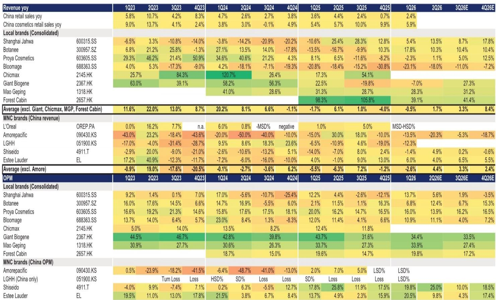
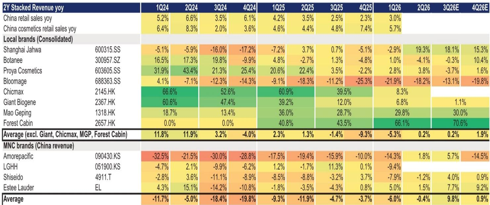
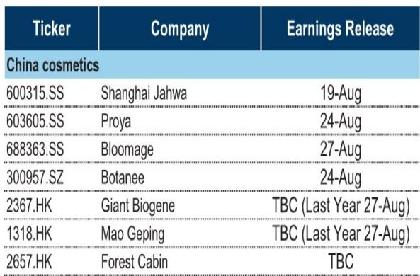

# 中国化妆品行业上半年观察：增长驱动与利润分化

尽管一季度行业整体表现平稳，最新研究预计，所覆盖的中国化妆品公司将在二季度迎来收入增长加速。这一判断的核心依据并非宏观消费回暖，而是公司层面的产品升级、渠道调整和新品牌放量。但与此同时，线上渠道的利润率仍在变化，公司间的利润分化将比收入分化更显著。

报告预计，毛戈平和森林家园将在上半年领跑增长，收入同比增速分别达到28%和39%。上海家化和贝泰妮紧随其后，二季度收入增速预计为14%和10%。珀莱雅则相对温和，二季度增速约为1%。巨子生物上半年收入预计同比下降7%，主要受高基数影响，但全年展望仍在正轨。华熙生物继续调整，预计上半年收入同比下降18%。

## 1. 核心品牌企稳，新兴品牌成为增长主力

研究认为，二季度收入加速的驱动力来自两个层面。一方面，核心品牌开始企稳。报告预计，珀莱雅核心品牌、Comfy和Winona将从一季度高达双位数的同比下滑，收窄至二季度低个位数增长。另一方面，新兴品牌正在成为更重要的增长引擎。Off-relax、花知晓、胶原蛋白、Winona Baby、AXOMED、Dr Yu和佰草集等品牌，预计可实现最高50%的同比增长。

> **观察：** 新兴品牌的高增速是这份报告中最值得关注的信号。它意味着，对于多数公司而言，增长的重心正在从单一主力品牌转向多品牌矩阵。能否将第二、第三品牌规模化，将决定公司未来两年的增长空间。

## 2. 线上利润率持续变化，线下效率成为缓冲

收入加速的另一面是利润率的不确定性。研究指出，线上渠道的回报表现仍然参差不齐，线上利润率整体呈节奏变化趋势。能够缓解这一不确定性的公司，往往在线下渠道有更强的议价能力。毛戈平和森林家园的线下同店销售增速保持在12%以上，这帮助它们维持了相对稳定的营业利润率。贝泰妮则通过战略性定价动作来应对线上不确定性。上海家化则受益于一季度前置的营销支出和运营效率提升。

报告预计，巨子生物的净利润率将好于市场谨慎预期，隐含的线上净利润率约为25%左右，较2025年下半年的低20%区间有所改善，但同比仍有调整。

## 3. 下半年关注新品和全渠道扩张，但高基数构成挑战

进入下半年，研究认为，公司需要应对几个关键变量。首先是线上增长的可持续性。高频抖音监测数据显示，7月至今的非旺季期间，各品牌GMV同比波动较大，但毛戈平、上海家化和森林家园仍有望保持稳健势头。其次是全球品牌在中国市场的竞争正在升温，叠加2025年下半年较高的基数，本土品牌面临的不确定性不容忽视。

应对措施包括经典产品升级、新品或新业务线推出，以及全渠道扩张。报告特别提及，珀莱雅和森林家园正在进行经典产品升级，巨子生物、森林家园和Winona在推进新品或新业务线，毛戈平和森林家园则在拓展全渠道布局。

> **观察：** 幅度在10%至27%之间，主要反映估值倍数压缩，而非盈利预测的大幅调整。这意味着，报告对行业基本面的判断并非负面，但市场定价已经反映了更谨慎的预期。对于关注这个赛道的读者，下半年新品推出的节奏和线上ROI的变化，将是比收入增速本身更值得追踪的指标。

For informational purposes only. Portions may be generated,translated,summarized,or edited with AI assistance based on source materials and may contain omissions or errors. Please verify independently. This is not investment,legal,tax,accounting,or other professional advice.

For informational purposes only. Portions may be generated,translated,summarized,or edited with AI assistance based on source materials and may contain omissions or errors. Please verify independently. This is not investment,legal,tax,accounting,or other professional advice.

