# 生命科学工具与诊断行业：2Q26 业绩预览——GS工具追踪器与相关市场追踪器更新

## 执行摘要

年初至今，工具板块相对于整体市场表现有所差异（回报率为-9%，而标普500为+10%），因为多家公司的一季度业绩与此前被认为保守的指引基本一致。工具领域再次面临这样的局面：为了实现我们覆盖范围内多家公司的全年指引，全年有机增长需要呈现逐季改善。我们持续关注几个我们认为可能推动终端市场改善和增长的因素，包括：1）由本土化趋势驱动的CDMO需求以应对关税影响；2）可能在2026年底/2027年初出现拐点的生物处理设备；3）2026年第二季度呼吸道检测相关不利因素的消退；4）临床阶段生物技术融资改善，可能从2026年下半年开始转化为支出；5）对下游制药制造的持续投入；以及6）由半导体和周期性模式驱动的工业领域表现。我们对美国学术与政府市场的潜在复苏持谨慎态度，虽然近期临床前生物技术融资的改善令人鼓舞，但我们认为这需要时间才能在支出模式中体现。

Evie Koslosky
+1(212)357-1694 | e.v.koslosky@gs.com
GS & Co. LLC

Grey Smith
+1(212)934-1193 | grey.smith@gs.com
GS & Co. LLC

近期的读者交流主要围绕当前复苏的幅度和时机，本季度的关注点在于管理层对终端市场健康状况的评论，以及评估当前增长率是否反映了长期增长算法的根本性改变，还是疫情后的暂时性影响。我们仍然认为，对于我们所覆盖的多个公司而言，当前估值提供了有吸引力的入场点，因为增长可能会从此加速，尽管节奏尚不确定。在本报告中，我们更新了GS工具追踪器，该追踪器观察到2026年第二季度相较于2026年第一季度的增长略有加速，并在另一份报告中更新了GS相关市场追踪器。

## 我们关注的图表

图表1：根据GS工具追踪器，2026年第二季度终端市场增长持续分化
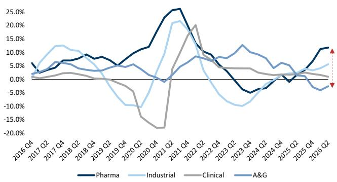
来源：GS全球研究

图表2：近期单克隆抗体销量按体积计算，高于历史平均增长水平
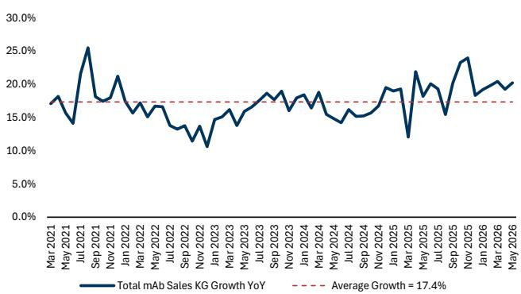
KG = 千克
来源：IQVIA，GS全球研究

图表3：2026年第二季度临床前生物技术风险投资融资加速
同比增长
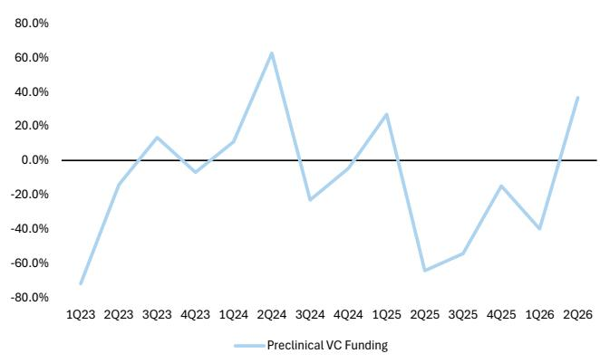
来源：Biopharma Dive

图表4：自一季度财报以来，工具板块平均估值倍数有所扩大
12个月工具板块与标普500 EV/EBITDA
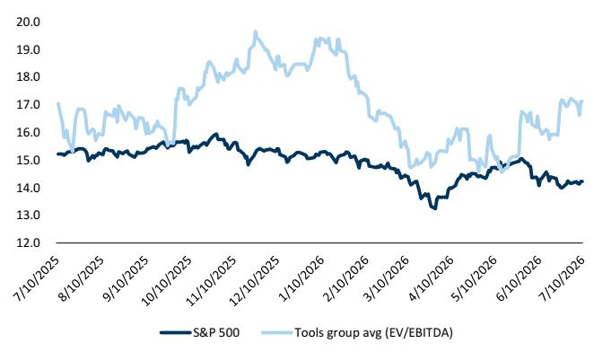
来源：FactSet

## GS工具追踪器更新

## 什么是GS工具追踪器？

GS工具追踪器是一个专有的市场增长模型，它汇集了4个不同工具终端市场（生物制药、工业、临床诊断和学术/政府）的17个季度数据集，然后根据每个数据集与各终端市场的相关性进行加权，以帮助确定各终端市场的增长估计。然后，它根据工具板块的整体风险敞口对终端市场增长进行加权，以提供季度总市场增长估计。增长每季度波动，与工具公司的收入增长一致，但长期平均增长率约为5%，与该领域管理团队的市场增长率估计一致。通常，生物制药是工具追踪器中增长最快的终端市场，长期平均增长率在高个位数范围内，工业在低个位数，临床诊断在低个位数，学术在中个位数。我们承认，追踪器不会考虑某些动态，包括美国以外的学术资金、临床诊断菜单扩展/定价以及生物类似药销量提升，但我们认为该追踪器是帮助读者定位并提供市场整体概览的工具。总体而言，GS工具追踪器与工具板块平均收入增长的相关性为86%，并且在80%的季度中正确判断了增长的加速或减速。

有关GS工具追踪器及我们上次更新的更多信息，请参阅我们的生命科学工具启动报告。

图表5：GS工具追踪器 vs 平均有机增长
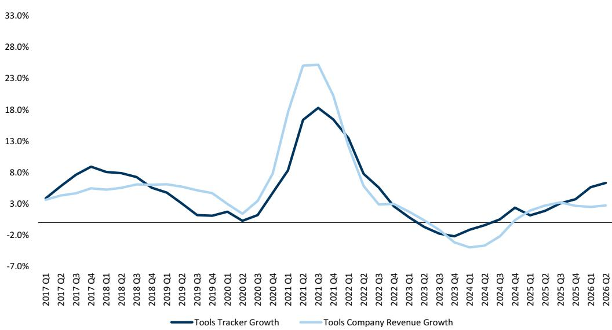
来源：公司数据，GS全球研究

图表6：终端市场数据集构成

<table><tr><td>终端市场</td><td>数据集</td></tr><tr><td>生物制药</td><td>制药研发支出 生物技术研发支出 中国研发支出 中国资本支出 制药资本支出 生物技术资本支出 生物技术IPO 生物技术风险投资融资</td></tr><tr><td colspan="2"></td></tr><tr><td>学术/政府</td><td>国立卫生研究院支出 国家科学基金会支出</td></tr></table>

来源：公司数据，GS全球研究

<table><tr><td>终端市场</td><td>数据集</td></tr><tr><td>工业</td><td>耐用品新订单 采购经理人指数 半导体资本支出 中国GDP</td></tr><tr><td colspan="2"></td></tr><tr><td>临床诊断</td><td>医院入院人数 LH诊断量 常规检测量</td></tr></table>

图表7：工具追踪器——生物制药增长
4季度滚动平均
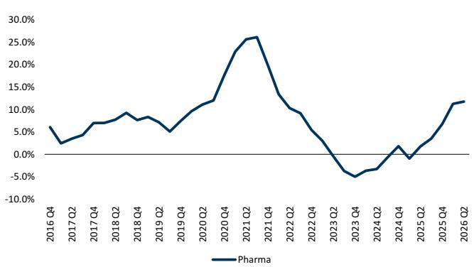
来源：GS全球研究

图表8：工具追踪器——工业增长
4季度滚动平均
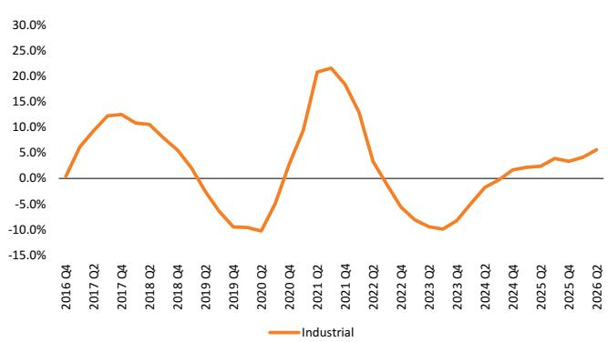
来源：GS全球研究

图表9：工具追踪器——临床诊断增长
4季度滚动平均
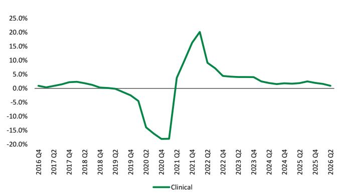
来源：GS全球研究

图表10：工具追踪器——学术与政府增长
4季度滚动平均
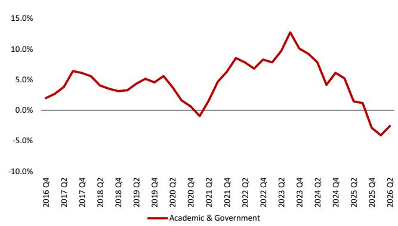
来源：GS全球研究

## GS工具追踪器 2026年第二季度更新

GS工具追踪器汇集了17个不同的数据集，以帮助我们进行历史及未来一个季度的市场增长估计。我们更新了截至本报告日期的数据，并包含以下每个终端市场的关键见解。我们注意到，部分数据集基于GS估计或尚未发布季度最后一个月的完整数据，因此我们对2026年第二季度的市场增长估计可能会有所变化。

总体而言，本季度我们观察到2026年第二季度潜在市场数据趋势相较于2026年第一季度略有加速，这主要得益于工业和学术（尽管仍为负值）终端市场的改善，而临床诊断基本持平，生物制药环比下降约2%，此前一季度表现强劲。虽然这与该领域多家公司设定的指引基本一致（该指引预计2026年第二季度增长加速），但我们认为，我们的终端市场追踪器连续两个季度发出加速信号，对于进入2026年下半年的工具公司而言是一个令人鼓舞的迹象，有助于推动有机增长。尽管每家公司仍存在特定因素，但终端市场的健康状况似乎正在逐步改善。有关更多细节，请参阅下面的终端市场要点，并联系我们的团队获取基础数据。

生物制药：根据我们的追踪器，第二季度生物制药终端市场实现了低两位数的增长，这得益于我们追踪的大多数数据集的广泛强势，尽管相较于强劲的2026年第一季度略有减速。加速主要由生物技术研发、中国资本支出和生物技术资本支出推动。我们注意到，我们的生物技术风险投资和IPO数据连续第三个季度保持高位，根据我们的估计，这大约需要1年以上的时间才能在生物技术资本支出中体现，这与近期管理层的评论一致（图表11）。

图表11：生物技术资本支出通常滞后于融资超过1年
4季度滚动平均
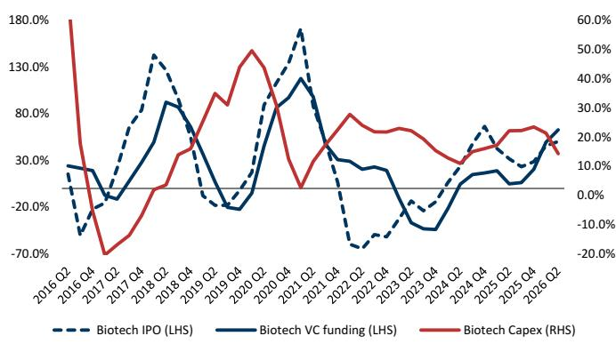
来源：GS全球研究，Pitchbook，Dealogic

工业：根据我们的追踪器，工业终端市场增长处于高个位数的高端，相较于第二季度有所加速，并继续远高于约低个位数的历史平均水平。该终端市场约3个百分点的加速主要得益于采购经理人指数和半导体资本支出的环比改善，但被耐用品新订单的疲软所抵消。鉴于周期性上升，我们继续看好工具覆盖范围内的工业终端市场，但同时指出近期的宏观不确定性是一个关键风险。根据历史模式，我们认为当前周期仍有增长空间，因为我们尚未看到工业增长率达到历史高点所显示的中等个位数水平。我们指出，安捷伦的CAM业务是一个关键受益者，该业务历史上与我们的工业追踪器密切相关。

临床诊断：临床诊断本季度相较于第一季度有所加速，并恢复至小幅正增长，这得益于持续较低的常规检测量，而医院入院人数加速了约1个百分点。我们注意到，我们的临床追踪器主要基于美国，因此中国的报销动态不会反映在此增长估计中。

学术/政府：根据我们的追踪器，学术终端市场仍远低于历史平均水平，国家科学基金会的支出连续第四个季度出现负增长，而国立卫生研究院的支出相较于第一季度略有加速，但仍处于低个位数增长范围。我们注意到，该终端市场的数据基于美国，因此相关市场刺激/欧洲动态不包括在内。虽然我们的追踪器侧重于支出，但我们观察到围绕学术资金的不确定性持续存在，因为许多研究人员面临多年期资助动态、博士生入学人数下降，以及尽管资金开始到位，但在将资金用于大型资本设备方面仍存在犹豫的持续讨论。

总体而言，这导致2026年第二季度相较于2026年第一季度的增长加速，虽然我们认识到工具追踪器无法捕捉到某些动态，但我们认为这对于工具终端市场是一个令人鼓舞的迹象，特别是考虑到读者对于工具公司能否在2026年下半年及之后持续实现增长加速的讨论。宏观相关的不利因素，包括中东地区的因素，可能对我们的数据构成风险，因为我们相信我们覆盖的大多数公司在该地区的风险敞口约为低个位数，而我们的工具追踪器并未充分体现这一点。

## GS相关市场追踪器

## 什么是GS相关市场追踪器？

我们追踪TMO、DHR、A、WAT和BRKR的相关市场订单，涉及（包括但不限于）液相色谱、气相色谱、质谱等仪器。自2024年3月相关设备更新刺激计划启动以来，我们已追踪到覆盖范围内相关仪器公司超过1,100个仪器订单，并在下方包含我们数据的最新更新。

有关GS相关市场追踪器及2026年第二季度更新的更多信息，请参阅我们的单独报告。

## GS相关市场追踪器 2026年第二季度更新

在2026年第二季度，利用我们的相关设备更新招标追踪器，我们在TMO、DHR、A（A为2026年第三季度）、WAT和BRKR中追踪到总计65个订单，同比下降57%。我们认为BRKR在本季度应最能抵御更广泛刺激相关订单增长不足的影响，因为其2026年第二季度订单同比增长约55%，而其他工具公司则出现下降。请参阅下方我们数据的更详细分解：

## 图表：

图表12：沃特世（WAT）按季度划分的仪器构成
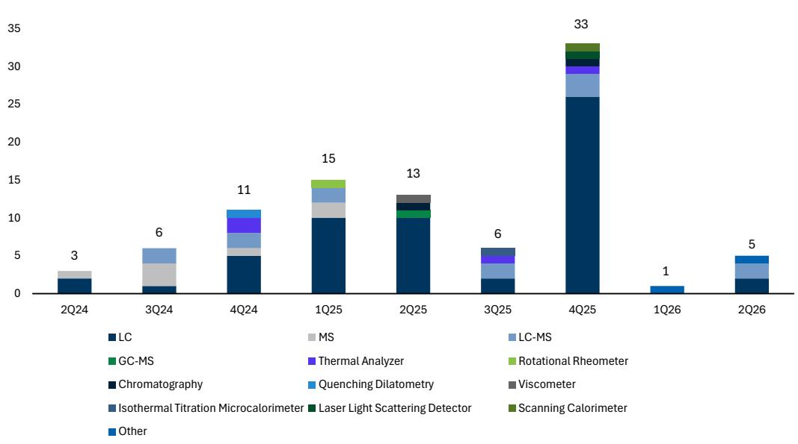
来源：GS全球研究汇编数据，中国招标网

图表13：安捷伦（A）按季度划分的仪器构成
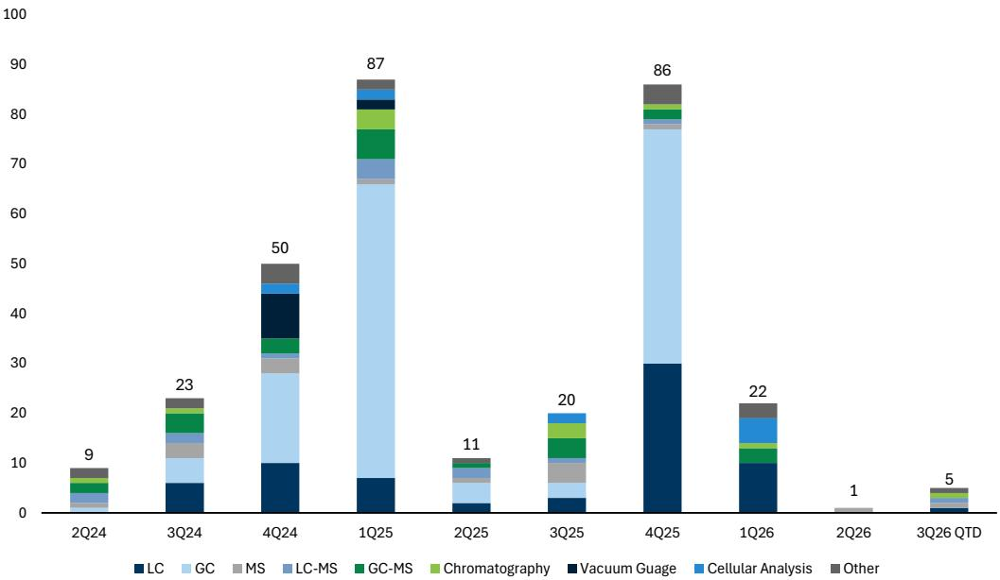
*2026年第三季度至今代表2026年5月1日至2026年7月5日
来源：GS全球研究汇编数据，中国招标网

图表14：赛默飞世尔科技（TMO）按季度划分的仪器构成
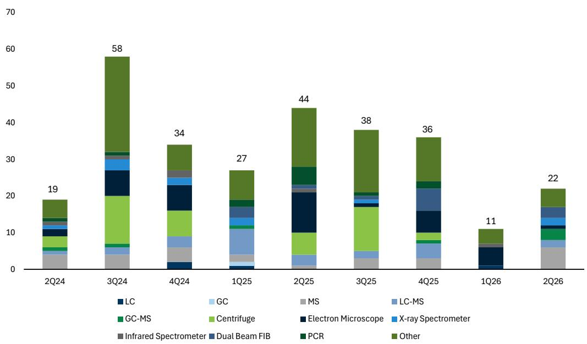
来源：GS全球研究汇编数据，中国招标网

图表15：丹纳赫（DHR）按季度划分的仪器构成

来源：GS全球研究汇编数据，中国招标网

图表16：布鲁克（BRKR）按季度划分的仪器构成
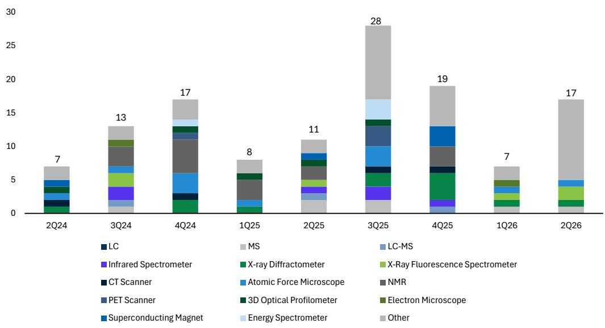
来源：GS全球研究汇编数据，中国招标网

图表17：2026年第二季度 vs 2025年第二季度按公司划分的中标情况
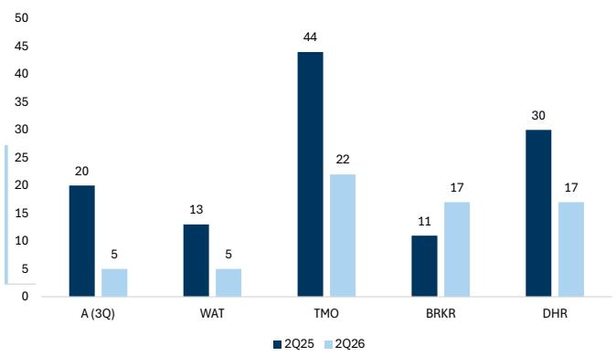
*A 2026年第三季度估计（反映2026年5月1日至2026年7月5日）/ 2025年第三季度实际
来源：GS全球研究汇编数据

图表18：2026年第一季度 vs 2025年第一季度按公司划分的中标情况
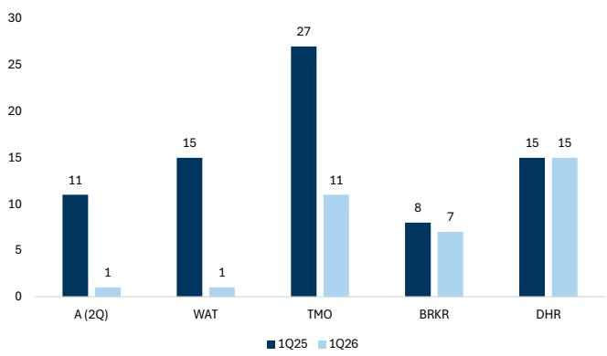
*A 2026年第二季度估计（反映2月1日至4月5日）/ 2025年第二季度实际
来源：GS全球研究汇编数据

图表19：2025年第四季度 vs 2024年第四季度按公司划分的中标情况
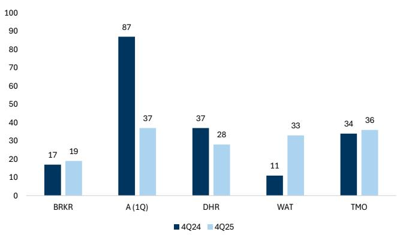
*A 2026年第一季度实际（反映11月1日至12月31日）/ 2025年第一季度实际
来源：GS全球研究汇编数据，中国招标网

图表20：2025年第三季度 vs 2024年第三季度按公司划分的中标情况
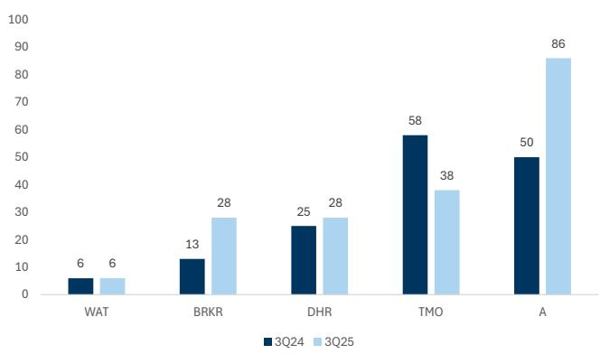
*A 2025年第四季度实际/2024年第四季度实际
来源：GS全球研究汇编数据，中国招标网

图表21：质谱仪进口至中国
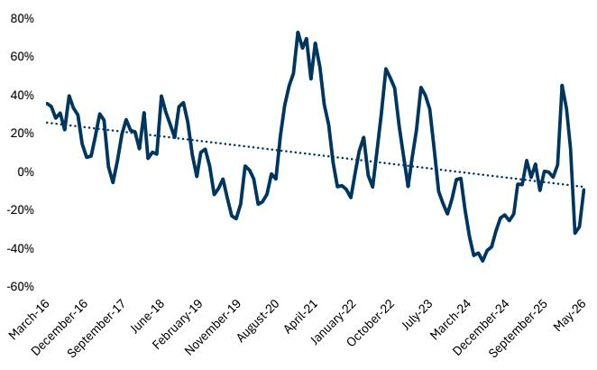
来源：GS全球研究汇编数据，中国招标网

图表22：液相色谱仪进口至中国
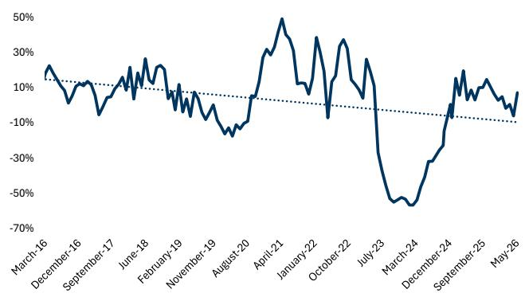
来源：GS全球研究汇编数据，中国招标网

生命科学工具：2026年第二季度财报日历及个股展望

图表23：即将到来的财报日历

<table><tr><td>公司</td><td>日期</td></tr><tr><td>A*</td><td>待定</td></tr><tr><td>BRKR</td><td>待定</td></tr><tr><td>DHR</td><td>2026年7月21日</td></tr><tr><td>MTD</td><td>2026年7月30日</td></tr><tr><td>RVTY</td><td>2026年8月4日</td></tr><tr><td>TMO</td><td>2026年7月23日</td></tr><tr><td>WAT</td><td>2026年8月4日</td></tr></table>

*安捷伦报告2026年第三季度

来源：公司数据，GS全球研究

生命科学工具预览

## 赛默飞世尔科技（TMO）——买入

对于2026年第二季度，我们预计有机收入增长3.1%，收入/每股收益为1173亿美元/5.70美元，而FactSet共识预期为1171亿美元/5.72美元。

## 季度

指引：TMO重申其2026年有机收入增长指引为3-4%，并将调整后营业利润率扩张预期从50个基点上调至70个基点。公司继续预计2026-2027年有机增长为3-6%。对于2026年第二季度，TMO设定了约3%的有机增长预期，这包括稳定的终端市场趋势以及前一季度不利因素（销售天数、CDMO合同阶段）的正常化。管理层预计，随着第一季度约100个基点的不利因素（少一个销售日）不再重复，以及制药服务（CDMO）收入阶段的影响减弱，同比增长将逐季改善，尽管收入仍偏向下半年。公司仍预计2026年终端市场动态基本不变，与新冠疫情相关的收入同比影响将减少100个基点。

图表24：2026年有机增长估计的阶段分布
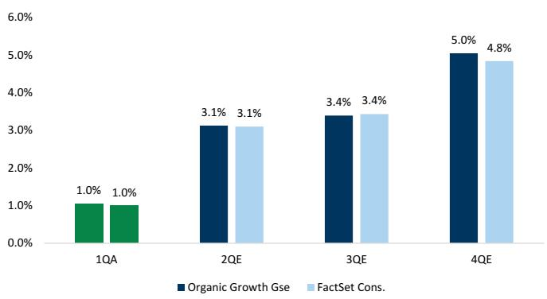
来源：GS全球研究，FactSet

关键讨论：进入2026年第二季度财报，TMO的关键讨论继续集中在2026财年3-4%指引中所包含的保守程度。我们认为，有几个因素将有助于推动增长从第一季度的1%加速，包括：1）CDMO收入偏向下半年；2）CRO收入因2025年下半年临床阶段生物技术融资转化为2026年下半年的支出而表现强劲；3）Clario收购完成后CRO市场份额持续/加速增长；4）美国学术与政府市场面临更轻松的对比基数；5）第四季度销售天数带来的正面影响（对第一季度产生负面影响）。此外，公司可能受益于与本土化努力相关的CDMO订单增长，这由美国商务部制药关税调整申请（截止日期为2026年6月12日）所驱动。这些申请可能刺激订单增长，因为尚未拥有最惠国待遇协议的制药/生物技术公司在申请过程中寻求巩固其本土化计划。然而，关键风险包括由谨慎的生物技术支出（尤其是在近期才看到融资改善的临床前终端市场）以及美国学术与政府支出（迹象显示持续疲软）所导致的持续宏观不确定性。

## 我们的观点

TMO是一家多元化的复合增长型公司，其估值倍数年初至今压缩了3.0倍（NTM EV/EBITDA），因为第一季度的温和增长削弱了市场对复苏斜率预期。我们认为，对于一个拥有多个杠杆可实现2026年指引上行的优质业务而言，这代表了一个有吸引力的入场点，这些杠杆包括上述因素，以及第二季度来自美国商务部关税减免申请截止日期（6月）的额外收益，这可能导致公司就其美国本土CDMO业务发布好于预期的订单评论。

## 模型

我们预计2026/2027/2028年收入和每股收益分别为4781亿美元/5023亿美元/5313亿美元和24.84美元/27.15美元/30.26美元。我们维持目标Q5-Q8 EV/EBITDA倍数19倍和570美元的目标价。

我们对TMO给予报告评级。我们的12个月目标价为570美元，基于Q5-Q8估计。我们的估值方法使用目标EV/EBITDA倍数19倍。关键风险包括：（1）早期研发终端市场疲软影响其长期增长预期；（2）大型制药公司支出减少，若更多最惠国待遇协议未能实现，可能导致研发支出下降；（3）随着终端市场复苏路径变得更加不确定，长期计划预期降低；（4）美国学术与政府市场持续疲软。

## 丹纳赫公司（DHR）——买入

对于2026年第二季度，我们预计有机收入增长2.0%，收入/每股收益为610亿美元/1.84美元，而FactSet共识预期为610亿美元/1.83美元。

## 季度

指引：DHR在第一季度重申其2026年全年有机增长指引，位于其2026-2027年设定的3-6%范围的低端，即全年约3-4%。在2026年第二季度，DHR预计有机收入增长为低个位数，营业利润率为26.5%，这由较低的呼吸道检测量和加速的增长投资驱动，意味着利润率同比压缩80个基点。此外，有机增长和利润率扩张继续偏向下半年，因为它们开始面临下半年的不利因素，包括：1）与两个Aldevron客户相关的动态影响；2）美国学术和政府资金；3）中国诊断政策相关不利因素。

图表25：2026年有机增长估计的阶段分布
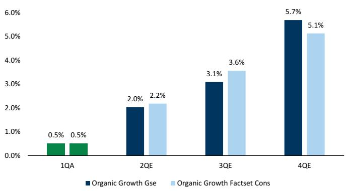
来源：GS全球研究，FactSet

关键讨论：进入第二季度，读者的问题主要集中在指引中隐含的下半年加速的可信度以及生物处理设备复苏的时机。公司指出了下半年更轻松的对比基数，包括Aldevron、中国诊断和美国学术与政府，以及第一季度呼吸道不利因素的消退，这应有助于根据管理层预期自然提升全年的增长率。在实现上行的杠杆方面，DHR第一季度生物处理设备订单增长30%，管理层目前预计不会在2026年转化为收入，然而，鉴于通常6-18个月的交货周期，这些订单有可能在本日历年内转化，从而带来相对于当前指引的上行。鉴于全年指引的逐步提升在很大程度上是几个关键领域更轻松对比基数的结果，我们认为读者的讨论集中在终端市场潜在改善的时机和幅度上，这将代表公司指引的上行空间。

## 我们的观点

DHR拥有强大的生物处理业务，在设备环境温和的情况下实现高个位数增长，然而，我们认为影响设备增长的不利因素正在开始缓解，基础生物药量继续强劲增长，推动额外的生物处理能力需求。随着近期订单增长转化为收入，我们可能会看到生物处理组合的增长加速，而其他终端市场（如美国学术与政府和Aldevron）则面临更轻松的对比基数，拖累减少。近期的价格走势代表了一个有吸引力的入场点，以受益于生物处理设备复苏，尽管我们继续关注下半年的呼吸道情况，因为公司预计第四季度将恢复正常的呼吸道季节。

## 模型

我们预计2026/2027/2028年收入和每股收益分别为2551亿美元/2692亿美元/2864亿美元和8.44美元/9.14美元/9.99美元。我们维持目标Q5-Q8 EV/EBITDA倍数19倍和230美元的目标价。

我们对DHR给予报告评级。我们的12个月目标价为230美元。我们的估值方法使用基于倍数的方法，目标Q5-Q8 EV/EBITDA倍数为20倍。关键下行风险：（1）学术和早期药物发现领域的进一步疲软可能影响我们的生命科学增长预期；（2）中国诊断相关不利因素持续至2026年以后；（3）生物处理设备在2026年全年持续落后；（4）可能导致我们的生物处理估计下调。

## 沃特世公司（WAT）——买入

对于2026年第二季度，我们预计有机收入增长4.6%，收入/每股收益为162亿美元/2.98美元，而FactSet共识预期为162亿美元/3.01美元。

## 季度

指引：在传统WAT业务实现两位数有机增长的一季度表现优异之后，公司上调了2026财年指引，包括有机收入增长范围在+6.5%至+8.0%（此前为+5.5%至+7.0%），并维持收购业务贡献30亿美元和3500万美元的协同效应，尽管第一季度超出预期4000万美元，这有助于降低下半年的风险。在2026年第二季度，WAT指引有机收入增长范围为+6.0%至+8.0%，收购业务贡献收入8.02亿美元。收购业务贡献意味着第二季度BD资产同比增长约2.5%。此外，第二季度承受了更高的利息支出和股份稀释的全部影响，在成本协同效应实现之前，这造成了第一季度的短期不利因素，而指引对基础业务和收购资产均包含保守假设，为进入该季度创造了更有利的设定。

图表26：2026年有机增长估计的阶段分布
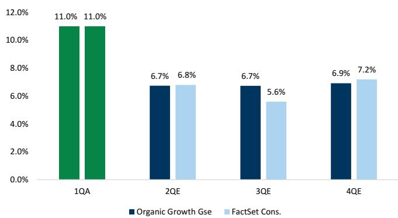
*WAT核心有机增长
来源：GS全球研究，FactSet

关键讨论：自一季度财报和指引上调以来，WAT股价上涨了+20%，这主要得益于读者情绪改善，认为整合驱动的增长算法的可持续性缓解了对收购资产的下行风险担忧。读者的讨论现已转向：1）公司能否执行收购资产指引中假设的增长加速；2）核心增长中包含的保守程度；3）鉴于溢价估值，股价还有多少上涨空间。在收购业务中，第二季度约2.5%的增长指引意味着较第一季度约250个基点的提升，这由呼吸道诊断不利因素的消退驱动。然而，如果公司开始受益于试剂、微生物学替换、服务附加或交叉销售收益方面的商业执行改善，且时间早于预期，这可能会推动第二季度指引的上行，因为这些举措预计要到下半年才会见效。此外，我们最近的实地考察强调了尚未开发的定价能力，如果定价举措比预期更早见效，这可以在2026年框架中已包含的50个基点之外推动上行。在核心业务中，公司有几个持续因素有助于推动高于同业的有机增长，包括强劲的下游制药需求、持续的LC-MS替换周期、GLP-1相关敞口以及将质谱仪交叉销售到收购渠道。此外，我们认为2026年核心指引是保守的，因为中国和化学业务的持续强势将代表当前增长预期的上行空间，这两者在第一季度的表现均远高于其全年预期。虽然近期估值倍数有所上升，但合并后的业务值得获得溢价估值，因为其周期性降低、规模/交叉销售优势、定价能力，并且它代表了一种基于执行的复苏，而非基于终端市场的复苏。

## 我们的观点

除了强劲的潜在增长驱动因素外，我们认为该业务在2026年有几个上行杠杆，包括核心业务中的中国和化学业务以及收购业务中的定价。长期来看，我们认为最近的交易扩大了WAT在诊断和临床研究领域的影响力，使其收入来源多样化，并提供了多个交叉销售机会。此外，我们认为BD资产的执行机会具有挑战性，但可以实现，并相信随着时间推移，市场将继续给予回报。

## 模型

我们预计2026/2027/2028年收入和每股收益分别为645亿美元/710亿美元/752亿美元和14.56美元/16.19美元/17.92美元。此外，在我们的模型中，我们更新了WAT利润率假设的阶段分布，以反映更近期的定价和商业策略执行。我们将目标Q5-Q8 EV/EBITDA倍数从此前的16倍上调至18倍，以反映更新的同业比较以及我们在实地考察后对商业执行信心的提升。我们将目标价从380美元上调至425美元，以反映修正后的倍数。

我们对WAT给予报告评级。我们的12个月目标价为425美元。我们的估值方法使用目标Q5-Q8 EV/EBITDA倍数18倍。关键风险包括：（1）近期收购BD生物科学和诊断解决方案业务存在整合风险，包括不可预见的成本、市场份额损失、制造问题等；（2）大型制药公司支出可能减少，可能导致资本支出投资减少，导致仪器替换周期短于预期；（3）WAT在核心业务和收购资产中的中国敞口可能因政策相关不利因素和可能取代WAT的本地竞争而面临挑战；（4）31%的收入暴露于工业终端市场，宏观相关不利因素可能对该细分市场的增长率产生负面影响，可能抑制资本设备投资。

## 安捷伦科技（A）——买入

对于2026年第三季度，我们预计有机收入增长5.7%，收入/每股收益为185亿美元/1.49美元，而FactSet共识预期为184亿美元/1.49美元。

## 季度

指引：安捷伦概述了其2026年第三季度核心收入增长指引为4.4%至5.9%，这意味着较第二季度有所下降，同时考虑到2026年剩余时间内更艰难的对比基数。管理层预计2026年第三季度营业利润率环比持平于第二季度（或同比上升120个基点），这主要由Ignite效率提升驱动，但被恢复正常的地理组合和通胀压力所抵消。公司预计第四季度利润率环比扩张约220个基点（或同比180个基点），这大致符合历史上第四季度相对于第三季度的利润率环比提升，在更正常的环境下（疫情前）这一提升约为200个基点。

图表27：2026年有机增长估计的阶段分布
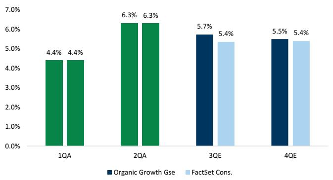
来源：GS全球研究，FactSet

图表28：GS工具追踪器工业估计与安捷伦CAM业务密切相关
4季度滚动平均
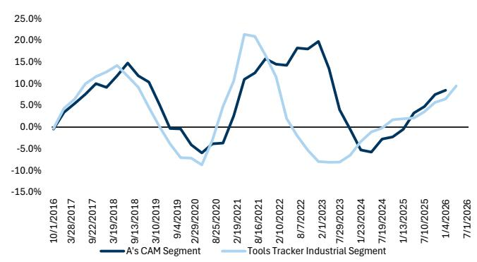
来源：GS全球研究，公司数据

关键讨论：虽然安捷伦2026财年第二季度财报的特点是化学终端市场和营业利润率均好于预期，但进入2026财年第三季度，读者的讨论是这些趋势在业务中的可持续性。化学终端市场约占公司CAM业务（化学与先进材料）的65%，其中约15%暴露于勘探和生产，约50%与炼油厂相关。这种多元化的客户基础使安捷伦受益，因为当油价上涨时，勘探和生产公司通常受益，导致更多资本支出，包括用于安捷伦的仪器，即使一些炼油厂可能面临更高的投入成本。此外，鉴于气相色谱是化学制造供应链的关键组成部分，并且安捷伦在气相色谱领域拥有领先的市场份额，我们认为安捷伦对该终端市场的特定敞口将在今年和明年实现可持续增长，因为老化的装机基础需要更换，使其免受已影响其他进入化学终端市场公司的宏观相关不利因素影响。在安捷伦的营业利润率方面，我们强调公司已实施的关键举措，包括战略定价、生产力和供应链敏捷性，我们预计这些举措将继续随着时间的推移使营业利润率受益，但注意到第三季度可能会因恢复正常的地理影响而被抵消。我们继续收到读者关于预期第三季度至第四季度营业利润率环比扩张约220个基点的问题，虽然公司指出这与历史季节性一致，但我们仍关注这一提升。此外，我们将关注其CDMO（Train C）新增产能可能带来的利润率影响，尽管我们预计这主要是2027年的动态，因为该产能的收入预计将在2027年春季产生。

## 我们的观点

安捷伦将受益于持续的生物制药仪器替换周期，以及未被充分认识的工业敞口进入周期性复苏（根据我们的工具追踪器），从而形成相对于同业的差异化增长，我们认为当前估计中并未反映这一点。我们认为，鉴于上述动态，安捷伦近期在化学终端市场和营业利润率方面的优异表现是可持续的。

## 模型

我们预计2026/2027/2028年收入和每股收益分别为745亿美元/794亿美元/843亿美元和6.06美元/6.71美元/7.53美元。我们维持目标Q5-Q8 EV/EBITDA倍数19倍和155美元的目标价。

我们对安捷伦给予报告评级。我们的12个月目标价为155美元。我们的估值方法使用目标19倍Q5-Q8 EV/EBITDA。关键风险包括：（1）大型制药公司支出减少，若更多最惠国待遇协议未能实现，可能导致资本支出投资减少，导致仪器替换周期短于预期；（2）在安捷伦的中国敞口中，本地竞争可能取代安捷伦，或各种负面地缘政治影响可能对增长造成不利因素；（3）全球宏观进一步疲软可能对我们关于安捷伦应用终端市场周期性上升的积极看法构成压力；（4）NASD业务疲软以及siRNA/mRNA进一步取消可能导致我们有机增长假设出现异常波动。

## Sotera Health——买入

对于2026年第二季度，我们预计收入增长5.1%，收入/每股收益为3.09亿美元/0.24美元，而FactSet共识预期为3.10亿美元/0.24美元。

## 季度

指引：展望2026年第二季度/2026财年，管理层预计第二季度Sterigenics业务与第一季度类似（第一季度按固定汇率增长6.1%），Nordion业务上半年收入占全年收入的40-45%（公司指引为低至中个位数固定汇率增长），Nelson Labs业务在第二季度恢复小幅增长。管理层预计全年Sterigenics收入增长中至高个位数固定汇率，Nordion增长低至中个位数固定汇率，Nelson Labs增长低个位数固定汇率，这假设公司整体定价为3-4%，其中Sterigenics处于高端，Nordion/Nelson Labs处于低端。

图表29：2026年固定汇率增长估计的阶段分布
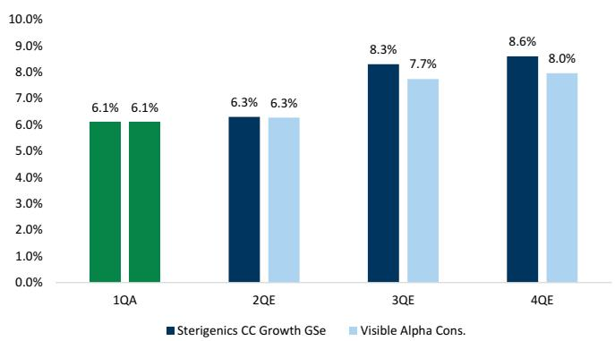
来源：GS全球研究，Visible Alpha共识数据

关键讨论：在我们启动覆盖后，SHC一直是多头和空头基金关注的主题，讨论集中在Sterigenics增长在更广泛的医疗科技量减速背景下的可持续性，以及诉讼动态。我们认为公司可以继续推动定价以抵消任何潜在的量疲软，并指出公司预计下半年Sterigenics收入增长将加速，这得益于更低的维护停机时间、合同可见性以及额外的X射线产能上线。此外，虽然公司在乔治亚州面临了几项积极的诉讼相关进展，但读者讨论的是，如果正在进行的诉讼中出现额外的清算事件，估值可能落在何处，这可能会支持估值向历史同业重新评级。

## 我们的观点

我们认为Sotera是一个高质量的可持续业务，20年持续的收入增长证明了这一点，这增强了公司通过为医疗科技/制药产品灭菌定价来抵消潜在较低量的能力。此外，我们认为与诉讼相关的潜在财务负债的清晰度有所提高，这应随着时间的推移反映在估值倍数中。

## 模型

我们更新了模型，反映2026/2027/2028年收入和每股收益分别为124亿美元/132亿美元/140亿美元和0.97美元/1.06美元/1.16美元，此前为124亿美元/132亿美元/140亿美元和1.00美元/1.09美元/1.20美元，以反映更新的折旧估计。我们将目标Q5-Q8 EV/EBITDA倍数从11倍上调至12倍，目标价从20美元上调至22美元，以反映修正后的估计和更新的倍数。

我们对SHC给予报告评级。我们的12个月目标价为22美元。我们的估值方法使用基于倍数的方法，目标Q5-Q8 EV/EBITDA倍数为12倍（与同业比较一致）。

下行风险：1）环氧乙烷法规与诉讼：SHC面临多起围绕其环氧乙烷设施的未决案件。如果案件数量大幅上升，或者他们输掉案件/和解金额高于我们当前估值中所包含的，他们可能需要赔偿附近居民和员工造成的损害，减少可用于再投资业务的现金水平，并加剧对环氧乙烷运营的担忧。2）新技术取代环氧乙烷灭菌：鉴于近期对环氧乙烷灭菌及其潜在人类健康影响的审查，医疗器械和制药公司可能寻求在可能的情况下将灭菌从环氧乙烷转向其他技术。3）地缘政治担忧：随着美国、加拿大、英国和欧盟对俄罗斯行业实施制裁，以及俄罗斯采取反制措施，这可能会扩大并可能影响核反应堆运营商，从而影响Co-60供应。管理层指出，俄罗斯钴供应风险约占2025年收入的0-2%。

## 布鲁克公司（BRKR）——卖出

对于2026年第二季度，我们预计有机收入增长4.4%，收入/每股收益为8.53亿美元/0.39美元，而FactSet共识预期为8.54亿美元/0.38美元。

## 季度

指引：在第一季度，BRKR重申其2026年全年有机收入增长1-2%以及营业利润率同比扩张250-300个基点（有机增长300-350个基点）。在2026年第二季度，BRKR指引有机收入增长恢复，范围为低至中个位数%，因为它们面临更轻松的对比基数，并且营业利润率环比显著提升。

图表30：2026年有机增长估计的阶段分布
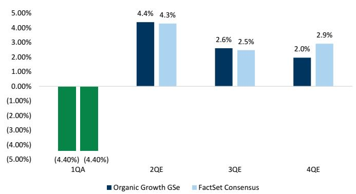
来源：GS全球研究，FactSet

关键讨论：进入2026年第二
