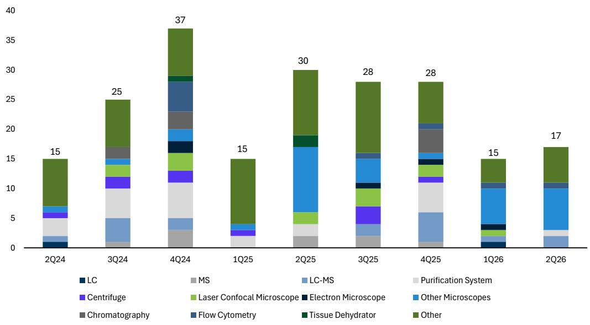

# 生命科学工具行业并非停滞：2Q26数据显示周期性复苏，而非结构性衰退

生命科学工具板块年初至今相对于标普500指数10%的涨幅，表现为负9%，这一分化引发了观察者们的核心疑问：疫情后的增长放缓是暂时的调整，还是行业长期逻辑的永久性改变？GS自研的工具追踪器，与工具行业平均收入增长的相关性达86%，并在80%的季度中正确预测了增速的加快或放缓，现在给出了清晰的答案。在2Q26，该追踪器显示基础市场增长相较1Q26略有加速，标志着改善势头连续第二个季度出现。这种由工业和学术终端市场提升所驱动的环比改善，与结构性衰退的说法相悖。

这一时机之所以重要，是因为该领域的多家公司已指引其有机增长将在2026年加速，而追踪器的信号现在用实证数据支持了这些预期，而不仅仅是管理层的信心。讨论的重点不再是增长是否会重新加速，而是加速的节奏、构成和持续性。对四个终端市场的仔细分解显示，复苏是真实的、不均衡的，并且关键取决于几个高确信度的催化剂，观察者们可以实时追踪。

## 生物制药增长在强劲的1Q后略有放缓，但领先指标指向下半年的转折点

根据追踪器，生物制药终端市场在2Q26实现了低两位数的增长，环比从异常强劲的1Q26放缓约2%。这种放缓并非疲软的信号，而是在高于趋势水平的活动期之后的自然调整。增长的底层构成比总体数字更重要。加速由三个子项引领：生物技术研发支出、中国资本支出和生物技术资本支出。这些并非随机波动；它们代表了一种连贯的早期周期投资模式，历史上这种模式先于更广泛的仪器和耗材采购。

最具战略意义的数据点在于生物技术风险投资资金与后续资本支出之间的关系。追踪器显示，生物技术风投和IPO活动连续第三个季度保持高位。历史分析表明，资金大约需要一年或更长时间才能传导至生物技术资本支出。这一滞后机制与近期多家工具公司管理层的评论精确吻合，这些评论指出2026年下半年临床阶段生物技术客户的支出将复苏。这意味着2025年末和2026年初的资金浪潮尚未转化为设备订单，但传导机制是完整的。观察者应预期生物制药终端市场在2026年下半年重新加速，因为这一资金管道将转化为资本部署，特别是对于赛默飞世尔科技而言，其通过CRO和CDMO业务对临床阶段生物技术支出有最直接的敞口。

第二个层面的影响涉及药品制造的回流。美国商务部2026年6月12日的制药关税调整申请截止日期，为制药和生物技术公司巩固其国内制造计划创造了催化剂。尚未拥有最惠国待遇定价安排的公司有动力提交包含具体回流承诺的申请。这一监管截止日期应在2Q26引发一波CDMO订单，特别是对于赛默飞在美国的制药服务业务。因此，2Q26财报电话会议上关于CDMO订单的评论，将成为检验监管压力是否正在转化为工具公司实际需求的关键实时测试。

## 工业增长加速至高个位数，周期尚未见顶

工业终端市场在2Q26以高个位数的高端增长，环比加速约3个百分点，并远高于其低个位数的长期平均水平。这一加速由采购经理人指数数据和半导体资本支出的提升所驱动，部分被耐用品新订单的疲软所抵消。半导体资本支出部分尤其值得注意，因为它反映了一个周期性的上升，历史上一直是安捷伦CrossLab和应用市场部门以及布鲁克等聚焦工业的工具公司的强劲推动力。

关键问题在于这个周期是否还有空间。历史模式表明，工具追踪器中的工业增长尚未达到中十几位数的水平，这代表了之前周期的高点。当前的轨迹意味着在周期成熟之前仍有上行空间。然而，近期宏观环境的不确定性，特别是与贸易政策和地缘政治紧张局势相关的不确定性，带来了下行风险。大多数工具公司在中东的敞口，估计为低个位数的收入，在追踪器中并未得到充分体现，如果局势恶化，可能成为不利因素。

对于观察者而言，工业终端市场提供了最直接、最可衡量的催化剂。安捷伦的CAM部门历史上与工业追踪器紧密相关，使其成为当前上升周期中最直接的受益者。该部门在2Q26财报中的表现将提供一个清晰的验证，检验追踪器的信号是否正在转化为收入。

## 临床诊断恢复至小幅正增长，但追踪器存在美国盲区

临床诊断在2Q26相较1Q26加速，并恢复至小幅正增长。改善由持续较低的常规检测量推动，这创造了有利的基数效应，同时医院入院率加速了约一个百分点。对于一个在疫情后正常化中挣扎的领域来说，这是一个温和但有意义的转变。

一个关键的注意事项：临床诊断追踪器主要基于美国，并未捕捉到中国的报销动态。这是一个显著的局限性，因为中国的诊断市场正经历由政府采购政策和定价改革驱动的结构性变化。追踪器的积极信号可能低估了具有大量中国诊断敞口的公司所面临的不利因素，同时如果医院入院趋势逆转，则可能高估美国市场的健康状况。观察者应将追踪器的信号与公司关于中国诊断收入和美国医院资本预算的具体评论进行交叉验证，然后再对终端市场的轨迹下结论。

## 学术与政府仍是最薄弱环节，但基线如此之低，任何稳定都有意义

学术与政府终端市场仍远低于历史平均水平。美国国家科学基金会连续第四个季度公布负的资金支出增长，而美国国立卫生研究院较1Q26略有加速，但仍处于低个位数增长区间。该追踪器基于美国，未包含中国刺激政策和欧洲动态，描绘了这一终端市场的严峻图景。

然而，定性背景比定量数据更令人关注。报告指出，研究人员面临多年的资助周期、博士入学人数的下降，以及即使在资金开始到位时，仍持续犹豫是否将资金用于大型资本设备。这种行为上的谨慎表明，即使资金支出有所改善，向仪器采购的转化也会滞后。学术终端市场不太可能在2026年成为工具增长的积极贡献者，而对该领域敞口较高的公司，特别是那些向大学实验室销售质谱仪和色谱系统的公司，将面临结构性阻力。

战略意义在于，学术复苏（当它到来时）将是一个多年过程，而非尖锐的V型反弹。观察者不应预期这一终端市场最早在2027年之前对增长做出有意义的贡献，并且可能需要下调对学术敞口不成比例公司的估值倍数。

## 驾驭2Q26财报季的决策框架

以下框架将追踪器的信号转化为每个2Q26财报报告中的可操作问题。

首先，评估生物技术资金到资本支出的转化。追踪器显示风投和IPO活动连续三个季度保持高位。每家公司的关键问题是，管理层是否报告了来自临床阶段生物技术客户的订单加速，特别是那些在2025年末筹集了资金的公司。如果答案是肯定的，那么下半年的转折点论点依然成立。如果答案是否定的，那么滞后可能比历史模式所暗示的要长，并且对2026年下半年的增长预期应有所调整。

其次，在6月12日关税申请截止日期的背景下评估CDMO订单评论。监管催化剂应已为美国本土CDMO产能带来一波与回流相关的订单激增。赛默飞对这一动态的敞口最大。强劲的订单评论将验证回流论点，并提供一个独立于更广泛终端市场趋势的公司特定催化剂。

第三，通过安捷伦的CAM部门监测工业终端市场势头。工业追踪器加速至高个位数，而安捷伦的CAM部门历史上与此数据紧密相关。如果安捷伦报告的工业收入增长与追踪器信号一致或更高，则确认周期性上升正在转化为订单。如果该部门表现不佳，则表明宏观不确定性导致客户尽管有有利的基础需求，但仍推迟设备采购。

第四，区分美国和中国临床诊断趋势。追踪器的积极信号基于美国，可能无法反映中国动态。公司应提供关于中国诊断收入趋势的单独评论。如果中国的不利因素正在加剧，美国的改善可能不足以抵消拖累。

第五，将学术和政府评论视为情绪指标而非增长驱动力。该终端市场在2026年不太可能有实质性改善。任何积极的评论都应被视为最坏时期已经过去的迹象，而非增长即将重新加速。负面的评论与追踪器的信号一致，不应感到意外。

该框架最重要的见解是，复苏并非均匀分布。对生物技术资金转化、CDMO回流和工业周期性上升有敞口的公司拥有多个上行杠杆。依赖学术和政府支出的公司则面临长期阻力。2Q26财报季将区分赢家与落后者，而追踪器为做出这一区分提供了实证基础。

*仅供参考。部分内容可能基于源材料通过AI辅助生成、翻译、总结或编辑，可能存在遗漏或错误。请独立核实。这不构成专业建议。*

仅供参考。部分内容可能基于源材料通过AI辅助生成、翻译、总结或编辑，可能存在遗漏或错误。请独立核实。这不构成专业建议。

