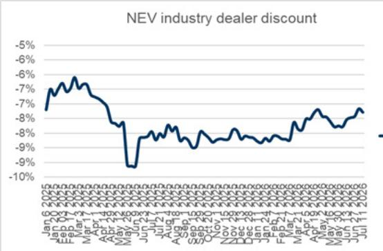
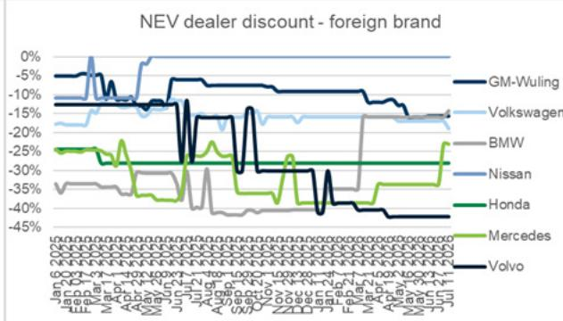
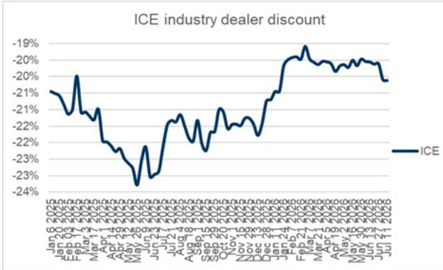
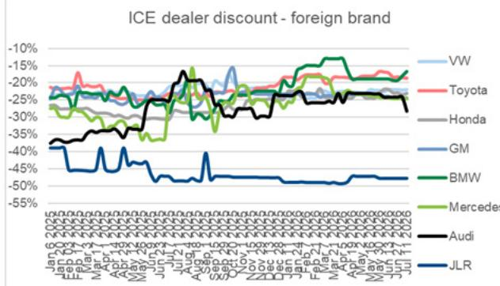
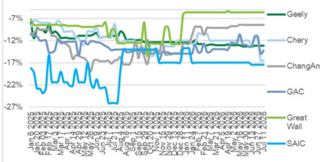

CHINA NEW ENERGY VEHICLE WEEKLY CHARTBOOK

# 2026 Week 28 - PV retail yoy decline narrowed, Nio/ Leapmotor/ XPeng order improved wow

Bottom line: Weekly NEV orders were -16% wow and -19% yoy, coming off the initial launches last week. PV retail decline narrowed to -15% yoy during Jul 1-5, compared to -20% yoy in 1H26. Nio / Leapmotor / XPeng showed the strongest growth at +13%/+10%/+5% wow, with Nio mainly driven by Nio's five-seater ES8 launched on Jul 9.

A curated compilation of the most topical charts on weekly passenger vehicle market performance, organized into the following categories: (1) Key NEV brands' weekly orders amount, (2) Key events to watch, (3) NEV/ICE dealer price discount tracker, and (4) Upstream battery pricing dynamics.

## 2026 Week 28 highlights:

Key brand orders: Nio / Leapmotor / XPeng showed the strongest growth at $+13\% / +10\% / +5\%$ wow, with Nio mainly driven by Nio's five-seater ES8 launched on Jul 9.

■ CPCA weekly trend: As of Jul 1-5, PV retail volume was 169k units (-15% yoy/+4% mom), while PV wholesale volume was 127k units (-35% yoy/-13% mom) per CPCA. Meanwhile, NEV retail volume was 103k units (-9% yoy/-6% mom), and NEV wholesale volume was 83k units (-20% yoy/-15% mom), with NEV penetration at 60.5%/66.5% in Jul 1-5, compared to 62.8%/63.4% in Jun.

■ Key pricing trends: Both NEV and ICE dealer discounts widened wow.

Upstream battery pricing dynamics: Battery grade lithium carbonate price decreased to Rmb153k/ton (-7.3% wow), while prismatic cell (LFP) and prismatic cell (NCM) prices were stable wow.

Tina Hou
+86(21)2401-8694 |
tina.hou@goldmansachs.cn
GS (China) Securities
Company Limited

Jenny Du
+86(21)2401-8978 |
jenny.x.du@goldmansachs.cn
GS (China) Securities
Company Limited

## Weekly order summary

Key brand weekly order trends during 2026 week 28 (7/6-7/12):

■ Key NEV OEMs combined orders were -16% wow and -19% yoy, coming off the initial launches last week.

Nio / Leapmotor / XPeng showed the strongest growth at +13%/+10%/+5% wow, with Nio mainly driven by Nio's five-seater ES8 launched on Jul 9.

In terms of YTD orders, Nio / HIMA / Tesla showed relatively defensive growth at +98%/+28%/-1% yoy.

<table><tr><td></td><td>Jan-26</td><td>Feb-26</td><td>Mar-26</td><td>Apr-26</td><td>May-26</td><td>Jun-26</td><td>Jul-26 MTD</td><td>2026 YTD</td></tr><tr><td colspan="9">Monthly order (units)</td></tr><tr><td>BYD (Dynasty &amp; Ocean)</td><td>123535</td><td>96547</td><td>252181</td><td>223899</td><td>197343</td><td>295514</td><td>148600</td><td>1312905</td></tr><tr><td>Geely (Galaxy &amp; Zeekr)</td><td></td><td></td><td>85343</td><td>125606</td><td>114161</td><td>110516</td><td>42700</td><td>471840</td></tr><tr><td>HIMA</td><td>26347</td><td>19574</td><td>45610</td><td>122320</td><td>143479</td><td>67232</td><td>14910</td><td>437155</td></tr><tr><td>Leapmotor</td><td></td><td></td><td>50257</td><td>82036</td><td>67357</td><td>59173</td><td>29000</td><td>283880</td></tr><tr><td>Tesla</td><td>30271</td><td>32614</td><td>60929</td><td>61914</td><td>57371</td><td>54214</td><td>20170</td><td>314370</td></tr><tr><td>Nio</td><td>15817</td><td>13400</td><td>38190</td><td>44025</td><td>86183</td><td>76636</td><td>23000</td><td>294165</td></tr><tr><td>Li Auto</td><td>18243</td><td>14614</td><td>26851</td><td>36401</td><td>43150</td><td>29609</td><td>11100</td><td>178340</td></tr><tr><td>Xiaomi</td><td>5529</td><td>10171</td><td>60587</td><td>33513</td><td>33980</td><td>27263</td><td>11000</td><td>180500</td></tr><tr><td>XPeng</td><td>16957</td><td>14597</td><td>41607</td><td>39394</td><td>54514</td><td>36059</td><td>13820</td><td>215020</td></tr><tr><td>SUM</td><td>236699</td><td>201519</td><td>661556</td><td>769108</td><td>797539</td><td>756215</td><td>314300</td><td>3688175</td></tr><tr><td colspan="9">YoY (%)</td></tr><tr><td>BYD (Dynasty &amp; Ocean)</td><td>-57%</td><td>-64%</td><td>-31%</td><td>-29%</td><td>-41%</td><td>-14%</td><td>-3%</td><td>-36%</td></tr><tr><td>Geely (Galaxy &amp; Zeekr)</td><td></td><td></td><td></td><td></td><td></td><td></td><td></td><td></td></tr><tr><td>HIMA</td><td>-25%</td><td>-22%</td><td>-21%</td><td>14%</td><td>154%</td><td>58%</td><td>-23%</td><td>28%</td></tr><tr><td>Leapmotor</td><td></td><td></td><td></td><td></td><td></td><td></td><td></td><td></td></tr><tr><td>Tesla</td><td>-37%</td><td>-37%</td><td>2%</td><td>55%</td><td>55%</td><td>4%</td><td>-35%</td><td>-1%</td></tr><tr><td>Nio</td><td>-9%</td><td>-2%</td><td>97%</td><td>24%</td><td>190%</td><td>248%</td><td>105%</td><td>98%</td></tr><tr><td>Li Auto</td><td>-47%</td><td>-46%</td><td>-20%</td><td>-9%</td><td>-19%</td><td>-21%</td><td>-40%</td><td>-27%</td></tr><tr><td>Xiaomi</td><td>-86%</td><td>-79%</td><td>-27%</td><td>-5%</td><td>51%</td><td>-91%</td><td>-88%</td><td>-71%</td></tr><tr><td>XPeng</td><td>-18%</td><td>-41%</td><td>-26%</td><td>7%</td><td>18%</td><td>-21%</td><td>-66%</td><td>-19%</td></tr><tr><td>SUM</td><td>-51%</td><td>-56%</td><td>-22%</td><td>-8%</td><td>6%</td><td>-31%</td><td>-33%</td><td>-27%</td></tr><tr><td colspan="9">MoM (%)</td></tr><tr><td>BYD (Dynasty &amp; Ocean)</td><td>-56%</td><td>-22%</td><td>161%</td><td>-11%</td><td>-12%</td><td>50%</td><td></td><td></td></tr><tr><td>Geely (Galaxy &amp; Zeekr)</td><td></td><td></td><td></td><td>47%</td><td>-9%</td><td>-3%</td><td></td><td></td></tr><tr><td>HIMA</td><td>-52%</td><td>-26%</td><td>133%</td><td>168%</td><td>17%</td><td>-53%</td><td></td><td></td></tr><tr><td>Leapmotor</td><td></td><td></td><td></td><td>63%</td><td>-18%</td><td>-12%</td><td></td><td></td></tr><tr><td>Tesla</td><td>-39%</td><td>8%</td><td>87%</td><td>2%</td><td>-7%</td><td>-6%</td><td></td><td></td></tr><tr><td>Nio</td><td>-49%</td><td>-15%</td><td>185%</td><td>15%</td><td>96%</td><td>-11%</td><td></td><td></td></tr><tr><td>Li Auto</td><td>-28%</td><td>-20%</td><td>84%</td><td>36%</td><td>19%</td><td>-31%</td><td></td><td></td></tr><tr><td>Xiaomi</td><td>-63%</td><td>84%</td><td>495%</td><td>-45%</td><td>1%</td><td>-20%</td><td></td><td></td></tr><tr><td>XPeng</td><td>-48%</td><td>-14%</td><td>185%</td><td>-5%</td><td>38%</td><td>-34%</td><td></td><td></td></tr><tr><td>SUM</td><td>-51%</td><td>-15%</td><td>161%</td><td>16%</td><td>4%</td><td>-5%</td><td></td><td></td></tr></table>

Source: ThinkerCar, Data compiled by GS Global Investment Research

Exhibit 1: NEV brand weekly orders summary

<table><tr><td>2025</td><td>2025</td><td>2025</td><td>2025</td><td>2026</td><td>2026</td><td>2026</td><td>2026</td></tr><tr><td>W256/16-6/22</td><td>W266/23-6/29</td><td>W276/30-7/6</td><td>W287/7-7/13</td><td>W256/15-6/21</td><td>W266/22-6/28</td><td>W276/29-7/5</td><td>W287/6-7/12</td></tr><tr><td colspan="8">Weekly order (units)</td></tr><tr><td>80000</td><td>82000</td><td>78000</td><td>75000</td><td>106800</td><td>70600</td><td>86500</td><td>62100</td></tr><tr><td></td><td></td><td></td><td></td><td>24180</td><td>28250</td><td>22700</td><td>20000</td></tr><tr><td>9000</td><td>10000</td><td>9900</td><td>9500</td><td>11675</td><td>10820</td><td>8110</td><td>6800</td></tr><tr><td></td><td></td><td></td><td></td><td>14100</td><td>15000</td><td>13800</td><td>15200</td></tr><tr><td>12000</td><td>11600</td><td>17000</td><td>14000</td><td>12600</td><td>11200</td><td>10900</td><td>9270</td></tr><tr><td>4900</td><td>5000</td><td>5500</td><td>5700</td><td>14450</td><td>11600</td><td>10800</td><td>12200</td></tr><tr><td>9000</td><td>7600</td><td>9500</td><td>9000</td><td>5930</td><td>9900</td><td>5700</td><td>5400</td></tr><tr><td>4000</td><td>283000</td><td>78500</td><td>9800</td><td>7200</td><td>6100</td><td>5400</td><td>5600</td></tr><tr><td>8800</td><td>9400</td><td>28600</td><td>11500</td><td>9000</td><td>7300</td><td>6750</td><td>7070</td></tr><tr><td>127700</td><td>408600</td><td>227000</td><td>134500</td><td>205935</td><td>170770</td><td>170660</td><td>143640</td></tr><tr><td colspan="8">YoY (%)</td></tr><tr><td></td><td></td><td></td><td></td><td>34%</td><td>-14%</td><td>11%</td><td>-17%</td></tr><tr><td></td><td></td><td></td><td></td><td>30%</td><td>8%</td><td>-18%</td><td>-28%</td></tr><tr><td></td><td></td><td></td><td></td><td>5%</td><td>-3%</td><td>-36%</td><td>-34%</td></tr><tr><td></td><td></td><td></td><td></td><td>195%</td><td>132%</td><td>96%</td><td>114%</td></tr><tr><td></td><td></td><td></td><td></td><td>-34%</td><td>30%</td><td>-40%</td><td>-40%</td></tr><tr><td></td><td></td><td></td><td></td><td>80%</td><td>-98%</td><td>-93%</td><td>-43%</td></tr><tr><td></td><td></td><td></td><td></td><td>2%</td><td>-22%</td><td>-76%</td><td>-39%</td></tr><tr><td></td><td></td><td></td><td></td><td>31%</td><td>-69%</td><td>-41%</td><td>-19%</td></tr><tr><td colspan="8">WoW (%)</td></tr><tr><td>-5%</td><td>2%</td><td>-5%</td><td>-4%</td><td>134%</td><td>-34%</td><td>23%</td><td>-28%</td></tr><tr><td></td><td></td><td></td><td></td><td>-10%</td><td>17%</td><td>-20%</td><td>-12%</td></tr><tr><td>-3%</td><td>11%</td><td>-1%</td><td>-4%</td><td>-36%</td><td>-7%</td><td>-25%</td><td>-16%</td></tr><tr><td></td><td></td><td></td><td></td><td>22%</td><td>6%</td><td>-8%</td><td>10%</td></tr><tr><td>-8%</td><td>-3%</td><td>47%</td><td>-18%</td><td>-4%</td><td>-11%</td><td>-3%</td><td>-15%</td></tr><tr><td>-4%</td><td>2%</td><td>10%</td><td>4%</td><td>-26%</td><td>-20%</td><td>-7%</td><td>13%</td></tr><tr><td>-2%</td><td>-16%</td><td>23%</td><td>-5%</td><td>8%</td><td>67%</td><td>-42%</td><td>-5%</td></tr><tr><td>-20%</td><td>69.75%</td><td>-72%</td><td>-88%</td><td>44%</td><td>-15%</td><td>-11%</td><td>4%</td></tr><tr><td>-2%</td><td>7%</td><td>204%</td><td>-60%</td><td>8%</td><td>-19%</td><td>-8%</td><td>5%</td></tr><tr><td>-5%</td><td>220%</td><td>-44%</td><td>-41%</td><td>34%</td><td>-17%</td><td>0%</td><td>-16%</td></tr></table>

## Key events to watch

## 2026 Week 29, Jul 13-19

■ Jul 13: BYD started pre-sale on Denza Z with entry price of Rmb680k.

■ Jul 16: XPeng to officially launch MONA L03.

■ Jul 16: Li Auto to launch L6 facelift.

■ Jul 16: Leapmotor to launch B01/B10 facelifts.

■ Jul 17: WAIC to launch in Shanghai.

## 2026 Week 30, Jul 20-26

■ Jul 21: Weekly orders for new-launched models.

## 2026 Week 31, Jul 27-Aug 2

■ Jul 30: Xiaomi to host SkyNomad tech event.

■ Aug 1: NEV OEM monthly volume release.

## 2026 Week 32-34, Aug 3-23

■ Aug 10-11: CPCA will release PV/NEV industry and by model wholesale/retail data.

## Retail end-pricing

■ NEV: average dealer discount vs. MSRP was 7.29% as of Jul 11, vs. 7.17%/7.95% as of Jul 4, 2026/Jul 7, 2025; BYD average dealer discount vs. MSRP was 4.10% as of Jul 11, vs. 4.10%/5.56% as of Jul 4, 2026/Jul 7, 2025.

ICE: average dealer discount vs. MSRP was 20.11% as of Jul 11, vs. 20.01%/22.12% as of Jul 4, 2026/Jul 7, 2025.

Exhibit 2: NEV dealer discount trend  
  
By brand dealer discount is based on best-selling models.

Source: Autohome, Data compiled by GS Global Investment Research  
Exhibit 3: ICE dealer discount trend  
  
By brand dealer discount is based on best-selling models.

ICE dealer discount - domestic brand  

## Upstream battery pricing dynamics

Battery grade lithium carbonate price decreased to Rmb153k/ton (-7.3% wow), while prismatic cell (LFP) and prismatic cell (NCM) prices were stable wow.

Exhibit 4: Battery and battery raw materials prices

<table><tr><td>Material</td><td>Unit</td><td>5/6/2026</td><td>5/11/2026</td><td>5/18/2026</td><td>5/25/2026</td><td>6/1/2026</td><td>6/8/2026</td><td>6/13/2026</td><td>6/22/2026</td><td>6/29/2026</td><td>7/6/2026</td><td>7/13/2026</td><td>WoW</td><td>3Q25</td><td>4Q25</td><td>1Q26</td><td>2Q26</td></tr><tr><td>Cathode</td><td>Unit</td><td></td><td></td><td></td><td></td><td></td><td></td><td></td><td></td><td></td><td></td><td></td><td></td><td></td><td></td><td></td><td></td></tr><tr><td>Lithium Carbonate (battery grade)</td><td>Rmb k / ton</td><td>177.0</td><td>190.0</td><td>191.0</td><td>181.0</td><td>179.5</td><td>168.5</td><td>174.5</td><td>167.5</td><td>151.5</td><td>165.0</td><td>153.0</td><td>-7.3%</td><td>112%</td><td>74%</td><td>-4%</td><td>1%</td></tr><tr><td>Battery</td><td>Unit</td><td></td><td></td><td></td><td></td><td></td><td></td><td></td><td></td><td></td><td></td><td></td><td></td><td></td><td></td><td></td><td></td></tr><tr><td>Prismatic cell (LFP)</td><td>Rmb / Wh</td><td>0.35</td><td>0.35</td><td>0.35</td><td>0.35</td><td>0.35</td><td>0.35</td><td>0.35</td><td>0.35</td><td>0.35</td><td>0.35</td><td>0.35</td><td>0.0%</td><td>14%</td><td>14%</td><td>4%</td><td>0%</td></tr><tr><td>Prismatic cell (NCM)</td><td>Rmb / Wh</td><td>0.47</td><td>0.47</td><td>0.47</td><td>0.47</td><td>0.47</td><td>0.47</td><td>0.47</td><td>0.47</td><td>0.47</td><td>0.47</td><td>0.47</td><td>0.0%</td><td>13%</td><td>10%</td><td>0%</td><td>0%</td></tr></table>

Source: ICC Sino, Data compiled by GS Global Investment Research

## Disclosure Appendix

## Reg AC

We, Tina Hou and Jenny Du, hereby certify that all of the views expressed in this report accurately reflect our personal views about the subject company or companies and its or their securities. We also certify that no part of our compensation was, is or will be, directly or indirectly, related to the specific recommendations or views expressed in this report.

Contributing Authors: Tina Hou GS (China) Securities Company Limited, Jenny Du GS (China) Securities Company Limited.

Unless otherwise stated, the individuals listed in the Contributing Authors disclosure of this report are analysts in GS' Global Investment Research division.

## GS Factor Profile

The GS Factor Profile provides investment context for a stock by comparing key attributes to the market (i.e. our universe of rated stocks) and its sector peers. The four key attributes depicted are: Growth, Financial Returns, Multiple (e.g. valuation) and Integrated (a composite of Growth, Financial Returns and Multiple). Growth, Financial Returns and Multiple are calculated by using normalized ranks for specific metrics for each stock. The normalized ranks for the metrics are then averaged and converted into percentiles for the relevant attribute. The precise calculation of each metric may vary depending on the fiscal year, industry and region, but the standard approach is as follows:

Growth is based on a stock's forward-looking sales growth, EBITDA growth and EPS growth (for financial stocks, only EPS and sales growth), with a higher percentile indicating a higher growth company. Financial Returns is based on a stock's forward-looking ROE, ROCE and CROCI (for financial stocks, only ROE), with a higher percentile indicating a company with higher financial returns. Multiple is based on a stock's forward-looking P/E, P/B, price/dividend (P/D), EV/EBITDA, EV/FCF and EV/Debt Adjusted Cash Flow (DACF) (for financial stocks, only P/E, P/B and P/D), with a higher percentile indicating a stock trading at a higher multiple. The Integrated percentile is calculated as the average of the Growth percentile, Financial Returns percentile and (100% - Multiple percentile).

Financial Returns and Multiple use the GS analyst forecasts at the fiscal year-end at least three quarters in the future. Growth uses inputs for the fiscal year at least seven quarters in the future compared with the year at least three quarters in the future (on a per-share basis for all metrics).

For a more detailed description of how we calculate the GS Factor Profile, please contact your GS representative.

## M&A Rank

Across our global coverage, we examine stocks using an M&A framework, considering both qualitative factors and quantitative factors (which may vary across sectors and regions) to incorporate the potential that certain companies could be acquired. We then assign a M&A rank as a means of scoring companies under our rated coverage from 1 to 3, with 1 representing high (30%-50%) probability of the company becoming an acquisition target, 2 representing medium (15%-30%) probability and 3 representing low (0%-15%) probability. For companies ranked 1 or 2, in line with our standard departmental guidelines we incorporate an M&A component into our target price. M&A rank of 3 is considered immaterial and therefore does not factor into our price target, and may or may not be discussed in research.

## Quantum

Quantum is GS' proprietary database providing access to detailed financial statement histories, forecasts and ratios. It can be used for in-depth analysis of a single company, or to make comparisons between companies in different sectors and markets.

## Disclosures

## Distribution of ratings/investment banking relationships

GS Investment Research global Equity coverage universe

<table><tr><td rowspan="2"></td><td colspan="3">Rating Distribution</td><td colspan="3">Investment Banking Relationships</td></tr><tr><td>Buy</td><td>Hold</td><td>Sell</td><td>Buy</td><td>Hold</td><td>Sell</td></tr><tr><td>Global</td><td>50%</td><td>34%</td><td>16%</td><td>65%</td><td>59%</td><td>43%</td></tr></table>

As of July 1, 2026, GS Global Investment Research had investment ratings on 3,104 equity securities. GS assigns stocks as Buys and Sells on various regional Investment Lists; stocks not so assigned are deemed Neutral. Such assignments equate to Buy, Hold and Sell for the purposes of the above disclosure required by the FINRA Rules. See ‘Ratings, Coverage universe and related definitions’ below. The Investment Banking Relationships chart reflects the percentage of subject companies within each rating category for whom GS has provided investment banking services within the previous twelve months.

## Regulatory disclosures

## Disclosures required by United States laws and regulations

See company-specific regulatory disclosures above for any of the following disclosures required as to companies referred to in this report: manager or co-manager in a pending transaction; 1% or other ownership; compensation for certain services; types of client relationships; managed/co-managed public offerings in prior periods; directorships; for equity securities, market making and/or specialist role. GS trades or may trade as a principal in debt securities (or in related derivatives) of issuers discussed in this report.

The following are additional required disclosures: Ownership and material conflicts of interest: GS policy prohibits its analysts, professionals reporting to analysts and members of their households from owning securities of any company in the analyst's area of coverage. Analyst compensation: Analysts are paid in part based on the profitability of GS, which includes investment banking revenues. Analyst as officer or director: GS policy generally prohibits its analysts, persons reporting to analysts or members of their households from serving as an officer, director or advisor of any company in the analyst's area of coverage. Non-U.S. Analysts: Non-U.S. analysts may not be associated persons of GS & Co. LLC and therefore may not be subject to FINRA Rule 2241 or FINRA Rule 2242 restrictions on communications with a subject company, public appearances and trading in securities covered by the analysts.

## Additional disclosures required under the laws and regulations of jurisdictions other than the United States

The following disclosures are those required by the jurisdiction indicated, except to the extent already made above pursuant to United States laws and regulations. Australia: GS Australia Pty Ltd and its affiliates are not authorised deposit-taking institutions (as that term is defined in the Banking Act 1959 (Cth)) in Australia and do not provide banking services, nor carry on a banking business, in Australia. This research, and any access to it, is intended only for “wholesale clients” within the meaning of the Australian Corporations Act, unless otherwise agreed by GS. In producing research reports, members of Global Investment Research of GS Australia may attend site visits and other meetings hosted by the companies and other entities which are the subject of its research reports. In some instances the costs of such site visits or meetings may be met in part or in whole by the issuers concerned if GS Australia considers it is appropriate and reasonable in the specific circumstances relating to the site visit or meeting. To the extent that the contents of this document contains any financial product advice, it is general advice only and has been prepared by GS without taking into account a client’s objectives, financial situation or needs. A client should, before acting on any such advice, consider the appropriateness of the advice having regard to the client’s own objectives, financial situation and needs. A copy of certain GS Australia and New Zealand disclosure of interests and a copy of GS’ Australian Sell-Side Research Independence Policy Statement are available at: https://www.goldmansachs.com/disclosures/australia-new-zealand/index.html. Brazil: Disclosure information in relation to CVM Resolution n. 20 is available at https://www.gs.com/worldwide/brazil/area/gir/index.html. Where applicable, the Brazil-registered analyst primarily responsible for the content of this research report, as defined in Article 20 of CVM Resolution n. 20, is the first author named at the beginning of this report, unless indicated otherwise at the end of the text. Canada: This information is being provided to you for information purposes only and is not, and under no circumstances should be construed as, an advertisement, offering or solicitation by GS & Co. LLC for purchasers of securities in Canada to trade in any Canadian security. GS & Co. LLC is not registered as a dealer in any jurisdiction in Canada under applicable Canadian securities laws and generally is not permitted to trade in Canadian securities and may be prohibited from selling certain securities and products in certain jurisdictions in Canada. If you wish to trade in any Canadian securities or other products in Canada please contact GS Canada Inc., an affiliate of The GS Group Inc., or another registered Canadian dealer. Hong Kong: Further information on the securities of covered companies referred to in this research may be obtained on request from GS (Asia) L.L.C. India: Further information on the subject company or companies referred to in this research may be obtained from GS (India) Securities Private Limited, Research Analyst - SEBI Registration Number INH000001493, 10th Floor, Ascent-Worli, Sudam Kalu Ahire Marg, Worli, Mumbai-400 025, India, Corporate Identity Number U74140MH2006FTC160634, Phone +91 22 6616 9000, Fax +91 22 6616 9001. GS may beneficially own 1% or more of the securities (as such term is defined in clause 2 (h) the Indian Securities Contracts (Regulation) Act, 1956) of the subject company or companies referred to in this research report. Registration granted by SEBI and certification from NISM in no way guarantee performance of the intermediary or provide any assurance of returns to investors. GS (India) Securities Private Limited compliance officer and investor grievance contact details, a copy of the annual compliance audit report and other relevant information and disclosures can be found at this link: https://www.goldmansachs.com/worldwide/india/research-analyst. Japan: See below. Korea: This research, and any access to it, is intended only for “professional investors” within the meaning of the Financial Services and Capital Markets Act, unless otherwise agreed by
