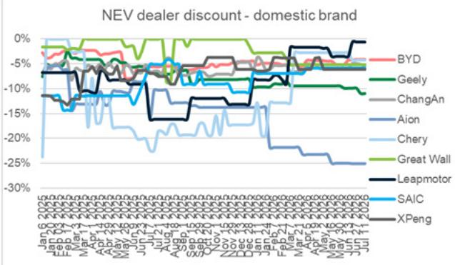

# 中国新能源汽车市场呈现双速分化：产品周期领先者加速，其余品牌维持动能面临挑战

截至2026年7月12日当周，中国新能源汽车市场释放了一个清晰信号：主要新能源品牌整体订单量环比下降16%，同比下降19%，扭转了前一周新车型上市后的增长势头。这并非短暂停顿，而是市场整体结构性调整的体现，被各品牌间的显著分化所掩盖。

蔚来、零跑和小鹏当周订单增长最为强劲，环比分别增长13%、10%和5%。蔚来的增长直接得益于7月9日推出的五座版ES8。与整体市场下滑的对比揭示了一个现象：在当前阶段，产品发布节奏而非品牌溢价或价格本身，决定了短期需求。整体订单环比下降16%并非随机波动，它反映了近期上市活动所积累的潜在需求已得到释放，而新刺激因素尚未出现。

乘用车零售数据进一步印证了这一判断。7月1日至5日，乘用车零售量为16.9万辆，同比下降15%。这较2026年上半年20%的同比降幅有所改善，但仍处于负值区间。同期新能源车零售量为10.3万辆，同比下降9%。新能源车零售渗透率为60.5%，批发渗透率为66.5%，略低于6月的62.8%和63.4%。市场整体并未扩张，而是在固定需求池内进行结构性调整。

对于策略制定者和资产配置者而言，关键洞察在于中国新能源汽车市场已进入一个阶段：宏观环境因素——零售增长放缓、经销商折扣扩大、电池原材料成本下降——既带来风险也创造观察点。胜出的品牌是那些通过产品发布将订单动能转化为持续销量的企业。落后的则是那些缺乏新车型储备、依赖价格竞争且被对手跟进或超越的品牌。

## 蔚来五座版ES8上市证明：产品周期精准度而非规模驱动短期订单增长

蔚来13%的周度订单增长是报告中最具参考价值的数据点。该公司年初至今订单同比增长98%，已使其成为市场中多数品牌同比负增长背景下的一个特例。7月9日推出的五座版ES8并非随机事件，而是一次有针对性的产品延伸，旨在填补蔚来产品线中的特定空白：一款不带第三排座椅的大型SUV，吸引那些追求空间和高端定位但无需家庭化配置的买家。

时机至关重要。蔚来在主要新能源车企整体订单环比下降16%的同一周推出了五座版ES8。该产品将需求吸引至蔚来展厅，而竞争对手的订单量却在收缩。这并非品牌偏好的转变，而是表明在零和需求环境中，一次时机恰当的产品发布可以抢占原本可能处于潜伏状态或流向竞争对手的市场份额。

第二个层面的含义是，蔚来的订单走势将取决于五座版ES8是蚕食其现有六座版的市场，还是扩大整体可触达用户池。周度数据显示为后者，因为总订单量上升而非持平。观察者应关注接下来两周的订单数据。如果蔚来在7月底前保持环比正增长，五座版ES8将证明其带来了真实的新增需求。如果订单回归均值，则该次发布可能仅是一次性脉冲。

## 零跑和小鹏表明：中价位市场并非同质化竞争——而是细分市场差异化

零跑环比增长10%和小鹏环比增长5%的订单表现，是在整体市场下滑背景下取得的，这挑战了关于中国中价位电动车市场已成为价格竞争红海的叙事。两个品牌均处于10万至20万元价格区间，该区间来自比亚迪王朝和海洋系列的竞争最为激烈。然而，两者在第28周均实现了份额增长。

零跑的表现尤其值得关注，因为该品牌缺乏蔚来或小鹏那样的品牌认知度。其订单增长表明，其产品定位——实用、注重性价比且续航有竞争力的电动车——正在吸引特定买家群体，这些群体并未被其他品牌的高端化发布所覆盖。报告关键事件日历中提到的7月16日B01和B10改款车型上市，可能提供进一步动能。零跑正在一个多数竞争对手追逐利润的市场中有效执行销量策略。

小鹏环比5%的增长虽然温和，但是一个复苏信号。该品牌在2026年全年经历了订单波动，7月至今订单同比下降66%即为明证。但周度环比改善，加上即将于7月16日上市的MONA L03，表明小鹏可能正处于产品周期上升阶段的起点。MONA L03是一次关键考验。如果它能带来持续的订单增长，小鹏可以稳定其市场地位。如果表现不佳，该品牌将在同一价格点面临来自零跑和比亚迪的更大压力。

对于整车企业的战略启示是，中价位市场并非单一市场，而是由续航里程、技术特性和品牌认知度定义的多个细分市场集合。零跑和小鹏在第28周胜出，是因为它们以特定产品瞄准了特定细分市场，而非在折扣上比对手投入更多。

## 新能源车与燃油车经销商折扣均在扩大，表明价格正成为需求变化的滞后指标

报告中的定价数据揭示了整个汽车价值链的一个值得关注的趋势。截至7月11日，新能源车平均经销商折扣相对于指导价为7.29%，高于7月4日的7.17%。同期燃油车平均折扣从20.01%扩大至20.11%。两者均朝着不利于盈利的方向发展。

同比比较更为明显。2025年7月7日，新能源车经销商平均折扣为7.95%，表明当前的7.29%实际上是改善。但周度环比扩大表明趋势正在逆转。2026年7月11日燃油车折扣20.11%，与2025年同期的22.12%相比有所改善，但近期轨迹是折扣扩大而非收窄。

具体到比亚迪，7月11日平均经销商折扣相对于指导价为4.10%，与7月4日持平。这种稳定性是一把双刃剑。它表明比亚迪并未被迫进行激进折扣，这保护了其利润结构。但这也意味着在竞争对手扩大折扣之际，比亚迪并未利用价格刺激需求。如果比亚迪的订单簿在未来几周走弱，该公司可能不得不在维持价格纪律和失去份额之间做出选择。

对上游供应商和电池制造商的影响是明确的。经销商折扣扩大压缩了整车企业利润，进而降低了其投资新车型开发和电池采购的意愿。电池级碳酸锂价格周环比下跌7.3%至每吨15.3万元，与此情况一致。下游需求预期降低正反馈至原材料定价。方形电池电芯价格（磷酸铁锂和三元锂）保持稳定，但如果碳酸锂继续下跌，这种稳定可能是暂时的。

## 决策框架：如何为2026年下半年布局

第28周的数据提供了一种结构化方式，用以评估哪些新能源品牌可能在2026年下半年表现突出，哪些面临表现不佳的风险。该框架包含三个维度：产品周期时机、订单动能可持续性以及价格纪律。

第一，产品周期时机。在7月和8月确认有新车型发布的品牌拥有明确的催化剂。蔚来的五座版ES8已初见成效。小鹏的MONA L03和理想汽车的L6改款，均于7月16日上市，将是下一个考验。零跑同日推出的B01和B10改款增加了7月中旬的发布密度。比亚迪腾势Z预售价68万元起，于7月13日开始预售，目标为高端市场，不会对销量指标产生重大影响。关键问题是，7月16日的发布能否为小鹏和零跑带来连续第二周的订单增长，还是整体市场的疲软会拖累它们。

第二，订单动能可持续性。年初至今的订单数据揭示了一个清晰的层级。蔚来以同比增长98%脱颖而出。鸿蒙智行以28%紧随其后。特斯拉基本持平，为-1%。其他主要品牌均深度负值：比亚迪-36%，理想汽车-27%，小鹏-19%，小米-71%。蔚来与其他品牌之间的分化并非一周异常，而是已持续六个月的趋势。年初至今订单增长为负的品牌面临结构性逆风，一周的良好表现无法逆转。

第三，价格纪律。维持稳定经销商折扣而不诉诸激进降价的品牌正在保护利润，但它们面临将份额让给愿意牺牲利润换取销量的竞争对手的风险。比亚迪稳定的4.10%折扣是一个战略选择。其成败取决于整体市场需求是企稳还是继续下滑。

该框架的输出是直接的。在高端市场，蔚来在产品周期时机、订单动能和价格纪律方面拥有较强组合。在中价位市场，零跑和小鹏值得关注，但它们的地位更为脆弱。在价值市场，比亚迪仍是主导者，但其年初至今订单负增长和稳定的折扣政策表明，它正在为利润而非市场份额进行管理。

上游电池市场强化了这一框架。碳酸锂价格周度下跌7.3%至每吨15.3万元，是整车企业需求疲软的先行指标。如果7月上市周期未能逆转整体订单下滑，碳酸锂可能进一步下跌，这将有利于电池电芯制造商，但预示着更广泛的电动车生态系统面临更深层次挑战。

2026年下半年将不会是水涨船高、所有新能源品牌均受益的局面。这将是一个由产品周期精准度、订单动能可持续性和价格纪律决定哪些品牌获得份额、哪些品牌失去份额的市场。第28周的数据表明，蔚来、零跑和小鹏目前处于这一分水岭的正确一侧。接下来两周将揭示它们的动能是否可持续，还是市场引力将其拉回。

*仅供参考。部分内容可能基于源材料通过AI辅助生成、翻译、总结或编辑，可能存在遗漏或错误。请独立核实。本文不构成专业建议。*

仅供参考。部分内容可能基于源材料通过AI辅助生成、翻译、总结或编辑，可能存在遗漏或错误。请独立核实。本文不构成专业建议。

