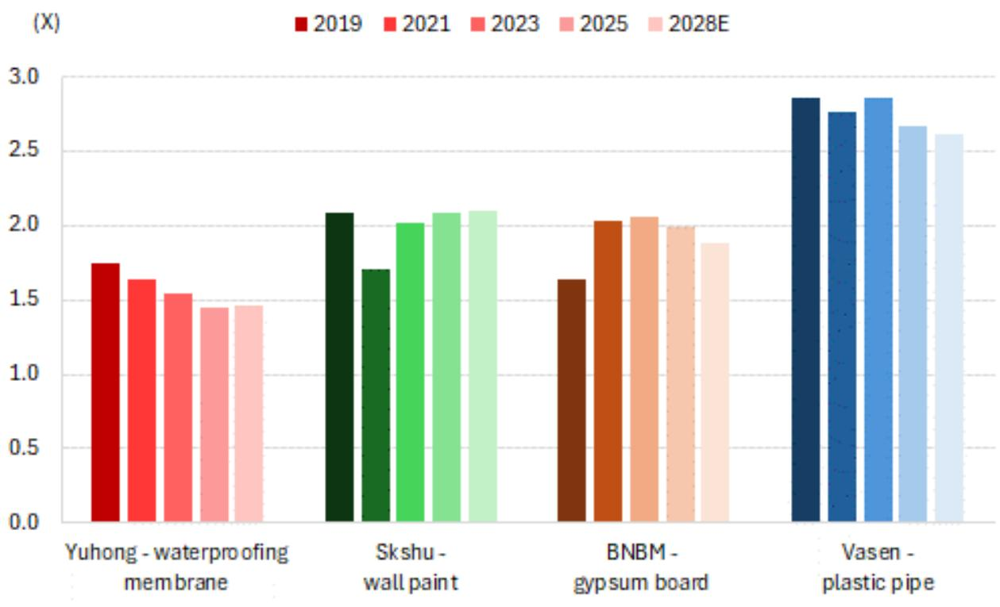
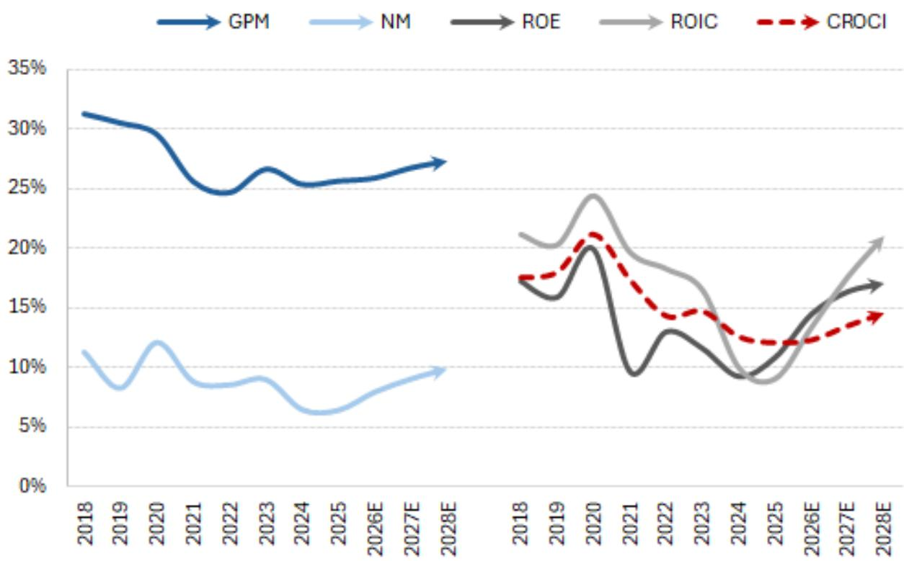

# 中国建材行业：翻新需求支撑市场稳定，战略转型助力企业成长

2026年7月

## 市场展望

翻新需求增长抵消新建项目收缩，行业整体规模趋于稳定

2021-2025年间，行业整体规模经历了调整（同期四家覆盖企业的市值也有相应变化）。当前分析显示，积压需求释放与二手房交易增加正推动市场短期企稳。长期来看，行业规模有望回归历史高位，为收入增长和估值修复提供支撑。

四大建材细分领域市场规模概览

  
来源：GS全球研究

## 渠道变革

积极拓展零售渠道、深化下沉市场布局、探索海外机遇

四家建材企业正采取三大核心策略：1）积极拓展零售渠道；2）深化低线城市及农村市场渗透；3）丰富产品组合。预计这些举措将在2025-2028年间贡献绝大部分收入增长，其中对三棵树的影响最为显著。此外，东方雨虹在国际市场展现出稳健的执行力。

四大建材企业收入结构概览

  
来源：公司数据，GS全球研究

## 价格与原材料成本比

渠道向零售业务转型带来积极变化

建材价格（尤其是防水材料和涂料）近期因成本上升已有所调整，而原材料成本开始回落，有助于改善利润空间。预计在零售业务占比提升的推动下，四家企业毛利率在2027年前将保持稳定或有所改善，2025年至2028年期间行业整体毛利率预计提升1-3个百分点。

四家企业价格与原材料成本比

  
注：石膏板价格-原材料成本比以北新建材中低端品牌（万家）单位经济为基准  
来源：公司数据，GS全球研究

## 盈利能力趋势

渠道转型与费用优化推动盈利触底回升

随着战略转型逐步推进，预计行业盈利能力和资本回报率将触底回升。四家企业2025年至2028年期间净利润率和资本回报率平均分别提升4个和3个百分点，其中三棵树修复力度较强，伟星新材相对温和。整体来看，2026-2028年四家企业每股收益年复合增长率预计在9%-29%之间（2025年中位数为-8%）。

四家企业平均盈利指标

  
来源：公司数据，GS全球研究

## 估值分析

12个月目标价显示行业存在13%-53%的上行空间

展望未来，预计12个月远期企业价值/资本回报率倍数将扩大0.1倍，主要得益于资本回报率较2026年水平提升1个百分点，对应行业13%-53%的上行空间。对于评级较高的企业（东方雨虹和三棵树），预计估值倍数扩大更为显著（+0.3倍），上行空间分别为47%和53%。

估值倍数与目标价汇总

<table><tr><td>截至2026年7月8日</td><td colspan="2">东方雨虹</td><td>三棵树</td><td>北新建材</td><td>伟星新材</td></tr><tr><td>代码</td><td colspan="2">002271.SZ</td><td>603737.SS</td><td>000786.SZ</td><td>002372.SZ</td></tr><tr><td>行业企业价值/资本回报率（2027年预测）</td><td colspan="2">9.1倍</td><td>14.7倍</td><td>9.1倍</td><td>13.6倍</td></tr><tr><td>相对行业平均溢价/折价</td><td colspan="2">0%</td><td>0%</td><td>-25%</td><td>-10%</td></tr><tr><td>--当前交易溢价/折价</td><td colspan="2">-7%</td><td>-12%</td><td>-33%</td><td>-22%</td></tr><tr><td>--2023-2025年平均溢价/折价</td><td colspan="2">12%</td><td>2%</td><td>-19%</td><td>9%</td></tr><tr><td>应用的企业价值/资本回报率</td><td colspan="2">9.1倍</td><td>14.7倍</td><td>6.8倍</td><td>12.3倍</td></tr><tr><td>--占历史平均企业价值/折现现金流比例</td><td colspan="2">61%</td><td>55%</td><td>65%</td><td>79%</td></tr><tr><td>资本回报率（2027年预测）</td><td colspan="2">15.2%</td><td>25.1%</td><td>11.7%</td><td>15.3%</td></tr><tr><td>--较2023-2025年平均水平</td><td>+3个百分点</td><td>+4个百分点</td><td>▼</td><td>-2个百分点</td><td>-3个百分点</td></tr><tr><td>隐含企业价值/资本回报率</td><td colspan="2">1.4倍</td><td>3.7倍</td><td>0.8倍</td><td>1.9倍</td></tr><tr><td>--占历史平均企业价值/资本回报率比例</td><td colspan="2">49%</td><td>74%</td><td>54%</td><td>59%</td></tr></table>

<table><tr><td>12个月目标价（元/股）</td><td>16.6元</td><td>35.9元</td><td>22.4元</td><td>9.3元</td></tr><tr><td>较此前目标价变化</td><td>-17%</td><td>3%</td><td>-34%</td><td>3%</td></tr><tr><td>当前价格（元/股）</td><td>11.3</td><td>23.4</td><td>17.4</td><td>8.2</td></tr><tr><td>目标价上行/下行空间</td><td>47%</td><td>53%</td><td>28%</td><td>13%</td></tr><tr><td>评级（新）</td><td>正面</td><td>正面</td><td>中性</td><td>中性</td></tr><tr><td>评级（旧）</td><td>正面</td><td>中性</td><td>正面</td><td>谨慎</td></tr><tr><td colspan="5">目标价隐含估值（市盈率、市净率）</td></tr><tr><td>市盈率：历史平均</td><td>47倍</td><td>55倍</td><td>14倍</td><td>20倍</td></tr><tr><td>2026-2028年每股收益年复合增长率</td><td>29%</td><td>27%</td><td>12%</td><td>9%</td></tr><tr><td>2026/2027/2028年预测</td><td>20倍/15倍/12倍</td><td>29倍/21倍/18倍</td><td>10倍/13倍/12倍</td><td>18倍/17倍/15倍</td></tr><tr><td>市净率：历史平均</td><td>3.2倍</td><td>8.1倍</td><td>1.9倍</td><td>4.2倍</td></tr><tr><td>2026/2027/2028年预测</td><td>1.9倍/1.8倍/1.6倍</td><td>9.4倍/7.9倍/6.7倍</td><td>1.5倍/1.4倍/1.3倍</td><td>3倍/2.9倍/2.7倍</td></tr></table>

注：价格基于2026年7月8日收盘价。  
来源：Datastream，公司数据，GS全球研究

## 目标价风险与方法论

<table><tr><td>公司</td><td>代码</td><td>评级</td><td>目标价风险与方法论</td></tr><tr><td>东方雨虹</td><td>002271.SZ</td><td>正面</td><td>基于12个月企业价值/资本回报率的目标价为16.60元。下行风险：1）海外扩张不及预期（产能投放、渠道建设、并购整合协同）；2）防水需求或下沉市场拓展执行不及预期；3）全国建筑活动弱于预期；4）原材料价格上涨幅度或持续时间超预期；5）非防水业务增长慢于预期；6）高风险开发商客户应收款及抵押资产减值损失超预期。</td></tr><tr><td>三棵树</td><td>603737.SS</td><td>正面</td><td>基于12个月企业价值/资本回报率的目标价为35.90元。下行风险：1）新零售业务发展不及预期（尤其是马上装门店扩张和美丽乡村渗透）；2）产品均价和利润率因同业竞争加剧和消费信心不足而低于预期；3）销售费用优化进度慢于预期（销售人员精简失误、零售业务推广支出超预期）；4）原材料价格（占成本80%以上）因上游油价上涨而意外飙升，导致利润空间收窄。</td></tr><tr><td>伟星新材</td><td>002372.SZ</td><td>中性</td><td>基于12个月企业价值/资本回报率的目标价为9.3元。上行/下行风险：1）防水涂料等新产品交叉销售快于/慢于预期；2）消费信心恢复加速家装/释放管道更换需求，或消费情绪疲软导致管道更换进一步推迟；3）在塑料管道市场（尤其是长三角以外及低线城市）份额扩张强于/弱于预期；4）海外业务（尤其是东南亚）扩张快于/慢于预期；5）原材料价格因上游油煤价格变化而意外下跌/上涨；6）城市更新（尤其是地下管网改造）推进快于/慢于预期。</td></tr><tr><td>北新建材</td><td>000786.SZ</td><td>中性</td><td>基于12个月企业价值/资本回报率的目标价为22.4元。上行/下行风险：1）国内房屋竣工面积高于/低于预期；2）新进入者区域渗透或全国产能扩张强于/弱于预期，导致价格和销量竞争加剧/缓和；3）石膏板品牌内部整合执行（协调提价、成本效率提升）好于/差于预期；4）新业务（防水、涂料、金属框架）收入增长和利润率高于/低于预期；5）原材料和能源成本（尤其是纸张占石膏板成本35%-40%，煤电占15%-20%）高于/低于预期；6）并购整合（尤其是嘉宝莉品牌）运营协同好于/差于预期。</td></tr></table>

来源：GS全球研究
