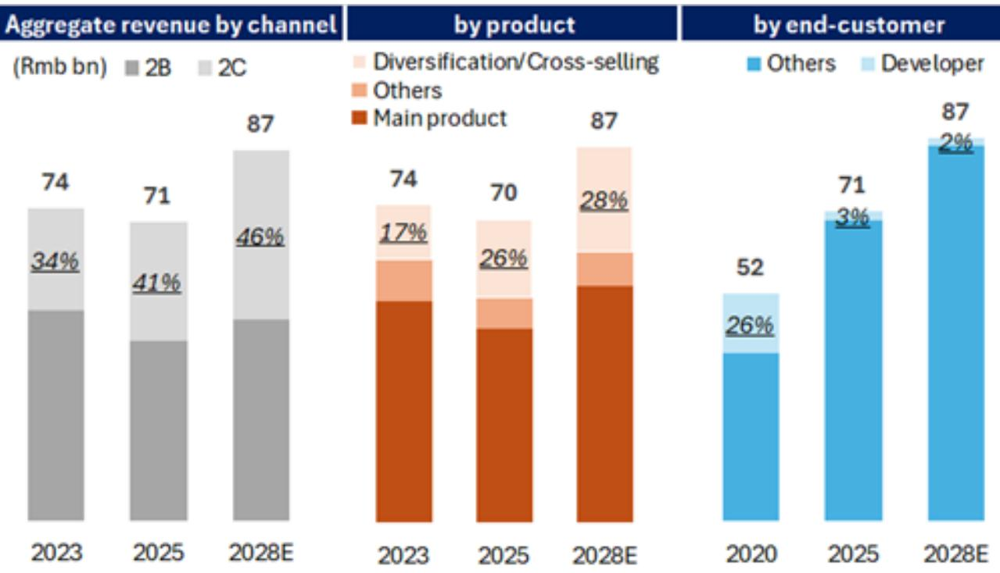
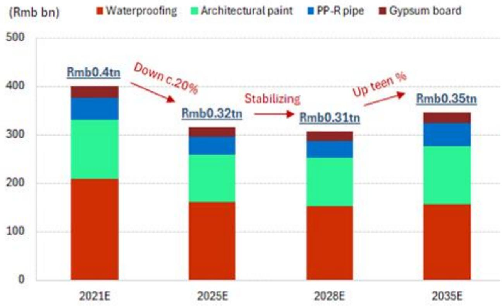

# GS：中国建材行业TAM企稳，翻新需求推动估值修复

2021至2025年间，中国建材行业市场总规模仍在调整约20%，而四家覆盖公司的市值跌幅却高达70%。这种估值与基本面的背离，在GS这份2026年7月的报告中有了新的解释框架。报告的核心判断是：行业总量正在企稳，但驱动逻辑已从新建转向翻新，能够抓住这一结构性切换的公司，将获得盈利增长与估值修复的双重支撑。

报告将防水、涂料、管材、石膏板四个子行业合并测算，认为当前积压的翻新需求与二手房交易回升，正在对冲新建面积的下滑。长期来看，行业总量有望回到2021年的峰值水平。这意味着，过去五年市场对建材股的定价，可能过度反映了新建市场调整的悲观预期，而低估了翻新需求的弹性。

## 1. 渠道切换是收入增长的核心引擎，零售占比决定公司韧性

报告指出，四家公司未来三年的收入增长几乎全部来自三大战略：向零售渠道的激进扩张、向低线及农村市场的渗透、以及产品线的拓宽。其中，三棵树被认为受渠道切换的拉动最为显著，而东方雨虹在国际市场的执行能力已被验证。

这一判断的关键在于，零售业务不仅贡献收入增量，还改变了公司的定价权结构。面向C端和中小B端的销售，相比过去依赖大B开发商的模式，拥有更强的价格谈判能力和更稳定的回款周期。报告认为，这种渠道结构的优化，是毛利率改善的根本驱动力。

> **KC评论：** 建材行业过去几年的估值压缩，很大程度上是市场对“坏账不确定性”和“大B模式不可持续”的定价。渠道切换的本质，是公司从“给开发商垫资”转向“给真实用户提供价值”。这个转变如果被验证，估值体系需要重新评估。

## 2. 原材料成本不确定性正在缓解，价差扩大为利润率提供安全垫

建材价格已在近期成本上涨中有所上调，而原材料价格开始回落。报告预计，到2028年底，四家公司的平均毛利率将较2025年提升1至3个百分点。这一判断的基础是：零售渠道占比提升带来的产品结构优化，以及原材料成本端的边际改善。

需要注意的是，不同子行业的价差弹性并不相同。石膏板由于成本结构中煤炭和电力占比更高，其利润率波动与能源价格关联更紧密；而防水和涂料则更多受沥青和乳液价格影响。报告认为，当前原材料价格的高位回落，对后者的利润率修复更为直接。

## 3. 盈利能力已触底，CROCI修复是估值扩张的前提

报告测算，四家公司平均净利率将从2025年水平扩张约4个百分点，CROCI扩张约3个百分点。其中，三棵树被定位为盈利修复弹性最大的标的，而伟星新材的改善幅度最为温和。整体来看，2026至2028年间，四家公司EPS年复合增长率在9%至29%之间，而2025年这一数字的中位数为-8%。

盈利能力的底部确认，是估值修复的前提。报告认为，当前行业平均EV/GCI倍数隐含的CROCI预期，仍低于历史均值。随着渠道切换和费用优化逐步兑现，估值倍数有望获得0.1倍的扩张，而东方雨虹和三棵树的扩张幅度可能更大。

> **KC评论：** 估值修复不是靠“行业回暖”这种模糊叙事，而是靠CROCI这个硬指标的改善。报告的核心逻辑是：渠道结构变了，利润率中枢上移了，CROCI就会回升，估值倍数自然跟着走。这是一个可追踪、可验证的框架。

## 4. 一个可复用的观察框架：跟踪零售占比与CROCI的联动

对于关注建材板块的决策者而言，这份报告提供了一个清晰的跟踪框架。核心变量有两个：一是各公司零售渠道收入占比的变化速度，二是CROCI的季度改善幅度。前者是领先指标，后者是验证指标。

报告对不同公司的判断差异，也值得注意。东方雨虹和三棵树被给予更积极的评价，核心在于其零售转型的执行力已得到初步验证；而北新建材和伟星新材的评级相对保守，反映出市场对其渠道切换速度和盈利改善幅度的疑虑。这种分化，恰恰说明行业整体企稳并不意味着所有公司都能同步受益。

For informational purposes only. Portions may be generated,translated,summarized,or edited with AI assistance based on source materials and may contain omissions or errors. Please verify independently. This is not investment,legal,tax,accounting,or other professional advice.

For informational purposes only. Portions may be generated,translated,summarized,or edited with AI assistance based on source materials and may contain omissions or errors. Please verify independently. This is not investment,legal,tax,accounting,or other professional advice.

