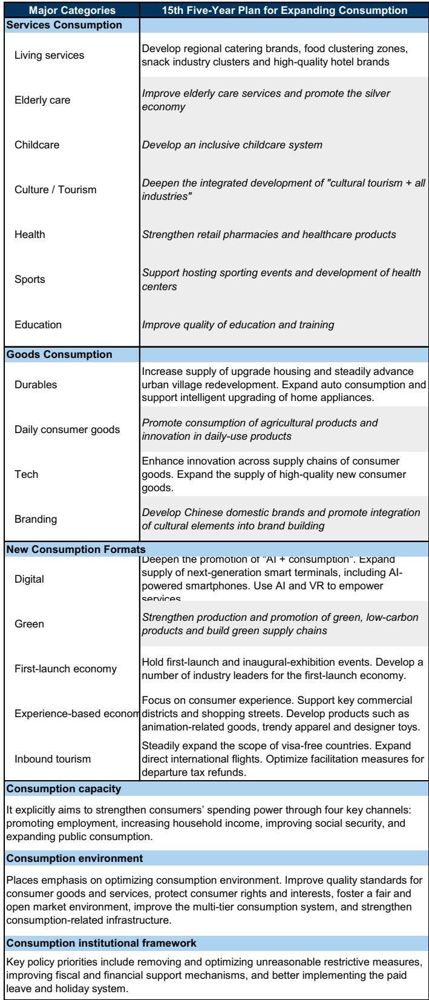

# GS：中国十五五扩大消费规划，供给侧推动与需求侧约束

中国国务院在7月13日批准了《“十五五”扩大消费规划》，由国家发改委和商务部联合提交。这份文件将消费提升为中期政策优先项，背景是今年零售数据表现偏弱。1至5月社会消费品零售总额同比仅增长1.4%，远低于去年同期的5%。GS团队在研报中给出的判断很直接：规划方向正确，但短期提振效果有限。

规划设定了到2030年社会消费品零售总额达到约60万亿元的目标，较2025年的50.1万亿元增长。这意味着“十五五”期间年均名义增速约为3.7%，低于“十四五”期间5.0%的增速。这个数字本身已经说明了政策的克制——不是追求高增长，而是为结构性转型留出空间。

## 1. 规划的核心是供给升级，而非需求侧直接推动

从政策工具看，这份规划更接近产业政策而非需求管理。重点领域包括服务消费升级、耐用品置换需求、新消费业态培育、以及消费基础设施完善。GS团队指出，这些措施更多是“供应侧”的——通过提升供给质量来释放潜在需求，而非直接向居民部门注入购买力。

服务消费是规划的重头戏，涵盖餐饮住宿、家政养老、文旅体育、教育培训等多个领域。规划强调标准制定、人才培养、品牌建设和数字化改造。这背后的逻辑是：中国服务消费占居民消费比重仍远低于主要发达地区，供给端的短板是制约消费释放的关键因素之一。

耐用品方面，规划延续了对住房升级、汽车消费和智能家电的支持，但方式从“补贴驱动”转向“供给升级驱动”——强调产品创新、柔性制造和国产品牌建设。GS认为，这意味着政策制定者更倾向于通过提升供给质量来维持商品消费，而非依赖一次性补贴。

## 2. 新消费业态是增量来源，但体量有限

规划专门列出了“首发宏观环境”、体验式消费、数字消费和入境旅游等新业态。这反映了政策层试图通过新场景和新供给来创造增量需求。AI赋能产品和服务、绿色低碳商品、沉浸式零售体验、以及入境免签政策扩围，都是具体抓手。

> **KC评论：** 这些新业态的规模目前仍然较小。规划将其单独列出，更多是信号意义——表明消费政策正在与产业升级主题（AI、智能出行、绿色供应链、国潮品牌、文化IP）更紧密地结合。但短期看，它们对总消费的拉动作用有限。

入境旅游方面，规划提出稳步扩大免签国家范围、增加直飞国际航线、优化离境退税便利化措施。这是少数直接面向外部需求的政策，但效果取决于国际旅行恢复节奏和地缘环境变化。

## 3. 消费能力的根本约束未被触及

规划也提到了就业支持、收入增长、社会保障强化和公共消费扩大——这些是提升居民消费能力的四个渠道。但GS团队指出，与以往高层政策文件类似，这份规划在资金来源、规模、时间表和实施细节上仍然缺乏具体信息。

当前制约消费的核心矛盾在于：劳动力市场偏弱、收入预期仍在调整、以及房地产相关的负财富效应仍在持续。规划中的供给侧措施无法直接解决这些问题。GS团队认为，更持久的消费复苏需要更强劲的就业和工资增长、居民资产负债表的稳定、以及更直接的需求侧支持。

这份规划本质上是对现有消费支持措施的整合与框架化，而非引入全新的政策工具。它明确了中期方向，但短期消费复苏的节奏仍取决于需求侧能否出现更实质性的改善。

For informational purposes only. Portions may be generated,translated,summarized,or edited with AI assistance based on source materials and may contain omissions or errors. Please verify independently. This is not investment,legal,tax,accounting,or other professional advice.

