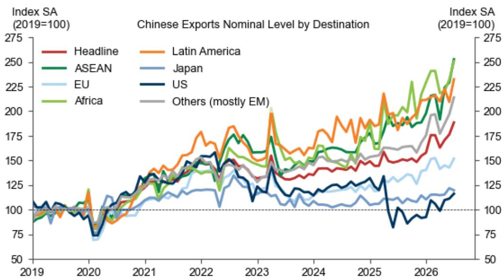
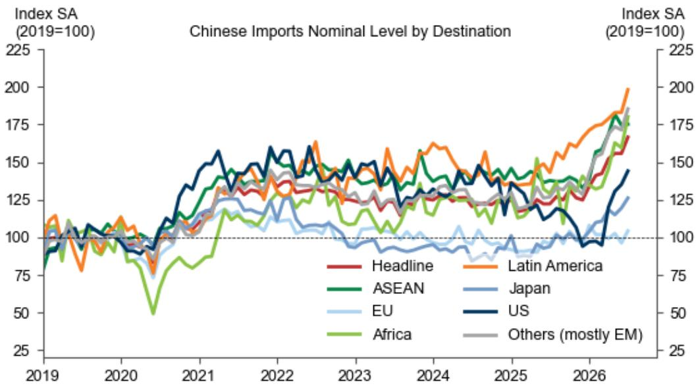
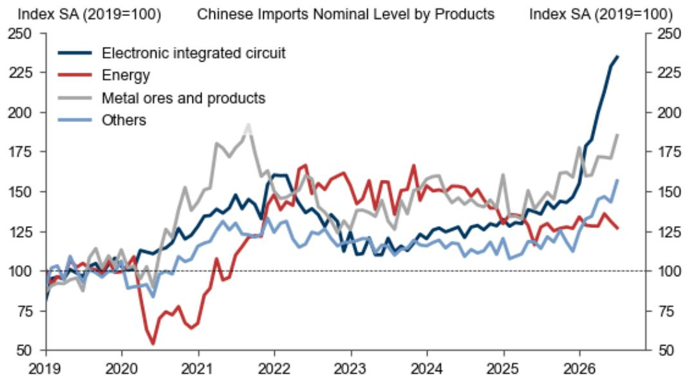

# 中国6月贸易顺差达1256亿美元，AI出口与能源进口变化推动结构转型

7月13日发布的6月贸易数据显示，中国出口表现持续活跃。名义出口同比增长27.0%，高于5月的19.4%，也超过市场预期的19.0%。进口同比增长36.0%，高于预期的26.1%。贸易顺差达1256亿美元，较5月的1054亿美元有所扩大。这些数据反映了中国贸易结构与定价能力的结构性变化。

从季节性调整后的环比数据看，6月出口和进口均环比增长6.9%，较5月出口3.3%的增速和进口持平的趋势明显加快。这种同步扩张表明，推动因素并非仅仅是基数效应或一次性需求波动，而是反映了更系统的变化：中国正在出口更多高价值技术产品，同时以较高价格进口关键原材料，由此形成的顺差扩大对全球供应链、汇率市场及贸易政策具有战略意义。

三个因素正在重塑中国贸易格局。第一，AI相关产品与半导体成为出口和进口增长的主要驱动力，但存在关键不对称：半导体出口量下降而价值飙升，反映出定价权的转移。第二，汽车行业成为重要的出口增长点，汽车出口同比增长69.6%。第三，能源进口量显著下降，原油进口量同比下降41.3%，表明有意识地减少对化石燃料依赖的战略转向。这些趋势共同构成一个清晰的叙事：中国正围绕更高价值、技术密集型产品重构贸易结构，同时降低对波动性能源市场的敞口。

## 半导体贸易呈现不对称：中国为芯片支付更高价格，出口数量却减少

6月数据中最值得关注的张力在于半导体贸易。半导体出口价值同比增长121.9%，高于5月的110.9%。然而出口量同比下降0.5%，较5月的2.1%增长有所回落。这种分化并非统计异常，而是表明中国半导体出口商每单位产品获得了显著更高的价格，可能反映了向更高端、更高利润率芯片的转变，以及全球AI相关组件的短缺。

进口方面，这一模式更为明显。半导体进口价值同比增长72.3%，高于5月的68.0%。但这一增长几乎完全由价格上涨驱动。进口量仅同比增长6.6%，较5月的-1.0%有所改善。这意味着中国正在为其尚无法自主生产的先进芯片支付显著溢价，尤其是用于AI训练和推理的芯片。这不是数量驱动的扩张，而是价格驱动的必要选择。

这种不对称性具有更深层的含义。半导体贸易动态表明，中国国内芯片产能正在低价值领域扩张，使其能够以更高价格出口更多产品，但在尖端组件上仍依赖外国供应商。出口与进口半导体之间的价格差距扩大，意味着外国芯片制造商（尤其是台湾、韩国和美国的厂商）能够获取日益增长的技术溢价。只要这种依赖持续存在，中国的贸易顺差将在一定程度上被其为先进芯片支付的溢价所抵消，这是一种限制AI出口繁荣净收益的结构性成本。

## 汽车出口成为结构性增长动力

汽车行业已从新兴出口类别转变为重要增长动力。6月汽车出口同比增长69.6%，较5月的39.3%明显加速。这并非单月异常，环比增长模式确认了持续上升趋势。虽然报告未提供汽车出口量数据，但同比加速的持续性表明，中国汽车制造商正在新兴市场以及发达市场获得更多份额。

这一趋势的重要性体现在三个方面。第一，它使中国出口基础更加多元化，减少对电子产品和机械的依赖，降低行业特定下行风险。第二，它对欧洲、日本和韩国的传统汽车制造中心形成直接竞争压力。第三，它使中国面临潜在的贸易摩擦，尤其是在欧盟，政策制定者已对补贴性中国电动汽车出口表示关注。6月对欧盟出口同比增长18.5%，高于5月的7.6%，表明欧洲需求依然强劲，但这种增长本身可能加速保护主义反应。

对于全球观察者而言，汽车出口周期可能成为贸易谈判中的焦点。中国汽车出口增速远超整体出口增速，这种分化可能引发监管关注。供应链涉及中国汽车生产的企业应做好应对潜在关税或非关税壁垒的准备，尤其是在欧洲。

## 能源进口下降反映战略调整，而非需求疲软

6月数据中最容易被忽视的部分是能源进口的变化。原油进口价值同比下降7.4%，较5月的15.3%增长出现明显逆转。进口量下降更为显著：原油进口量同比下降41.3%，而5月为下降29.0%。成品油进口呈现类似模式，价值下降26.3%，量下降48.6%。

这并非需求问题。如果中国工业活动减弱，我们应看到各类进口普遍下降。然而，谷物进口增长26.7%，铜矿进口价值增长33.3%，半导体进口大幅增长。能源进口下降是特定且具有战略性的。它可能反映了多种因素：国内煤炭产量增加、可再生能源部署加速，以及在不确定性和价格波动背景下减少对进口化石燃料依赖的政策选择。

对于商品市场而言，这一趋势具有深远影响。中国长期以来是全球原油市场的边际买家，进口量的持续减少将从根本上改变供需动态。如果中国能源进口下降是结构性而非周期性的，则意味着全球石油需求预期将发生永久性转变。能源市场参与者应将6月数据视为潜在转折点，而非暂时现象。

## 解读中国贸易数据的分析框架

对于需要将这些趋势转化为可操作分析的读者，以下框架提供了每月贸易数据发布时可关注的关键问题。

首先，区分价格驱动与数量驱动的增长。半导体贸易完美说明了这一点：出口价值增长122%，但出口量下降。完全由价格驱动的高名义增长，其反映的实际经济动能不如数量驱动的增长。分析任何产品类别时，应始终比较价值与数量的增长率。两者之间的差距扩大表明定价能力或成本传导，而非需求扩张。

其次，关注顺差的产品集中度。集中在少数产品类别（如汽车和半导体）的贸易顺差，比广泛多元化的顺差更容易受到政策冲击。6月数据显示，顺差扩大越来越多地由技术和运输设备驱动，而这些正是最可能引发贸易救济措施的领域。

第三，监测进口结构以获取战略信号。能源进口下降，加上半导体和谷物进口上升，表明有意识的资源配置策略。中国正在优先考虑技术投入和粮食安全，同时减少对能源价格波动的敞口。这种重新配置对全球商品需求、供应链投资和风险评估具有影响。

第四，评估区域多元化。对东盟出口同比增长34.5%，而对美国出口仅增长13.9%。新兴市场与发达市场出口增长之间的差距正在扩大，表明中国出口商正积极转向增长更快的地区。这种区域转移减少了对单一市场的依赖，但也增加了新兴经济体监管和政治风险。

最后，考虑对汇率和资本流动的间接影响。1256亿美元的贸易顺差创造了显著的外汇流入，为人民币提供支撑，并为央行提供政策灵活性。然而，如果顺差由价格效应而非数量效应驱动，其可持续性则不太确定。半导体定价逆转或汽车出口放缓可能迅速缩小顺差，使汇率和储备头寸面临调整风险。

6月贸易数据不仅是一个月度快照。它是一个战略信号，表明中国贸易结构正受到技术依赖、能源政策和区域调整的重新塑造。仔细解读这些数据，其影响远不止于下一季度的增长预测。

*仅供参考。部分内容可能基于原始材料通过AI辅助生成、翻译、总结或编辑，可能存在遗漏或错误。请独立核实。本文不构成任何专业建议。*

仅供参考。部分内容可能基于原始材料通过AI辅助生成、翻译、总结或编辑，可能存在遗漏或错误。请独立核实。本文不构成任何专业建议。

