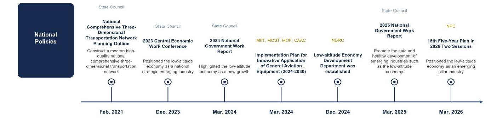
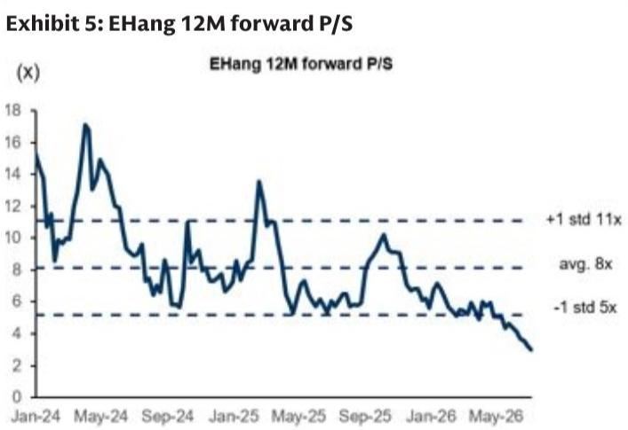

GC TECH

# eVTOL应用场景在政策支持下持续拓展；基于合理市场定价调整对亿航的观察

中国eVTOL产业持续发展，商业应用场景不断丰富（例如观光、物流、短途运输），生态系统逐步完善，政策支持力度加强，监管细则也更为明确。初期应用主要集中在空中旅游（点对点往返），并已逐步扩展至短途物流，长期来看，空中出租车/机场接驳服务具有发展潜力。

Allen Chang  
+852-2978-2930 |  
allen.k.chang@gs.com  
GS (Asia) L.L.C.

Verena Jeng
+852-2978-1681 | verena.jeng@gs.com
GS (Asia) L.L.C.

低空经济的政策支持：我们梳理了近期针对eVTOL行业的政府标准、政策与法规。我们注意到，2025年12月发布的《民用航空法》旨在优化低空空域资源配置，而2026年3月的“十五五”规划将低空经济定位为新兴支柱产业（链接）。我们对支持城市空中交通和低空经济的有利政策与法规保持积极看法。

Ting Song +852-2978-6466 | ting.song@gs.com GS (Asia) L.L.C.

安徽省：对新开航线提供运营补贴，奖励金额为40万元人民币；提供生产制造激励。

深圳市：对eVTOL运营提供每飞行每人100-300元人民币的运营补贴；提供生产制造激励。

■ 广州市：对单条载人无人驾驶空中航线提供不超过100万元人民币的运营补贴；提供生产制造激励。

eVTOL商业化应用场景的拓展：我们持续观察到eVTOL在以下多个场景的应用：（1）空中交通，（2）空中物流，以及（3）应急响应。在空中交通方面，我们预计eVTOL公司将先从空中旅游解决方案入手，在隔离空域内提供点对点往返飞行，随后再转向机场接驳的点对点定期航班。长期来看，我们预计将出现空中出租车解决方案，提供按需的点对点飞行服务。在物流和应急场景中，eVTOL可以提供短途或长途物流运输，覆盖山区和偏远地区，并为高层建筑提供消防应急服务。

在本报告中，基于合理市场定价，我们将对亿航的评级从买入调整为中性。这反映了我们下调的预估，主要由于EH216-S商业服务可能需要更长时间，这可能意味着我们此前对AAV出货量的假设过于乐观，且VT-35及海外扩张仍处于早期阶段。我们的新目标价为7.3美元（此前为16.9美元）。更多细节请见下文。

图表1：城市空中交通与低空经济关键政策汇总  
  
来源：公司数据，中国民航局

亿航：超越空中旅游服务的应用场景；基于合理市场定价下调至中性

<table><tr><td>EH</td><td>12个月目标价：7.3美元</td><td colspan="2">现价：5.41美元</td><td colspan="2">潜在空间：34.9%</td></tr><tr><td rowspan="2">中性</td><td>GS预测</td><td></td><td></td><td></td><td></td></tr><tr><td></td><td>2025年12月</td><td>2026年12月E</td><td>2027年12月E</td><td>2028年12月E</td></tr><tr><td>市值：3.18亿美元</td><td>营收（百万元人民币）新</td><td>418.0</td><td>533.3</td><td>972.1</td><td>1,675.5</td></tr><tr><td>企业价值：3.058亿美元</td><td>营收（百万元人民币）旧</td><td>418.0</td><td>533.3</td><td>1,099.4</td><td>1,816.1</td></tr><tr><td>3个月日均交易量：840万美元</td><td>EBITDA（百万元人民币）</td><td>(316.1)</td><td>(208.8)</td><td>14.8</td><td>439.7</td></tr><tr><td>中国</td><td>每股收益（人民币）新</td><td>(3.79)</td><td>(3.27)</td><td>(0.31)</td><td>5.21</td></tr><tr><td rowspan="2">大中华区科技</td><td>每股收益（人民币）旧</td><td>(3.79)</td><td>(3.27)</td><td>1.91</td><td>7.58</td></tr><tr><td>市盈率（倍）</td><td>NM</td><td>NM</td><td>NM</td><td>7.0</td></tr><tr><td rowspan="5">并购排名：3</td><td>市净率（倍）</td><td>8.1</td><td>3.0</td><td>2.8</td><td>2.0</td></tr><tr><td>股息率（%）</td><td>0.0</td><td>0.0</td><td>0.0</td><td>0.0</td></tr><tr><td>CROCI（%）</td><td>NM</td><td>NM</td><td>17.5</td><td>41.6</td></tr><tr><td></td><td>2026年3月</td><td>2026年6月E</td><td>2026年9月E</td><td>2026年12月E</td></tr><tr><td>每股收益（人民币）</td><td>(1.77)</td><td>(0.88)</td><td>(0.65)</td><td>(0.03)</td></tr></table>

来源：公司数据，GS预估，FactSet。价格截至2026年7月13日收盘。
来源：公司数据，GS全球投资研究

我们对eVTOL行业以及作为行业领导者的亿航的长期发展机遇保持积极看法。我们继续预计亿航在2026-2028年将实现强劲的营收增长，复合年增长率超过77%，这得益于AAV出货量的提升以及盈利能力的改善。话虽如此，我们认为商业售票服务需要更长的时间。公司已获得型号合格证，并支持其合作伙伴获得运营许可证，但EH216-S的商业服务启动仍需时间，有待中国民航局根据新的运营和安全要求进行批准。我们继续将用于长途飞行的VT-35和海外营收机会视为长期增长动力，尽管两者仍处于早期阶段。

我们观察到公司市场估值的调整，并将估值倍数重置为2027年预期市销率的3.7倍，这接近其近期交易均值，而此前我们的目标价隐含的2027年预期市销率为7.5倍，接近其两年平均市销率。鉴于其潜在空间低于我们大中华区科技板块覆盖标的48%的平均水平，我们将亿航的评级从买入下调至中性。可能推动估值重新评估的因素包括：（1）信息技术宏观环境强于预期，这可能得益于更强劲的经济增长或政府支持，从而鼓励企业采购新技术；（2）商业化进程快于预期，这可能得益于针对各种应用场景推出更多新机型，或新的商业模式加速商业化；（3）技术迁移或生态系统发展快于预期，这可能进一步提升乘客的飞行体验。

我们对2026-2028年营收增长（复合年增长率超过77%）的预估基于：（1）公司的合作伙伴及子公司已在获得型号合格证和适航证后取得EH216-S的运营许可证，支持AAV出货量的提升；（2）亿航的产能扩张，使其能够抓住对AAV日益增长的需求；（3）亿航目前正与中国民航局密切合作，根据中国民航局新的监管框架，满足EH216-S商业售票飞行服务的新运营和安全要求。

盈利预测调整：我们维持2026年预估不变，将2027年盈利预测下调至净亏损2300万元人民币（此前为净利润1.43亿元人民币），并将2028年净利润下调31%，主要由于营收降低和运营支出增加。2027/2028年营收分别下调12%/8%，反映了EH216-S商业服务启动所需时间长于预期，这意味着我们此前对AAV出货量的假设可能过于乐观；而运营支出比率上升主要反映了为支持产品开发和提升乘客飞行体验而增加的研发投入，这将支持公司的长期增长。

图表2：盈利预测调整

<table><tr><td rowspan="2">百万元人民币</td><td colspan="3">2026年E</td><td colspan="3">2027年E</td><td colspan="3">2028年E</td></tr><tr><td>旧</td><td>新</td><td>变动%</td><td>旧</td><td>新</td><td>变动%</td><td>旧</td><td>新</td><td>变动%</td></tr><tr><td>营收</td><td>533</td><td>533</td><td>0%</td><td>1,099</td><td>972</td><td>-12%</td><td>1,816</td><td>1,676</td><td>-8%</td></tr><tr><td>毛利润</td><td>331</td><td>331</td><td>0%</td><td>684</td><td>612</td><td>-11%</td><td>1,125</td><td>1,050</td><td>-7%</td></tr><tr><td>营业利润</td><td>(256)</td><td>(256)</td><td>na</td><td>148</td><td>(29)</td><td>na</td><td>582</td><td>397</td><td>-32%</td></tr><tr><td>净利润</td><td>(248)</td><td>(248)</td><td>na</td><td>143</td><td>(23)</td><td>na</td><td>566</td><td>389</td><td>-31%</td></tr><tr><td>利润率</td><td></td><td></td><td></td><td></td><td></td><td></td><td></td><td></td><td></td></tr><tr><td>毛利率</td><td>62.1%</td><td>62.1%</td><td>0ppts</td><td>62.2%</td><td>62.9%</td><td>0.7ppts</td><td>62.0%</td><td>62.6%</td><td>0.7ppts</td></tr><tr><td>营业利润率</td><td>-48.0%</td><td>-48.0%</td><td>0ppts</td><td>13.5%</td><td>-3.0%</td><td>-16.4ppts</td><td>33.1%</td><td>23.7%</td><td>-9.4ppts</td></tr><tr><td>净利润率</td><td>-46.6%</td><td>-46.6%</td><td>0ppts</td><td>13.0%</td><td>-2.3%</td><td>-15.3ppts</td><td>31.1%</td><td>23.2%</td><td>-7.9ppts</td></tr></table>

来源：公司数据，GS全球投资研究

图表3：各板块营收及毛利率变动

<table><tr><td>营收</td><td>2025年</td><td>2026年E</td><td>2027年E</td><td>2028年E</td></tr><tr><td>新（百万元人民币）</td><td></td><td></td><td></td><td></td></tr><tr><td>空中交通解决方案 - AAV产品</td><td>353</td><td>439</td><td>805</td><td>1,359</td></tr><tr><td>空中交通解决方案 - 观光服务</td><td>-</td><td>19</td><td>60</td><td>175</td></tr><tr><td>智慧城市管理</td><td>19</td><td>32</td><td>47</td><td>65</td></tr><tr><td>空中媒体解决方案</td><td>20</td><td>32</td><td>47</td><td>64</td></tr><tr><td>其他</td><td>26</td><td>11</td><td>13</td><td>13</td></tr><tr><td>总计</td><td>418</td><td>533</td><td>972</td><td>1,676</td></tr><tr><td>旧（百万元人民币）</td><td></td><td></td><td></td><td></td></tr><tr><td>空中交通解决方案 - AAV产品</td><td>353</td><td>439</td><td>932</td><td>1,500</td></tr><tr><td>空中交通解决方案 - 观光服务</td><td>-</td><td>19</td><td>60</td><td>175</td></tr><tr><td>智慧城市管理</td><td>19</td><td>32</td><td>47</td><td>65</td></tr><tr><td>空中媒体解决方案</td><td>20</td><td>32</td><td>47</td><td>64</td></tr><tr><td>其他</td><td>26</td><td>11</td><td>13</td><td>13</td></tr><tr><td>总计</td><td>418</td><td>533</td><td>1,099</td><td>1,816</td></tr><tr><td>变动%</td><td></td><td></td><td></td><td></td></tr><tr><td>空中交通解决方案 - AAV产品</td><td>0%</td><td>0%</td><td>-14%</td><td>-9%</td></tr><tr><td>空中交通解决方案 - 观光服务</td><td></td><td>0%</td><td>0%</td><td>0%</td></tr><tr><td>智慧城市管理</td><td>0%</td><td>0%</td><td>0%</td><td>0%</td></tr><tr><td>空中媒体解决方案</td><td>0%</td><td>0%</td><td>0%</td><td>0%</td></tr><tr><td>其他</td><td>0%</td><td>0%</td><td>0%</td><td>0%</td></tr><tr><td>总计</td><td>0%</td><td>0%</td><td>-12%</td><td>-8%</td></tr></table>

<table><tr><td>毛利率</td><td>2025年</td><td>2026年E</td><td>2027年E</td><td>2028年E</td></tr><tr><td>新</td><td></td><td></td><td></td><td></td></tr><tr><td>空中交通解决方案 - AAV产品</td><td>62.9%</td><td>63.0%</td><td>64.0%</td><td>64.0%</td></tr><tr><td>空中交通解决方案 - 观光服务</td><td></td><td>54.0%</td><td>54.0%</td><td>54.0%</td></tr><tr><td>智慧城市管理</td><td>64.4%</td><td>64.4%</td><td>64.4%</td><td>64.4%</td></tr><tr><td>空中媒体解决方案</td><td>59.4%</td><td>59.4%</td><td>59.4%</td><td>59.4%</td></tr><tr><td>其他</td><td>42.2%</td><td>45.0%</td><td>45.0%</td><td>45.0%</td></tr><tr><td>总计</td><td>61.6%</td><td>62.2%</td><td>62.9%</td><td>62.6%</td></tr><tr><td>旧</td><td></td><td></td><td></td><td></td></tr><tr><td>空中交通解决方案 - AAV产品</td><td>62.9%</td><td>63.0%</td><td>63.0%</td><td>63.0%</td></tr><tr><td>空中交通解决方案 - 观光服务</td><td></td><td>54.0%</td><td>54.0%</td><td>54.0%</td></tr><tr><td>智慧城市管理</td><td>64.4%</td><td>64.4%</td><td>64.4%</td><td>64.4%</td></tr><tr><td>空中媒体解决方案</td><td>59.4%</td><td>59.4%</td><td>59.4%</td><td>59.4%</td></tr><tr><td>其他</td><td>4 2.2%</td><td>45.0%</td><td>45.0%</td><td>45.0%</td></tr><tr><td>总计</td><td>61.6%</td><td>62.2%</td><td>62.2%</td><td>61.9%</td></tr><tr><td>变动%</td><td></td><td></td><td></td><td></td></tr><tr><td>空中交通解决方案 - AAV产品</td><td>0ppts</td><td>0ppts</td><td>1ppts</td><td>1ppts</td></tr><tr><td>空中交通解决方案 - 观光服务</td><td>0ppts</td><td>0ppts</td><td>0ppts</td><td>0ppts</td></tr><tr><td>智慧城市管理</td><td>0ppts</td><td>0ppts</td><td>0ppts</td><td>0ppts</td></tr><tr><td>空中媒体解决方案</td><td>0ppts</td><td>0ppts</td><td>0ppts</td><td>0ppts</td></tr><tr><td>其他</td><td>0ppts</td><td>0ppts</td><td>0ppts</td><td>0ppts</td></tr><tr><td>总计</td><td>0ppts</td><td>0ppts</td><td>0.7ppts</td><td>0.7ppts</td></tr></table>

来源：公司数据，GS全球投资研究

市场定价：我们继续采用基于DCF的方法推导目标价，以捕捉公司的长期现金流生成能力。更新后的自由现金流反映了我们的预期，即考虑到中国民航局的新监管框架，AAV出货量的提升将有所推迟，而修订后的营收规模也将影响盈利能力和现金转换周期天数，导致自由现金流的提升速度放缓。我们将第二阶段自由现金流（2029-2031年）的同比增长率更新为6%（此前为10%），终端增长率维持3%不变，这与我们大中华区科技板块的覆盖范围一致。我们以12%的加权平均资本成本（不变）进行折现，其中股权成本为15.2%（贝塔系数1.88，无风险利率3.0%，市场风险溢价6.5%），债务成本为3.0%。因此，我们的新目标价修订为7.3美元（此前为16.9美元）。我们的新目标价隐含2027年预期市销率3.7倍（此前为7.5倍），与其近期交易平均市销率一致。鉴于其潜在空间低于我们大中华区科技板块覆盖标的48%的平均水平，我们将亿航的评级从买入下调至中性。自2023年10月15日被列入买入名单以来，亿航股价下跌73%，而纳斯达克指数上涨93%，原因是EH216-S的规模化生产和商业化所需时间长于预期。

图表4：亿航DCF估值

<table><tr><td>百万元人民币</td><td>2018</td><td>2019</td><td>2020</td><td>2021</td><td>2022</td><td>2023</td><td>2024</td><td>2025</td><td>2026E</td><td>2027E</td><td>2028E</td><td>2029E</td><td>2030E</td><td>2031E</td></tr><tr><td colspan="12">关键假设</td><td rowspan="15" colspan="3"></td></tr><tr><td>AAV 216交付量</td><td>2</td><td>62</td><td>70</td><td>30</td><td>19</td><td>48</td><td>215</td><td>163</td><td>197</td><td>369</td><td>663</td></tr><tr><td colspan="12">损益表</td></tr><tr><td>营收</td><td>66</td><td>122</td><td>180</td><td>57</td><td>44</td><td>117</td><td>456</td><td>418</td><td>533</td><td>972</td><td>1,676</td></tr><tr><td>同比</td><td></td><td>83%</td><td>48%</td><td>-68%</td><td>-22%</td><td>165%</td><td>288%</td><td>-8%</td><td>28%</td><td>82%</td><td>72%</td></tr><tr><td>毛利率</td><td>50.8%</td><td>58.5%</td><td>59.0%</td><td>63.4%</td><td>65.9%</td><td>64.1%</td><td>61.4%</td><td>61.5%</td><td>62.1%</td><td>62.9%</td><td>62.6%</td></tr><tr><td>运营支出比率</td><td>175.1%</td><td>99.3%</td><td>113.3%</td><td>647.4%</td><td>765.5%</td><td>321.7%</td><td>123.5%</td><td>140.3%</td><td>110.2%</td><td>65.9%</td><td>39.0%</td></tr><tr><td>营业利润</td><td>(83)</td><td>(50)</td><td>(98)</td><td>(332)</td><td>(310)</td><td>(302)</td><td>(283)</td><td>(329)</td><td>(256)</td><td>(29)</td><td>397</td></tr><tr><td>同比</td><td></td><td></td><td></td><td></td><td></td><td></td><td></td><td></td><td></td><td></td><td></td></tr><tr><td>净利润</td><td>(79)</td><td>(76)</td><td>(88)</td><td>(314)</td><td>(328)</td><td>(302)</td><td>(230)</td><td>(277)</td><td>(248)</td><td>(23)</td><td>389</td></tr><tr><td>同比</td><td></td><td></td><td></td><td></td><td></td><td></td><td></td><td></td><td></td><td></td><td></td></tr><tr><td colspan="12">现金流</td></tr><tr><td>现金转换周期</td><td>(105)</td><td>(5)</td><td>170</td><td>937</td><td>1,154</td><td>351</td><td>9</td><td>24</td><td>20</td><td>(30)</td><td>-</td></tr><tr><td>资本支出</td><td>(5)</td><td>(4)</td><td>(9)</td><td>(16)</td><td>(9)</td><td>(8)</td><td>(39)</td><td>(148)</td><td>(75)</td><td>(39)</td><td>(50)</td></tr><tr><td>资本支出占营收比</td><td>7%</td><td>3%</td><td>5%</td><td>28%</td><td>20%</td><td>7%</td><td>9%</td><td>35%</td><td>14%</td><td>4%</td><td>3%</td></tr><tr><td>自由现金流</td><td>(48)</td><td>(59)</td><td>(161)</td><td>(137)</td><td>(182)</td><td>(96)</td><td>119</td><td>(327)</td><td>(90)</td><td>(38)</td><td>238</td><td>252</td><td>267</td><td>283</td></tr><tr><td>同比</td><td></td><td></td><td></td><td></td><td></td><td></td><td></td><td></td><td></td><td></td><td></td><td>6%</td><td>6%</td><td>6%</td></tr><tr><td colspan="6">自由现金流阶段</td><td rowspan="3" colspan="6">第一阶段（2023-28E）获得TC，产能快速提升以履行预订单</td><td rowspan="3" colspan="3">第二阶段（2029E-31E）稳定的营收增长和客户基础 10%</td></tr><tr><td colspan="6">自由现金流增长</td></tr><tr><td colspan="6">终端增长率</td></tr><tr><td colspan="14">终值</td><td>3%</td></tr><tr><td colspan="10">折现因子</td><td>1.00</td><td>0.88</td><td>0.85</td><td>0.83</td><td>0.81</td></tr><tr><td colspan="10">自由现金流现值</td><td>(38)</td><td>208</td><td>214</td><td>220</td><td>229</td></tr><tr><td colspan="10">2027年企业价值（百万元人民币）</td><td>3,471</td><td></td><td></td><td></td><td></td></tr><tr><td colspan="10">现金及等价物</td><td>258</td><td></td><td></td><td></td><td></td></tr><tr><td colspan="10">债务</td><td>158</td><td></td><td></td><td></td><td></td></tr><tr><td colspan="10">2027年股权价值（百万元人民币）</td><td>3,572</td><td></td><td></td><td></td><td></td></tr><tr><td colspan="10">2027年股权价值（百万美元）</td><td>489</td><td></td><td></td><td></td><td></td></tr><tr><td colspan="10">每ADS价值（美元）</td><td>7.30</td><td></td><td></td><td></td><td></td></tr><tr><td colspan="10">隐含2027年市销率</td><td>3.7x</td><td></td><td></td><td></td><td></td></tr><tr><td colspan="15">WACC假设（2027E）</td></tr><tr><td>无风险利率</td><td>3.0%</td><td></td><td></td><td></td><td></td><td></td><td></td><td></td><td></td><td></td><td></td><td></td><td></td><td></td></tr><tr><td>贝塔系数</td><td>1.88</td><td></td><td></td><td></td><td></td><td></td><td></td><td></td><td></td><td></td><td></td><td></td><td></td><td></td></tr><tr><td>市场风险溢价</td><td>6.5%</td><td></td><td></td><td></td><td></td><td></td><td></td><td></td><td></td><td></td><td></td><td></td><td></td><td></td></tr><tr><td>股权成本</td><td>15.2%</td><td></td><td></td><td></td><td></td><td></td><td></td><td></td><td></td><td></td><td></td><td></td><td></td><td></td></tr><tr><td>债务成本</td><td>3.0%</td><td></td><td></td><td></td><td></td><td></td><td></td><td></td><td></td><td></td><td></td><td></td><td></td><td></td></tr><tr><td>WACC</td><td>12%</td><td></td><td></td><td></td><td></td><td></td><td></td><td></td><td></td><td></td><td></td><td></td><td></td><td></td></tr></table>

来源：公司数据，GS全球投资研究

  
来源：Eikon Datastream

## 下行/上行风险：

（1）商业化进程慢于/快于预期：公司正与合作伙伴在eVTOL商业化方面展开合作，涵盖空中交通、物流和应急领域。如果商业化进程慢于或快于我们的预期，可能对我们的预估产生下行或上行影响。

（2）eVTOL出货量低于/高于预期：eVTOL销售是公司营收的主要驱动力。受客户需求和行业环境影响，eVTOL出货量的降低或增加，可能导致我们的盈利预估出现下行或上行。

（3）eVTOL政策/法规差于/好于预期：支持eVTOL运营和产能扩张的政策/法规对eVTOL公司的发展有影响。如果政策/法规差于或好于预期，可能对我们的预估产生下行或上行风险。

图表6：亿航损益表摘要

<table><tr><td>百万元人民币</td><td>2023</td><td>2024</td><td>2025</td><td>2026E</td><td>2027E</td><td>2028E</td></tr><tr><td colspan="7">利润表</td></tr><tr><td>营收</td><td>117</td><td>456</td><td>418</td><td>533</td><td>972</td><td>1,676</td></tr><tr><td>毛利润</td><td>75</td><td>280</td><td>257</td><td>331</td><td>612</td><td>1,050</td></tr><tr><td>运营支出</td><td>(378)</td><td>(563)</td><td>(586)</td><td>(588)</td><td>(640)</td><td>(653)</td></tr><tr><td>销售费用</td><td>(60)</td><td>(131)</td><td>(122)</td><td>(117)</td><td>(114)</td><td>(111)</td></tr><tr><td>管理费用</td><td>(150)</td><td>(233)</td><td>(270)</td><td>(196)</td><td>(169)</td><td>(164)</td></tr><tr><td>研发费用</td><td>(167)</td><td>(199)</td><td>(195)</td><td>(274)</td><td>(357)</td><td>(377)</td></tr><tr><td>营业利润</td><td>(302)</td><td>(283)</td><td>(329)</td><td>(256)</td><td>(29)</td><td>397</td></tr><tr><td>税前利润</td><td>(301)</td><td>(225)</td><td>(276)</td><td>(267)</td><td>(38)</td><td>400</td></tr><tr><td>净利润</td><td>(302)</td><td>(230)</td><td>(277)</td><td>(248)</td><td>(23)</td><td>389</td></tr><tr><td>每股收益（人民币）</td><td>(4.98)</td><td>(3.45)</td><td>(3.79)</td><td>(3.27)</td><td>(0.31)</td><td>5.21</td></tr><tr><td colspan="7">利润率</td></tr><tr><td>毛利率</td><td>64.1%</td><td>61.4%</td><td>61.5%</td><td>62.1%</td><td>62.9%</td><td>62.6%</td></tr><tr><td>营业利润率</td><td>-257.6%</td><td>-62.1%</td><td>-78.7%</td><td>-48.0%</td><td>-3.0%</td><td>23.7%</td></tr><tr><td>税前利润率</td><td>-256.0%</td><td>-49.4%</td><td>-65.9%</td><td>-50.1%</td><td>-3.9%</td><td>23.9%</td></tr><tr><td>净利润率</td><td>-256.9%</td><td>-50.4%</td><td>-66.2%</td><td>-46.6%</td><td>-2.3%</td><td>23.2%</td></tr><tr><td colspan="7">同比</td></tr><tr><td>营收</td><td>165%</td><td>288%</td><td>-8%</td><td>28%</td><td>82%</td><td>72%</td></tr><tr><td>毛利润
