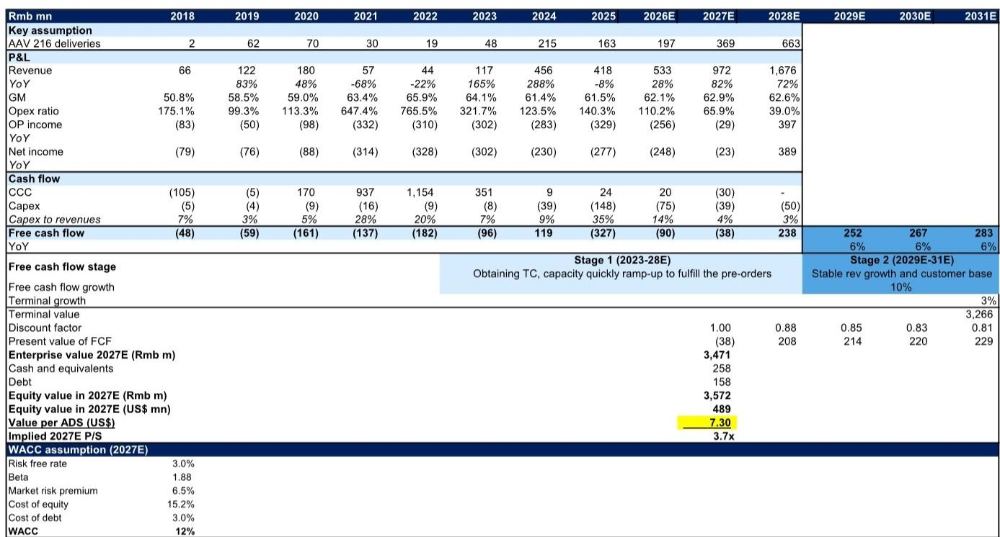
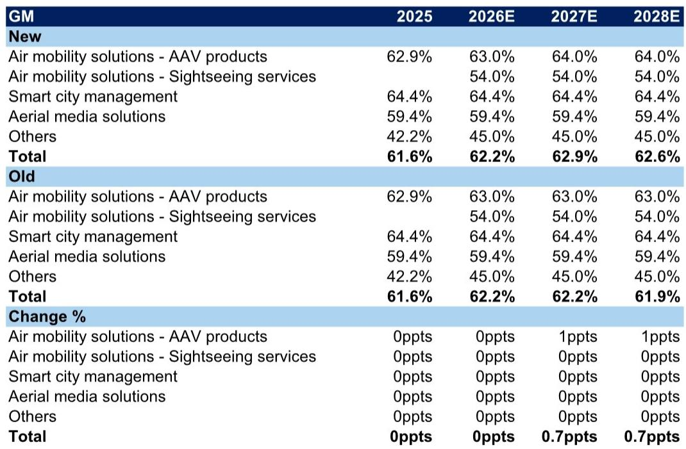
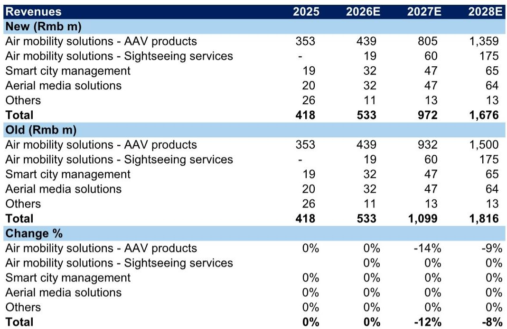

# GS：GCTECH-eVTOL应用场景扩张，政策支持稳固

中国低空宏观环境政策密集落地，但行业龙头亿航的商业化节奏正在被市场重新审视。GS在最新报告中调整了对亿航公司的观点，核心原因并非技术或订单，而是监管审批周期超出预期——EH216-S的商业载客运营仍需等待民航局新的运行安全要求落地。这份报告提供了一个观察窗口：当政策热情与商业现实之间出现时间差，市场如何重新校准预期。

报告同时梳理了各地对低空宏观环境的补贴力度。安徽对新开航线奖励40万元，深圳对每架次载人飞行补贴100至300元，广州单条载人无人驾驶航线运营补贴上限100万元。这些数字说明地方政府仍在积极推动，但补贴能否转化为可规模化的商业场景，取决于适航审批的节奏。

> **KC评论：** 报告最关键的修正不是需求判断，而是时间假设。GS将2027年营收预测下调12%，2028年下调8%，直接原因是“此前对AAV出货量的假设可能过于激进”。这提醒读者：eVTOL行业的估值锚点正在从“政策利好”转向“审批节点可预测性”。

## 1. 商业场景正在从观光旅游向短途物流延伸，但载人运营仍卡在审批阶段

报告将eVTOL的应用场景分为三个层次。短期落地最快的是空中观光，点A到点A的封闭空域飞行，技术门槛和监管复杂度最低。中期看点是机场接驳，点A到点B的固定航线，需要更成熟的空域管理。长期想象空间在于空中出租车，按需飞行的点对点服务。

物流场景的推进速度可能快于载人。短途物流和山区配送对安全冗余的要求低于载客，且已有实际运营案例。但报告明确指出，亿航的EH216-S要启动商业载客服务，仍需等待民航局在新的运行安全框架下批准。公司虽然已获得型号合格证（TC），并协助合作伙伴取得运营合格证（OC），但“商业售票服务仍需更长时间”。

## 2. 营收增长预期仍强劲，但盈利拐点被推迟

GS维持2026年营收预测不变，但将2027年净利润从盈利1.43亿元修正为亏损2300万元，2028年净利润下调31%。修正后的2027至2028年营收复合增长率仍达77%，但盈利时间表明显后移。

背后的结构性原因有两个。一是研发投入持续增加。报告提到，更高的运营支出比率主要来自“支持产品开发和提升乘客飞行体验的研发研究”。这意味着，即便营收增长，利润释放也会被持续的研发投入稀释。二是出货量假设被调低。2027年AAV出货量从之前的预期下调，反映了审批周期的不确定性。

从估值角度看，接近近期交易均值。GS认为，当前估值已基本反映了审批延迟的不确定性，但上行空间相对于覆盖的其他科技公司已不具备吸引力。

## 3. 一个可复用的观察框架：用“审批节点”替代“政策热度”作为估值锚

这份报告提供了一个行业分析的方法论启示。对于eVTOL这类受监管强约束的新兴行业，市场容易犯的错误是用政策热度替代商业进度。地方政府补贴、五年规划定位、适航证获取，这些信号容易让读者高估短期商业化速度。

更可靠的观察框架是追踪三个具体节点：第一，民航局对商业载客运营的具体安全要求何时发布；第二，运营商何时获得针对特定航线的商业运营许可；第三，单条航线的实际票价和客座率数据。只有当这三个节点逐一落地，行业才真正从“政策驱动”切换到“商业验证”阶段。

报告没有展开的是，如果审批周期继续拉长，行业内的竞争格局可能发生变化。拥有更多现金储备或更广泛产品线的公司，在等待期内的生存能力更强。亿航的VT-35长距离机型仍处于早期阶段，海外扩张也尚未形成收入贡献，这意味着公司短期内仍高度依赖EH216-S单一产品的审批进展。

> **KC评论：** 报告将DCF模型中第二阶段（2029-2031年）的自由现金流增速从10%下调至6%，终端增长率维持3%。这个调整幅度不大，但方向明确——分析师认为，即便审批通过，规模化的速度也可能慢于此前的乐观假设。对于关注这个赛道的读者，这个增速假设本身就是一个值得跟踪的变量。

For informational purposes only. Portions may be generated,translated,summarized,or edited with AI assistance based on source materials and may contain omissions or errors. Please verify independently. This is not investment,legal,tax,accounting,or other professional advice.

For informational purposes only. Portions may be generated,translated,summarized,or edited with AI assistance based on source materials and may contain omissions or errors. Please verify independently. This is not investment,legal,tax,accounting,or other professional advice.

