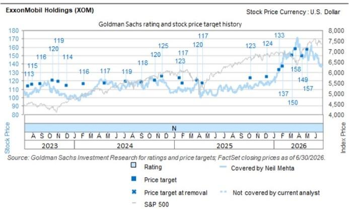

# ExxonMobil Holdings (XOM)

## 管理层午餐会要点：聚焦并购策略、二叠纪增长与勘探

XOM

12个月目标价位：\$157.00

当前价位：\$145.09

潜在空间：\$8.2\%

7月14日（周二），我们邀请埃克森美孚董事长兼首席执行官Darren Woods先生，就公司关键战略举措进行交流。主要要点包括：(1) 二叠纪增长与技术进展，(2) 勘探机会，(3) 并购策略，以及(4) 下游业务展望。我们对公司上游业务组合持积极看法，管理层持续部署关键技术以释放价值，尤其是在二叠纪区域。此外，我们对公司的炼化业务持建设性态度，认为其有望支撑公司表现。展望未来，我们将持续关注上游产量情况、外延增长机会、结构性成本削减以及液化天然气运营的更新信息。详见下文。

在上游业务组合方面，公司讨论了运营执行情况，特别是在二叠纪和圭亚那区域，以及持续的勘探工作。在二叠纪，公司维持了长期产量目标，并强调了其专有技术（包括持续部署的轻质支撑剂）带来的关键优势。在圭亚那，XOM强调了强劲的运营执行情况，以及优化储层和释放不可抗力下额外区块的努力。此外，管理层还讨论了投资组合中的其他机会，包括特立尼达和多巴哥，并对低成本莫桑比克和巴布亚项目持建设性态度。关于委内瑞拉，公司指出商业投资需要更有利的财政和监管环境，但也提到存在利用其技术的机会。

基本面方面，受低开工率和全球需求韧性驱动。在地缘政治供应中断的背景下，公司指出全球产品库存较低，对价格形成支撑。我们还注意到，公司维持其观点，即任何美国出口禁令都将适得其反，并讨论到，虽然《琼斯法案》豁免使得产品从墨西哥湾沿岸流向东西海岸成为可能，但边际产品仍需进口。在公司层面，管理层仍专注于提升产品收率和把握强劲的利润空间。

公司强调了其中期作为合理整合者的角色，并指出了其竞争优势和专有技术。讨论重点集中在下48州的技​​术优势，特别是在二叠纪持续部署的轻质支撑剂的价值。此外，公司认为存在重新压裂的机会以优化资产采收率，这得益于一系列可叠加的技术。管理层关于外延增长的框架仍侧重于推动运营和技术协同效应，以创造结构性长期价值。更广泛地看，公司的资本配置优先级未变，我们注意到公司重申了维持强劲资产负债表的承诺，同时投资于优势、高回报的增长项目，并在周期内保持稳定的回购。我们还注意到公司对结构性成本削减的关注，其有望在2030年前实现200亿美元的成本节约目标。

## 估值与主要风险：

我们对XOM的评级为中性，基于EV/DACF、FCF回报表现和P/E的12个月目标价位为\$157。主要风险涉及大宗商品价格、炼化利润率和运营执行。

## 附录

## Reg AC

我们，Neil Mehta、Alexa Petrick和Josiah Knight，特此证明本报告中表达的所有观点准确反映了我们个人对相关公司及其证券的看法。我们还证明，我们的薪酬中没有任何部分直接或间接与报告中表达的具体建议或观点相关。

除非另有说明，本报告封面所列人员为GS全球投资研究部分析师。

撰稿作者：Neil Mehta GS & Co. LLC, Alexa Petrick GS & Co. LLC, Josiah Knight GS & Co. LLC, Lydia Gould GS & Co. LLC。

除非另有说明，本报告撰稿作者披露中列出的个人是GS全球投资研究部分析师。

## GS因子概况

GS因子概况通过将关键属性与市场（即我们的评级股票池）及其行业同行进行比较，为股票提供投资背景。所描绘的四个关键属性是：增长、财务回报、倍数（例如估值）和综合（增长、财务回报和倍数的复合）。增长、财务回报和倍数是通过计算每只股票特定指标的标准化排名得出的。然后将这些指标的标准化排名进行平均，并转换为相关属性的百分位数。每个指标的具体计算可能因财年、行业和地区而异，但标准方法如下：

增长基于股票的前瞻性销售增长、EBITDA增长和EPS增长（对于金融股，仅EPS和销售增长），百分位数越高表示增长型公司。财务回报基于股票的前瞻性ROE、ROCE和CROCI（对于金融股，仅ROE），百分位数越高表示财务回报越高的公司。倍数基于股票的前瞻性P/E、P/B、价格/股息（P/D）、EV/EBITDA、EV/FCF和EV/债务调整后现金流（DACF）（对于金融股，仅P/E、P/B和P/D），百分位数越高表示股票交易倍数越高。综合百分位数计算为增长百分位数、财务回报百分位数和（100% - 倍数百分位数）的平均值。

财务回报和倍数使用GS分析师对未来至少三个季度后的财年末的预测。增长使用对未来至少七个季度后的财年与至少三个季度后的财年相比的输入（所有指标均基于每股）。

有关我们如何计算GS因子概况的更详细说明，请联系您的GS代表。

## 并购排名

在我们的全球覆盖范围内，我们使用并购框架审视股票，同时考虑定性因素和定量因素（可能因行业和地区而异），以纳入某些公司可能被收购的可能性。然后，我们将覆盖范围内的公司按1到3分进行并购排名，其中1表示公司成为收购目标的可能性高（30%-50%），2表示可能性中等（15%-30%），3表示可能性低（0%-15%）。对于排名为1或2的公司，根据我们的标准部门指南，我们将并购组成部分纳入目标价位。并购排名3被视为不重要，因此不计入我们的目标价位，并且可能在研究中讨论或不讨论。

## Quantum

Quantum是GS的专有数据库，提供详细的财务报表历史、预测和比率的访问。它可用于对单一公司进行深入分析，或比较不同行业和市场的公司。

## 披露

ExxonMobil Holdings的评级相对于其覆盖范围内的其他公司：CVR Energy Inc., Calumet Inc., Canadian Natural Resources Ltd., Cenovus Energy Inc., Chevron Corp., ConocoPhillips, Delek US Holdings, ExxonMobil Holdings, HF Sinclair Corp., Imperial Oil Ltd., Kosmos Energy Ltd., Marathon Petroleum Corp., PBF Energy Inc., Par Pacific Holdings, Phillips 66, Suncor Energy Inc., Valero Energy Corp.

## 公司特定监管披露

以下披露涉及GS集团（及其附属机构，“GS”）与本研究中提及的GS全球投资研究所覆盖公司之间的关系。

GS在过去12个月内因投资银行服务获得报酬：ExxonMobil Holdings (\$145.09)

GS预计在未来3个月内将寻求因投资银行服务获得报酬：ExxonMobil Holdings (\$145.09)

GS在过去12个月内与以下公司存在投资银行服务客户关系：ExxonMobil Holdings (\$145.09)

GS做市该证券或其衍生品：ExxonMobil Holdings (\$145.09)

## 评级/投资银行关系分布

GS投资研究全球股票覆盖范围

| | 评级分布 | | | 投资银行关系 | | |
| :--- | :--- | :--- | :--- | :--- | :--- | :--- |
| | 买入 | 持有 | 卖出 | 买入 | 持有 | 卖出 |
| 全球 | 50% | 34% | 16% | 65% | 59% | 43% |

截至2026年7月1日，GS全球投资研究对3,104只股票进行了投资评级。GS将股票指定为买入和卖出，列入各个地区的投资清单；未如此指定的股票被视为中性。就FINRA规则要求的上述披露而言，此类指定等同于买入、持有和卖出。请参阅下面的“评级、覆盖范围和相关定义”。投资银行关系图表反映了每个评级类别中GS在过去十二个月内提供过投资银行服务的公司所占的百分比。

## 目标价位和评级历史图表

  
所示目标价位应结合所有先前发布的GS（可能包含或不包含目标价位）以及公司、其行业和金融市场的发展情况来考虑。

## 目标价位历史表 ExxonMobil Holdings (XOM)

| 报告日期 | 目标价位 (\$) | 收盘价 (\$) |
| :--- | :--- | :--- |
| 2026年5月7日 | 157.00 | 146.58 |
| 2026年4月16日 | 149.00 | 151.98 |
| 2026年3月22日 | 158.00 | 159.67 |
| 2026年3月11日 | 150.00 | 151.58 |
| 2026年2月4日 | 137.00 | 147.59 |
| 2026年1月21日 | 133.00 | 133.61 |
| 2025年12月10日 | 124.00 | 119.54 |
| 2025年10月9日 | 123.00 | 112.91 |
| 2025年4月17日 | 117.00 | 106.92 |
| 2025年3月27日 | 120.00 | 117.89 |
| 2025年2月4日 | 117.00 | 109.96 |
| 2025年1月23日 | 123.00 | 110.15 |
| 2024年11月21日 | 125.00 | 121.93 |
| 2024年10月24日 | 120.00 | 119.59 |
| 2024年9月6日 | 118.00 | 112.64 |
| 2024年7月10日 | 119.00 | 111.92 |
| 2024年4月23日 | 117.00 | 121.03 |
| 2024年2月6日 | 116.00 | 102.25 |
| 2023年12月7日 | 114.00 | 98.42 |
| 2023年11月6日 | 119.00 | 105.87 |
| 2023年10月17日 | 120.00 | 111.39 |
| 2023年9月1日 | 116.00 | 113.52 |
| 2023年8月2日 | 115.00 | 105.29 |
| 2023年7月17日 | 113.00 | 101.38 |

表中所示目标价位未针对公司行为进行调整。

## 监管披露

## 美国法律法规要求的披露

请参阅上述公司特定监管披露，了解本报告提及的公司所需的任何以下披露：待定交易中的经理或联合经理；1%或其他所有权；特定服务的报酬；客户关系类型；先前期间的已管理/联合管理公开发行；董事职位；对于股权证券，做市和/或专家角色。GS作为主体交易或可能交易本报告中讨论的发行人的债务证券（或相关衍生品）。

以下是额外要求的披露：所有权和重大利益冲突：GS政策禁止其分析师、向分析师报告的专业人员及其家庭成员持有分析师覆盖范围内的任何公司的证券。分析师薪酬：分析师的薪酬部分基于GS的盈利能力，其中包括投资银行收入。分析师作为高管或董事：GS政策通常禁止其分析师、向分析师报告的人员或其家庭成员在分析师覆盖范围内的任何公司担任高管、董事或顾问。非美国分析师：非美国分析师可能不是GS & Co. LLC的关联人员，因此可能不受FINRA规则2241或FINRA规则2242关于与主题公司沟通、公开露面以及交易分析师所覆盖证券的限制。

## 美国以外司法管辖区法律和法规要求的额外披露

以下披露是相关司法管辖区要求的，除非已根据美国法律在上述范围内作出。澳大利亚：GS Australia Pty Ltd及其附属公司不是澳大利亚的授权存款机构（该术语在1959年银行法（联邦）中定义），不提供银行服务，也不在澳大利亚开展银行业务。除非GS另有约定，本研究及其任何访问仅面向澳大利亚公司法意义上的“批发客户”。在制作研究报告时，GS Australia全球投资研究部的成员可能会参加由研究报告主题公司和实体主办或组织的现场访问和其他会议。在某些情况下，如果GS Australia认为在特定情况下与现场访问或会议相关是适当和合理的，此类现场访问或会议的费用可能部分或全部由相关发行人承担。如果本文档内容包含任何金融产品建议，则仅为一般性建议，由GS在未考虑客户目标、财务状况或需求的情况下编制。客户在根据任何此类建议采取行动前，应考虑该建议是否适合其自身目标、财务状况和需求。某些GS Australia和New Zealand的利益披露以及GS澳大利亚卖方研究独立性政策声明的副本可在以下网址获取：https://www.goldmansachs.com/disclosures/australia-new-zealand/index.html。巴西：与CVM第20号决议相关的披露信息可在https://www.gs.com/worldwide/brazil/area/gir/index.html获取。在适用的情况下，根据CVM第20号决议第20条定义，主要负责本研究报告内容的巴西注册分析师是本报告开头指定的第一作者，除非文本末尾另有说明。加拿大：此信息仅供您参考，在任何情况下均不应被解释为GS & Co. LLC为在加拿大交易任何加拿大证券而向加拿大证券购买者发布的广告、要约或招揽。GS & Co. LLC未根据适用的加拿大证券法在任何加拿大司法管辖区注册为交易商，通常不被允许交易加拿大证券，并且可能被禁止在加拿大的某些司法管辖区出售某些证券和产品。如果您希望在加拿大交易任何加拿大证券或其他产品，请联系GS Canada Inc.（GS集团的附属公司）或其他注册的加拿大交易商。香港：可向GS (Asia) L.L.C.索取本研究中提及的所覆盖公司证券的进一步信息。印度：可从GS (India) Securities Private Limited获取本研究中提及的主题公司或公司的进一步信息，研究分析师 - SEBI注册号INH000001493，地址：10th Floor, Ascent-Worli, Sudam Kalu Ahire Marg, Worli, Mumbai-400 025, India，公司识别号U74140MH2006FTC160634，电话+91 22 6616 9000，传真+91 22 6616 9001。GS可能实益拥有本研究报告提及的主题公司或公司1%或以上的证券（该术语在1956年印度证券合约（监管）法第2(h)条中定义）。SEBI的注册和NISM的认证不以任何方式保证中介机构的业绩或向读者提供任何回报保证。GS (India) Securities Private Limited的合规官和读者投诉联系方式、年度合规审计报告副本以及其他相关信息和披露可在此链接获取：https://www.goldmansachs.com/worldwide/india/research-analyst。日本：见下文。韩国：除非GS另有约定，本研究及其任何访问仅面向金融服务和资本市场法意义上的“专业读者”。可从GS (Asia) L.L.C.首尔分行获取本研究中提及的主题公司或公司的进一步信息。新西兰：GS New Zealand Limited及其附属公司不是新西兰的“注册银行”或“存款接受者”（定义见1989年新西兰储备银行法）。除非GS另有约定，本研究及其任何访问面向“批发客户”（定义见2008年金融顾问法）。某些GS Australia和New Zealand的利益披露副本可在以下网址获取：https://www.goldmansachs.com/disclosures/australia-new-zealand/index.html。俄罗斯：在俄罗斯联邦分发的研究报告不属于俄罗斯立法定义中的广告，而是信息和分析，其主要目的不是推广产品，并且不提供俄罗斯评估活动立法意义上的评估。研究报告不构成俄罗斯法律法规定义的个性化研究交流，不针对特定客户，并且是在未分析客户财务状况、投资概况或风险概况的情况下编制的。GS不对客户或任何其他人基于本研究可能做出的任何投资决策承担任何责任。新加坡：GS (Singapore) Pte.（公司编号：198602165W），受新加坡金融管理局监管，接受对本研究的法律责任，如有任何因本研究引起或与之相关的问题，应联系该公司。台湾：此材料仅供参考，未经许可不得转载。读者应仔细考虑自身的投资风险。投资结果由个人读者自行负责。英国：在英国可能被归类为零售客户（定义见金融行为监管局规则）的人士，应结合先前GS关于本报告提及的所覆盖公司的研究来阅读本研究，并应参考GS International已发送给他们的风险警告。这些风险警告的副本以及本报告中使用的某些金融术语的词汇表，可向GS International索取。

欧盟和英国：与欧盟委员会授权条例(EU) (2016/958)第6(2)条（包括该授权条例在英国脱离欧盟和欧洲经济区后作为英国国内法律和法规实施的部分）相关的披露信息，关于研究交流或其他建议或暗示投资策略的信息客观呈现的技术安排，以及特定利益或利益冲突迹象的披露，可在https://www.gs.com/disclosures/europeanpolicy.html获取，其中说明了与投资研究相关的利益冲突管理欧洲政策。

日本：GS Japan Co., Ltd.是在关东财务局注册的金融工具交易商，注册号Kinsho 69，是日本证券业协会、日本金融期货协会、第二类金融工具业协会和日本投资管理协会的成员。股票买卖需支付与客户预先确定的佣金加上消费税。有关日本证券交易所、日本证券业协会或日本证券金融公司要求的任何适用披露，请参阅公司特定披露。

## 评级、覆盖范围和相关定义

买入(B)、中性(N)、卖出(S) 分析师推荐将股票作为买入或卖出列入各个地区的投资清单。被指定为投资清单上的买入或卖出取决于该股票相对于其覆盖范围的潜在总回报。任何未被指定为投资清单上的买入或卖出且具有有效评级（即，不是评级暂停、未评级、早期生物技术、覆盖暂停或未覆盖的股票）的股票被视为中性。每个地区管理区域信念清单，这些清单选自各自地区投资清单上的报告评级股票，代表侧重于潜在总回报大小和/或在其各自覆盖区域内实现回报的可能性的研究交流。此类信念清单中股票的添加或移除由各自地区的投资审查委员会或其他指定委员会管理，并不代表分析师对此类股票投资评级的改变。

总回报潜力代表当前股价与目标价位之间的上行或下行差异，包括目标价位相关时间范围内预期支付的所有已付或预期股息。所有覆盖的股票都需要目标价位。总回报潜力、目标价位和相关时间范围在每份添加或重申投资清单成员资格的报告中有说明。

覆盖范围：每个覆盖范围内的股票清单可通过主要分析师、股票和覆盖范围在https://www.gs.com/research/hedge.html获取。

未评级(NR)。当GS在此公司涉及合并或战略交易中担任顾问角色时，当存在法律、监管或政策限制时，以及在特定其他情况下，根据GS政策，投资评级、目标价位和盈利预测（如相关）将被移除。早期生物技术(ES)。当此公司没有已通过II期临床试验的药物、治疗或医疗器械，也没有分销后II期药物、治疗或医疗器械的许可时，根据GS政策，不分配投资评级和目标价位。评级暂停(RS)。GS已暂停此股票的投资评级和目标价位，因为没有足够的基本面基础来确定投资评级或目标价位。先前的投资评级和目标价位（如有）不再对此股票有效，不应依赖。覆盖暂停(CS)。GS已暂停对此公司的覆盖。未覆盖(NC)。GS未覆盖此公司。

## 全球产品；分发实体

GS全球投资研究为GS客户制作和分发研究产品。全球GS办公室的分析师对行业和公司以及宏观经济、货币、大宗商品和投资组合策略进行研究。本研究在澳大利亚由GS Australia Pty Ltd (ABN 21 006 797 897)分发；在巴西由GS do Brasil Corretora de Títulos e Valores Mobiliários S.A.分发；GS Brazil公共沟通渠道：0800 727 5764和/或 contatogsinvestmentresearch@gs.com；在加拿大由GS & Co. LLC或GS Canada Inc.分发；在中国由GS (Asia) L.L.C.分发；在德国由GS Bank Europe SE分发；在法国由GS Bank Europe SE分发；在香港由GS (Asia) L.L.C.分发；在印度由GS (India) Securities Private Limited分发；在日本由GS Japan Co., Ltd.分发；在韩国由GS (Asia) L.L.C.首尔分行分发；在新西兰由GS New Zealand Limited分发；在俄罗斯由GS (Asia) L.L.C.分发；在新加坡由GS (Singapore) Pte.（公司编号：198602165W）分发；在台湾由GS (Asia) L.L.C.分发；在英国和欧洲经济区由GS International（“GSI”）分发，GSI由审慎监管局（“PRA”）授权，并受金融行为监管局（“FCA”）和PRA监管，已批准本研究在英国的分发。

欧洲经济区：GS Bank Europe SE（“GSBE”）是一家在德国注册的信贷机构，在单一监管机制内，接受欧洲央行的直接审慎监管，并在其他方面受德国联邦金融监管局（BaFin）和德意志联邦银行监管，并在欧洲经济区内分发研究。

## 一般披露

本研究仅面向我们的客户。除与GS相关的披露外，本研究基于我们认为可靠的当前公开信息，但我们不保证其准确或完整，也不应依赖于此。本文所含信息、意见、估计和预测截至本文日期，如有更改，恕不另行通知。我们力求适时更新我们的研究，但各种法规可能阻止我们这样做。除某些定期发布的行业报告外，大部分报告根据分析师的判断不定期发布。

GS开展全球全方位服务、综合投资银行、投资管理和经纪业务。我们与全球投资研究所覆盖的相当大比例的公司存在投资银行和其他业务关系。GS & Co. LLC，美国经纪交易商，是SIPC成员（https://www.sipc.org）。

我们的销售人员、交易员和其他专业人士可能会向我们的客户和自营交易部门提供口头或书面的市场评论或交易策略，这些评论或策略可能反映与本研究中表达的意见相反的意见。我们的资产管理领域、自营交易部门和投资业务可能做出与本研究中表达的建议或观点不一致的投资决策。

本报告中指定的分析师可能不时与我们的客户（包括GS销售人员和交易员）讨论，或在本报告中讨论，交易策略，这些策略涉及可能对本报告中讨论的股权证券的市场价格产生近期影响的事件，这种影响可能与分析师对此类股票公布的预期目标价位方向相反。任何此类交易策略都不同于且不影响分析师对此类股票的基本股权评级，该评级反映了股票相对于其覆盖范围的回报潜力，如本文所述。

我们及我们的附属机构、高级职员、董事和员工将不时持有本研究中提及的证券或衍生品（如有）的多头或空头头寸，作为主体进行交易，以及买入或卖出，除非法规或GS政策禁止。

在GS组织的会议上第三方演讲者所表达的观点，包括来自GS其他部门的个人，不一定反映全球投资研究的观点，也不是GS的官方观点。

本文引用的任何第三方，包括任何销售人员、交易员和其他专业人士或其家庭成员，可能持有与本报告指定分析师表达的观点不一致的上述产品的头寸。

本研究不构成在任何司法管辖区出售或购买任何证券的要约或招揽，在该等要约或招揽将是非法的。它不构成个人建议，也未考虑个别客户的具体投资目标、财务状况或需求。客户应考虑本研究中的任何建议或推荐是否适合其特定情况，并在适当时寻求专业建议，包括税务建议。本研究中提及的投资的价值和价格以及从中获得的收入可能会波动。过往表现并非未来表现的指引，未来回报不保证，可能发生原始资本损失。汇率波动可能对某些投资的价值或价格或从中获得的收入产生不利影响。

某些交易，包括涉及期货、期权和其他衍生品的交易，会产生重大风险，并不适合所有读者。读者应查阅当前的期权和期货披露文件，可从GS销售代表或https://www.theocc.com/about/publications/character-risks.jsp和https://www.goldmansachs.com/disclosures/cftc_fcm_disclosures获取。在涉及多次买卖期权（如价差）的期权策略中，交易成本可能很高。将应要求提供支持文件。

全球投资研究提供的不同服务水平：GS全球投资研究向您提供的服务水平和类型可能与向GS内部和其他外部客户提供的服务有所不同，具体取决于多种因素，包括您个人对沟通频率和方式的偏好、您的风险状况和投资重点及视角（例如，市场范围、行业特定、长期、短期）、您与GS整体客户关系的规模和范围，以及法律和监管限制。例如，某些客户可能要求在特定证券的研究发布时收到通知，某些客户可能要求将分析师基本面分析的特定基础数据通过数据馈送或其他方式以电子方式交付给他们。分析师基本面研究观点的任何变化（例如，对股权证券的评级、目标价位或盈利预测的重大变化）都不会在通过电子方式广泛发布到我们的内部客户网站或通过其他必要方式向所有有权接收此类报告的客户发布此类信息之前，传达给任何客户。

所有研究报告同时通过电子方式发布到我们的内部客户网站，供所有客户使用。并非所有研究内容都会重新分发给我们的客户或提供给第三方聚合商，GS也不对第三方聚合商重新分发我们的研究负责。如需获取与一只或多只证券、市场或资产类别相关的研究、模型或其他数据（包括相关服务），请联系您的GS代表或访问https://research.gs.com。

披露信息也可在https://www.gs.com/research/hedge.html或联系Research Compliance, 200 West Street, New York, NY 10282获取。

## © 2026 GS.

您仅可为自己使用而存储、展示、分析、修改、重新格式化及打印通过本服务向您提供的信息。未经GS明确书面同意，您不得转售或逆向工程此信息以计算或开发任何用于披露和/或营销的指数，或创建任何其他衍生作品或商业产品、数据或产品。未经GS明确书面同意，您不得以任何格式向任何第三方发布、传输或以其他方式复制此信息的全部或部分。前述限制包括但不限于，使用、提取、下载或检索此信息的全部或部分，以训练或微调机器学习或人工智能系统，或向任何此类系统提供或复制此信息的全部或部分作为提示或输入。
