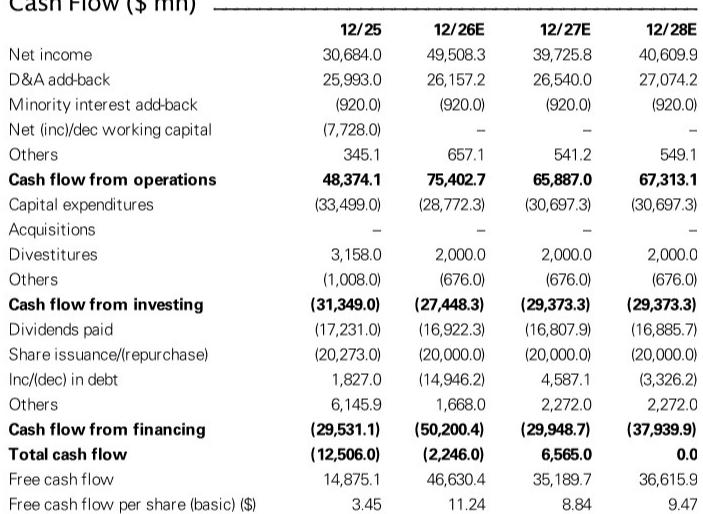
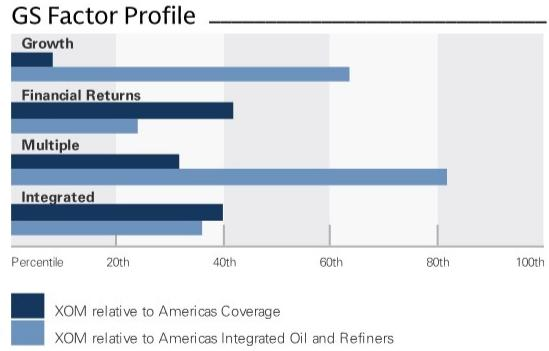
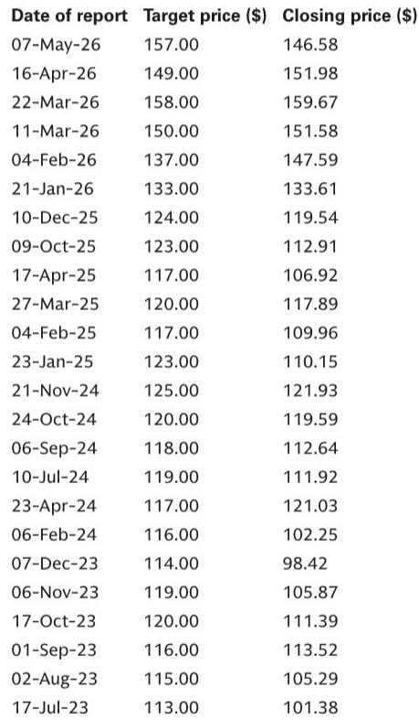

# ExxonMobil’s Strategy Is Not About Volume—It Is About Technology Leverage Across a Capital-Disciplined Portfolio

ExxonMobil’s CEO Darren Woods recently laid out a strategic vision that is far more nuanced than simply drilling more wells. In a mid-July lunch with analysts, the company’s leadership emphasized that its competitive advantage no longer rests on raw resource scale but on proprietary technology deployment, disciplined capital allocation, and a selective M&A framework designed to extract structural long-term value. The message is clear: ExxonMobil is positioning itself as a technology-driven operator in a capital-constrained world.

The timing matters. Against a backdrop of geopolitical supply disruptions, low global product inventories, and resilient demand for refined products, ExxonMobil is executing a playbook that balances near-term earnings support from its downstream operations with long-term upstream optionality. An estimated free cash flow yield of 7.7% in 2026 and a net debt-to-EBITDA ratio that falls to 0.2x by next year. These are not the metrics of a company chasing growth at any cost.

What is striking is the coherence of the strategy. The company is not simply maintaining production targets in the Permian; it is actively deploying lightweight proppant technology and re-fracking techniques to optimize recovery from existing acreage. In Guyana, operational execution is being paired with reservoir optimization and efforts to unlock acreage currently under force majeure. The portfolio also includes low-cost opportunities in Mozambique and Papua, while Venezuela remains contingent on a stronger fiscal and regulatory backdrop. Each of these decisions reflects a single governing logic: deploy capital only where proprietary technology can generate a structural cost advantage.

This is not a story about volume growth. It is a story about margin expansion through technological differentiation. The following sections unpack the four pillars of ExxonMobil’s strategy and explain why observers should evaluate the company not as a commodity producer but as an industrial technology firm with upstream assets.

## ExxonMobil’s Proprietary Technology in the Permian Is a Structural Cost Advantage, Not a Volume Driver

The most important detail from the CEO lunch is not the production target itself but the mechanism by which ExxonMobil intends to achieve it. The company maintained its long-term Permian production target while highlighting the continued deployment of lightweight proppant technology. This is not a marginal efficiency gain. Lightweight proppant reduces the energy required to fracture rock, lowers material costs, and improves the conductivity of fractures, which directly boosts recovery rates per well. Over time, this technology compounds: each well becomes more productive, and the inventory of economically viable drilling locations expands.

Re-fracking opportunities add another layer. By returning to existing wells and applying new stimulation techniques, ExxonMobil can extract additional hydrocarbons without the full cost of drilling a new well. The company described a pipeline of "stackable technologies," meaning that each innovation builds on the previous one rather than being a one-off improvement. For an observer, the implication is that ExxonMobil’s Permian asset is not a static resource base but a continuously improving manufacturing process.

This technological edge carries a second-order implication for the broader industry. If ExxonMobil can sustain or improve its cost structure while others face depletion-driven cost inflation, the company will widen its margin advantage over time. In a commodity price downturn, that advantage becomes a survival differentiator. In an upcycle, it translates directly into higher free cash flow generation.

## The M&A Framework Is Selective and Technology-Led, Not Scale-Driven

ExxonMobil’s management explicitly described the company as a "logical consolidator" in the medium term, but the framework they outlined is highly selective. The focus is not on acquiring acreage for the sake of scale but on deals that allow ExxonMobil to apply its proprietary technologies to assets that are currently underperforming. This is a critical distinction.

The company’s competitive advantages in the Lower 48, particularly lightweight proppant and re-fracking capabilities, mean that ExxonMobil can extract more value from an acquired asset than the seller could. This creates a willingness to pay a premium that is justified by the operational synergies, not by financial engineering. The M&A strategy is therefore a direct extension of the technology strategy: identify assets where the technology gap is widest, apply the stackable innovations, and capture the margin uplift.

For the market, this framework reduces the risk of value-destructive acquisitions. ExxonMobil is not in a race to consolidate for market share. The company’s capital allocation priorities remain unchanged: maintain a strong balance sheet, invest in advantaged high-return growth projects, and sustain steady buybacks through the cycle. The M&A rank of 3, indicating a low probability of the company becoming an acquisition target itself, reinforces that ExxonMobil sees itself as the consolidator, not the consolidatee.

## Downstream Earnings Are Supported by Structural Product Tightness, Not Cyclical Luck

The downstream segment often gets treated as a cyclical appendage to the upstream business, but ExxonMobil’s current positioning suggests something more structural. The company highlighted low global product inventories and resilient demand, driven in part by geopolitical supply disruptions. Refining margins are being supported by utilization levels that remain below capacity, meaning that any demand uptick flows directly to pricing.

Crucially, ExxonMobil pushed back against the idea that a US export ban on refined products would be constructive. The company argued such a ban would be counterproductive, a view grounded in the reality that US Gulf Coast refineries depend on export markets to absorb their output. The Jones Act waiver has enabled some product flow from the Gulf Coast to the East and West Coasts, but marginal volumes continue to be imported. This suggests that the US market is not self-sufficient in refined products, and any policy that restricts exports would simply shift the supply-demand imbalance rather than resolve it.

At the company level, management remains focused on enhancing product yield. This means optimizing the mix of outputs from each barrel of crude to capture the highest-margin products. In a tight market, even small improvements in yield can have outsized effects on earnings. The downstream segment is therefore not a passive cash cow; it is an actively managed portfolio where operational excellence translates into margin capture.

## The Capital Allocation Framework Provides a Decision Template for Observers

The most useful lens for evaluating ExxonMobil is the company’s own capital allocation framework, which is unchanged from prior communications but worth restating given the current environment. The hierarchy is clear: first, maintain a strong balance sheet; second, invest in advantaged, high-return growth projects; third, sustain steady buybacks and dividends through the cycle.

The balance sheet is already in exceptional shape. Net debt-to-EBITDA is projected to fall from 0.5x in 2025 to 0.2x by 2026, and net debt-to-equity drops from 12.3% to 7.2% over the same period. This gives ExxonMobil the financial flexibility to pursue M&A, increase buybacks, or weather a downturn without distress. The dividend yield of 2.8% in 2026, combined with a payout ratio of 34.2%, leaves ample room for growth without straining the balance sheet.

The investment in advantaged projects is already visible. The upstream portfolio includes not just the Permian and Guyana but also low-cost opportunities in Mozambique and Papua, plus potential in Trinidad. Each of these projects meets the threshold of being high-return and technologically advantaged. The company’s commitment to $20 billion in structural cost savings by 2030 provides a further margin buffer.

For an observer, the decision framework is straightforward. Evaluate ExxonMobil not on the absolute level of oil prices but on the spread between its cost of supply and the market price. If proprietary technology continues to lower that cost of supply, the company will generate excess returns regardless of where oil trades. The capital allocation framework ensures that those excess returns are returned to shareholders rather than squandered on low-return projects.

The company’s exploration efforts add a layer of optionality. In addition to the Permian and Guyana, ExxonMobil is constructive on Mozambique and Papua, both low-cost basins, and is monitoring Venezuela for a potential improvement in the fiscal and regulatory backdrop. These are not near-term production drivers but long-term portfolio hedges. If any of these opportunities mature, they will add to the inventory of high-return projects without requiring a change in capital allocation priorities.

What ties all of this together is the company’s view of itself as a technology enterprise with upstream assets, not an oil company that happens to use technology. The distinction is critical. An oil company optimizes for volume; a technology enterprise optimizes for margin. ExxonMobil’s proprietary lightweight proppant, re-fracking capabilities, and stackable innovations are the mechanisms by which it intends to sustain margin advantage through the cycle. The downstream segment, with its focus on yield enhancement and structural product tightness, provides a complementary earnings stream.

The risk to this thesis is not commodity price volatility per se but the possibility that technological differentiation erodes faster than expected. If competitors replicate lightweight proppant or re-fracking techniques, the margin advantage narrows. The report notes that the company’s M&A framework is focused on driving operational and technological synergies, which implies that management is aware of this risk and is actively seeking to stay ahead of the curve.

For the serious business audience, the takeaway is that ExxonMobil is executing a strategy that is internally consistent, capital-disciplined, and technology-driven. The company’s financial strength and operational focus reflect confidence that this strategy will deliver. The key risks—commodity prices, refining margins, and operational execution—are real but manageable given the company’s financial strength and technological edge.

*For informational purposes only. Portions may be generated, translated, summarized, or edited with AI assistance based on source materials and may contain omissions or errors. Please verify independently. This is not professional advice.*

For informational purposes only. Portions may be generated, translated, summarized, or edited with AI assistance based on source materials and may contain omissions or errors. Please verify independently. This is not professional advice.

