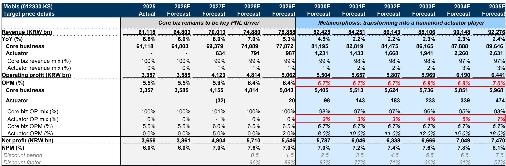
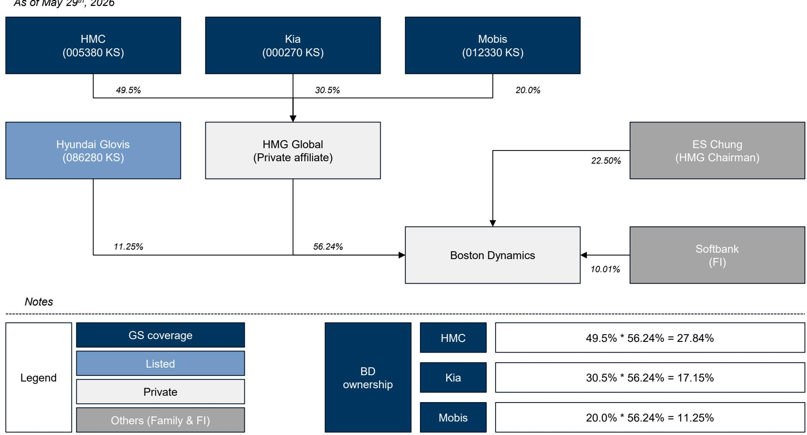
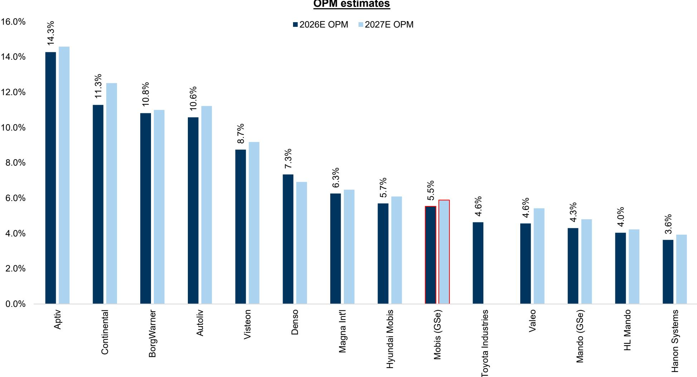

# 现代摩比斯的估值重估：人形机器人执行器业务能否兑现是关键

自2026年初以来，现代摩比斯经历了显著的估值倍数提升，其一年期远期市盈率从约7倍上升至超过10倍。最初的催化剂很明确：市场开始计入该公司间接持有的波士顿动力公司11%的股份，这家机器人公司已成为商业人形机器人发展的风向标。但仅凭这一持股并不能完全解释这一变动。读者对摩比斯的估值方式正在发生更深层次的结构性转变——这取决于该公司能否从传统的汽车零部件供应商转型为人形机器人执行器制造商。

估值重估尚未完成。即使在近期倍数扩张之后，摩比斯的交易价格仍约为一年期远期市盈率的10倍，仍低于全球汽车零部件同行平均水平的11倍。尽管该公司未来几年的每股收益增长轨迹强于同行，但这一折价依然存在。核心矛盾在于：摩比斯2025年的营业利润率约为5.5%，在结构上低于可比全球汽车零部件公司的利润率。市场正在为当前较低的盈利能力支付折价，即便它承认了潜在的高增长未来。

进一步估值重估的论点取决于一个单一的战略转折点。摩比斯的核心汽车零部件业务在本十年末之前仍将是主要的利润驱动力，但其利润率空间有限。相比之下，人形机器人执行器业务预计到2030年代中期将实现超过15%的营业利润率，而核心业务利润率稳定在6.7%左右。如果摩比斯能够扩大执行器生产规模，并在新兴的人形机器人供应链中占据哪怕适度的市场份额，未来十年的盈利结构转变就可能证明其估值倍数远高于当前水平。然而，市场尚未完全计入这一情景。

这不是一个关于近期盈利加速的故事。这是一个关于选择权的故事——以及市场越来越愿意为此买单。对于观察者而言，关键问题是这种选择权是否真实，它如何映射到摩比斯现有的业务结构，以及需要发生什么才能使估值倍数进一步扩大。

## 波士顿动力持股是触发因素，而非核心逻辑

始于2026年初的估值重估最初是由摩比斯间接持有的波士顿动力11.25%股权推动的。通过一个复杂的持股链——现代汽车持有HMG Global 49.5%的股份，HMG Global持有波士顿动力56.24%的股份，而摩比斯持有HMG Global 20%的股份——摩比斯对波士顿动力的经济敞口是真实但间接的。市场对这一持股的热情反映了对人形机器人公司的更广泛重估，而非对摩比斯基础汽车零部件业务的重新评估。

但一家知名机器人公司的少数股权并非持续估值重估的持久基础。该持股的价值本身具有波动性，并取决于波士顿动力自身的商业轨迹。更重要的是，它并未改变摩比斯的核心盈利能力或利润率结构。已经发生的估值重估，更应被理解为市场正在为转型叙事定价，而非财务基本面的具体变化。

真正的战略问题是，摩比斯能否从波士顿动力估值的被动受益者转变为人形机器人供应链的积极参与者。该公司计划制造执行器——对人形机器人至关重要的精密运动控制部件——代表了这一转变。波士顿动力持股提供了估值窗口；执行器业务将决定这个窗口是扩大还是关闭。

## 核心汽车零部件业务提供现金流，但限制估值倍数扩张

摩比斯的核心业务——向现代和起亚供应模块、照明、电子和其他部件——是一项稳定但利润率较低的业务。近年来营业利润率平均约为5.5%，预测显示到2030年代初将逐步改善至约6.7%。这一轨迹由规模、成本纪律以及向高价值电子部件的适度转变所驱动，但并不代表行业规范的结构性突破。

核心业务的收入增长前景同样温和。从2025年约61万亿韩元起，核心收入预计到2030年将以约4-5%的复合年增长率增长，此后减速至约2-3%。这一减速反映了全球汽车市场的成熟，以及在汽车产量增长趋于平缓的世界中，传统汽车零部件可寻址市场的有限增量。

这是摩比斯估值的根本制约因素。具有可比利润率状况的全球汽车零部件公司的交易价格在10-12倍远期市盈率之间。摩比斯当前的估值倍数接近该范围的低端，这与一家盈利增长稳定但乏善可陈、定价能力有限的公司相符。要使估值倍数突破同行平均水平，市场需要看到一条通往更高利润率的可信路径——而这条路径不能仅来自核心业务。

## 人形机器人执行器业务是相对少见可信的利润率转折点

摩比斯执行器业务的财务预测在相对数值上较小，但在结构上意义重大。执行器收入预计从2027年的6340亿韩元开始，到2035年增长至约2.6万亿韩元。即使在预测期结束时，这也仅占公司总收入的不到3%。利润贡献最初更为有限：执行器业务预计在2027年亏损，2028年左右盈亏平衡，并从2030年起才开始产生有意义的营业利润。

关键细节在于利润率轨迹。核心业务营业利润率在6.7%处趋于平稳。相比之下，执行器利润率预计将从2029年的2%上升至2035年的18%。这不是线性改善；它反映了一种技术产品的经济规律，该产品受益于学习曲线、规模经济以及在新兴市场中的定价能力。如果这些预测得以实现，执行器业务到2035年将贡献约7%的总营业利润，尽管仅占收入的3%。这种利润结构转变正是证明整体估值倍数更高的原因。

估值应用于2035年预估每股收益，然后折现回当前。该估值倍数比当前水平高出约50%，比全球汽车零部件同行平均水平高出约35%。这一溢价反映了预期的盈利构成转变：一家从高利润率执行器销售中获得越来越多利润份额的公司，其交易估值倍数应高于纯粹的汽车零部件供应商。

## 观察者应使用三部分决策框架评估摩比斯

对摩比斯的研究案例可以围绕三个独立条件构建，每个条件都必须满足才能使估值重估逻辑成立。

首先，核心汽车零部件业务必须继续产生稳定的现金流和适度的利润率改善。这是基础。如果核心业务恶化——由于成本通胀、生产中断或竞争压力——整个估值框架将崩溃，因为执行器业务在短期内规模太小，无法弥补。报告中提到的印度工厂火灾风险，是核心业务运营中断可能削弱逻辑的具体例子。

其次，执行器业务必须实现预期的利润率轨迹。这是最不确定的条件。执行器生产需要摩比斯目前尚未大规模拥有的精密制造能力。该公司必须投资于产能、工艺工程和质量控制，同时与成熟的工业自动化供应商和潜在的新进入者竞争。利润率到2035年达到18%的假设是合理的，但尚未得到验证。如果执行器利润率停滞在8-10%，利润结构转变将太小，不足以证明估值倍数高于同行平均水平。

第三，市场必须继续对人形机器人相关盈利赋予溢价估值倍数。这一条件是外部的，并受读者情绪变化的影响。如果人形机器人主题失去动力——由于商业化采用慢于预期、监管障碍或竞争技术——即使摩比斯运营执行良好，估值倍数溢价也可能收缩。波士顿动力持股是对冲这一风险的部分手段，但它并不能使摩比斯免受对人形机器人市场更广泛重新评估的影响。

这三个条件相互独立且共同完备。如果任何一个条件失败，估值重估将停滞，摩比斯将回归同行平均估值倍数。

## 市场正在为选择权定价，而非结果

摩比斯当前的估值反映了一个市场，该市场愿意为一个真实但不确定的战略选择权支付适度的溢价。10倍的远期市盈率并非困境估值，但也不是对执行器逻辑的完全信心投票。这是一个嵌入了概率加权转型预期的价格，并对上行情景应用了较大的折价。

这对于经历结构性变化的公司来说是典型的。从7倍到10倍的估值倍数扩张捕捉了对该选择权的初步认识。下一阶段——从10倍到15倍或更高——将需要执行力的证据。这些证据将以执行器生产里程碑、利润率进展以及来自人形机器人原始设备制造商的订单可见性的形式出现。在这些信号出现之前，估值倍数可能保持区间波动。

对于观察者而言，风险并非执行器逻辑错误。而是价值实现的时间长于市场的耐心。预测显示执行器利润仅在2030年后才变得重要。在一个奖励近期盈利可见性的市场中，长达十年的回报期创造了估值波动性。折价率取决于中期事件——产品公告、合作协议或竞争对手行动——是加速还是延迟市场对价值的认可。

现代摩比斯还不是一家人形机器人公司。它是一家拥有可信计划成为人形机器人公司的汽车零部件公司。这一区别很重要，因为它决定了观察者应如何评估风险回报。上行案例取决于一个尚未真正开始的、成功的多年转型。下行案例是均值回归，股票交易价格与其全球汽车零部件同行一致。当前价格介于这两种结果之间，下一步走向将由执行质量决定，而非叙事的强度。

*仅供参考。部分内容可能基于源材料通过AI辅助生成、翻译、总结或编辑，可能存在遗漏或错误。请独立核实。这不构成专业建议。*

仅供参考。部分内容可能基于源材料通过AI辅助生成、翻译、总结或编辑，可能存在遗漏或错误。请独立核实。这不构成专业建议。

