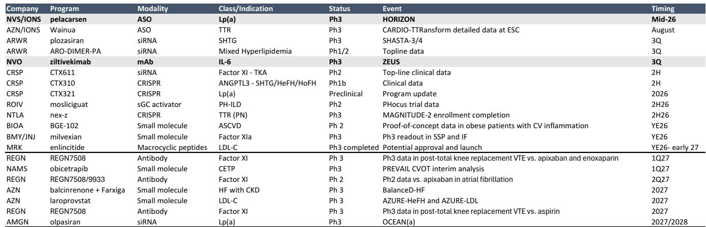
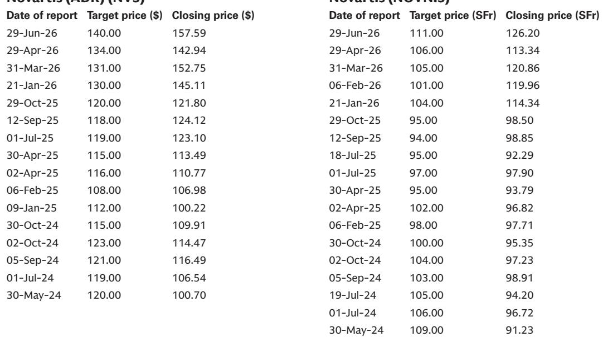
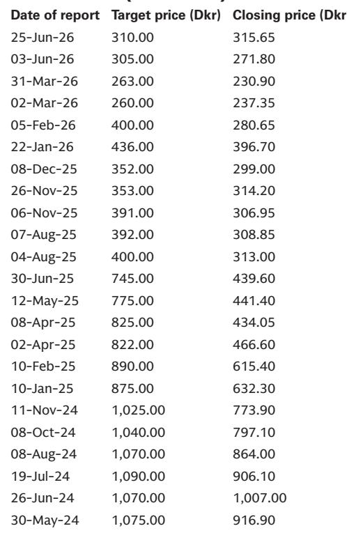

# GS：全球医疗保健心血管药物复兴CARDIO-TTRansform后两个

AZN和IONS的CARDIO-TTRansform试验意外失败后，市场对心血管领域新药的信心出现变化。AZN单日下跌10%，IONS跌33%，ALNY跌11%。但GS最新报告认为，三季度还有两个关键催化剂可能重塑这一赛道：NVS/IONS的HORIZON试验和NVO的ZEUS研究。前者将首次验证Lp(a)靶点能否转化为临床获益，后者则测试抗炎通路对心血管不确定性的降低效果。报告对这两个事件的潜在市场影响做了量化推演。

## 1. HORIZON试验：Lp(a)靶点面临首次大规模验证

Lp(a)是已知最后一个未被成功成药的主要心血管不确定性因子，影响全球约14亿人。NVS与IONS合作的HORIZON试验入组8323人，是首个评估降低Lp(a)能否减少心血管事件的大规模三期研究。报告指出，整体人群需要12%的不确定性降低才能达到统计显著性，高不确定性亚组需要14%。NVS管理层认为13%-15%的降幅对Lp(a)而言已有临床意义。

GS对NVS的报价影响测算为+2%至-3%，但提醒当前约16倍市盈率已部分定价了三个关键催化剂的成功，若HORIZON结果不理想，节奏变化不确定性可能更大。对IONS而言，若试验失败，其基于里程碑和特许权使用费的收入模型将面临至少10%的节奏变化不确定性；若结果积极，则存在10%-20%的上行空间。

> **KC评论：** 这张表里最容易被忽略的是NAMS。其obicetrapib在降低Lp(a)方面效果介于PCSK9抑制剂和专门Lp(a)药物之间，但HORIZON若成功，将直接验证其多机制假说，间接降低其PREVAIL试验的不确定性。报告测算，若HORIZON结果积极，NAMS的DCF估值可能上调14%。

## 2. ZEUS研究：验证炎症通路能否独立降低心血管不确定性

NVO的ZEUS试验评估ziltivekimab（IL-6单抗）在6200名ASCVD患者中的效果。这是首个在心血管适应症中测试IL-6抑制的大型三期研究。报告认为，行业标准是15%-20%的疗效获益，但根据统计计算，12%的MACE降低就足以达到显著性。

GS目前对ziltivekimab在所有适应症中给予40%的成功概率，预计2028年上市，不确定性调整后的美国峰值销售额约100亿丹麦克朗。若ZEUS结果积极，将验证降低hsCRP这一炎症标志物能否独立于降脂通路带来心血管获益，这对BIOA的口服NLRP3抑制剂等后续项目具有重要参考意义。

报告测算NVO在ZEUS结果公布后的报价波动区间为+7%至-5%，高于HORIZON对NVS的影响，反映市场对这一全新机制的不确定性更大。

## 3. 如何用报告框架判断后续影响

GS提供了一个可复用的分析框架：三个情景——统计显著且有临床意义、未达统计显著但有信号、完全失败——对应不同公司的报价影响路径。以HORIZON为例，若结果积极，AMGN可能上涨5%-10%（市场提前定价其更高效的siRNA olpasiran），CRSP可能上涨5%-10%（基因编辑方案可能提供更持久的Lp(a)降低）。若失败，这些公司面临2%-5%的节奏变化。

报告还指出，Lp(a)检测率、支付方态度、以及后续更长效或口服方案的竞争，将决定即使HORIZON成功后的商业前景。NVS已在开发下一代长效药物DII235，AMGN的olpasiran预计2028年完成三期，LLY同时布局siRNA和口服两条管线。

> **KC评论：** GS对NVS的报价影响测算看起来幅度不大（+2%/-3%），但这是基于当前估值已部分定价成功。真正需要关注的是，若HORIZON结果模糊——比如仅在亚组达到显著性——市场如何解读。报告没有完全展开的是，这种“混合结果”对Lp(a)赛道整体估值的影响可能比单一公司报价变动更大。

For informational purposes only. Portions may be generated,translated,summarized,or edited with AI assistance based on source materials and may contain omissions or errors. Please verify independently. This is not investment,legal,tax,accounting,or other professional advice.

For informational purposes only. Portions may be generated,translated,summarized,or edited with AI assistance based on source materials and may contain omissions or errors. Please verify independently. This is not investment,legal,tax,accounting,or other professional advice.

