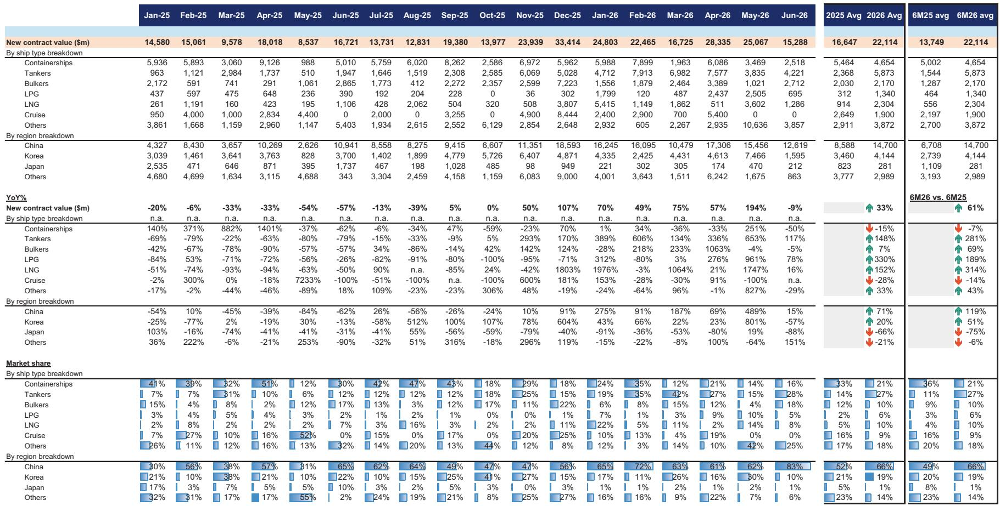
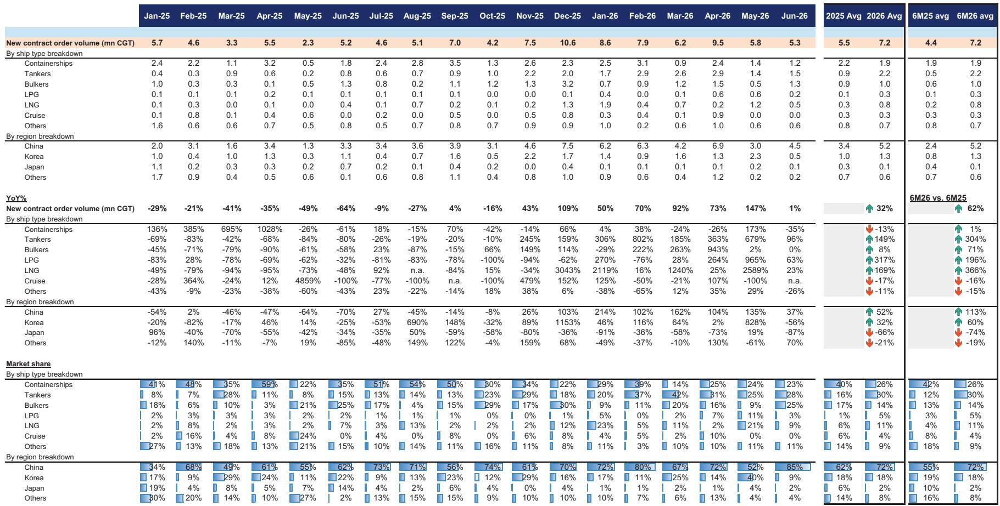
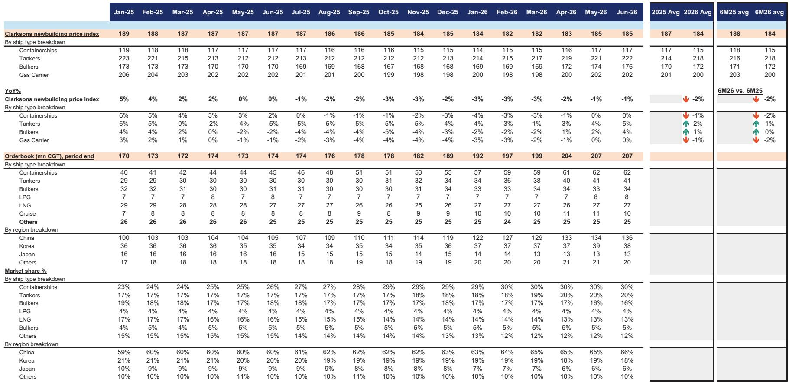

# 中国造船业主导地位已非周期性现象——这是改写全球秩序分配规则的结构性转变

2026年6月，中国船厂按修正总吨（CGT）计算承接了全球85%的新造船订单，这是自2024年8月以来的最高份额，这一水平打破了任何关于这只是暂时性产能驱动的观点。前一个月，中国的份额为52%；6月份，这一比例跃升至85%。相比之下，韩国船厂同期从40%骤降至9%。这并非单月异常。这是多年趋势的 culmination，中国船厂已系统性地主导了三大商船类型——集装箱船、油轮和散货船——而韩国船厂仍然依赖狭窄且波动性大的液化天然气（LNG）运输船领域。其战略含义明确：任何对未来造船供应、定价或竞争动态的分析，都必须从中国现在是边际价格制定者和全球船队更新的主要瓶颈这一假设出发。

6月份的数据还揭示了一个更微妙但同样重要的转折点。虽然新合同总价值环比下降39%，但约70%的下降来自海上工程合同减少以及液化石油气（LPG）和LNG运输船订单环比收缩60-70%。剔除这些因素，集装箱船、油轮和散货船的总量和总价值环比分别上升22%和14%。市场并未走弱；而是在轮动。支撑全球大宗商品和制成品贸易的主力船型需求正在加速，而中国船厂是最大的受益者。对于观察者和从业者而言，问题已不再是中国是否会主导，而是这种主导地位将如何重塑订单时机、定价能力以及非中国建造商的竞争可行性。

## 韩国市场份额的骤降暴露了超越LNG周期性的结构性脆弱

韩国船厂6月份9%的市场份额——低于前一个月的40%——是报告中最引人注目的数据点，但这不应被视为一次性事件。这一下降反映了在LNG运输船、LPG运输船和集装箱船领域同时失去份额。即使排除LNG运输船，韩国6月份的份额也仅为7%，而5月份为25%。这不仅仅是订单流不均匀的结果。它反映了在韩国船厂曾拥有定价和技术溢价的细分领域，其竞争力出现了结构性侵蚀。

报告数据显示，韩国船厂在集装箱船领域（中国拿下了6月份100%的订单）和油轮领域（中国份额达到78%）均失去了阵地。韩国仅存的利基是LNG运输船，但即使在那里，由于霍尔木兹海峡及更广泛能源贸易路线相关的地缘不确定性抑制了新造船谈判，订单管道似乎也已放缓。报告明确将LPG和LNG运输船订单环比下降60-70%归因于“战争增加了不确定性，导致新订单谈判放缓”。这是一个暂时性因素，但它暴露了更深层次的风险：韩国船厂将其订单簿集中在一个比支持中国船厂的多元化、更新驱动型需求更易波动、更易受地缘干扰的领域。

对于关注韩国造船企业的观察者而言，这意味着仅看订单簿覆盖率是不够的。订单簿的质量和多元化至关重要。一个拥有3.2年覆盖率但严重依赖LNG的船厂，其面临的风险状况与一个拥有类似覆盖率但油轮、散货船和集装箱船组合均衡的中国船厂截然不同。韩国造船模式曾依赖在气体运输船领域的技术领先地位来获取溢价定价，但现在正受到可寻址市场缩窄的制约。

## 中国船厂胜出不仅因为价格更低，更因为能提供更短交付周期和更快产能扩张

对中国市场份额增长的传统解释是成本优势。这并不全面。报告提供了明确证据，表明中国船厂赢得订单是因为它们能更快交付——并且它们正在积极扩张产能以保持这一优势。恒力重工在考虑三期产能完成后，其订单簿覆盖年数为2.8倍，远低于全球平均的3.7倍，也低于扬子江船业的3.4倍。较短的覆盖率使恒力能够提供更早的交船期，这在船东竞相更换老旧船队并遵守环保法规的市场中是一个决定性优势。

报告指出，如果恒力最终确定四期产能扩张（估计在三期基础上增加高达100%的现有产能），其覆盖年数可能降至2倍以下。这不是渐进式增长；而是阶梯式变化。一个覆盖率低于2倍且产能快速扩张的船厂，成为需要在2029年或2030年前交付船舶的船东的默认选择。与此同时，扬子江船业预计在2026年底前在泓源船厂增加产能，报告预计这将支持其进一步赢得订单。竞争动态很明确：中国船厂不仅在价格上胜出；它们在可用性上也胜出。

这对定价能力有直接的二阶效应。克拉克森新造船价格指数6月份环比上涨0.1%至185点，受散货船和油轮价格分别上涨1.3%和0.4%的推动。这些正是中国船厂主导的领域。随着订单簿填满、交船期延长，中国船厂有杠杆推动价格上涨，特别是对于推动更新需求的中小型集装箱船和油轮。报告显示，6月份所有集装箱船订单均在7,000标准箱以下，归因于更新需求——这是一个中国船厂几乎不受韩国或日本竞争的领域。

## 扬子江与恒力的分化揭示了两种截然不同的市场份额获取策略

扬子江船业和恒力重工6月份均改善了订单势头，但这种改善的性质根本不同，指向了不同的竞争轨迹。扬子江船业赢得了四艘1,900标准箱集装箱船和两艘LPG订单，这比4-5月份有所改善，但仍比2026年第一季度平均水平低24%。相比之下，恒力重工的新订单量较4-5月平均水平加速增长102%，仅6月份就获得了16艘6,000标准箱集装箱船订单。这一单笔订单占恒力当月新订单量的一半。

报告还指出，预计恒力将从地中海航运获得多达20艘20,000标准箱双燃料集装箱船订单，估值约40亿美元，占恒力现有订单簿的10%以上，交付从2029年上半年开始。该订单如果确认，将改变恒力的产品组合，并提升其在超大型集装箱船领域的地位，而该领域传统上由韩国和日本船厂主导。报告明确表示，这意味着“扬子江船业将面临更激烈的竞争”。

对于观察者而言，这种分化很重要，因为它表明中国造船业并非铁板一块。扬子江船业正在执行一项稳健、多元化的战略，专注于中小型船舶并保持适度的覆盖年数。恒力重工则追求激进的产能扩张，并瞄准市场的高价值端。扬子江面临的风险是，恒力的规模和交付速度可能会抢走订单，特别是如果地中海航运的巨额订单预示着主要班轮公司向中国船厂订购超大型船舶的趋势转变。恒力的机遇在于，其较短的覆盖年数和不断扩大的产能使其成为船队更新加速（特别是对于需要更长设计和建造周期的双燃料船舶）的自然受益者。

## 造船业观察决策框架：优先关注覆盖年数、产能扩张轨迹和订单簿多元化

6月份的数据为评估船厂提供了一个清晰的分析框架。三个指标至关重要，并且它们相互作用，决定了哪些船厂将抓住下一波订单。

首先，相对于全球平均水平的覆盖年数。覆盖率低于3.5年的船厂——如恒力（2.8倍）和日本船厂（2.2倍）——有较强的动力继续赢得订单，因为它们需要填满交船期以维持利用率。覆盖率高于4.0倍的船厂，如中国新时代造船（4.0倍），面临不同的战略选择：它们可以在定价上有所选择，专注于高利润率船舶，但面临将市场份额输给更具进取心的竞争对手的风险。

其次，产能扩张轨迹。报告明确指出，恒力的四期扩张可能使其现有产能弹性较高，这将进一步压缩其覆盖年数，并使其在接单上更加积极。扬子江在泓源船厂的产能增加更为温和，但仍具支撑性。相比之下，韩国和日本船厂并未以可比速度扩张产能。它们的覆盖年数稳定或下降，这意味着它们无法在交付速度上竞争大部分商船需求。

第三，按船型和燃料技术划分的订单簿多元化。中国船厂在集装箱船、油轮和散货船领域全面获胜，这提供了针对特定细分市场低迷的自然对冲。韩国船厂过度集中于LNG和LPG，这些领域更易受地缘风险和能源价格波动影响。日本船厂覆盖年数为2.2倍且仍在下降，正成为全球市场的边缘参与者，尽管报告指出日本建造商名村造船和三井E&S受益于老旧船队更新的韧性需求以及向环保船舶的结构性转变。它们的机遇在于利基领域，而非广泛的市场份额。

对于观察者而言，该框架表明恒力在订单增长和市场份额获取方面潜力最高，但也因其快速产能扩张而承担执行风险。扬子江提供更可预测、多元化的订单流，但面临来自恒力的日益激烈的竞争。如果LNG订单反弹，韩国船厂可能提供价值，但这种反弹取决于地缘稳定性，不在管理层控制范围内。日本船厂和诸如东京计器（在全球自动舵和电罗经市场占有60%份额）等设备供应商，可能受益于售后服务需求和新造船量，无论哪个船厂赢得船体合同——这是一种值得单独分析的差异化定位。

## 油轮和散货船的定价轨迹将由中国船厂的产能限制决定，而非需求

报告中关于新造船价格的数据具有启发性。克拉克森指数6月份环比上涨0.1%，油轮和散货船价格分别上涨0.4%和1.3%。这些是中国船厂占据78%和89%市场份额的领域。其机制很直接：随着中国船厂的订单簿被油轮和散货船订单填满——6月份油轮订单环比增长5%，同比增长96%——可用的交船期变得稀缺，定价权转向船厂。

报告显示，6月份有21艘超大型油轮（VLCC）订单，其中12艘给中国船舶集团，5艘给韩华海洋，2艘给恒力，计划于2028年下半年至2030年交付。这是四到六年的交付周期，异常漫长，表明船东愿意接受延长的交付时间表以锁定中国船厂的产能。这对运费率有二阶影响：如果新造船交付集中在2028-2030年，当前油轮需求的供应响应将被延迟，可能在中短期内支撑更高的运费率。

对于散货船，6月份订单环比增长166%引人注目，特别是考虑到散货船新造船价格在6月份上涨了1.3%。这表明船东正急于在价格进一步上涨或中国船厂被完全订满之前锁定船位。报告数据显示，中国订单簿覆盖年数已升至4.1倍，而全球平均为3.7倍。这0.4倍的差距大约相当于五个月的生产积压，这使中国船厂有信心推高价格，而不必担心将订单输给无法提供更早交付的竞争对手。

观察者应关注中国订单簿覆盖年数的轨迹，作为新造船定价的领先指标。如果覆盖年数继续升至4.1倍以上，定价能力将进一步增强，特别是对于油轮和散货船。如果覆盖年数稳定或下降，则表明产能扩张与需求保持同步，限制了价格上涨。报告中关于恒力四期扩张的数据表明，中期内产能可能超过需求，这最终可能缓和定价——但那是2028-2030年的故事，而非2026-2027年。

## 日本造船复兴论依赖于利基定位，而非广泛的市场份额恢复

报告对两家日本造船商——名村造船和三井E&S——以及设备供应商东京计器仍持建设性看法。理由有三：老旧船队更新的韧性潜在需求、向环保船舶的结构性转变以及日本造船业的长期振兴。但报告中的数据讲述了一个更为清醒的故事。日本6月份按修正总吨计算的全球市场份额为2%，低于5月份的4%和2025年平均的6%。日本订单簿覆盖年数已降至2.2倍，是所有主要造船国中最低的，远低于全球平均的3.7倍。

日本船厂的研究逻辑在于它们有能力在专业化、高价值的细分领域竞争——双燃料船舶、复杂气体运输船以及需要先进工程的船舶——在这些领域，中国船厂尚未完全具备能力。报告中提到“日本造船业长期振兴”，表明这是一个数十年的结构性故事，而非短期增长叙事。对于观察者而言，日本造船业的机遇是真实但狭窄的。它需要耐心，并愿意接受即使相对订单量增长，市场份额仍将保持低位。

东京计器在全球自动舵和电罗经市场60%的份额是另一种机遇。随着未来几年售后服务需求和新造船需求均增加，东京计器受益于每一艘建造的船舶，无论由哪个船厂建造。报告还指出了来自国防开支的利好因素，这增加了独立于商业航运周期的需求层。对于寻求接触造船业但不想承担特定船厂风险的观察者而言，设备供应商可能提供一条更多元化、周期性更弱的路径。

*仅供参考。部分内容可能基于源材料通过AI辅助生成、翻译、总结或编辑，可能存在遗漏或错误。请独立核实。这不构成专业建议。*

仅供参考。部分内容可能基于源材料通过AI辅助生成、翻译、总结或编辑，可能存在遗漏或错误。请独立核实。这不构成专业建议。

