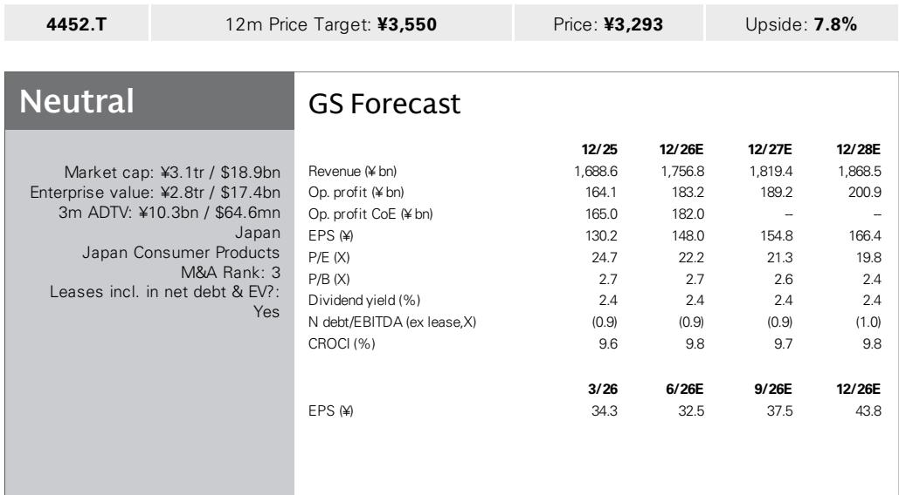
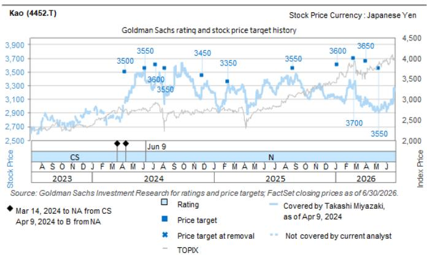

# The New Competitive Advantage in Consumer Goods Is Not Brand Power Alone — It Is the Ability to Be Recommended by AI

In July 2026, Kao Corporation held a marketing strategy briefing that revealed a fundamental shift in how consumer goods companies must compete. The presentation, led by Hirofumi Ito, Head of the Marketing Innovation Center, did not focus on new product formulations or advertising campaigns. Instead, it centered on a single, strategic insight: the rules for being chosen by consumers have changed, and the company that masters the new rules will separate itself from competitors.

The old rule was straightforward: deliver useful information and value directly to consumers. The new rule, as Kao articulated it, is more complex. In the AI era, companies must deliver and accumulate value and information across both consumers and AI systems simultaneously. This is not a marginal adjustment to marketing strategy. It is a structural change in how brand equity is built and maintained. When AI agents, recommendation engines, and voice-of-customer aggregators become the primary gateways through which consumers discover products, the quality of a brand's data footprint matters more than the quality of its advertising.

Kao's argument is that its scientific evidence base — the proprietary research and testing data it has accumulated across decades of product development — gives it a defensible advantage in this new environment. The company has built visualization systems that monitor AI recommendations by country and brand, track the penetration of social media and word-of-mouth, and analyze the effectiveness of marketing initiatives. These systems, collectively called Global Marketing i-Kao, are designed to answer a single strategic question: what gives a brand the "power to keep being chosen" when the selector is increasingly an algorithm?

This briefing matters because it represents a rare instance of a major consumer goods company explicitly acknowledging that brand power alone is no longer sufficient. The implication for observers and competitors is clear: the companies that will sustain premium positioning and margin performance are those that can engineer their products and data to be selected by AI intermediaries, not just by human consumers.

## Kao's Scientific Evidence Base Transforms Marketing from an Art into a Defensible Competitive Moat

The core of Kao's strategy rests on a claim that is easy to dismiss and difficult to replicate: that scientific evidence, properly organized and deployed, can become a barrier to entry in the AI-driven commerce environment. This is not about having more data than competitors. It is about having data that is structured, verifiable, and directly relevant to the criteria that AI systems use to make recommendations.

Kao's management stated that in agentic commerce — where AI agents act on behalf of consumers to make purchase decisions — the quality of reviews becomes more important than the quantity. This is a critical distinction. Many consumer goods companies have focused on generating volume of user reviews, often through sampling programs or promotional campaigns. Kao's argument is that as AI systems become more sophisticated, they will weight review quality, consistency, and evidentiary support more heavily than raw count. A hundred reviews that cite specific product attributes and measurable outcomes will outweigh a thousand generic five-star ratings.

The company's scientific evidence includes clinical testing data, ingredient efficacy studies, and long-term usage tracking. When this evidence is formatted and fed into the systems that power AI recommendations, it becomes a form of structured capital. It cannot be easily purchased or manufactured by a competitor. It must be accumulated over time through disciplined research and development. This gives Kao a temporal advantage that is difficult to close.

The strategic implication is that marketing spend allocation must change. Companies that continue to invest heavily in brand advertising without simultaneously investing in the data infrastructure that makes their products "AI-visible" will find their marketing dollars yielding diminishing returns. The moat is not the brand name. The moat is the evidence that the brand can present to an AI system.

## The Visualization Systems Create a Feedback Loop That Links AI Behavior to Marketing Effectiveness

Kao has built three specific monitoring tools that together form an operational dashboard for the new competitive environment. The first is AI recommendation monitoring, which tracks by country and by brand how frequently and in what context AI systems recommend Kao products. The second is the Voice of Customer Dashboard, which measures the penetration rate of social media and word-of-mouth conversations. The third is Marketing Initiative Knowledge AI, which analyzes the effectiveness of past marketing measures and generates hypotheses for future action.

The strategic power of this system lies not in any single tool but in the feedback loop they create together. When AI recommendation data is combined with consumer voice data, Kao can identify discrepancies. If an AI system is under-recommending a product that receives strong consumer reviews, that signals a data or positioning problem that can be corrected. If a product is being recommended frequently but not converting to purchase, that signals a messaging or availability problem. The system allows Kao to treat AI behavior as a measurable, improvable variable rather than a black box.

Kao's plan is to implement this workflow globally. The company has established the Europe and Americas DX Marketing Center to deploy the mechanisms and expertise developed in its Japanese headquarters to overseas markets. This organizational move is significant because it acknowledges that the AI recommendation environment is not uniform across geographies. Different markets have different dominant platforms, different regulatory frameworks for data use, and different consumer trust levels in AI recommendations. A centralized system that can be adapted locally, while maintaining consistent data standards, is the organizational structure required to compete at scale.

The so what for observers is that Kao is building a management system that allows it to measure and improve its AI competitiveness in real time. This is a different kind of operational capability than traditional market share tracking or brand health monitoring. It is a capability designed for a world where the distribution of consumer attention is mediated by machines.

## The Overseas Margin Gap Cannot Be Closed by Cost Cutting Alone — It Requires a Data-Driven Replication of Domestic Success

Kao's financial data reveals a clear strategic imperative. The operating margins in its overseas global consumer care business remain at approximately half the level of its Japan business. A global research report covering the company notes that Kao aims to boost these margins through the organizational structure that deploys its monitoring systems and headquarters expertise globally.

The margin gap is not primarily a cost problem. It is a revenue quality problem. In Japan, Kao has decades of brand equity, established distribution relationships, and deep consumer understanding. In overseas markets, it must build these advantages from a weaker starting position while facing entrenched local competitors and different consumer preferences. The traditional approach to closing this gap has been to invest in brand building and distribution, which are expensive and slow.

Kao's alternative thesis is that deploying its scientific marketing approach — the evidence-based proposals and the monitoring systems — can close the margin gap faster and more efficiently than traditional brand investment. The logic is that if the company can make its products more visible to AI recommendation systems in overseas markets, it can acquire customers at lower cost and with higher conversion rates. The evidence from its domestic market, where these systems are already operational, provides a proof of concept.

This argument is plausible but unproven at scale. The report notes that the key question for observers is whether Kao's source of enhanced competitiveness lies in its systems or in its established brand power and sales track record. If the systems are the primary driver, then overseas margins should improve as the systems are deployed. If brand power is the primary driver, then overseas margins will remain depressed until brand equity is built through traditional means.

The decision framework for readers is straightforward. Track Kao's overseas margin trajectory over the next two to three years. If margins begin to converge toward domestic levels without a proportional increase in advertising spend, that validates the systems-first thesis. If margins remain stagnant despite system deployment, that suggests that the systems are necessary but not sufficient, and that brand building remains the binding constraint.

## The Decision Framework: Three Questions to Evaluate Any Consumer Company's AI Readiness

Kao's strategy briefing provides a template for evaluating any consumer goods company's competitive position in the AI era. The framework consists of three diagnostic questions that strategists can apply across the sector.

First, does the company possess proprietary scientific or technical evidence that can be structured for AI consumption? This is not the same as asking whether the company has good products. Many companies have good products but lack the clinical data, ingredient research, or usage studies that AI systems can weigh as evidence. The companies that will win are those that can produce verifiable, quantitative claims about product performance that meet the evidentiary standards of sophisticated recommendation algorithms.

Second, does the company have monitoring systems that track how AI platforms recommend its products in real time? Without this capability, a company is flying blind. It cannot know whether its products are being surfaced or suppressed, and it cannot test whether changes to its data or positioning improve recommendation rates. Kao's AI recommendation monitoring, by country and by brand, is the minimum viable capability for competing in this environment. Companies that lack this capability are already at a structural disadvantage.

Third, does the company have an organizational structure that can deploy these capabilities globally while adapting to local market conditions? The margin gap between Kao's domestic and overseas operations illustrates the risk of uneven capability deployment. A company that has world-class AI readiness in its home market but cannot replicate it abroad will face persistent margin compression in its international operations.

The answers to these questions will sort consumer goods companies into three categories: those that are building AI-ready moats, those that are trying to retrofit legacy capabilities, and those that are unaware that the rules have changed. Kao has placed itself firmly in the first category. Whether its systems prove to be sufficient to close the overseas margin gap will be one of the most telling data points for the broader industry over the next several years.

*For informational purposes only. Portions may be generated, translated, summarized, or edited with AI assistance based on source materials and may contain omissions or errors. Please verify independently. This is not professional advice.*

For informational purposes only. Portions may be generated, translated, summarized, or edited with AI assistance based on source materials and may contain omissions or errors. Please verify independently. This is not professional advice.

