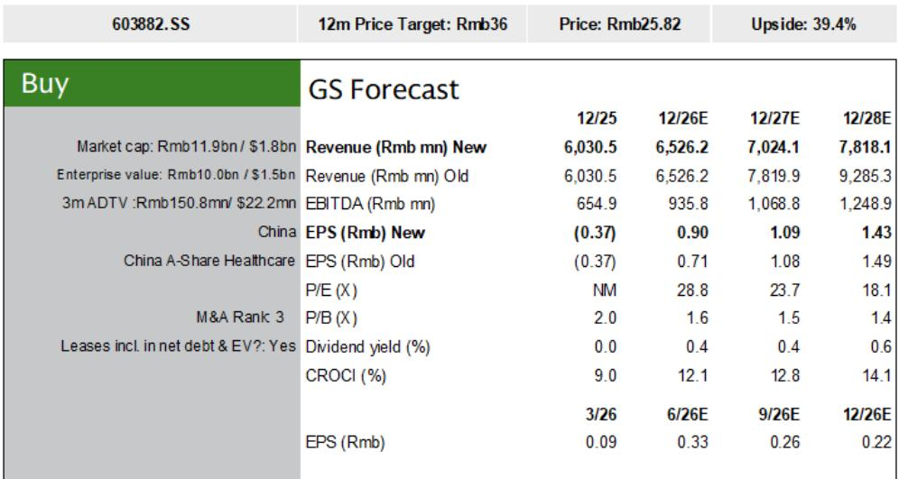
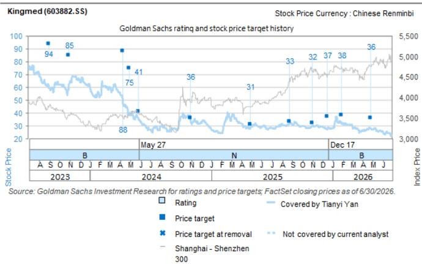

# GS：金域医学1H26初步净利润超预期-推出新股权激励计划-观察

金域医学2026年上半年业绩预告，净利润1.7亿至2.2亿元，而去年同期是净亏损8500万元。GS认为，这一数字超出其预期，主要驱动力不是收入端的大幅反弹，而是成本控制与数字化转型带来的运营效率提升。同日发布的股权激励计划，则进一步锁定了市场对公司未来三年增长节奏的预期。

这份报告的核心判断是：金域医学正在从后疫情时代的利润压缩中走出来，但路径不是靠行业景气度回升，而是靠内部效率改善和行业供给出清。DRG 3.0和医疗服务价格全国统一化带来的检测量价不确定性，公司管理层认为可以通过成本管控、向上游转嫁不确定性、以及数字化管理来对冲。

## 1. 股权激励目标暗示了管理层对政策不确定性的判断

激励计划设定的营收增长目标为：2026年较2025年增长不低于6%，2027年不低于14.5%，2028年不低于26%。换算成年化增速，大约在6%到10%之间。GS认为，这个目标已经隐含了对DRG 3.0实施后检测量可能下降、以及全国医疗服务价格标准化可能带来降价不确定性的预期。

更值得关注的是扣非净利润目标：2026年3.9亿元、2027年5亿元、2028年6亿元。相比营收的温和增长，利润目标的增速更快。这说明管理层对利润率的修复有明确预期，而实现路径不是靠提价，而是靠成本端的主动管理。

> **KC评论：** 股权激励目标往往反映管理层对未来的真实判断。营收增速不高，但利润增速更快，说明公司认为行业竞争格局改善后，利润率的弹性比收入弹性更大。这一点与市场普遍担忧的“量价齐跌”叙事形成对比。

## 2. 行业供给出清正在成为利润修复的底层逻辑

报告的研究逻辑部分指出，市场此前主要担忧后疫情时代的利润压缩和应收账款不确定性。但GS认为，行业竞争正在缓解，核心原因是合规趋严和DRG/DIP改革加速了供给端出清。独立医学实验室行业在疫情期间经历了大量新增产能，随着监管收紧和医保支付改革推进，部分中小型实验室正在退出市场。

金域医学作为行业龙头，受益于两个结构性趋势：一是医院外包检测渗透率的持续提升，二是行业整合带来的市场份额集中。GS用其自有的调整后利润率指标判断，正常化的盈利能力正在企稳，并接近拐点。

这一判断与股权激励目标形成呼应：如果行业供给出清确实在加速，那么龙头公司的议价能力和规模效应将逐步显现，利润修复的可持续性也会更强。

## 3. GS下调了远期收入预期，但上调了近期利润预期

报告对2026年至2028年的盈利预测做了调整。2026年净利润预测从3.29亿元上调至4.15亿元，上调幅度约26%。但2027年和2028年的收入预测分别下调了10%和16%，净利润预测基本持平或小幅下调。

这种“近期利润上调、远期收入下调”的调整方向，反映的是报告对行业短期与中长期的不同判断：短期来看，成本控制和效率提升的效果正在兑现，利润修复比预期更快；中长期来看，检测量和价格可能面临持续不确定性，收入增速难以回到疫情前的高水平。

> **KC评论：** GS对远期收入的下调，说明他们并不认为行业基本面会全面反转。利润修复更多来自内部效率改善和竞争格局优化，而不是需求端的爆发。这一点对理解金域医学的研究逻辑至关重要——它不是一个“行业复苏”的故事，而是一个“龙头在存量竞争中胜出”的故事。

## 4. 可复用的观察框架：如何判断独立医学实验室的拐点

从这份报告可以提炼出一个分析ICL行业公司拐点的框架：第一，看供给端出清速度，即中小实验室退出和行业集中度变化；第二，看龙头公司的成本控制能力，包括向上游转嫁不确定性、数字化运营效率提升；第三，看股权激励或管理层指引是否隐含了对政策不确定性的明确预期。

这三个维度中，供给出清是最容易被忽视的变量。市场往往过度关注需求端的波动，而忽略了行业结构变化对龙头利润率的长期影响。金域医学的案例表明，当行业从扩张期进入整合期，规模效应和成本控制能力可能成为比收入增长更重要的利润驱动因素。

报告也提示了需要持续跟踪的不确定性：行业外包需求恢复慢于预期、高端检测需求持续疲软、集采和本地采购政策带来的定价不确定性、以及行业整合速度不及预期。这些因素都可能影响利润修复的节奏和幅度。

For informational purposes only. Portions may be generated,translated,summarized,or edited with AI assistance based on source materials and may contain omissions or errors. Please verify independently. This is not investment,legal,tax,accounting,or other professional advice.

For informational purposes only. Portions may be generated,translated,summarized,or edited with AI assistance based on source materials and may contain omissions or errors. Please verify independently. This is not investment,legal,tax,accounting,or other professional advice.

