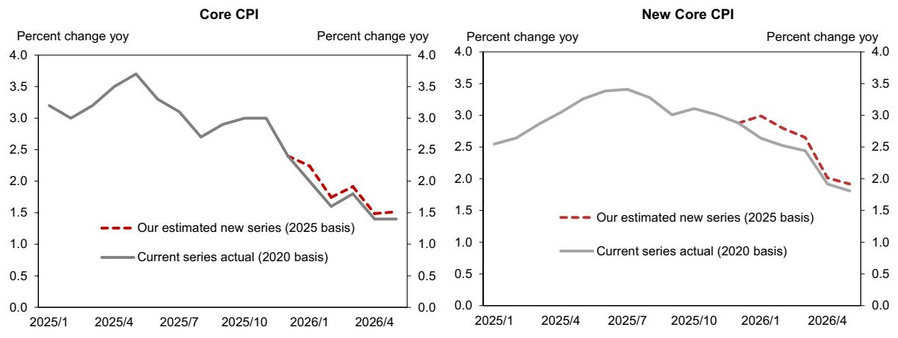

# 日本CPI基期修订：2026年初数据将出现技术性上修，随后对通胀展望形成结构性影响

日本每五年一次的消费者价格指数基期修订将于2026年8月7日进行。这并非单纯的统计调整，它将追溯修订2026年1月至6月的通胀数据，在官方统计中形成一个可见但暂时的上升。对观察者和政策制定者而言，更深远的影响在于，同一修订将为2026和2027财年的通胀展望嵌入一个结构性的下行倾向。其机制并非源于经济基本面变化，而是衡量价格的商品篮子权重被重新调整，以反映2025年的实际消费模式。两个具体项目——大米和高中学费——推动了近期的上修，而同一大米权重增加以及移动电话费用的显著下降，将使未来读数走低。任何依赖整体或核心CPI来判断未来18个月日本通胀轨迹的人，都必须在8月修订引入可能误导市场预期和政策解读的光学失真之前，调整其分析框架。

此次修订之所以重要，是因为它恰逢一个关键节点。日本央行正处于其正常化周期的最后阶段，政府也在评估经济能否维持需求驱动的通胀模式。2026年上半年的一次性上修，可能被误读为潜在价格压力正在加速的证据。相反，随后对2026-2027年路径的下行压力，可能被解读为通缩，而实际情况是衡量标尺发生了结构性变化。基期修订并非对未来价格行为的预测，而是对观察价格行为的镜头进行重新校准。然而在市场中，镜头往往与观察对象本身同等重要。

## 大米和学费权重将推高2026年1-6月的报告通胀

2025年基期修订最直接的影响，是对2026年前六个月的核心及新核心CPI进行上修。这由两个因素驱动。首先，高中学费在全国CPI中的权重从0.56%降至0.24%，托儿所费用从0.52%降至0.33%。这些下降之所以重要，是因为政府在2025年实施的免费学费、学校午餐和育儿政策，在旧的2020年基期下对通胀产生了负贡献。在新基期下，这些政策驱动的价格下降被赋予了更小的权重，因此它们对整体指数的压制效应缩小。计算很简单：一个给定百分比的下降，如果其类别权重减半，那么对整体的影响也减半。

其次，对2026年初影响更大的是，大米的权重从0.62%几乎弹性较高至1.01%。大米价格是2025年至2026年初通胀的主要驱动因素，在新基期下，这一飙升在CPI计算中被赋予了显著更高的权重。对于2026年1月至3月，这一权重增加将导致报告通胀出现显著上修。从4月开始，由于大米价格在早前飙升后已转为负贡献，该效应会减弱。因此，修订将上修效应前置到了2026年数据系列的第一季度。

这些是机械效应，而非需求加速的信号。上修并不意味着日本消费者面临的价格比以前衡量的更高；它意味着相同的价格变化以不同的权重集合进行汇总。对于任何使用2026年1-6月CPI数据来评估通胀趋势的人而言，在得出关于潜在动能的任何结论之前，必须剔除基期效应。

## 推高2026年初的相同权重变化，将在2026-27财年抑制通胀

修订的长期影响与短期效应相反。大米权重的增加，在2026年初放大了米价上涨的正贡献，现在将在今年晚些时候及2027年放大米价下跌的负贡献。大米价格已经见顶并正在下跌。由于新基期赋予大米1.01%的权重（此前为0.62%），大米价格每下跌一个百分点，对整体CPI的拖累将比旧基期下大约多出60%。对于一个一直依赖大米驱动的通胀来使核心CPI保持在目标之上的经济体而言，这是一个有意义的阻力。

第二个下行压力来自移动电话费用。移动电话服务费的权重从0.90%降至0.58%，手机设备本身的权重也从0.90%降至0.58%。行业报告显示，从2026年下半年到2027年上半年，移动服务和设备价格可能上涨。在旧基期下，这些价格上涨将对CPI产生更大的正贡献。在新基期下，由于权重减少了约三分之一，这一正贡献显著减弱。净效应是，分析师此前预期的上行压力来源，现在将以较小的力度体现在官方统计中。

这两个效应共同作用——大米权重增加放大了价格下跌的影响，移动费用权重降低削弱了价格上涨的影响——为2026和2027财年的通胀展望创造了一个结构性的下行倾向。修订并未改变消费者实际支付的价格，但它改变了这些价格在日本央行目标及市场关注的指数中的呈现方式。

## 公共服务权重的修订反映了政府政策的转变，而非消费者行为

新基期中一个讨论较少但分析上重要的变化是公共服务权重的显著下降，在全国CPI中从12.19%降至10.79%。这并非反映消费者在公共服务上支出减少；而是政府实施高中和托儿所免费或高额补贴政策的直接结果。当政府承担这些服务的成本时，家庭在这些项目上的支出份额会机械地下降，即使使用率上升。CPI基期修订通过降低学校午餐、高中学费和托儿所费用的权重来捕捉这一变化。

其战略意义在于，CPI对教育和育儿领域政策驱动的价格变化变得不那么敏感。对于分析通胀前景的观察者而言，这意味着未来政府扩大或收缩免费公共服务的决定，对整体CPI的影响将小于在旧基期下的影响。相反，一般服务（包括外出就餐、酒店费用和估算租金等市场驱动类别）的权重从37.35%上升至38.86%。这一转变使CPI对私营部门服务通胀更加敏感，而这正是日本央行希望看到的需求驱动型价格压力类型。对于那些认为日本通胀机制正从成本推动转向需求拉动的人来说，一般服务权重的上升在分析上是积极的。

## 解读2025年基期修订后日本CPI的决策框架

对于分析师、投资组合经理和政策观察者而言，基期修订创造了一个可预测的失真模式，在任何对通胀敏感的决策中都必须加以考虑。以下框架将修订机制转化为可操作的调整。

首先，对于任何使用2026年1-6月CPI数据来评估通胀趋势的人，请对修订前的估计值进行一次性的向上调整。仅基于权重变化，2026年第一季度的核心CPI可能上修约0.1至0.2个百分点，由于大米权重，3月份的影响最大。剔除能源的新核心CPI将经历类似幅度的修订。不要将此上修解读为基础通胀的加速。这是一个统计上的基期调整效应，一旦基期转换，将在同比比较中逆转。

其次，对于涵盖2026和2027财年的预测，相对于旧基期下的预测，将预期通胀率累计下调0.1至0.2个百分点。主要驱动因素是大米权重：如果2026年末大米价格同比下跌10%，新基期将使整体CPI比旧基期多减少约0.10个百分点。次要驱动因素是移动电话权重：如果2027年移动费用上涨5%，其正贡献将比旧基期下低约0.02个百分点。这些数字单独看并不大，但它们会跨类别、跨时间累积。

第三，关注日本央行的反应函数。央行表示会看穿暂时性因素，但在实践中，暂时性与结构性之间的区别在政策沟通中往往模糊不清。2026年初数据的向上修订，可能在8月修订公布前的几个月内营造一个鹰派叙事，尽管修订本身是回顾性的。相反，随后2027年数据的下行趋势可能产生鸽派压力。理性的应对是预先调整预期，并传达基期修订是衡量标准的变化，而非通胀前景的变化。

第四，对于跨行业的相对价值分析，权重变化提供了明确信号。权重增加的类别——大米、外出就餐、酒店费用、大学学费和估算租金——未来将对CPI产生更大影响。这些行业中定价能力正在改善的公司将对指数产生不成比例的巨大影响。相反，权重降低的行业——移动电话、高中学费、托儿所费用和服装——影响将减小。基于通胀敏感性超配或低配这些行业的读者，应将其贝塔假设调整至新权重。

最后，对于任何围绕日本CPI构建通胀挂钩衍生品或名义债券交易策略的人，基期修订引入了一个已知、可衡量且暂时的错位。2026年初数据的向上修订是一次性的水平移动，一旦新权重公布，市场将完全预期到。随后的下行趋势是一个多季度的阻力，将逐渐被定价。机会不在于预测修订，而在于正确校准对受权重变化影响最大的CPI细分领域的敞口，特别是大米和移动费用，这些领域的权重变化最大，价格动态也最为分化。

*仅供参考。部分内容可能基于源材料通过AI辅助生成、翻译、总结或编辑，可能存在遗漏或错误。请独立核实。本文不构成任何专业建议。*

仅供参考。部分内容可能基于源材料通过AI辅助生成、翻译、总结或编辑，可能存在遗漏或错误。请独立核实。本文不构成任何专业建议。

