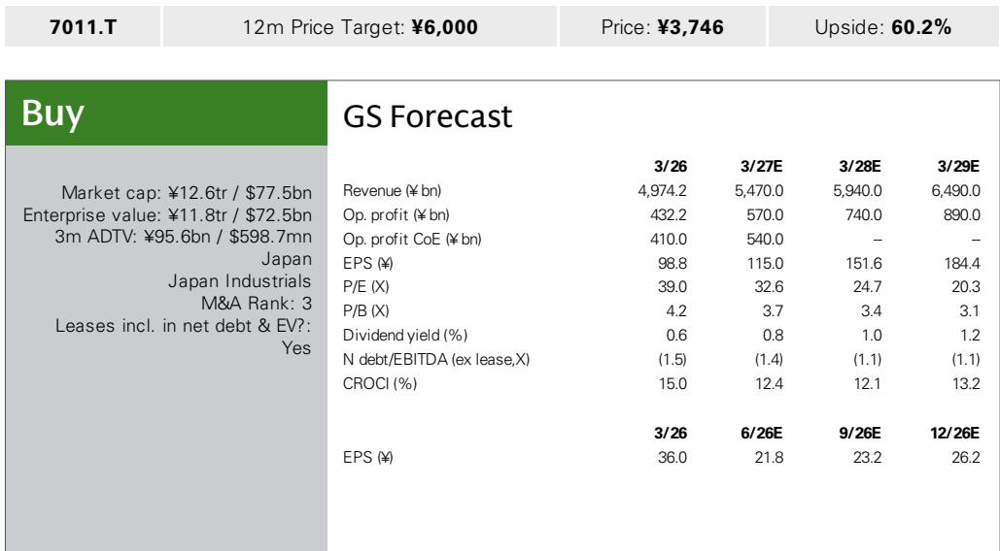
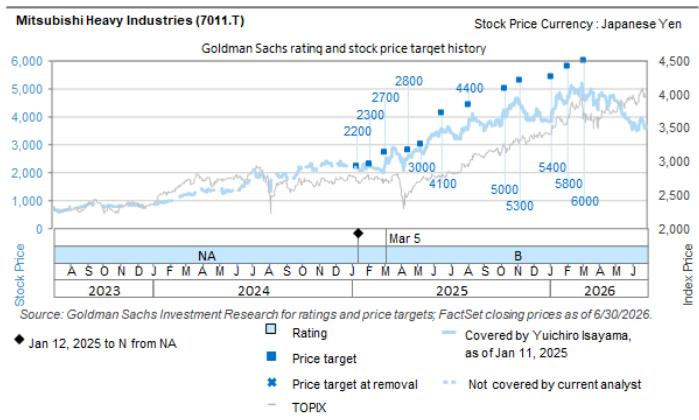

# 三菱重工：被低估的AI基础设施参与者，与英伟达的合作印证了这一方向

7月14日，2026年，日经新闻报道称三菱重工与英伟达正在就AI数据中心技术展开合作。三菱重工正在评估将其高效冷却系统、应急电源和能源管理解决方案部署到下一代“AI工厂”——即GPU集群产生巨大热量和电力需求的设施中。目前尚未披露订单金额、目标设施或引入时间表。然而，这一消息的意义远不止于短期收入贡献。它验证了市场应如何重新评估三菱重工的结构性转变：作为AI基础设施的赋能者，而不仅仅是传统的工业集团。

市场此前一直未能充分认识到这一点。随着AI投资周期从GPU采购扩展到整个支持基础设施——发电、冷却、能源管理——三菱重工正处于多个长期趋势的交汇点。该公司是全球大型燃气轮机联合循环系统的高质量参与者，处于三家企业寡头竞争格局中。它还以核电作为增长动力，并且是日本关键的国防相关企业。这些积极因素尚未在估值中体现。该公司远期市盈率为32.6倍。

与英伟达的合作是估值重估的催化剂，而非短期盈利事件。其战略逻辑是合理的，但读者需要一个框架来区分信号与噪音。

## 短期盈利影响微乎其微，但这并非重点

三菱重工的数据中心业务目前收入在数百亿日元至低于1000亿日元的范围内——不到公司总销售额的1%。即使与英伟达的合作带来可观订单，短期内对合并收益的贡献仍将微不足道。2024年中期经营计划（MTBP）将增长领域——氢/氨、CCUS、电气化/数据中心——的目标设定为在2026财年（该计划的最后一年）总计约1000亿日元。数据中心部分只是其中一小部分。

关注短期收入影响的读者将错过更宏观的故事。此次合作表明，英伟达作为AI计算领域的主导者，认为三菱重工的基础设施能力对其扩展“AI工厂”概念至关重要。这是对三菱重工技术体系的认可，而非一份采购订单。市场应将其解读为一种战略验证，为未来的商业协议打开大门。

三菱重工多年来一直在为此布局。2023年收购美国电力解决方案公司Concentric，以及2025年5月在德克萨斯州达拉斯建立战略基地，都表明其有意构建美国数据中心能力。与英伟达的合作是合乎逻辑的下一步，而非孤立事件。

## AI基础设施瓶颈正从芯片转向电力和冷却，三菱重工处于独特位置

AI建设的第一阶段是关于GPU的可用性。企业争相获取H100及其后续产品。这一阶段正在成熟。第二阶段——也是将在未来三到五年内定义赢家的阶段——是关于大规模运行这些集群所需的物理基础设施。

单个AI数据中心的耗电量堪比一个小城市。GPU产生的极端热密度是传统空气冷却系统无法处理的。电力供应可靠性、冷却效率和能源管理已成为AI计算扩展的约束条件。这正是三菱重工核心能力的契合点。

三菱重工在2026年英伟达GTC大会上展示了其产品，包括具有世界领先效率的现场发电、高效冷却解决方案和下一代配电系统。这些并非边缘产品线。它们是建立在数十年热管理、发电和工业能源系统经验基础上的工程解决方案。该公司的燃气轮机联合循环技术——一个只有三家全球参与者竞争的市场——提供了超大规模数据中心所需的效率和可靠性。

投资界历来将三菱重工归类为涉及国防、能源和航空航天的工业集团。AI基础设施的角度在很大程度上被忽视了。这种情况正在改变。

## 评估三菱重工AI基础设施机会的三管齐下决策框架

读者需要一种结构化的方法来评估与英伟达的合作是否能转化为持续的价值创造。三个问题定义了该框架。

首先，三菱重工在AI数据中心所需的特定基础设施组件中是否拥有可防御的竞争优势？答案是肯定的，在冷却和发电方面。高密度GPU集群的液冷是一项技术要求很高的应用。三菱重工在大型热管理方面的专业知识——通过发电厂和工业应用积累而来——可以直接转移。燃气轮机寡头格局提供了定价权和进入壁垒。新进入者无法复制数十年的工程积累和客户关系。

其次，对于一家收入超过5万亿日元的公司来说，潜在市场规模是否足够大？全球数据中心冷却市场预计到2030年将以每年15-20%的速度增长，完全由AI工作负载驱动。数据中心电力基础设施是一个更大的机会。如果三菱重工即使只占据一小部分份额，数据中心业务也可能从低于1000亿日元增长到早期阶段的数千亿日元，正如该公司通过其并购战略所表明的那样。这将为增长领域做出有意义的贡献，并支持估值重估。

第三，此次合作是否创造了经常性收入或后续订单的路径？目前的安排是技术合作和采用评估。这对于这种规模的基础设施合作来说是典型的。合乎逻辑的进展是试点安装，然后是参考部署，最后是商业合同。三菱重工与软银的现有关系——2025年3月的数据中心合作——为从合作走向商业合作提供了先例。

## 估值重估论点建立在三个独立支柱之上，与英伟达的合作强化了所有支柱

三菱重工的投资案例一直基于多个引擎：国防、能源转型，以及现在的AI基础设施。与英伟达的合作并未取代其他两个，而是强化了它们。

国防业务提供了盈利可见性和政府支持的需求。日本的国防支出轨迹是明确的，三菱重工是战斗机、海军舰艇和导弹系统的主要承包商。仅此一项就足以证明其相对于工业板块平均水平的溢价。

能源转型业务——氢、氨、碳捕获和核电——使三菱重工为向脱碳发电的数十年转变做好了准备。特别是核电，在日本和全球范围内正经历政策复兴。三菱重工的核电能力是一个长期增长选项，市场尚未完全定价。

AI基础设施角度增加了第三个增长向量，具有更短周期的催化剂。数据中心建设正在进行中。与英伟达的合作提供了切实的证据，表明三菱重工正在被整合到AI供应链中。这三个支柱各自独立具有价值。它们共同创造了一个当前估值尚未反映的重估复合案例。

工业子板块平均EV/EBITDA倍数为14倍，使用9%的资本成本折现回2027财年和2028财年估计的中点。这一溢价是合理的，因为国防、能源和AI基础设施的顺风因素正在汇聚。与英伟达的合作降低了AI基础设施支柱仍停留在理论层面的风险。

## 风险因素可控且易于理解

三个下行风险值得关注。日元相对于假设走强将压缩三菱重工海外收益的价值。由于低利润项目集中或大额一次性成本，能源业务盈利能力下降可能拖累营业利润率。投资组合改革受挫可能降低整体回报。

这些风险都不是AI基础设施论点所独有的。它们是三菱重工多元化工业模式固有的结构性风险。与英伟达的合作并未加剧这些风险。相反，它提供了一种对冲：数据中心基础设施具有与大型能源项目不同的利润率和周期特征。

更相关的风险是执行。三菱重工必须将技术合作转化为具有明确订单金额和时间表的商业协议。该公司已表示有意通过并购将数据中心相关销售额在早期阶段增长至数千亿日元。这需要严格的资本配置和整合。收购Concentric和建立达拉斯基地表明管理层理解这一策略。

与英伟达的合作是对三菱重工战略方向的验证，但并非商业成功的保证。读者应在未来几个季度关注正式公告、试点部署和订单披露。

*仅供参考。部分内容可能基于源材料通过AI辅助生成、翻译、总结或编辑，可能存在遗漏或错误。请独立核实。这不构成投资、法律、税务、会计或其他专业建议。*

仅供参考。部分内容可能基于源材料通过AI辅助生成、翻译、总结或编辑，可能存在遗漏或错误。请独立核实。这不构成投资、法律、税务、会计或其他专业建议。

