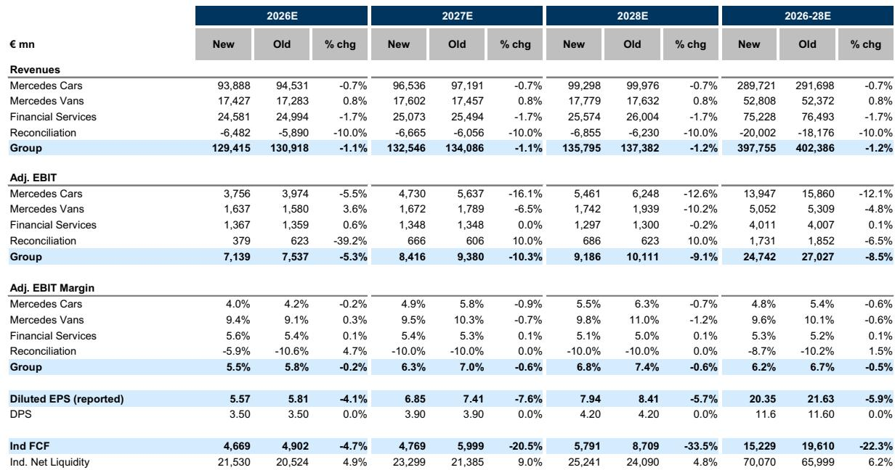
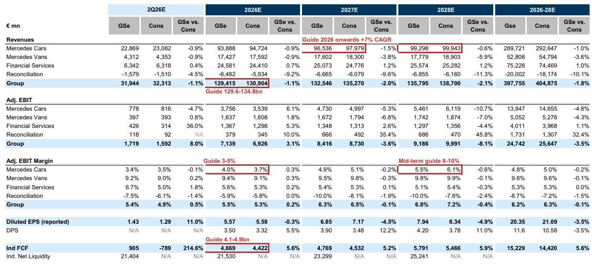
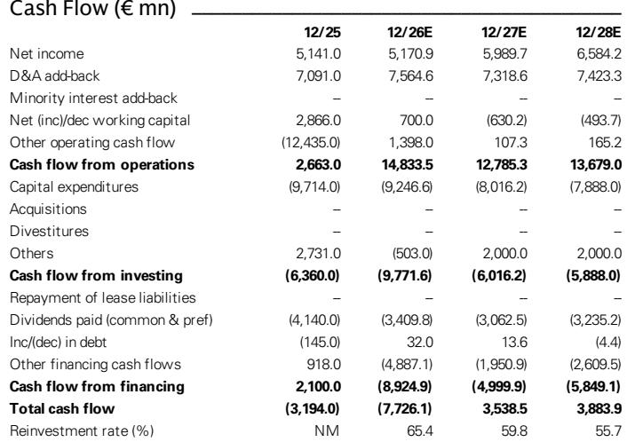

# GS：奔驰集团2Q26预览，下调中国盈利预期，2Q汽车利润率仍在指引内

奔驰二季度批发数据发布后，GS下调了全年盈利预测。核心调整集中在两个方向：美国与欧洲销量上调，但中国销量预期从-14%进一步下修至-30%，北京奔驰合资公司全年利润率从6%降至4%。这组数字背后，是这家德国豪华车企正在经历的区域利润再分配——新车型在欧洲和美国获得强劲订单，但中国市场的量价仍在调整正在影响整体盈利结构。

二季度集团销量41.8万辆，同比下降8%。欧洲受益于CLA、GLB和GLC等新车型拉动，美国由GLE和GLE Coupe支撑，两地均录得正增长。但中国市场的下滑幅度超出预期，管理层在预沟通会上明确提到，二季度经销商利润“显著出现变化”，若趋势延续，下半年不排除额外支付经销商补贴。GS将全年中国销量预测从-14%进一步下调至-30%，这是本次盈利预测调整的最大变量。

## 1. 新车型在欧洲和美国正在形成真实订单势能，但中国市场的结构性仍在调整更重

电动化转型是奔驰当前最清晰的增长线。二季度全球纯电动车销量同比增长51%，欧洲BEV渗透率达到26%。电动CLA、GLB和GLC订单已排至明年，电动C-Class于5月开放预订。这些信号表明，产品周期本身并不弱。

但中国市场的仍在调整正在抵消这些积极因素。GS测算，二季度Cars部门调整后EBIT为7.78亿欧元，利润率3.4%，落在全年3-5%指引区间下沿。全年Cars利润率预测从4.2%下调至4.0%，2027年从5.8%降至4.9%。值得注意的是，2027年利润率的降幅（-0.9个百分点）远大于2026年（-0.2个百分点），说明GS认为中国利润仍在调整不是一次性冲击，而是会持续影响未来两年的盈利结构。

> **KC评论：** 中国市场的利润率压缩，本质上是合资公司利润池缩水。北京奔驰的利润率从6%降至4%，意味着每卖一辆车的合资利润贡献在下降。这不是销量相对值的问题，而是定价权与成本结构同时承压。

## 2. 非现金项目可能进一步压低报表利润，但自由现金流和回购提供缓冲

管理层在预沟通中提及，正在持续评估研究账面价值，可能触发非现金减值。GS认为这一不确定性真实存在。二季度自由现金流虽保持正值，但低于一季度水平。

不过，资产负债表提供了另一层支撑。上一轮20亿欧元回购计划已于6月底提前完成，授权范围内仍有30亿欧元剩余额度。GS预计全年回购总额约31亿欧元，高于市场共识的23亿欧元。管理层明确表示，回购不依赖于戴姆勒卡车减持的时点，这意味着资金安排有独立保障。

## 3. 电动GLC在中国的定价策略是当前最值得关注的边际信号

电动GLC在中国以29.9万元起售，GS认为定价具有吸引力。管理层报告称预订单强劲且转化率高。这款车型的定价和订单转化率，将是观察奔驰能否在中国市场稳住量价平衡的关键窗口。

报告没有完全展开的是，如果电动GLC成功放量，能否对冲燃油车利润下滑。目前看，新车型订单主要集中于欧洲和美国，中国市场的电动化渗透率提升仍需时间验证。

## 4. 一个可复用的观察框架：用区域利润贡献变化判断豪华车竞争格局

奔驰的案例提供了一个分析框架：当一家全球车企同时面临区域分化时，不能只看集团总量。需要拆解三个维度——新车型订单质量（是否真实转化为交付和定价能力）、合资公司利润池变化（而非仅看批发量）、以及管理层对经销商网络的财务支持意愿（补贴或库存调整）。这三个指标叠加，才能判断利润底部的真实位置。

GS维持对奔驰的正面看法，但盈利预测的下修幅度——2026-2028年集团EBIT累计下调8.5%——说明中国市场的利润仍在调整正在被系统性纳入估值框架。

For informational purposes only. Portions may be generated,translated,summarized,or edited with AI assistance based on source materials and may contain omissions or errors. Please verify independently. This is not investment,legal,tax,accounting,or other professional advice.

For informational purposes only. Portions may be generated,translated,summarized,or edited with AI assistance based on source materials and may contain omissions or errors. Please verify independently. This is not investment,legal,tax,accounting,or other professional advice.

