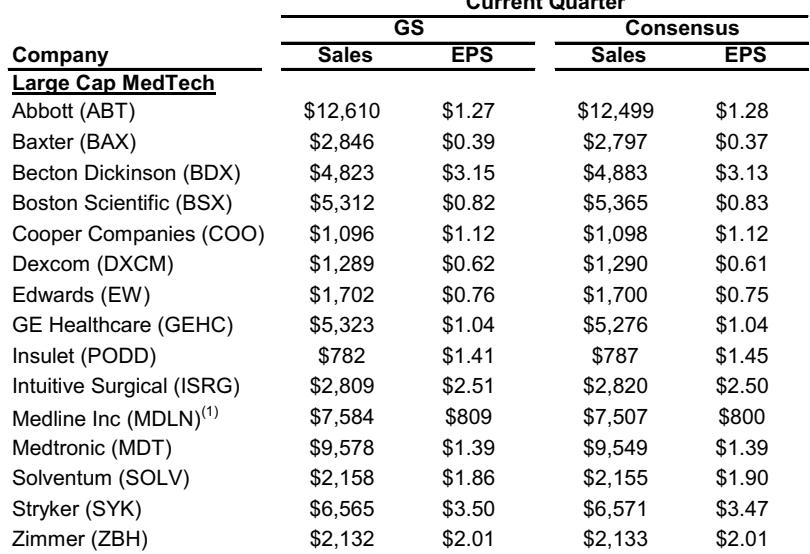
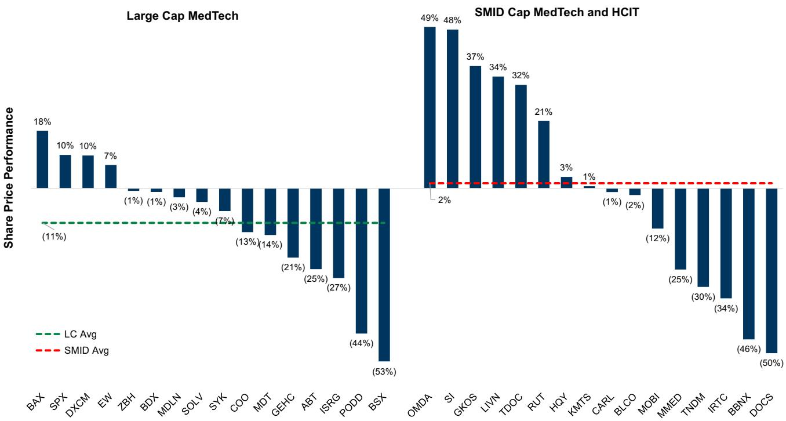
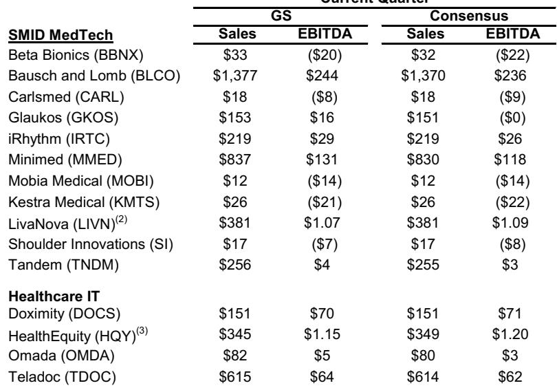

# GS：MedTech-HCIT 2Q26图表预览——基本面混合与估值折价

大型 MedTech 板块今年迄今表现落后于标普500指数约30个百分点，多数大盘股估值已跌破20年均值。GS在2Q26季报预览报告中指出，当前板块面临增长减速、产品周期成熟和个别龙头公司遭遇逆风三重不确定性。但报告同时认为，估值折价本身不足以驱动持续反弹——市场需要看到更积极的资本配置、更务实的盈利预期校准，以及有可见度的管线催化。

这份报告覆盖了大型 MedTech、SMID 和 Healthcare IT 三个子板块共30余家公司，核心判断是：2Q26季报可能带来短期交易性机会，但板块的系统性修复需要更长时间。

## 1. 增长减速不是季度现象，而是结构性节奏变化

GS追踪的大型 MedTech 加权有机增长在2025年达到高点后持续回落。2Q26的有机增长预期仅环比微幅改善，且改善主要来自 Stryker 的网络安全事件后恢复和 Solventum 的一次性库存收益，而非终端需求的实质性回暖。

报告引用的医院调研和利用率诊断显示，美国手术量环境仍处于调整中。1Q26的天气、流感等暂时性扰动并未在2Q出现预期中的“追赶效应”。更关键的是，多数公司并未在全年指引中假设终端市场改善——这意味着管理层自己也不认为增长会自然加速。

> **KC评论：** 这里容易被忽略的是“指引隐含的下半年增速”这张表。多数公司2H26的有机增长预期低于1H26，只有 Abbott、Stryker、Minimed 等少数公司隐含加速。对于读者而言，季报的“惊喜”可能更多来自成本控制而非收入超预期。

## 2. 估值折价背后是产品周期真空和资本配置缺位

报告指出，多数大型 MedTech 公司当前交易价格低于其20年平均估值倍数。但低估值本身不是观点偏积极理由。GS认为，板块持续反弹需要三个条件同时成立：更积极的资本配置（包括股东回报和增长性资本支出）、2026年及以后盈利预期的合理校准，以及有可见度的管线或增长驱动因素。

目前的情况是，过去几年支撑板块超趋势增长的主要产品周期（如糖尿病、结构性心脏病、机器人手术）正在进入成熟阶段，而新一代产品尚未形成足够规模。同时，多数公司的资本配置策略仍偏保守，回购和并购力度不足以改变市场对增长前景的预期。

## 3. 季报窗口的选股逻辑：短期惊喜与中期叙事

GS在报告中给出了明确的选股框架：既要看2Q26季报的超预期潜力，也要看2H26至2027年叙事能否转向正面。报告重点提及了 Abbott、Intuitive Surgical、Medline 等公司在季度层面可能超预期，同时指出 Edwards、Omada、Insulet 等公司在季报和中期叙事上都有看点。

具体来看，Abbott 的超预期来自海外 Libre 招标延迟后的恢复、MiniMed 的 Instinct 出货、诊断业务基数效应缓解以及电生理份额提升。Intuitive Surgical 则受益于美国手术中 Sp、Ion 和力反馈器械的混合结构改善。这些驱动因素都是公司层面的，而非行业性的。

对于全年盈利，GS认为2Q的 EPS 或利润率超预期很可能被用来对冲下半年的爬坡不确定性，因此对全年指引的上修空间不宜过度乐观。

## 4. 成本端改善是少数确定性信号

报告追踪的 MedTech 关键原材料价格在最近30天多数回落。铝、铜、镍、聚丙烯等主要投入品价格环比下降，只有不锈钢和运费仍在上涨。这对利润率构成温和利好，但报告也提醒，DRAM 价格同比仍大幅上涨，且运费环比涨幅超过20%，成本端并非全面改善。

原材料成本下降对利润率的贡献需要时间传导，且各公司库存周期和套保策略不同，实际受益幅度存在差异。但至少从方向上看，2H26的成本不确定性可能小于上半年。

---

GS这份报告的核心价值不在于给出季报预测，而在于提供了一个判断框架：当估值已经反映悲观预期时，市场需要看到哪些信号才能重新定价。目前来看，多数信号仍处于“等待验证”阶段。

For informational purposes only. Portions may be generated,translated,summarized,or edited with AI assistance based on source materials and may contain omissions or errors. Please verify independently. This is not investment,legal,tax,accounting,or other professional advice.

For informational purposes only. Portions may be generated,translated,summarized,or edited with AI assistance based on source materials and may contain omissions or errors. Please verify independently. This is not investment,legal,tax,accounting,or other professional advice.

