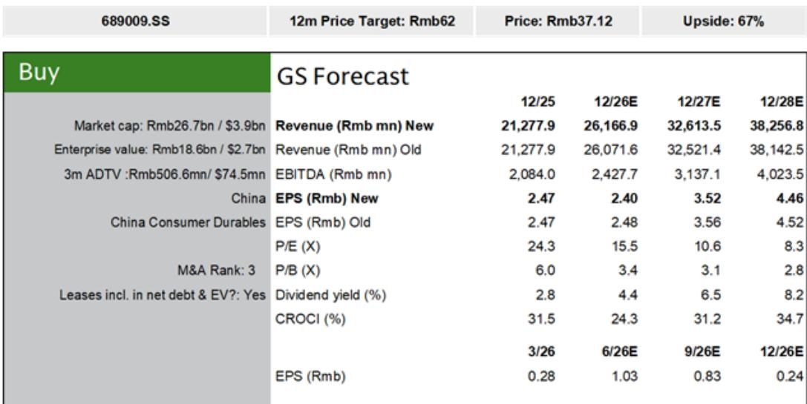
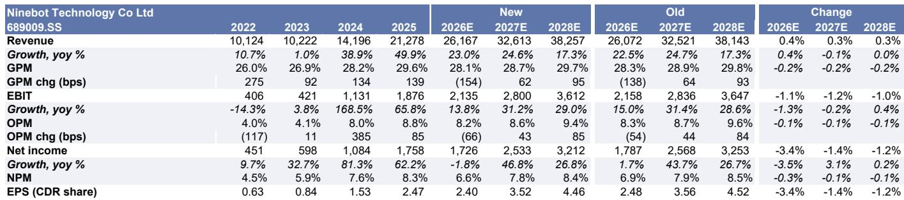
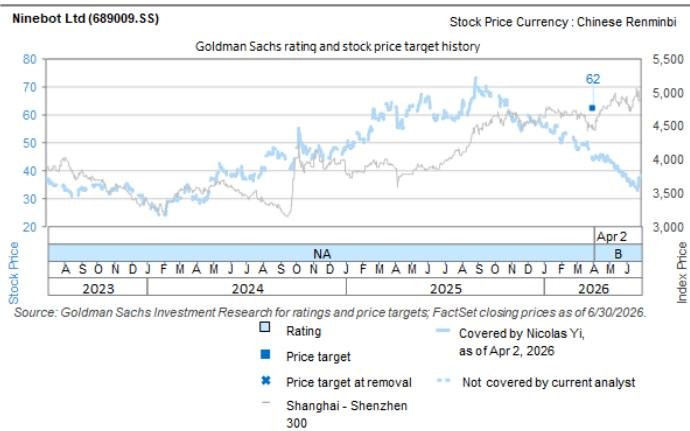

# GS：九号公司2Q26预览-收入增长加速与份额提升，利润率不确定性缓解

九号公司预计在8月10日发布二季度业绩。GS在最新预览报告中给出一个核心判断：收入增速将明显回升，利润不确定性环比大幅收窄。二季度收入同比增长约27%，较一季度的15%明显加速；净利润同比降幅从一季度的55%收窄至5%左右。如果剔除汇兑损益的影响，GS认为二季度经常性利润将实现双位数增长。

这份报告的关键不在于单季数字本身，而在于它揭示了一个转折信号——成本上涨和汇率波动的冲击正在见顶，而公司通过产品结构优化和提价正在重建利润空间。

## 1. 割草机器人弹性较高增长，正在成为利润结构的关键变量

GS预计九号二季度割草机器人销量同比弹性较高以上。Sensor Tower的App下载追踪数据也印证了这一结构性增长势头。割草机器人业务毛利率长期维持在48%以上，远高于两轮车和滑板车业务。随着该业务收入占比从2024年的6.3%提升至2026年预期的12.6%，产品组合本身就在推动整体利润率修复。

> **KC评论：** 割草机器人不仅是增长故事，更是利润故事。当高毛利业务占比持续上升时，即使个别业务毛利率因成本承压，整体利润表仍可能改善。这是理解九号利润走势的一个容易被忽略的框架。

## 2. 两轮车需求正在走出低谷，6月降幅已收窄至4%

国内两轮车行业需求在一季度同比下降17%，但到6月降幅已收窄至4%。九号凭借产品力和渠道扩张，仍在持续获取市场份额，二季度实现两位数增长。GS认为，随着新品上市、以旧换新补贴和国标过渡期影响减弱，下半年需求有望进一步改善。低基数效应尤其会在四季度显现。

## 3. 成本与汇率不确定性正在边际缓解，但二季度仍是全年不确定性高点

管理层已在4月随新品上市完成一轮提价，7月计划进行第二轮同等幅度的提价。GS预计成本上涨对利润的最大冲击集中在二季度，下半年将逐步减弱。汇率方面，二季度汇兑损失环比一季度（约2.48亿元）将明显收窄，但同比仍有不确定性——去年二季度汇兑收益约2.27亿元。公司已加强套期保值策略，贸易余额也在下降。

## 4. 估值处于历史低位区间，回购和分红提供底部支撑

当前报价对应2026年预期市盈率约15.5倍，低于过去两年20倍的平均水平。公司同时提供约4%的股息率，并计划进行1.5亿至3亿元的股份回购注销，对应约0.5%至1%的股东回报。GS认为，随着下半年利润环比改善、国内两轮车需求回暖以及欧盟割草机器人反倾销调查暂未加征临时关税，估值存在重新定价的空间。

这份报告的核心逻辑可以概括为：收入加速、利润触底、产品结构优化、估值偏低。但真正需要持续跟踪的变量，是割草机器人在欧洲市场的渗透速度，以及两轮车行业需求能否在三四季度确认拐点。

For informational purposes only. Portions may be generated,translated,summarized,or edited with AI assistance based on source materials and may contain omissions or errors. Please verify independently. This is not investment,legal,tax,accounting,or other professional advice.

For informational purposes only. Portions may be generated,translated,summarized,or edited with AI assistance based on source materials and may contain omissions or errors. Please verify independently. This is not investment,legal,tax,accounting,or other professional advice.

