# POWERING UP EUROPE

## Who pays for Electrification and Artificial Intelligence?

We explore the cost of electrifying Europe and of rolling out datacenters to support artificial intelligence. Our analysis suggests that electricity bill increases over the coming ten years will be much lower than anticipated, averaging 2-4% pa. This should ease concerns over affordability-driven regulatory intervention and strongly corroborates our thesis of an "earnings super cycle" in Utilities and ongoing multiple expansion.

Even with electrification and AI, power bill growth would be just 2-4% pa. Over the past ten years, power bills for a typical European household have increased by +5% pa. Over the coming ten years, we estimate that electricity bills will increase at a slower pace, despite accelerating electrification and rising AI adoption. Our base case (EU targets largely missed, slow DC roll-out) implies +2% annual growth in bills, while our hyper-adoption scenario for electrification and datacenters increases this to +4% pa. These figures are significantly below prevailing expectations and reflect two common misconceptions about capex and power demand.

North vs South divide. We estimate that annual electricity bill increases could reach the mid-to-high single digits in the UK and Germany, driven primarily by rising grid fees, although Germany may be better positioned to mitigate the impact through fiscal support. In Italy and Spain, we forecast largely unchanged power bills until 2035, supported by more modest grid-fee growth and normalizing power prices.

About 35-40% of electrification capex is non-inflationary or deflationary. We estimate c.35-40% of investments in the power system over the coming ten years (€2.2-3.5 trn on our two scenarios) will be non-inflationary (eg power grids' maintenance) or deflationary (eg onshore renewable additions, as seen in Spain).

Power demand growth should reduce unit fixed costs. Rising power consumption from new sources – EVs, heat pumps, industrial electric boilers, aircon, datacenters – should spread fixed costs (eg grid fees) over a larger base, thereby reducing unit costs. In our base case, we forecast power demand growth of c.1.5-2.5% pa until 2030, accelerating to c.3-3.5% thereafter. Our hyper-adoption scenario (EU goals being met, higher AI Agents penetration) implies 4.5-5% growth from 2030.

Household energy spending could fall by -30%. We estimate electrifying a typical household could lead to c.30% savings in fuel costs – equivalent to an annual reduction in energy costs of €1,200 per family. Given these benefits, policymakers may seek to encourage switching to help alleviate the burden of upfront costs.

## Alberto Gandolfi

+39(02)8022-0157 |
alberto.gandolfi@gs.com
GS Bank Europe SE - Milan branch

Mafalda Pombeiro
+44(20)7552-9425 |
mafalda.pombeiro@gs.com
GS International

## Ajay Patel

+44(20)7552-1168 | ajay.patel@gs.com
GS International

## Dhwani Khenwar

+1(332)245-7724 | dhwani.khenwar@gs.com GS India SPL

## Lawrence Lavizani

+44(20)7051-1060 | lawrence.lavizani@gs.com GS International

## Table of Contents

Executive Summary 3
Electrification: 2-4% growth in bills pa, much lower than anticipated 9
Electrification capex: c.35-40% is non-inflationary or deflationary 13
Power demand growth would lower unit fixed costs 16
Households' energy spending would fall 19
Europe spends c.€1 trn pa on fossil fuel 21
Utilities entering an "earnings super-cycle" 23
Investment thesis, valuation & key risks 26
Disclosure Appendix 34

## Executive Summary

Many investors worry that the scale of infrastructure investment required for electrification (€2.2-3.5 trn over the next decade on our estimates) could create affordability challenges, ultimately derailing our organic growth/earnings super-cycle re-rating thesis for the sector. Our analysis, based on both a base-case and a hyper-adoption scenario for electrification and datacentres, suggests these concerns are overstated. On these two scenarios, we estimate electricity bill increases over the coming ten years will average between +2% and +4% pa, respectively. These figures are significantly below prevailing expectations, and also lower than the +5% annual increase in electricity bills, experienced by European consumers over the past ten years. As a result, we believe the electrification process is likely to prove much more manageable from both a social and economic perspective than many investors anticipate. Two factors underpin this seemingly counter-intuitive conclusion: (1) not all capex is inflationary: c.35-40% of the electrification investments that we project are non-inflationary (eg maintenance of power grids) or deflationary (eg onshore renewable additions), and (2) power consumption growth from new sources would lower unit fixed costs, such as grid fees. In our view, these findings strongly support our thesis of an "earnings super cycle" in Utilities and ongoing multiple expansion.

## Even with electrification and AI, power bill growth would be well below prevailing perceptions

Over the past ten years, power bills for a typical European household have increased by +5% pa. Over the coming ten years, we estimate that electricity bills will increase at a slower pace, despite accelerating electrification and rising AI adoption. Our base case (EU targets largely missed, slow DC roll-out) implies +2% annual growth in bills, while our hyper-adoption scenario for electrification (EU targets met) and datacenters (higher penetration rate of AI Agents) increases this to +4% pa. These figures are significantly below prevailing expectations and reflect two common misconceptions about capex and power demand.

## Exhibit 1: We expect European electricity bills to grow at a +2% CAGR to 2035 (base case), or at +4% in a hyper-adoption scenario

EU-27 + UK electricity bills evolution under different scenarios, 2026E-35E (€/MWh, average retail and industrial)

  
Source: GS Global Investment Research

## North vs South divide: meaningful regional differences

Our estimates suggest that annual electricity bill increases in the UK and Germany could reach mid-to-high single digit, primarily driven by greater investments in power grids vs the rest of Europe. The situation might potentially be more manageable in Germany given the likely ability to fiscally support consumers. In Italy and Spain, we forecast largely unchanged power bills until 2035 owing to a more muted evolution in grid fees and the likely normalization in power prices.

## Exhibit 2: Germany and the UK may face the highest growth in electricity bills owing to rising grid fees

Unit electricity bills 2026E-35E CAGR in GSe base case, breakdown by country (%, average retail and industrial)

  
Source: GS Global Investment Research

About 35-40% of electrification capex is non-inflationary or deflationary
We estimate c.35-40% of the electrification capex that we project over the coming ten years (€2.2-3.5 trn on our two scenarios) will be non-inflationary (eg power grids' maintenance) or deflationary (eg onshore renewable additions, as seen in Spain).

Exhibit 3: We expect 35-40% of electrification capex to be non-inflationary or deflationary EU power sector 10-year cumulative capex, breakdown by impact on inflation (€ trn)

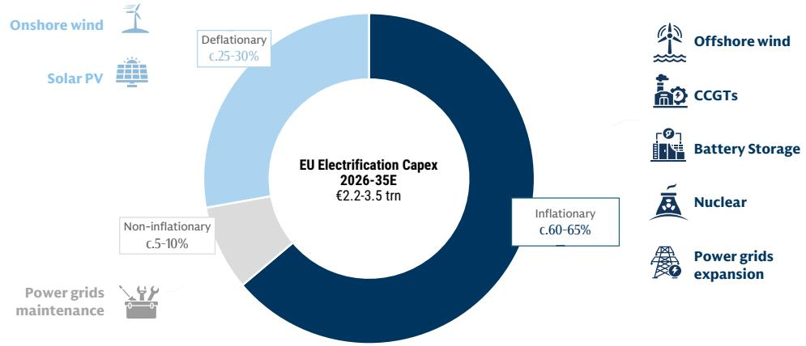  
Source: GS Global Investment Research

## Power demand growth from new sources should lower unit fixed costs

Rising power consumption from new sources – EVs, heat pumps, industrial electric boilers, aircon, datacenters – should spread fixed costs (eg grid fees) across a wider base, thereby reducing unit costs. In our base case, we forecast power demand growth of c.1.5-2.5% pa until 2030, accelerating to c.3-3.5% thereafter. Our hyper-adoption scenario (EU goals being met, higher AI Agents penetration rate) implies 4.5-5% annual growth from 2030.

Exhibit 4: We see power demand growth accelerating from 1.5-2% pa to potentially 4-5% pa, depending on the pace of electrification and datacenter rollout
EU power demand evolution across different GS scenarios, 2026E-35E (percentage)

  
Source: GS Global Investment Research

Households' energy spending could fall by -30%: €1,200 savings pa per family
We estimate electrifying a typical household could lead to c.30% annual savings in fuel – equivalent to an annual reduction in energy costs of €1,200 per family. Essentially, running an EV or electric heating would lead to meaningful monthly savings for European households. Given these benefits, policymakers may seek to encourage switching to help alleviate the burden of upfront costs.

Exhibit 5: Despite higher electricity volumes, electrification could reduce household bills by c.30%

Household annual energy bill breakdown by source, 2026-35E (€ per year)

  
Source: GS Global Investment Research

## Europe spends c.€1 trn pa on fossil fuel

Each year, Europe spends around €1 trn pa on oil and derivative products, natural gas and coal. The rising share of electricity in the primary energy mix would imply meaningful savings in fossil fuel spending, which we estimate at €100-150 bn per annum as of 2030-35.

Exhibit 6: European end-users spend €1 trn in fossil fuels per year, mostly in oil EU-27 + UK fossil fuel end-user spending in 2024, breakdown by commodity (percentage)

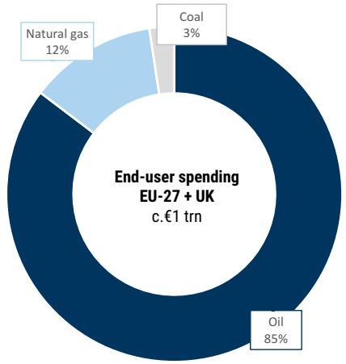

## Electrification and AI to drive a generational earnings super-cycle

A growing electricity infrastructure deficit is likely to support higher returns across Renewables and FlexGen, while driving increased investment requirements throughout the electricity value chain – including power grids. Over the coming ten years, we estimate electrification will require €2.2-3.5 trn of investments, a meaningful acceleration vs the past ten years. For the main electrification compounders, this should support high-single-digit to low-double-digit average earnings growth into the 2030s, on our estimates (see here). We see this supporting an "earnings super-cycle" for the industry extending well into the 2030s. As the investment cycle unfolds, earnings expectations are likely to move materially higher into 2030-31, thus supporting further multiple expansion. This may also weaken the sector's correlation with cost of capital and commodity prices.

Exhibit 7: European Utilities' re-rating is underpinned by higher (and better-quality) structural earnings growth
SX6P 1-year forward PE evolution, 2019-26 (x)  
  
\* Updated as of 13 July  
Source: Bloomberg

## Favor transformative electrification stories, renewables and energy security infrastructure providers

We favor three clusters of companies: (1) Transformative electrification stories include companies where electrification capex is set to accelerate meaningfully (Naturgy, Enel, Engie and PPC), significantly transforming these portfolios on a 3-5 year basis; (2) Renewable developers, which should benefit from rising returns and organic growth opportunities (RWE, EDPR, Solaria, Orsted). RES manufacturers that should benefit from rising orders and margins (eg Vestas and Nordex); and (3) Energy security infrastructure providers, such as Siemens Energy, EON and Snam.

## Electrification: 2-4% growth in bills pa, much lower than anticipated

Over the past ten years, the main cost items for a typical European household — housing, food and energy — have increased by +4% pa on average. Electricity bills have risen at an annual rate of +5%. Over the coming ten years, we estimate that electricity bills will increase at a slower rate of between 2% pa and 4% pa based on two scenarios: (1) our base case, which assumes a slower pace of electrification (c.40-50% below EU electrification goals) alongside a gradual datacenters roll out (lagging the US by more than five years), and (2) our hyper-adoption scenario, where we simulate faster electrification (in line with EU goals on EVs and HPs) and stronger adoption rates for AI Agents, requiring a more substantial expansion of datacenter infrastructure. This projected evolution in electricity bills is much lower than commonly perceived, and hence we believe the electrification process is likely to prove much more manageable from both a social and economic perspective than many investors anticipate. Two factors underpin this conclusion: the share of non-inflationary (eg power grids maintenance) and deflationary capex (onshore wind and solar) is higher than prevailing expectations, and power demand growth from new customers should lower unit fixed costs (eg grid fees).

Households' main cost items have been growing +4% over the past ten years
According to Eurostat, household cost inflation averaged +c.4% CAGR across the main spending categories over the past ten years (2016-25). Electricity and gas bills saw the steepest increase, at 5% and 6% CAGR, respectively, while housing costs increased more moderately at c.2% CAGR.

Exhibit 8: European household cost inflation averaged c.4% CAGR over the past ten years (+5% for power bills)
EU-27 HCPI average annual increase by category, 2016-25 (percentage)  
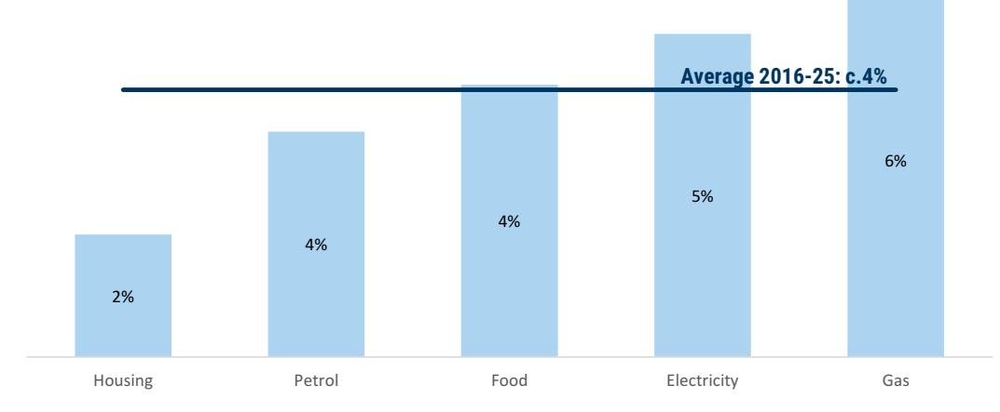  
Source: Eurostat

## Electricity bills to grow 2-4% pa to 2035

Our base case power demand forecast implies slow progress on electrification and only a gradual roll-out in datacenters. More specifically, by 2030, electrification would remain c.40–50% below EU targets, and our 2031 datacentre forecast is c.15% below the EUDCA's (already conservative) expectations. Under this scenario, power demand would grow by 1.5–2.5% pa to 2030, rising to 3–3.5% thereafter until 2035 as the pace of electrification and, particularly, datacenters development picks up. We estimate that meeting this demand would require c.€2.2 trn of electrification capex over the coming ten years. Our analysis suggests that this would lead to a +2% annual increase in electricity bills over 2026–35E, for Europe. This is less than half of the annual increase experienced by households over the past ten years.

Our hyper-adoption scenario assumes a stronger pace of electrification and a faster datacenters roll-out. Specifically, we assume adoption rates broadly in line with the EU's 2030 targets for mobility and heating: c.30 mn EVs vs around 10 mn in 2026, and c.60 mn HPs vs around 30 mn in 2026. This would require an acceleration in investments across power grids and, in particular, power generation (renewables, gas plants, batteries). Under this scenario, power demand growth would reach 4.5-5% pa over 2030-35.

Exhibit 9: Our hyper-adoption scenario assumes faster electrification and datacenter build-out
Infographic

<table><tr><td></td><td>Base Case (+2%)</td><td>Hyper-adoption (+4%)</td></tr><tr><td>Datacenters</td><td>c.60 GW capacity by 203520-30% share of Agentic AI queries by 2035</td><td>c.80 GW capacity by 203535% share of Agentic AI queries by 2035</td></tr><tr><td>Electric Vehicles</td><td>35% of new EV sales by 2030</td><td>55% of new EV sales by 2030 (EU target)</td></tr><tr><td>Heat Pumps</td><td>Half of the 2030 EU target (30 mn)</td><td>100% of the 2030 EU target (60 mn)</td></tr></table>

Source: GS Global Investment Research

Under our hyper-adoption scenario, electricity bills would grow by +4% CAGR over the coming ten years, we estimate. Once again, this would be less than the increase faced by households over the past ten years.

Exhibit 10: We expect European electricity bills to grow at a +2% CAGR to 2035, or at +4% in a hyper-adoption scenario

EU-27 + UK electricity bills evolution under different scenarios, 2026E-35E (€/MWh, average retail and industrial)

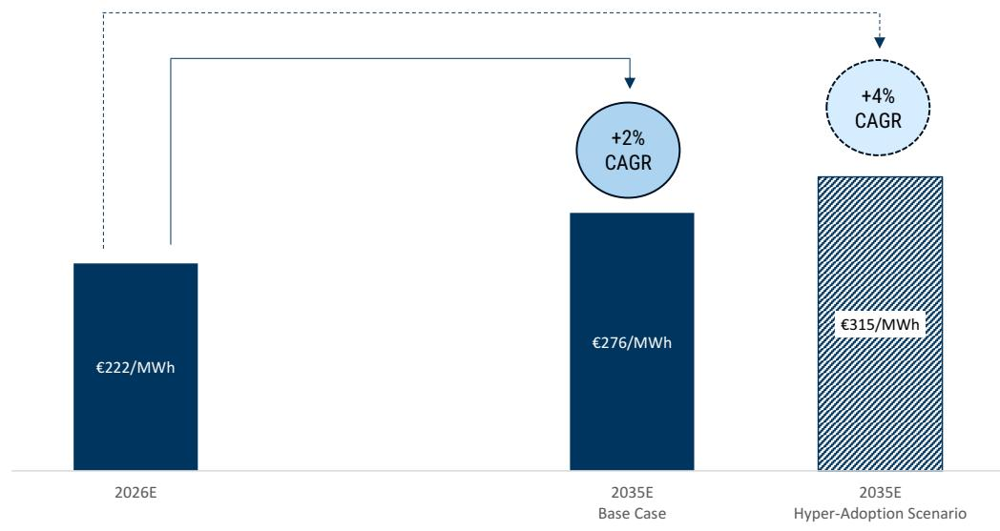  
Source: GS Global Investment Research

## Meaningful regional deviations: North vs South divide

At a regional level, outcomes are likely to be relatively heterogeneous. Across both our base-case and hyper-adoption scenarios, we expect electricity bills to rise more rapidly in the UK and Germany. Under our base case, annual bill increases reach +4% and +7% respectively, rising to +5% and +8% under our hyper-adoption scenario. This reflects higher investment requirements in power grids (15-25% annual increase in RAB). Germany may be better positioned to mitigate the impact on consumers given the potential scope for fiscal support measures.

By contrast, we expect the evolution of power bills in Italy and Spain to be more muted. Under both scenarios, we forecast broadly unchanged electricity tariffs through 2035; this reflects the much lower increase in grid fees and, especially for Italy, the projected normalization in power prices which are currently nearly twice the levels seen in Spain.

## Exhibit 11: Germany and the UK may face the highest growth in electricity bills owing to rising grid fees

Unitary electricity bills 2026E-35E CAGR in GSe base case, breakdown by country (%, average retail and industrial)

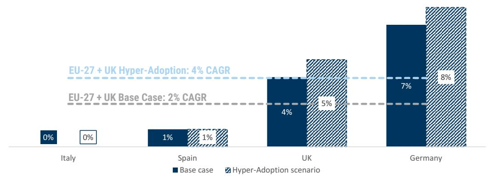  
Source: GS Global Investment Research

## Electrification capex: c.35-40% is non-inflationary or deflationary

We estimate c.35-40% of the electrification capex projected over the coming ten years (€2.2-3.5 trn on our two scenarios) will be non-inflationary (eg maintenance investments in power grids) or deflationary (onshore wind and solar additions will lower energy prices). This is much higher than many perceive and it is one of the reasons why we project a more muted evolution in power bills than anticipated by investors.

## Expected electrification capex at €2.2-3.5 trn

As discussed in previous reports (see here), growing electrification needs are placing increasing pressure on an aging power system. This should drive substantial investment upgrades in power grids, as well as in power generation over the next decade. Power grids are c.40 years old and require a major upgrade to accommodate rising demand from new clients: datacenters, heat pumps, electric vehicles, air conditioning and industrial boilers. We also envisage an acceleration in renewable additions, and rising investments in back-up generation — CCGTs and BESS, to offset asset retirements and support rising consumption.

Our base case implies c.€2.2 trn of investment over 2026-35, rising to c.€3.5 trn under our hyper-adoption scenario, which assumes faster electrification and accelerated datacenter deployment – as detailed in the chapter "Electrification: 2-4% growth in bills pa, much lower than anticipated".

This new level of investment would represent a c.60–150% increase versus the historical level of €1.4 trn, incurred over the past ten years (2016–25).

Exhibit 12: We estimate €2.2-3.5 trn electrification investment needs over 2026-35, a significant acceleration vs history
EU power sector 10-year cumulative capex, breakdown by driver (€ trn)  
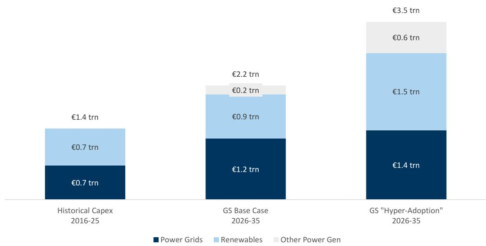  
Source: GS Global Investment Research

About 35-40% of the investments are non-inflationary or deflationary
We break down the €2.2-3.5 trn electrification investments into three broad categories:

Non-inflationary (c.10%). These investments largely relate to maintenance spending in power grids, to preserve these assets in the current shape.

Deflationary (c.25-30%). Here we include investments in onshore wind and solar generation assets. Evidence across Europe shows that countries with a higher share of renewables (eg Spain) tend to have power prices that are c.40-50% lower relative to power systems that are still largely reliant on gas plants (eg Italy). Continued renewable additions would have a deflationary effect on power prices, especially in Italy, Germany and the UK, as seen below.

Exhibit 13: Nordics, France and Spain show lower and more stable power prices than Germany, Italy and the UK 1-year forward power curve by country, (€/MWh)  
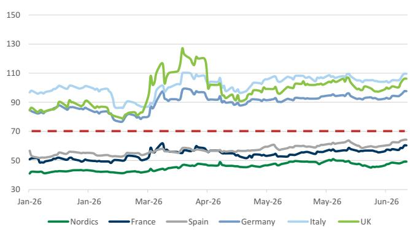  
UK power price converted to € at an FX rate of 1.15  
Exhibit 14: This difference can be explained by the generation mix, with renewables and nuclear-led systems showing lower pricing Countries' 2025 generation output, breakdown by source (percentage)

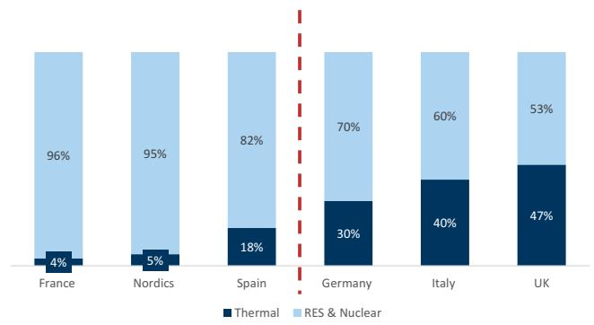  
Source: GS Global Investment Research  
Source: Bloomberg

Inflationary (c.60–65%). In this category, we mostly include investments in: offshore wind, back-up generation (CCGTs, battery storage and nuclear) and power grids' expansion.

As a result, 35–40% of the required investment should have either a neutral or deflationary effect on electricity bills, helping to offset the inflationary pressure from the rest of the spending.

Exhibit 15: We expect 35-40% of electrification capex to be non-inflationary or deflationary EU power sector 10-year cumulative capex, breakdown by impact on inflation (€ trn)

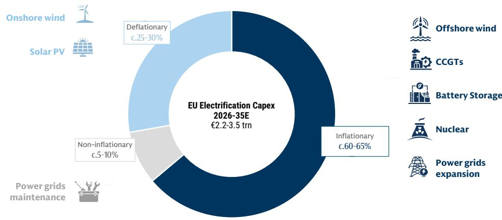  
Source: GS Global Investment Research

## Power demand growth would lower unit fixed costs

Rising power consumption from new sources – EVs, heat pumps, industrial electric boilers, aircon, datacenters – would spread fixed costs across a larger base (eg grid fees), thereby reducing unit costs. On our base case, power demand would grow by c.1.5-2.5% pa until 2030, accelerating to c.3-3.5% thereafter. Our hyper-adoption scenario (EU goals being met, higher AI Agents penetration rate) implies 4.5-5% growth from 2030.

## Electrification is gathering momentum

Recent data suggest that electrification in Europe is accelerating. In 2025, the region sold more than 2 mn EVs (c.20% share of total vehicle sales) and installed >2.5 mn heat pumps (here and here). As a reference, an EV can roughly double a household's electricity consumption when used as the primary family vehicle, while switching from gas to electric heating can have a much higher effect, provided the HP also provides cooling as well as heating. Combined, 2025 EV sales and heat pump installations are equivalent to adding more than 5 mn households to Europe's power system.

Looking ahead, we expect electricity demand growth to be driven by four factors: (1) modest GDP growth, adjusted for energy efficiency, (2) accelerating electrification of transport and buildings, (3) the gradual roll-out of datacenters, and (4) rising air-conditioning penetration. Together, these factors should drive electricity demand growth in our base case of c.1.5-2.5% CAGR through 2030, accelerating to c.3-3.5% thereafter as electrification and datacenter deployment gather pace, as detailed earlier. We note that despite the supportive top-down outlook, we maintain a conservative approach in our company models, assuming electricity demand growth of c.1.5-2.0%.

Exhibit 16: We expect power consumption to grow by 1.5-2.5% pa over 2025-30E, with growth rising to 3-3.5% pa thereafter, as electrification and datacenter rollout accelerate EU 2025-35E power demand evolution GSe base case, breakdown by driver (TWh, percentage)  
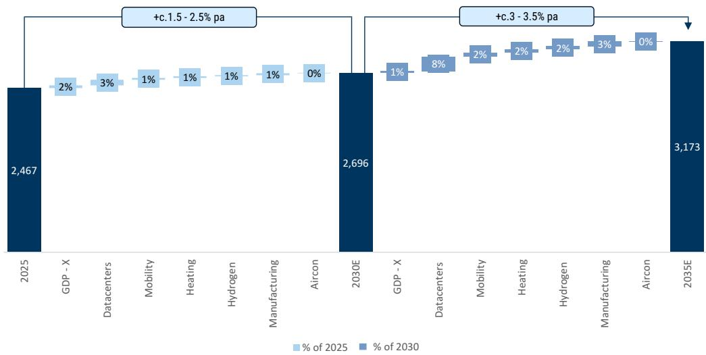  
Source: GS Global Investment Research

## Datacenters are coming to Europe; now there's evidence

Based on data collected from major European power grid operators, we estimate the EU datacenter pipeline at c.480 GW. The UK, Italy and Germany account for the largest volumes in absolute terms. We note this pipeline is equivalent to c.1.5x current European power demand, pointing to a significant long-term boost to electricity consumption, in our view.

Exhibit 17: We estimate the European DC pipeline has reached nearly 500 GW European datacenter connection requests, breakdown by country (GW, percentage)  
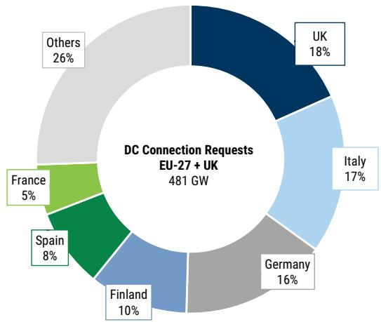  
Source: GS Global Investment Research

This pipeline should drive a significant acceleration in datacenter capacity additions over the next decade. From c.15 GW at the end of 2025, capacity could exceed 35 GW by 2031 and reach >60 GW by 2035 in our base case, broadly consistent with Europe maintaining a five-year lag versus the US.

In an upside scenario, where Agentic AI accounts for 30-40% of queries (+10 pp vs our base case, see here), higher power intensity could increase datacenter capacity needs by c.25-30%, taking installed capacity to c.80 GW by 2035. By then, datacenters could account for c.25% of total electricity demand.

Exhibit 18: By 2035, Europe's datacenter market could reach c.80 GW capacity in our upside scenario

EU Datacenter capacity evolution potential, 2025-35 (GW)

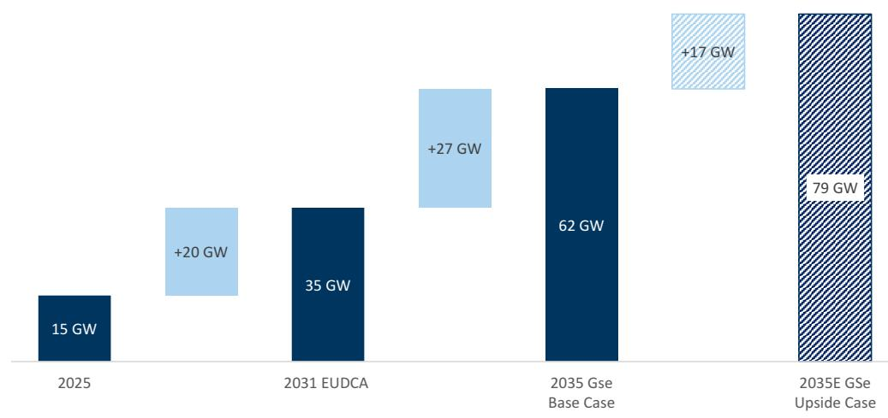  
Source: GS Global Investment Research, European Data Center Association

## Power demand at +c1.5-2% pa initially, potentially peaking at +5% pa

Power demand growth will largely depend on the pace of electrification and datacenter deployment. Our base case assumes delays to national electrification targets, while our hyper-electrification scenario assumes delivery of current 2030 goals and stronger datacenter growth. As a result, electricity demand growth could rise from c.1.5-2% initially to potentially +5% pa by 2035.

Exhibit 19: We see power demand growth accelerating from 1.5-2% pa, potentially to 4-5% pa, depending on the pace of electrification and datacenter rollout
EU power demand evolution across different GS scenarios, 2026E-35E (percentage)

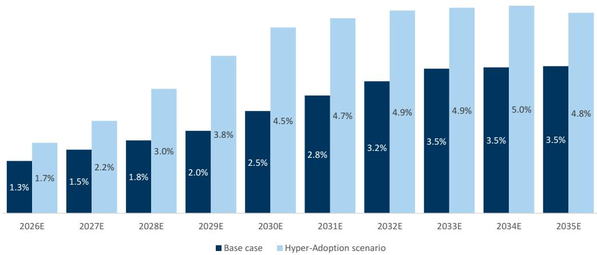  
Source: GS Global Investment Research

Household annual electricity consumption, 2026-35E

## Households' energy spending would fall

We estimate electrifying a typical household could lead to c.30% savings in fuel costs – equivalent to an annual reduction in energy costs of €1,200 per family. Given these benefits, policymakers may seek to encourage switching to help alleviate the burden of upfront costs.

## Electrification would nearly triple the consumption of a typical household

At the household level, full electrification would increase annual electricity consumption from c.3 MWh to 9 MWh, we estimate. This would be a function of swapping a combustion car for an EV, and gas heating with electric heating.

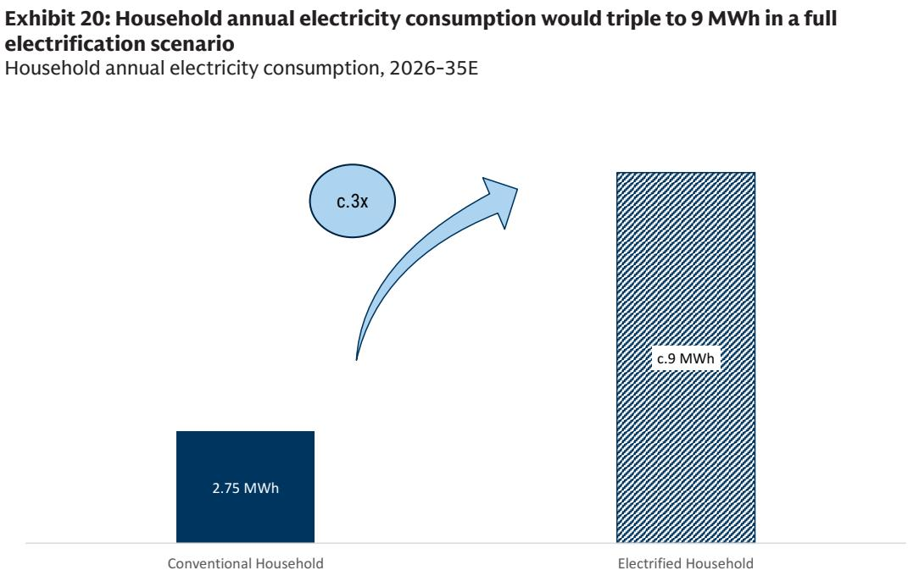  
Source: GS Global Investment Research

## Household energy costs would drop by -30%, or €1,200 per annum

Despite this near-tripling in power consumption per family, total energy spending should fall. A typical European household currently spends c.€4,200 per year on electricity, heating and fuel for mobility. This total cost could decline by c.30% to €3,000 per year – implying €1,200 annual savings per family – following full electrification, as savings from petrol and natural gas would more than offset the higher spending in electricity. This can be explained by the superior energy efficiency of EVs and HPs, which lower annual running costs for cars and heating. Upfront investment to install a heat pump and purchase an EV would, however, be required.

Household annual energy bill breakdown by source, 2026-35E (€ per year)

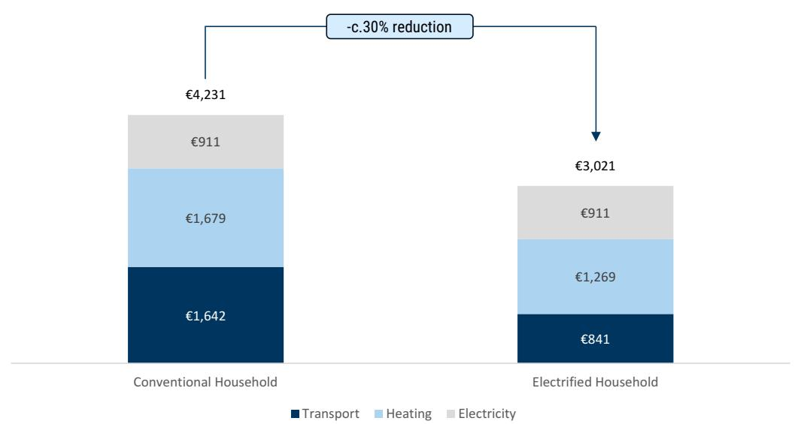  
Source: GS Global Investment Research

## Europe spends c.€1 trn pa on fossil fuel

Each year, Europe spends around c.€1 trn on oil and derivative products (petrol, diesel, jet fuel, heavy fuel oil), natural gas and coal. The rising share of electricity in the primary energy mix would imply meaningful savings on fossil fuel spending, which we estimate at €100-150 bn per annum as of 2030-35. The EU reportedly believes that, eventually (ie by 2040-45), the reduction in fossil fuel import costs could drop by about -50%.

## Europe spends €1 trn annually on fossil fuels

European end-users currently spend c.€1 trn per year on fossil fuels, with oil and refined products accounting for the largest share, largely driven by transport demand. Natural gas and coal make up most of the remainder, primarily serving power generation and industrial processes.

Exhibit 22: European end-users spend €1 trn in fossil fuels per year, mostly in oil EU-27 + UK fossil fuel end-user spending in 2024, breakdown by commodity (percentage)  

Source: GS Global Investment Research

In our view, the debate around affordability and electrification is often incomplete. Indeed, by replacing fossil fuel with electricity, Europe could ultimately reduce its fossil fuel imports by as much as 50% (see here for details). On our estimates, the share of electricity within final energy consumption could rise to 30-35% by 2035, from c.20% currently. This could eventually generate c.€100-150 bn annual savings through lower fossil fuel procurements, at constant prices.

2035E

Exhibit 23: Electrification could raise the share of electricity in final energy consumption to 30-35% by 2035, vs c.20% today

EU share of electricity in final energy consumption, 2024 vs 2035 (percentage)

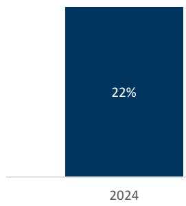

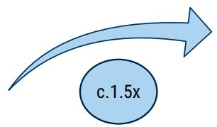

  
Source: International Energy Agency, GS Global Investment Research

## Utilities entering an "earnings super-cycle"

A growing electricity infrastructure deficit is likely to support higher returns across Renewables and FlexGen, while driving increased investment requirements throughout the value chain – including power grids. Over the coming ten years, we estimate electrification will require €2.2-3.5 trn of investments, a meaningful acceleration vs the past ten years. For the main electrification compounders, this should support high-single-digit to low-double-digit average earnings growth into the 2030s, on our estimates (see here). We see this supporting an "earnings super-cycle" for the industry extending well into the 2030s. As the investment cycle unfolds, earnings expectations are likely to move materially higher into 2030–31, thus supporting further multiple expansion. This may also weaken the sector's correlation with cost of capital and commodity prices.

Exhibit 24: European Utilities' re-rating is underpinned by higher (and better-quality) structural earnings growth  
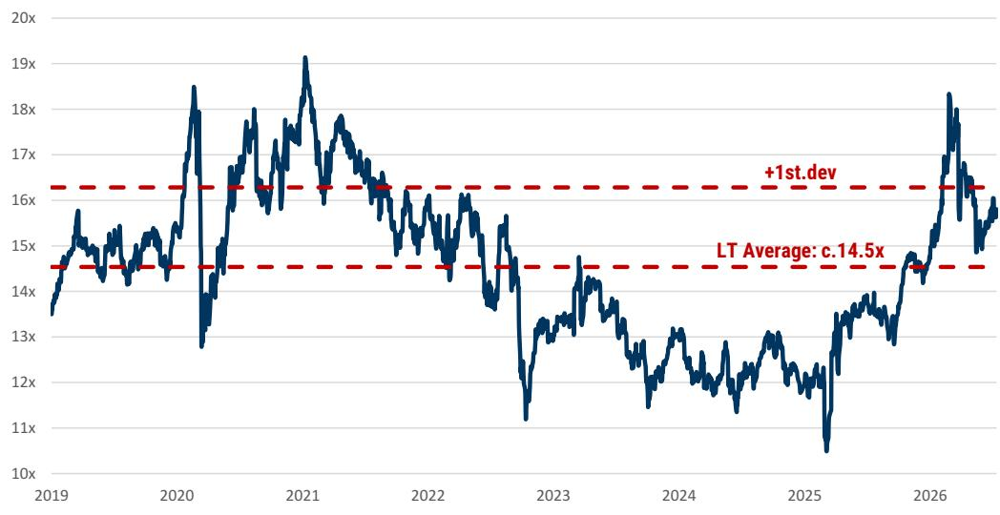  
\* Updated as of 13 July  
Source: Bloomberg

We believe organic growth will be particularly strong for these key Buy rated stocks: we estimate an average EPS CAGR of +c.14% over 2026-30E.

Exhibit 26: We see three company clusters as the main beneficiaries Infographic

Exhibit 25: We estimate an EPS CAGR of c.+14% to the end of the decade for our key Buy-rated names
2026-30E Clean EPS CAGR breakdown by company (percentage)  
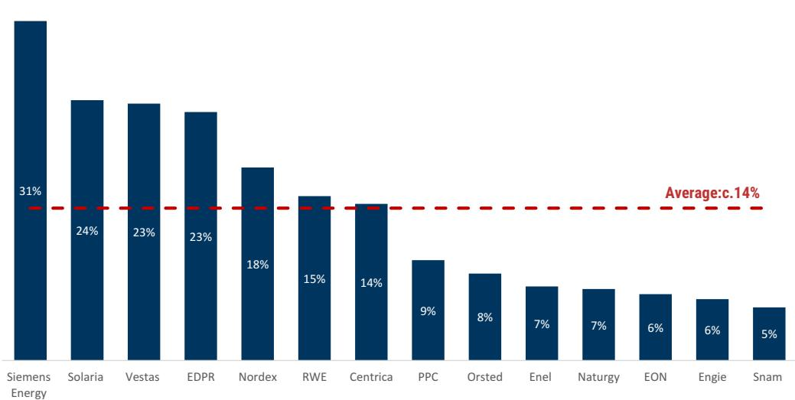  
Source: GS Global Investment Research

## Favor transformative electrification stories, renewables, and energy security infrastructure providers

We favor three clusters of companies: (1) Transformative electrification stories include companies where electrification capex is set to accelerate meaningfully (Naturgy, Enel, Engie and PPC), significantly transforming these portfolios on a 3-5 year basis; (2) Renewable developers, which should benefit from rising returns and organic growth opportunities (RWE, EDPR, Solaria, Orsted). RES manufacturers that should benefit from rising orders and margins (eg Vestas and Nordex); and (3) Energy security infrastructure providers, such as Siemens Energy, EON and Snam.

We favour three company clusters:

  
Transformative Electrification Stories: Naturgy, Enel, Engie, PPC

## Renewables:

Developers (RWE, EDPR, Solaria, Orsted)
Manufacturers (Vestas, Nordex)

  
Source: GS Global Investment Research

Energy Security Providers: Siemens Energy, EON, Snam

The main beneficiaries trade on an average P/E of c.12x and an EV/EBITDA of c.7.5x by 2030E, a discount to the sector
