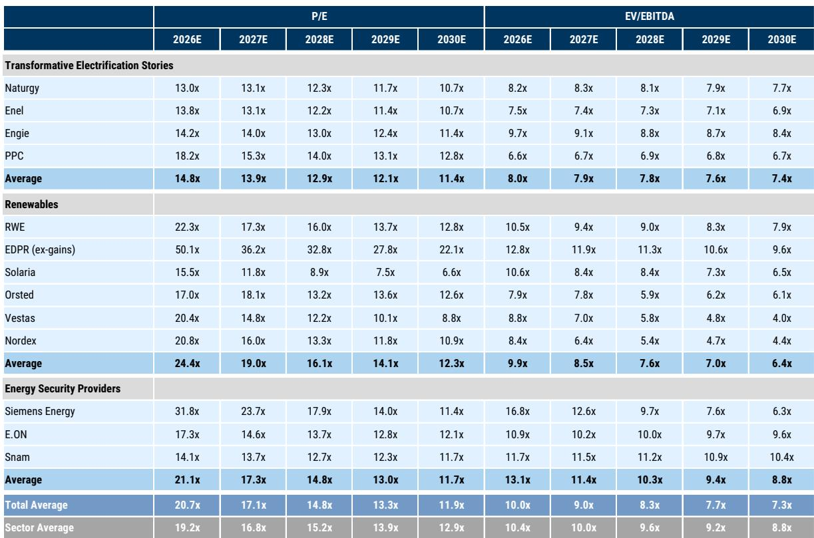
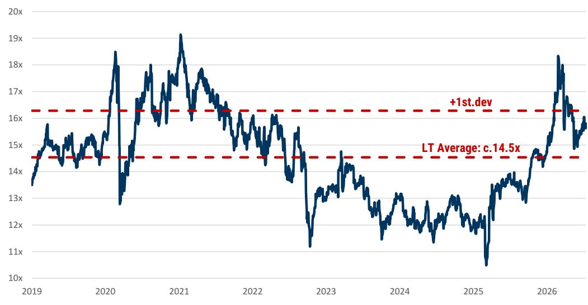

# GS：欧洲电气化与AI，谁来买单

市场对欧洲电气化和AI数据中心推高电价的担忧，可能被放大了。GS最新报告测算，未来十年欧洲家庭电费年均涨幅仅为2%至4%，远低于过去十年5%的年增速，也低于多数读者的预期。这一结论的核心支撑来自两个常被忽略的结构性因素：约35%-40%的电气化研究本身不具有通胀效应，甚至具有价格变化效应；而电力需求增长反而会摊薄单位固定成本。报告认为，这为公用事业板块的“盈利超级周期”提供了坚实支撑。

## 1. 电气化研究中超过三分之一不推高电价

GS估算，未来十年欧洲电气化所需研究在2.2万亿至3.5万亿欧元之间。其中约35%-40%属于非通胀性或价格变化性研究。非通胀部分主要指电网维护——这类支出不新增产能，也不会推高终端电价；价格变化部分则来自陆上风电和光伏的持续扩张，这些项目的单位发电成本仍在下降，西班牙就是典型案例。这意味着，市场对“大规模研究必然推高电价”的线性推演，忽略了研究结构本身的差异性。

> **KC评论：** 这一判断的关键不在于研究总量，而在于研究构成。如果大部分新增研究集中在成本仍在下降的可再生能源领域，那么电价的上涨不确定性就会被自然对冲。读者需要关注的不是“投了多少钱”，而是“钱投到了哪里”。

## 2. 电力需求增长反而降低单位固定成本

一个反直觉的结论是：电力消费增长本身有助于压低电价。原因在于电网费用等固定成本，会被更大的用电基数摊薄。GS在基准情景下预测，到2030年欧洲电力需求年增速为1.5%-2.5%，此后加速至3%-3.5%；在超预期采用情景下，2030年后增速可达4.5%-5%。新增需求主要来自电动车、热泵、工业电锅炉、空调和数据中心。这些新用户的加入，使得电网的固定成本分摊到每度电上的金额下降，从而部分抵消了研究带来的成本上升。

## 3. 家庭能源支出有望下降30%，每年节省1200欧元

报告还测算，一个典型欧洲家庭如果完成电气化转型——包括使用电动车和电热泵——每年能源支出可减少约1200欧元，降幅约30%。这主要得益于电力作为终端能源的效率远高于化石燃料。GS指出，欧洲每年在石油、天然气和煤炭上的终端支出约1万亿欧元，而电气化进程到2030-2035年可每年节省1000亿至1500亿欧元的化石燃料开支。这一节省效应，是政策制定者推动电气化转型的重要宏观环境基础。

## 4. 南北欧电价分化：英国德国涨幅最高，意大利西班牙基本不变

区域差异显著。GS预计，英国和德国未来十年电费年涨幅可能达到中高个位数，主要驱动因素是两国电网研究强度远高于欧洲其他地区。德国由于财政空间更大，可能通过补贴缓解居民不确定性。而意大利和西班牙的电费到2035年基本保持不变，原因在于电网费用增长温和，且意大利当前电价已处于高位，未来有望回落至正常水平。这一分化意味着，不同市场的公用事业公司面临的监管环境和盈利前景将截然不同。

报告的核心结论并非“电气化没有成本”，而是“成本被系统性高估了”。当市场普遍担忧电费飙升会倒逼监管干预时，GS用研究结构和需求弹性两个维度，给出了一个更温和的推演路径。对于公用事业板块而言，这恰恰是盈利预期上修和估值扩张的催化剂。

For informational purposes only. Portions may be generated,translated,summarized,or edited with AI assistance based on source materials and may contain omissions or errors. Please verify independently. This is not investment,legal,tax,accounting,or other professional advice.

For informational purposes only. Portions may be generated,translated,summarized,or edited with AI assistance based on source materials and may contain omissions or errors. Please verify independently. This is not investment,legal,tax,accounting,or other professional advice.

