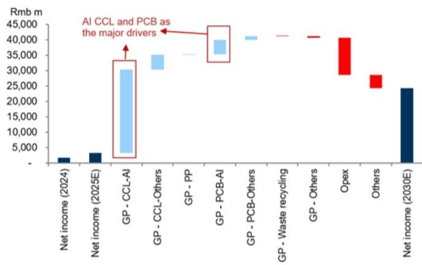
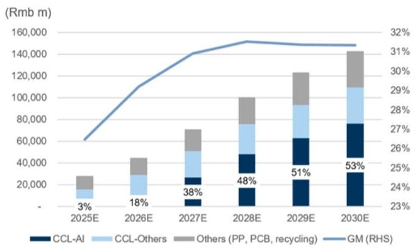
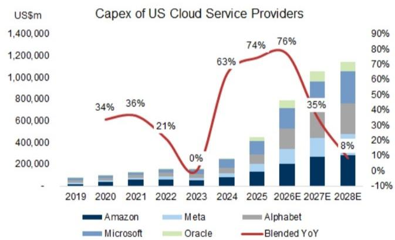
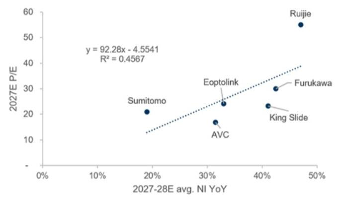
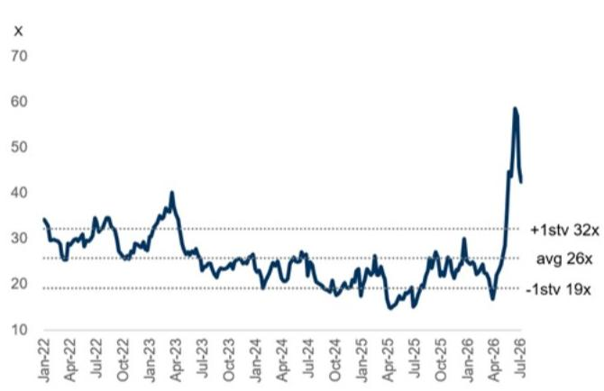
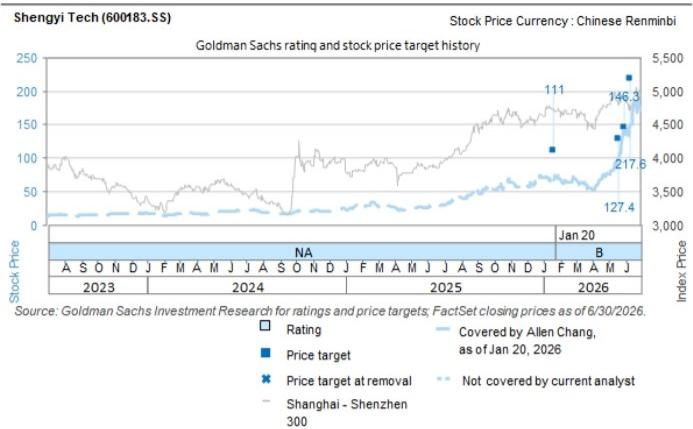

# Shengyi Tech (600183.SS): CCL shipments growth and price increase driving growth; 2Q26 NI guidance beat; Buy

Shengyi reported its 2Q26 preliminary result (link), with net income mid-point up 136% YoY / 76% QoQ, or 37% / 44% higher than our estimate / Bloomberg consensus. Management attributes the strong net income growth to (1) strong growth of high-end CCL business, supported by shipments growth and ASP improvement, (2) subsidiary's, Shengyi Electronics, strong AI PCB shipments growth, driven by the rising end demand from AIDC. We remain positive on Shengyi's growth ahead, supported by its capacity expansion, product mix upgrades toward AI CCL, price increases that offset rising raw material costs, and its accumulated experience in high-end CCL design and mass production. We factor in Shengyi's 2Q26 net income guidance and raise our 12M TP to Rmb247. Maintain Buy.

Allen Chang  
+852-2978-2930 |  
allen.k.chang@gs.com  
GS (Asia) L.L.C.

Verena Jeng  
+852-2978-1681 | verena.jeng@gs.com  
GS (Asia) L.L.C.

Yifan Hu  
+852-2978-0996 | yifan.hu@gs.com  
GS (Asia) L.L.C.

Exhibit 1: Shengyi 2Q26 net income guidance

<table><tr><td rowspan="2">Rmb m</td><td colspan="3">2Q26 pre-announcement</td><td rowspan="2">2Q26 GSe</td><td rowspan="2">Vs. Mid-point</td><td rowspan="2">2Q26 Consensus</td><td rowspan="2">Vs. Mid-point</td><td rowspan="2">2Q25</td><td rowspan="2">YoY</td><td rowspan="2">1Q26</td><td rowspan="2">QoQ</td></tr><tr><td>Low-end</td><td>High-end</td><td>Mid-point</td></tr><tr><td>Net income</td><td>1,941</td><td>2,140</td><td>2,040</td><td>1,486</td><td>37%</td><td>1,419</td><td>44%</td><td>863</td><td>136%</td><td>1,158</td><td>76%</td></tr></table>

Global Server TAM update: We updated our Global Server TAM in late Jun (report link) and raised: (1) AI servers implied AI chips shipments by 14% / 22% / 14% in 2026-28E, (2) US cloud service providers (CSPs) capex by 8% / 27% / 25% in 2026-28E, and (3) China CSP capex by 37% / 44% / 55% in 2026-28E. We expect Shengyi to benefit from the global cloud capex uptrend in coming years, considering its leading position in AI CCL and close partnership with leading AI PCB players, which would support Shengyi's revenue growth and profitability improvement.

Exhibit 2: 2025-30E waterfall chart: AI CCL and PCB as key drivers  
  
Source: Company data, GS Global Investment Research

Exhibit 4: US CSP Capex trend  
Exhibit 3: Shengyi's revenue and GM trends  
  
Source: Company data, GS Global Investment Research

  
Data include Microsoft, Amazon, Meta, Alphabet and Oracle. For Microsoft, we use capex incl. financial lease. In FY24, 50% of the capex of Microsoft was spent on land and 50% on AI/Cloud.

Exhibit 5: China CSP capex trend  
  
Data include Bytedance, Tencent, Alibaba, Baidu. We calculate Bytedance (private) relevant operating metrics by analyzing the industry and companies that our China Internet team cover, and then extrapolating them to Bytedance.  
Source: Company data, GS Global Investment Research  
Source: Company data, GS Global Investment Research

Earnings revision: We factor in Shengyi's 2Q26 net income guidance and raise our 2026-28E net incomes by 17% / 1% / 1%, mainly on higher revenues. Our 2026-28E revenues are revised up by 11% / 4% / 3%, mainly on higher contribution from CCL and PCB business, considering the company's price increases and capacity expansion. We raise our 2026-28E opex ratios, mainly on higher R&D spending, supporting the specification upgrades for AI CCL and PCB. Our estimate shows a GM uptrend in coming years, driven by the product mix upgrade towards AI CCL and PCB.

Exhibit 6: Earnings revision

<table><tr><td rowspan="2">Rmb mn</td><td colspan="3">2026E</td><td colspan="3">2027E</td><td colspan="3">2028E</td></tr><tr><td>Old</td><td>New</td><td>Chg</td><td>Old</td><td>New</td><td>Chg</td><td>Old</td><td>New</td><td>Chg</td></tr><tr><td>Revenue</td><td>40,436</td><td>45,067</td><td>11%</td><td>68,034</td><td>70,931</td><td>4%</td><td>97,158</td><td>100,484</td><td>3%</td></tr><tr><td>GP</td><td>11,694</td><td>13,167</td><td>13%</td><td>21,018</td><td>21,934</td><td>4%</td><td>30,494</td><td>31,691</td><td>4%</td></tr><tr><td>OP</td><td>7,475</td><td>8,338</td><td>12%</td><td>14,241</td><td>14,415</td><td>1%</td><td>20,719</td><td>20,939</td><td>1%</td></tr><tr><td>Net income</td><td>5,821</td><td>6,790</td><td>17%</td><td>11,577</td><td>11,722</td><td>1%</td><td>16,975</td><td>17,158</td><td>1%</td></tr><tr><td>Margins</td><td></td><td></td><td></td><td></td><td></td><td></td><td></td><td></td><td></td></tr><tr><td>GM</td><td>28.9%</td><td>29.2%</td><td></td><td>30.9%</td><td>30.9%</td><td></td><td>31.4%</td><td>31.5%</td><td></td></tr><tr><td>OPM</td><td>18.5%</td><td>18.5%</td><td></td><td>20.9%</td><td>20.3%</td><td></td><td>21.3%</td><td>20.8%</td><td></td></tr><tr><td>NM</td><td>14.4%</td><td>15.1%</td><td></td><td>17.0%</td><td>16.5%</td><td></td><td>17.5%</td><td>17.1%</td><td></td></tr></table>

Source: Company data, GS Global Investment Research

Valuation: We continue to derive our 12M TP from near-term P/E, and we increase our 2027E target P/E to 50.4x (vs. 45x previously), based on the updated forward year earnings growth and trading P/E multiple of our peer group. This reflects our positive view on Shengyi's ability to benefit from the global growth trend in AI infrastructure. With our updated earnings estimates and target multiple, our 12M TP increases to Rmb247.0 (vs. Rmb217.6 previously). Maintain Buy.

Exhibit 7: The target P/E multiple is derived from correlation between peers P/E and earnings YoY  
  
Source: Company data, GS Global Investment Research

Exhibit 8: Shengyi 12M forward P/E  
  
Source: Company data, GS Global Investment Research

Exhibit 9: Shengyi P&L Summary

<table><tr><td>Rmb m</td><td>1Q25</td><td>2Q25</td><td>3Q25</td><td>4Q25</td><td>1Q26</td><td>2Q26E</td><td>3Q26E</td><td>4Q26E</td><td>2023</td><td>2024</td><td>2025</td><td>2026E</td><td>2027E</td><td>2028E</td><td>2029E</td><td>2030E</td><td>Rmb m</td></tr><tr><td colspan="5">Income statement</td><td colspan="4"></td><td colspan="8"></td><td>Income statement</td></tr><tr><td>Revenues</td><td>5,611</td><td>7,069</td><td>7,934</td><td>7,818</td><td>8,141</td><td>11,848</td><td>12,495</td><td>12,583</td><td>16,586</td><td>20,388</td><td>28,431</td><td>45,067</td><td>70,931</td><td>100,484</td><td>123,253</td><td>143,039</td><td>Revenues</td></tr><tr><td>GP</td><td>1,380</td><td>1,898</td><td>2,233</td><td>2,015</td><td>2,288</td><td>3,495</td><td>3,706</td><td>3,679</td><td>3,182</td><td>4,486</td><td>7,526</td><td>13,167</td><td>21,934</td><td>31,691</td><td>38,678</td><td>44,833</td><td>GP</td></tr><tr><td>OP</td><td>699</td><td>1,079</td><td>1,416</td><td>1,107</td><td>1,441</td><td>2,333</td><td>2,331</td><td>2,232</td><td>1,291</td><td>1,998</td><td>4,300</td><td>8,338</td><td>14,415</td><td>20,939</td><td>25,736</td><td>29,670</td><td>OP</td></tr><tr><td>Net income</td><td>564</td><td>863</td><td>1,017</td><td>891</td><td>1,158</td><td>2,060</td><td>1,830</td><td>1,743</td><td>1,164</td><td>1,739</td><td>3,334</td><td>6,790</td><td>11,722</td><td>17,158</td><td>20,973</td><td>24,277</td><td>Net income</td></tr><tr><td>EPS (Rmb)</td><td>0.23</td><td>0.36</td><td>0.35</td><td>0.37</td><td>0.48</td><td>0.86</td><td>0.76</td><td>0.73</td><td>0.50</td><td>0.74</td><td>1.31</td><td>2.84</td><td>4.90</td><td>7.17</td><td>8.76</td><td>10.14</td><td>EPS (Rmb)</td></tr><tr><td colspan="5">Margins</td><td colspan="4"></td><td colspan="8"></td><td>Margins</td></tr><tr><td>GM</td><td>24.6%</td><td>26.9%</td><td>28.1%</td><td>25.8%</td><td>28.1%</td><td>29.5%</td><td>29.7%</td><td>29.2%</td><td>19.2%</td><td>22.0%</td><td>26.5%</td><td>29.2%</td><td>30.9%</td><td>31.5%</td><td>31.4%</td><td>31.3%</td><td>GM</td></tr><tr><td>OPM</td><td>12.4%</td><td>15.3%</td><td>17.8%</td><td>14.2%</td><td>17.7%</td><td>19.7%</td><td>18.7%</td><td>17.7%</td><td>7.8%</td><td>9.8%</td><td>15.1%</td><td>18.5%</td><td>20.3%</td><td>20.8%</td><td>20.9%</td><td>20.7%</td><td>OPM</td></tr><tr><td>NM</td><td>10.0%</td><td>12.2%</td><td>12.8%</td><td>11.4%</td><td>14.2%</td><td>17.4%</td><td>14.6%</td><td>13.9%</td><td>7.0%</td><td>8.5%</td><td>11.7%</td><td>15.1%</td><td>16.5%</td><td>17.1%</td><td>17.0%</td><td>17.0%</td><td>NM</td></tr><tr><td colspan="5">Ratios</td><td colspan="4"></td><td colspan="8"></td><td>Ratios</td></tr><tr><td>Opex ratio</td><td>12.2%</td><td>11.6%</td><td>10.3%</td><td>11.6%</td><td>10.4%</td><td>9.8%</td><td>11.0%</td><td>11.5%</td><td>11.4%</td><td>12.2%</td><td>11.3%</td><td>10.7%</td><td>10.6%</td><td>10.7%</td><td>10.5%</td><td>10.6%</td><td>Opex ratio</td></tr><tr><td>Tax rate</td><td>11.6%</td><td>12.0%</td><td>10.8%</td><td>13.2%</td><td>12.9%</td><td>12.9%</td><td>12.9%</td><td>12.9%</td><td>9.6%</td><td>9.7%</td><td>11.9%</td><td>12.9%</td><td>13.0%</td><td>14.0%</td><td>15.0%</td><td>15.0%</td><td>Tax rate</td></tr><tr><td colspan="5">YoY</td><td colspan="4"></td><td colspan="8"></td><td>YoY</td></tr><tr><td>Revenues</td><td>27%</td><td>36%</td><td>55%</td><td>39%</td><td>45%</td><td>68%</td><td>57%</td><td>61%</td><td>-8%</td><td>23%</td><td>39%</td><td>59%</td><td>57%</td><td>42%</td><td>23%</td><td>16%</td><td>Revenues</td></tr><tr><td>GP</td><td>47%</td><td>68%</td><td>91%</td><td>62%</td><td>66%</td><td>84%</td><td>66%</td><td>83%</td><td>-20%</td><td>41%</td><td>68%</td><td>75%</td><td>67%</td><td>44%</td><td>22%</td><td>16%</td><td>GP</td></tr><tr><td>OP</td><td>58%</td><td>86%</td><td>189%</td><td>127%</td><td>106%</td><td>116%</td><td>65%</td><td>102%</td><td>-32%</td><td>55%</td><td>115%</td><td>94%</td><td>73%</td><td>45%</td><td>23%</td><td>15%</td><td>OP</td></tr><tr><td>Net income</td><td>44%</td><td>60%</td><td>131%</td><td>143%</td><td>105%</td><td>139%</td><td>80%</td><td>96%</td><td>-24%</td><td>49%</td><td>92%</td><td>104%</td><td>73%</td><td>46%</td><td>22%</td><td>16%</td><td>Net income</td></tr><tr><td colspan="5">QoQ</td><td colspan="4"></td><td colspan="8"></td><td>QoQ</td></tr><tr><td>Revenues</td><td>-1%</td><td>26%</td><td>12%</td><td>-1%</td><td>4%</td><td>46%</td><td>5%</td><td>1%</td><td rowspan="4" colspan="8"></td><td>Revenues</td></tr><tr><td>GP</td><td>11%</td><td>37%</td><td>18%</td><td>-10%</td><td>14%</td><td>53%</td><td>6%</td><td>-1%</td><td>GP</td></tr><tr><td>OP</td><td>44%</td><td>54%</td><td>31%</td><td>-22%</td><td>30%</td><td>62%</td><td>0%</td><td>-4%</td><td>OP</td></tr><tr><td>Net income</td><td>54%</td><td>53%</td><td>18%</td><td>-12%</td><td>30%</td><td>78%</td><td>-11%</td><td>-5%</td><td>Net income</td></tr></table>

Source: Company data, GS Global Investment Research

Valuation: We derive our 12M TP of Rmb247 on a target P/E multiple of 50.4x 2027E EPS. Our target P/E of 50.4x is derived from the correlation between P/E and EPS growth of Shengyi Tech's peers, based on the company's 2027-28E EPS YoY growth.

Key risks: Lower-than-expected AI infrastructure investment, Lower-than-expected allocation, Change in the direction of technology.

<table><tr><td>600183.SS</td><td>12m Price Target: Rmb247.00</td><td colspan="2">Price: Rmb147.90</td><td colspan="2">Upside: 67.0%</td></tr><tr><td colspan="6"></td></tr><tr><td>Buy</td><td colspan="5">GS Forecast</td></tr><tr><td></td><td></td><td>12/25</td><td>12/26E</td><td>12/27E</td><td>12/28E</td></tr><tr><td>Market cap:</td><td>Revenue (Rmb mn) New</td><td>28,431.1</td><td>45,067.3</td><td>70,930.8</td><td>100,484.1</td></tr><tr><td>Rmb354.1bn / $52.2bn</td><td>Revenue (Rmb mn) Old</td><td>28,431.1</td><td>40,436.2</td><td>68,034.0</td><td>97,157.9</td></tr><tr><td>Enterprise value:</td><td>EBITDA (Rmb mn)</td><td>5,212.6</td><td>9,362.3</td><td>15,753.0</td><td>22,592.1</td></tr><tr><td>Rmb358.9bn / $52.9bn</td><td>EPS (Rmb) New</td><td>1.31</td><td>2.84</td><td>4.90</td><td>7.17</td></tr><tr><td>3m ADTV: Rmb9.6bn / $1.4bn</td><td>EPS (Rmb) Old</td><td>1.31</td><td>2.43</td><td>4.83</td><td>7.09</td></tr><tr><td>China</td><td>P/E (X)</td><td>30.8</td><td>52.2</td><td>30.2</td><td>20.6</td></tr><tr><td>Greater China Technology</td><td>P/B (X)</td><td>5.4</td><td>17.3</td><td>15.6</td><td>13.9</td></tr><tr><td>M&A Rank: 3</td><td>Dividend yield (%)</td><td>2.8</td><td>1.7</td><td>2.9</td><td>4.2</td></tr><tr><td>Leases incl. in net debt & EV?: No</td><td>CROCI (%)</td><td>29.3</td><td>32.0</td><td>46.1</td><td>56.5</td></tr><tr><td></td><td></td><td>3/26</td><td>6/26E</td><td>9/26E</td><td>12/26E</td></tr><tr><td></td><td>EPS (Rmb)</td><td>0.48</td><td>0.86</td><td>0.76</td><td>0.73</td></tr></table>

Source: Company data, GS estimates, FactSet. Price as of 14 Jul 2026 close.

## Disclosure Appendix

## Reg AC

We, Allen Chang, Verena Jeng and Yifan Hu, hereby certify that all of the views expressed in this report accurately reflect our personal views about the subject company or companies and its or their securities. We also certify that no part of our compensation was, is or will be, directly or indirectly, related to the specific recommendations or views expressed in this report.

Unless otherwise stated, the individuals listed on the cover page of this report are analysts in GS' Global Investment Research division.

Contributing Authors: Allen Chang GS (Asia) L.L.C., Verena Jeng GS (Asia) L.L.C., Yifan Hu GS (Asia) L.L.C..

Unless otherwise stated, the individuals listed in the Contributing Authors disclosure of this report are analysts in GS' Global Investment Research division.

## GS Factor Profile

The GS Factor Profile provides investment context for a stock by comparing key attributes to the market (i.e. our universe of rated stocks) and its sector peers. The four key attributes depicted are: Growth, Financial Returns, Multiple (e.g. valuation) and Integrated (a composite of Growth, Financial Returns and Multiple). Growth, Financial Returns and Multiple are calculated by using normalized ranks for specific metrics for each stock. The normalized ranks for the metrics are then averaged and converted into percentiles for the relevant attribute. The precise calculation of each metric may vary depending on the fiscal year, industry and region, but the standard approach is as follows:

Growth is based on a stock's forward-looking sales growth, EBITDA growth and EPS growth (for financial stocks, only EPS and sales growth), with a higher percentile indicating a higher growth company. Financial Returns is based on a stock's forward-looking ROE, ROCE and CROCI (for financial stocks, only ROE), with a higher percentile indicating a company with higher financial returns. Multiple is based on a stock's forward-looking P/E, P/B, price/dividend (P/D), EV/EBITDA, EV/FCF and EV/Debt Adjusted Cash Flow (DACF) (for financial stocks, only P/E, P/B and P/D), with a higher percentile indicating a stock trading at a higher multiple. The Integrated percentile is calculated as the average of the Growth percentile, Financial Returns percentile and (100% - Multiple percentile).

Financial Returns and Multiple use the GS analyst forecasts at the fiscal year-end at least three quarters in the future. Growth uses inputs for the fiscal year at least seven quarters in the future compared with the year at least three quarters in the future (on a per-share basis for all metrics).

For a more detailed description of how we calculate the GS Factor Profile, please contact your GS representative.

## M&A Rank

Across our global coverage, we examine stocks using an M&A framework, considering both qualitative factors and quantitative factors (which may vary across sectors and regions) to incorporate the potential that certain companies could be acquired. We then assign a M&A rank as a means of scoring companies under our rated coverage from 1 to 3, with 1 representing high (30%-50%) probability of the company becoming an acquisition target, 2 representing medium (15%-30%) probability and 3 representing low (0%-15%) probability. For companies ranked 1 or 2, in line with our standard departmental guidelines we incorporate an M&A component into our target price. M&A rank of 3 is considered immaterial and therefore does not factor into our price target, and may or may not be discussed in research.

## Quantum

Quantum is GS' proprietary database providing access to detailed financial statement histories, forecasts and ratios. It can be used for in-depth analysis of a single company, or to make comparisons between companies in different sectors and markets.

## Disclosures

The rating(s) for Shengyi Tech is/are relative to the other companies in its/their coverage universe: AAC, ACM Research, AMEC, ASMPT, AVC, AccoTest, Anji Micro, Asus, Auras, BOE, BYDE, Biren, CR Micro, Cambricon, Chenbro, China Mobile (HK), China Telecom, China Tower Corp., China Unicom, Chinasoft Intl, Compal, Desay SV, E Ink, E-Town Semis, EHang, Empyrean, Eoptolink, FOCI, Fositek, Foxconn Industrial Internet, Gigabyte, Gigadevice, Glodon Co., HTC Corp., Hikvision, Hon Hai, Horizon Robotics, Hua Hong, Huace Navigation, Huaqin Co.(A), Huaqin Co.(H), Hwatsing, InnoScience, Innolight, Inspur, Insta360, Inventec, JCET, Kematek, King Slide, Kingdee, Kingsoft Office, LandMark, Largan, Lenovo, Lingyi, Maxscend, Meitu, MetaX, Mitac, Montage (A), Montage (H), NAURA, NSIG, Nexchip, OmniVision, Pegatron, Pony AI Inc. (ADR), Pony AI Inc. (H), Quanta, RoboTechnik, Ruijie Networks, SG Micro, SICC, SMIC (A), SMIC (H), SZS, Sangfor, SenseTime, Shengyi Tech, Shennan Circuits, StarPower, Sunny Optical, TFC Optical, Thundersoft, Tongyu Communication, Transsion, UMT, UNIS, VPEC, Vanchip, VeriSilicon, Victory Giant, WNC, WUS, WeRide, Wistron, Wiwynn, YJ Semitech, YOFC, Yonyou, ZTE (A), ZTE (H), iFlytek

## Company-specific regulatory disclosures

The following disclosures relate to relationships between The GS Group, Inc. (with its affiliates, "GS") and companies covered by GS Global Investment Research and referred to in this research.

GS expects to receive or intends to seek compensation for investment banking services in the next 3 months: Shengyi Tech (Rmb147.90)

GS had an investment banking services client relationship during the past 12 months with: Shengyi Tech (Rmb147.90)

## Distribution of ratings/investment banking relationships

GS Investment Research global Equity coverage universe

<table><tr><td rowspan="2"></td><td colspan="3">Rating Distribution</td><td colspan="3">Investment Banking Relationships</td></tr><tr><td>Buy</td><td>Hold</td><td>Sell</td><td>Buy</td><td>Hold</td><td>Sell</td></tr><tr><td>Global</td><td>50%</td><td>34%</td><td>16%</td><td>65%</td><td>59%</td><td>43%</td></tr></table>

As of July 1, 2026, GS Global Investment Research had investment ratings on 3,104 equity securities. GS assigns stocks as Buys and Sells on various regional Investment Lists; stocks not so assigned are deemed Neutral. Such assignments equate to Buy, Hold and Sell for the purposes of the above disclosure required by the FINRA Rules. See 'Ratings, Coverage universe and related definitions' below. The Investment Banking Relationships chart reflects the percentage of subject companies within each rating category for whom GS has provided investment banking services within the previous twelve months.

## Price target and rating history chart(s)

  
The price targets shown should be considered in the context of all prior published GS, which may or may not have included price targets, as well as developments relating to the company, its industry and financial markets.

## Target price history table(s) Shengyi Tech (600183.SS)

<table><tr><td>Date of report</td><td>Target price (Rmb)</td><td>Closing price (Rmb)</td></tr><tr><td>11-Jun-26</td><td>217.60</td><td>149.73</td></tr><tr><td>30-May-26</td><td>146.30</td><td>140.62</td></tr><tr><td>22-May-26</td><td>127.40</td><td>108.01</td></tr><tr><td>20-Jan-26</td><td>111.00</td><td>68.00</td></tr></table>

Price targets shown in table(s) are unadjusted for corporate actions.

## Regulatory disclosures

## Disclosures required by United States laws and regulations

See company-specific regulatory disclosures above for any of the following disclosures required as to companies referred to in this report: manager or co-manager in a pending transaction; 1% or other ownership; compensation for certain services; types of client relationships; managed/co-managed public offerings in prior periods; directorships; for equity securities, market making and/or specialist role. GS trades or may trade as a principal in debt securities (or in related derivatives) of issuers discussed in this report.

The following are additional required disclosures: Ownership and material conflicts of interest: GS policy prohibits its analysts, professionals reporting to analysts and members of their households from owning securities of any company in the analyst's area of coverage. Analyst compensation: Analysts are paid in part based on the profitability of GS, which includes investment banking revenues. Analyst as officer or director: GS policy generally prohibits its analysts, persons reporting to analysts or members of their households from serving as an officer, director or advisor of any company in the analyst's area of coverage. Non-U.S. Analysts: Non-U.S. analysts may not be associated persons of GS & Co. LLC and therefore may not be subject to FINRA Rule 2241 or FINRA Rule 2242 restrictions on communications with a subject company, public appearances and trading in securities covered by the analysts.

## Additional disclosures required under the laws and regulations of jurisdictions other than the United States

Additional disclosures required under the laws and regulations of jurisdictions other than the United States

The following disclosures are those required by the jurisdiction indicated, except to the extent already made above pursuant to United States laws and regulations. Australia: GS Australia Pty Ltd and its affiliates are not authorised deposit-taking institutions (as that term is defined in the Banking Act 1959 (Cth)) in Australia and do not provide banking services, nor carry on a banking business, in Australia. This research, and any access to it, is intended only for "wholesale clients" within the meaning of the Australian Corporations Act, unless otherwise agreed by GS. In producing research reports, members of Global Investment Research of GS Australia may attend site visits and other meetings hosted by the companies and other entities which are the subject of its research reports. In some instances the costs of such site visits or meetings may be met in part or in whole by the issuers concerned if GS Australia considers it is appropriate
