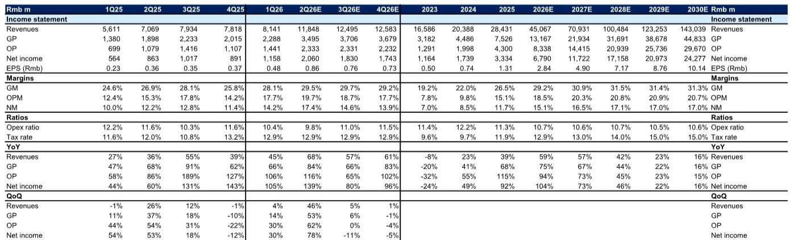
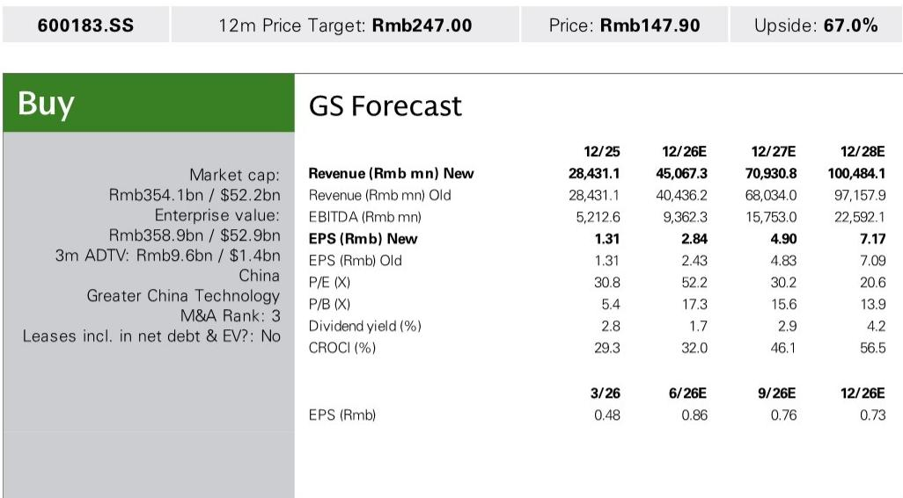
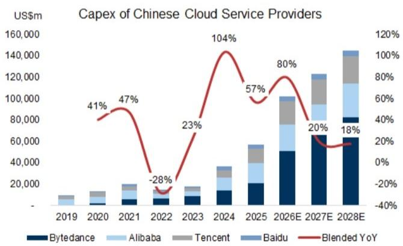

# 生益科技二季度业绩超预期：结构性的转折，而非周期性的回升

生益科技公布的2026年第二季度净利润中位数为20.4亿元人民币，较分析师的估计高出37%，较彭博一致预期高出44%。这一核心数据——同比增长136%，环比增长76%——本身已足够引人注目。但这一超预期表现的构成，传递了更具战略意义的信号：公司并非仅仅受益于印制电路板需求的广泛复苏，而是在有意识地转向人工智能基础设施供应链中价值最高的环节。在这些环节中，定价能力、销量增长和利润率扩张正在相互强化。

管理层将这一优异表现归因于两个具体引擎：高端覆铜板（CCL）出货量及平均销售价格的提升，以及子公司生益电子受AI数据中心终端需求驱动的强劲AI PCB出货量。这些并非泛泛的行业顺风，而是代表着公司收入结构的转变，其速度超过了市场的预期。分析师将2026-2028年的净利润预测分别上调了17%、1%和1%，这主要源于对2026年收入预测11%的上调，反映出对生益科技扩大其AI相关产品组合速度的重新评估。

这一时刻的战略重要性在于三股力量的交汇：全球云服务提供商资本支出的超级周期正在被上调（包括美国和中国的超大规模云服务商）；生益科技在原材料成本上升的同时展现出提价能力；以及其产能扩张计划与AI服务器基础设施的多年建设周期相契合。第二季度的超预期表现并非偶然，它是一个结构性盈利上调周期中第一个可见的数据点。

## 全球服务器市场总规模的上调创造了多年的需求背景，生益科技处于独特位置

分析师在6月下旬对全球服务器总可寻址市场的更新，是理解生益科技发展轨迹的最重要的外部变量。AI服务器隐含芯片出货量在2026至2028年分别被上调了14%、22%和14%。同期，美国云服务提供商的资本支出预估分别上调了8%、27%和25%。对于中国云服务提供商，调整幅度更为显著：分别为37%、44%和55%。这些数字并非微调，而是对AI基础设施建设时间表的结构性重新定价，尤其是在中国，其国内需求正独立于全球供应链动态而加速增长。

生益科技在这一需求激增中的定位并非被动。公司在AI级覆铜板领域占据领先地位，这种特殊层压材料是服务器主板和交换设备所需的高频、高可靠性PCB的关键材料。更重要的是，它与领先的AI PCB制造商保持着紧密的合作关系。这种双重角色——既是材料供应商，又是PCB产能的间接推动者——意味着生益科技在产业链的两个环节都能创造价值。当云服务提供商资本支出加速时，直接受益的是PCB组装链。但常被忽视的次级效应，是对先进CCL的拉动需求，而生益科技在这方面兼具规模和技术差异化优势。

分析师报告中的收入瀑布图清晰地展示了这种关系：AI CCL和AI PCB是到2030年的主要增长驱动力，公司总收入预计将从2025年的284亿元人民币增长至2030年的1430亿元人民币。这意味着五年复合年增长率约为38%。这样的增长轨迹不仅需要市场增长，还需要在AI细分市场中获取份额。生益科技的第二季度业绩表明，其获取份额的速度快于分析师先前模型的假设。

## 生益科技的提价并非防御性，而是产品差异化的战略信号

在CCL和PCB行业，读者普遍担心原材料成本上升会压缩利润率，迫使公司进入被动定价周期。生益科技第二季度的表现挑战了这一说法。公司在提高平均销售价格的同时，毛利率也呈现上升趋势，从2026年第一季度的28.1%上升到第二季度的预计29.5%。分析师对2026年全年毛利率的估计为29.2%，到2027年将升至30.9%，2028年升至31.5%。

这些利润率的改善并非仅来自成本控制，而是由产品组合向AI CCL的转变所驱动。AI CCL具有更高的单价和比标准CCL更好的毛利率。分析师明确指出，价格上涨正在抵消原材料成本的上升，这意味着生益科技拥有定价权。在一个客户是超大规模云服务商和一级PCB组装商（拥有显著议价能力）的行业中，持续的价格上涨表明生益科技的产品正成为AI服务器制造中不可替代的投入品。

预计运营费用率将略有上升，从2026年的10.7%升至2028年的10.7%，这主要是为了支持AI CCL和PCB规格升级而增加的研发支出。这是一个建设性的信号，表明公司正在投资下一代材料，而不仅仅是最大化当前产能。预计营业利润率将从2026年的18.5%扩大到2028年的20.8%，即使研发支出在增加。这种投资增加与利润率上升的组合，是一家正在扩展其竞争护城河、而非仅仅收割现有优势的公司的特征。

## 子公司生益电子正成为第二个增长引擎，而不仅仅是整合载体

PCB子公司生益电子在读者模型中常被视为次要贡献者。第二季度的数据表明，这种观点需要更新。管理层将子公司强劲的AI PCB出货量增长视为盈利超预期的直接驱动因素，分析师对2026年收入的修正也源于CCL和PCB业务贡献的增加。PCB板块并非仅仅吸收CCL的产出，它同样受益于推动母公司核心业务的同一波AI数据中心需求浪潮。

其战略意义在于，生益科技现在拥有两个不同但互补的引擎。CCL业务提供材料差异化和定价杠杆，PCB业务则提供垂直整合和直达终端客户的渠道。两者结合，创造了一个竞争对手难以复制的综合产品，因为很少有公司能同时具备生产先进CCL的技术能力和制造AI级PCB的规模。这种双重能力在中国市场尤其有价值，因为中国的云服务提供商正在扩大自己的AI基础设施，并更倾向于能同时提供材料和板级解决方案的供应商。

分析师的收入预测显示，PCB板块将贡献陡峭的增长：总收入从2026年到2028年翻了一番多，从450亿元人民币增至1000亿元人民币。即使考虑到远期年份的一些保守估计，这一轨迹也意味着生益电子在合并业务中的份额将显著增加。这种转变对估值有影响，因为PCB业务通常与纯材料供应商的估值倍数不同。分析师决定将2027年盈利的目标市盈率从45倍提高到50.4倍，正是反映了这种业务组合的演变。

## 读者的决策框架：论证成立需满足的三个条件

对于评估生益科技的读者而言，盈利超预期和上调的业绩指引提供了一个清晰的切入点，但这一论证取决于三个相互关联的因素。每个因素都可以通过可观察的数据点进行追踪，并且每个因素都有其特定的风险。

第一个条件是，全球云服务提供商的资本支出，尤其是在中国，必须继续以等于或高于分析师修正后的估计速度增长。2026年中国云服务提供商资本支出37%的上调已纳入收入模型。如果中国的超大规模云服务商因监管变化、出口管制或资本配置重点的转变而放缓其AI基础设施建设，生益科技的收入增长将会减速。风险并非二元的，但它是实质性的。读者应关注字节跳动、腾讯、阿里巴巴和百度的季度资本支出披露，将其作为最直接的领先指标。

第二个条件是，随着行业产能扩张，生益科技必须保持其在CCL领域的定价能力。分析师的模型假设毛利率到2028年稳步上升，这意味着价格上涨继续超过原材料成本通胀。如果竞争对手的CCL制造商增加产能并出现价格竞争，利润率扩张可能会停滞。这里的关键监测点是季度毛利率走势。如果毛利率在达到30%之前连续两个季度持平或下降，那么定价能力的假设就需要重新评估。

第三个条件是，生益电子必须在没有重大良率或质量问题的情况下扩大其AI PCB产能。子公司的增长是收入修正的关键贡献者，任何产能爬坡都伴随着执行风险。分析师的报告并未指出这方面的特定风险，但PCB行业的历史上不乏因良率挑战而导致产能增加未能实现预期利润率的例子。读者应追踪子公司的分部利润披露，这将揭示PCB业务是在盈利地扩张，还是仅仅以微薄利润率增加收入。

如果这三个条件都成立，那么论证是可行的。如果任何一个条件减弱，嵌入在50.4倍目标市盈率中的估值倍数扩张将首先受到压缩。第二季度的超预期表现为论证提供了有力的数据点，但接下来的两个季度将是决定性的，以确认这一转折是结构性的还是暂时性的。

*仅供参考。部分内容可能基于源材料通过AI辅助生成、翻译、总结或编辑，可能存在遗漏或错误。请独立核实。这不构成专业建议。*

仅供参考。部分内容可能基于源材料通过AI辅助生成、翻译、总结或编辑，可能存在遗漏或错误。请独立核实。这不构成专业建议。

