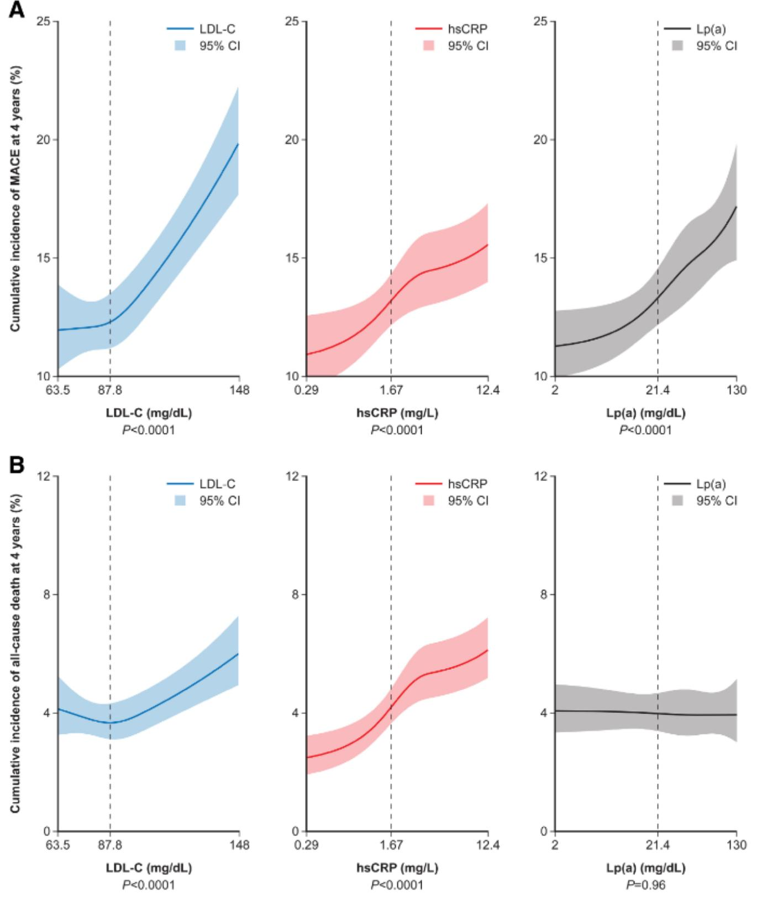
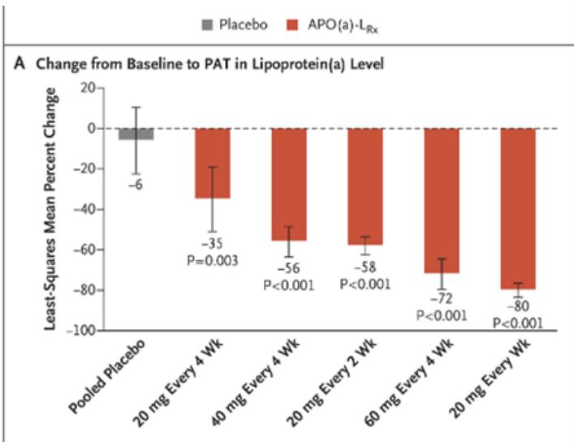
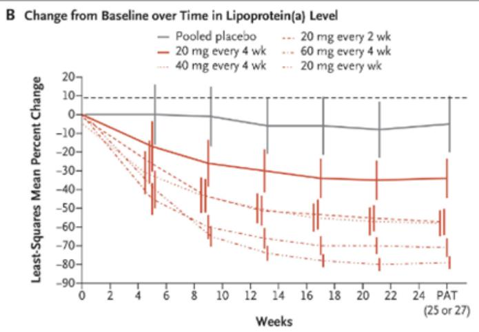
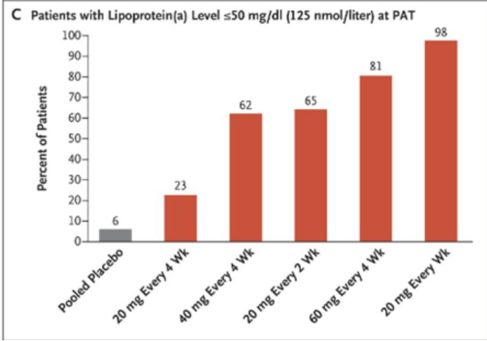
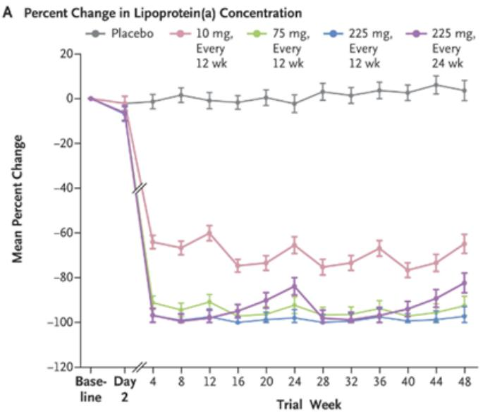
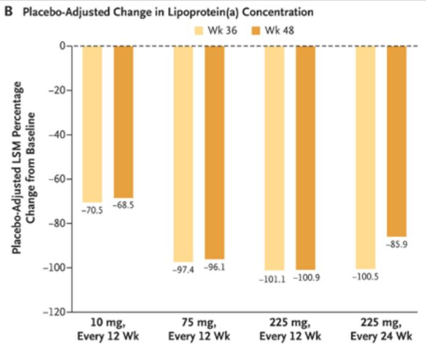

# GLOBAL HEALTHCARE

## The Cardiology Renaissance: Lp(a): Mid-year data to read through to a new cardiovascular drug class

The next highly-watched cardiovascular (CV) events likely this quarter are Phase 3 outcome results from NVS/IONS' HORIZON study of Lp(a)-targeting antisense oligonucleotide pelacarsen, alongside NVO's ZEUS study of ziltivekimab (anti-IL-6). Lp(a) is an independent risk factor for atherosclerotic cardiovascular disease (ASCVD) that impacts approximately 1.4 billion people globally (up to 20% of the population), where first Phase 3 data from HORIZON could validate the translation of Lp(a) lowering to CV outcomes, thus reading through to AMGN's siRNA olpasiran (Phase 3 data in 2027/28) and LLY, among others. Within, we frame the key debates, notably: (1) the amount of Lp(a) lowering needed and whether greater reduction drives superior CV outcomes, which would benefit AMGN; (2) the lack of benefit on high-sensitivity C-reactive protein, an inflammatory marker; and (3) AMGN's and NVS' trial design and baseline characteristics, particularly the isolation of Lp(a) via the optimal treatment of other risk factors (e.g., LDL-C), which is logical from a regulatory/payor perspective but likely impacting event rates, leading to delays. Investor expectations are low given the aforementioned delays, Lp(a) as an unproven target, and NVS' commentary - per our statistical analysis, significance would be achievable in HORIZON's overall population and the high-risk subgroup on a 12% and 14% risk reduction, respectively. Nonetheless, we believe a trend in efficacy would provide positive readthrough for the field, and if HORIZON is successful, we expect commercial uptake to remain debated in the context of Lp(a) testing rates/payor dynamics, noting the emerging longer-acting or oral options (e.g., AMGN, LLY, among others).

### Laying out the Lp(a) landscape into key 2H26+ data

Lp(a) is an independent genetic risk factor for cardiovascular disease; First Phase 3 outcomes data in mid-26

We see Lp(a)-targeting drugs as potentially transformative in cardiovascular disease. Elevated Lp(a) is an independent, genetic risk factor for atherosclerotic cardiovascular disease (ASCVD) that impacts approximately 1.4 billion people globally (up to 20% of the population), and is tested via a routine blood draw. Literature suggests that the three key roles of Lp(a) in progression of the atherosclerotic process include its proatherogenic (deposition of Lp(a) in arterial walls), prothrombotic (competes with plasminogen for binding sites of the endothelium and fibrin, interfering with clot dissolution), and pro-inflammatory effects (activating immune cells, leading to the release of inflammatory cytokines such as IL-6 and TNFα) - the oxidised phospholipids carried by Lp(a) are further thought to contribute to vascular injury and inflammation. Lp(a) ≥70mg/dL is a threshold for significantly elevated adverse event risk, per prior studies, and the Lp(a) normal range is <30mg/dL.

Into data releases in 2H26+, including Ph3 cardiovascular outcomes trials of Lp(a)-lowering agents, starting with NVS/IONS' pelacarsen and AMGN's olpasiran, we frame several key debates:

- The translation of Lp(a) lowering to cardiovascular risk reduction, which appears to be 50mg/dL in the secondary prevention setting, that both pelacarsen and olpasiran are able to achieve per prior data;
- Whether more potent Lp(a) reduction will translate to improved CV outcomes. Higher Lp(a) appears to be reflective of higher CV risk, which could suggest that, like LDL-C, greater lowering could lead to improved CV outcomes. However, it is not yet well-understood whether the benefit could flatten when below a certain threshold. Therefore, we will assess whether olpasiran's higher magnitude of lowering vs. pelacarsen is an advantage;
- The lack of impact of Lp(a)-targeting drugs on high-sensitivity C-reactive protein (hs-CRP), a marker of inflammation used to assess CV risk, in the context of the minimal impact and failures seen from the cholesteryl ester transfer protein (CETP) class. However, in our view, while not lowering hs-CRP, the CETP class also did not lower LDL-C, which is a known marker of atherosclerotic CV risk. On the other hand, the PCSK9 antibodies do not lower hs-CRP, but do lower LDL-C (and Lp(a) but not to the magnitude of targeted therapies), and lead to CV benefits. Further, some studies have indicated that high Lp(a) is not well correlated with high CRP, potentially suggesting that although Lp(a) may increase vessel wall inflammation it is not well reflected in CRP measures. Overall, Lp(a) could impact inflammatory pathways, albeit where the measurement is limited, and/or there could be some protection through removing the pro-atherosclerotic properties of Lp(a) - which was seen with the PCSK9s.
- Aspects of AMGN and NVS' trial design, especially the optimized treatment for other CV risk factors to isolate the impact of Lp(a). We see this as logical from a regulatory/payor perspective, but note that it may have impacted event rates, resulting in the delays - especially given the differences in the enrolled population vs. other cardiovascular studies that the companies may have based their assumptions on, and that Lp(a) appears to have a synergistic effect with other markers (LDL-C, hs-CRP) regarding CV risk;
- Baseline characteristics. We note that, unlike AMGN's study, NVS is testing its primary endpoint in the overall population (Lp(a) ≥70mg/dL) and the high-risk subgroup (Lp(a)≥90mg/dL), which are powered for different hazard ratios, albeit note NVS has a high median baseline Lp(a) of approximately 100mg/dL with almost all (approximately 80%) of the patients in the elevated risk subgroup.

### Upcoming Ph3 data releases to demonstrate the translation from Lp(a) reduction to cardiovascular outcomes

Regarding the translation of Lp(a) lowering to meaningful cardiovascular risk reduction, e.g., 20%, several studies have used Mendelian randomization or trial data to estimate the extent of absolute Lp(a) lowering needed to achieve a relative risk reduction (20%) similar to a reduction of LDL-C by 38.67mg/dL. From the literature, we note a wide range of required Lp(a) reduction spanning 65-101.5mg/dL in the primary prevention setting and 32-50mg/dL in the secondary prevention setting (Exhibit 1) - note that the Lp(a) Ph3 trials enroll a population with a history of ASCVD, and are thus considered the secondary prevention setting. That said, the Lp(a) lowering needed for such a risk reduction depends on the baseline level, which varied across these studies.

**Exhibit 1: Estimated Lp(a) lowering needed to achieve a 20% risk reduction based on LDL-C reduction**

| Study | Year published | Study design | N | Setting | Estimated Lp(a) reduction (mg/dL) |
|-------|---------------|-------------|---|---------|----------------------------------|
| Lamina et al. | 2019 | Mendelian randomization | 62,114 | Primary prevention | 65.7 |
| Burgess et al. | 2018 | Mendelian randomization | 48,333 | Primary prevention | 101.5 |
| Parish et al. | 2018 | Clinical trial | 3,978 | Secondary prevention | 32.0 |
| Szarek et al. | 2020 | Clinical trial | 18,924 | Secondary prevention | 40.0 |
| Madsen et al. | 2019 | Population study | 58,527 | Secondary Prevention | 50.0 |

Source: JACC Focus Seminar 2/4

As noted above, the Lp(a) normal range is <30mg/dL, and it is unclear whether lowering Lp(a) past this threshold will drive incremental benefit. Therefore, one focus of Lp(a) interventional studies is whether patients' Lp(a) can be brought from the high-risk range into the normal range, rather than the absolute Lp(a) reduction (e.g., 80% reduction from 50mg/dL to 10mg/dL may not drive more a clinically meaningful/significant risk reduction than a 60% reduction from 70mg/dL to 28mg/dL). Because of the higher CV risk associated with high Lp(a), it is likely that the efficacy benefit will be greatest in patients with high baseline levels. We also note there is some epidemiological evidence that very low Lp(a) levels are associated with the risk of diabetes, though it is unclear whether this is causal.

Further, there has been a debate on the lack of impact of Lp(a)-targeting drugs (pelacarsen and olpasiran) on high-sensitivity C-reactive protein (hs-CRP) in the context of the minimal impact seen from cholesteryl ester transfer protein (CETP) inhibitors, where four inhibitors have failed Ph3 efforts. Hs-CRP is a marker of inflammation and is used to assess CV risk, where elevated levels (3mg/L+) are considered a predictor of heart disease and stroke risk, particularly in patients that appear otherwise healthy, e.g., with normal cholesterol. However, there have been studies indicating that higher Lp(a) was associated with increased MACE risk across both high and low baseline hs-CRP values - though we note that people with both elevated Lp(a) and hs-CRP may have a higher risk of CV death/MACE than those with only one elevated marker. We note that in the Ph2 OCEAN(a)-DOSE trial, olpasiran did not significantly impact hs-CRP or hs-IL-6, although the study authors caveated that reliance on circulating markers of inflammation could potentially miss an anti-inflammatory signal.

However, with respect to CETP therapies in development, while hs-CRP has not reduced, we believe that another key reason why the trials may not have been successful is that while they may have achieved the on target effect of an increase in HDL-C, the absolute values of LDL-C did not decrease, suggesting these therapies did not act through inflammatory or atherosclerotic pathways. A post-hoc analysis of the placebo arm in REGN/Sanofi's ODYSSEY OUTCOMES study of PCSK9 antibody Praluent highlighted that LDL-C, Lp(a) and hs-CRP are independently predictive of CV risk (see here). However, while higher Lp(a) was associated with higher risk of MACE events, there was no benefit on all-cause mortality and CV death, although the lack of association was unexplained.

**Exhibit 2: Analysis of the placebo arm in ODYSSEY OUTCOMES highlights that LDL-C, hsCRP and Lp(a) are independent risk factors for MACE, but Lp(a) appeared to show limited correlation with all cause and CV death**

A

Source: https://www.ahajournals.org/doi/10.1161/CIRCULATIONAHA.124.071269

Mechanistically, recall that proinflammatory effects is one of the three potential mechanisms where Lp(a) can impact CV risk - therefore, it is possible that the other pathways (pro-atherogenic, prothrombotic) are the more significant drivers of risk and efficacy. The potential for non-inflammatory pathways to independently impact CV risk is supported by read across from the PCSK9 class, which did also do not reduce hsCRP (as noted here) but did show a CV benefit through lowering LDL-C. For ODYSSEY OUTCOMES, in the Praluent arm, a sub-group analysis based on Lp(a) stratification, but with both arms had similar LDL-C lowering, patients with higher Lp(a) at baseline (84mg/dL vs. 11mg/dL - subgroup categories were ≥50mg/dL vs. <50mg/dL), that also saw a reduction of -14mg/dL (vs. -3mg/dL), saw a greater reduction in MACE events. In the analysis, patients with high Lp(a) demonstrated an HR of 0.80 which became statistically significant after 1.25 years, while those with low Lp(a) at baseline, the HR was 0.90 which became statistically significant after 2.45 years. This highlights potential synergy between Lp(a) and LDL-C lowering, and is also suggestive that a approximately 28mg/dL reduction in Lp(a) could lead to a reduction in CV risk of 20%, which is slightly lower than suggested in Exhibit 1.

**Exhibit 3: Post-Hoc analysis of the Praluent (alirocumab) arm in ODYSSEY OUTCOMES split by Lp(a) at baseline**

Source: https://academic.oup.com/eurheartj/article/46/Supplement\_1/ehaf784.2068/8308256
Baseline Lp(a) <50 mg/dL
N=13,215, 1828 events

As discussed below, in the HORIZON Ph3 trial, patients LDL-C is stabilized, in order to isolate the benefit from Lp(a) lowering. The ODYSSEY OUTCOMES post-hoc analysis is suggestive that greater absolute Lp(a) lowering could lead to greater and earlier cardio-protection, however, what is unclear is that is this a synergistic impact with additional LDL-C lowering. In HORIZON, median LDL-C at baseline was 65.7mg/dL (in the normal range), and only approximately 11% of patients were on PCSK9 mAbs at baseline, which could somewhat limit the read across, however, the baseline Lp(a) is much higher than in ODYSSEY OUTCOMES at 108.2mg/dL and so greater lowering from a higher baseline could convey greater benefit. Overall, while there appears to be a lack of an inflammation response from the Lp(a) therapies in development, we are optimistic that the potential benefit derived by reducing the pro-atherosclerotic activity of Lp(a) could lead to CV benefits in HORIZON.

Further, some studies indicated that high Lp(a) is not well correlated with high CRP, potentially suggesting that although Lp(a) may increase vessel wall inflammation it is not well reflected in CRP measures. For instance, the Lp(a) increases in vessel wall inflammation may be a localized effect not enough to increase systemic CRP effects where CRP is largely produced by the liver.

### Ph3 trials that read out in 2H26+ look to confirm the Lp(a) hypothesis

While multiple studies have outlined the association between elevated Lp(a) and cardiovascular risk, there has not yet been placebo-controlled data from a large Ph3 study confirming that lowering Lp(a) will impact cardiovascular outcomes. Thus, we look to data from NVS/IONS' HORIZON study, the first large-scale pivotal study to evaluate the effect of lowering Lp(a) on cardiovascular risk reduction. If positive, we expect a de-risking of the approach for competitors, with AMGN's Ph3 data to follow also potentially in 2027/28+. Longer term, assuming success on cardiovascular outcomes studies, cardiologists we have spoken with could envision Lp(a) reduction as a potentially approvable marker for drug development, akin to lowering LDL-C to support approval for PCSK9-targeting drugs. That said, they caveated the uncertainty around access/reimbursement with such an approach.

**Exhibit 4: Comparison of Ph2 data for late-stage Lp(a)-targeting assets**

| TICK | AMGN | NVS/IONS | LLY | LLY |
|------|------|----------|-----|-----|
| Asset | Olpasiran | Pelacarsen | Lepodisiran | Muvalaplin |
| Mechanism | Lp(a)-targeting siRNA | Antisense oligonucleotide | Lp(a)-targeting siRNA | Small molecule blocking apo(a)-apo B100 interaction |
| Formulation | SC | SC | SC | Oral |
| Baseline Lp(a) levels in Ph2 | 260.3 nmol/L | 204.5-246.6 nmol/L | 253.9 nmol/L | 216.8 nmol/L |
| Timepoint for primary analysis | Week 36 | Week 25/27 | Week 24 | Week 12 |
| Dosing | 225mg Q12W | 20mg QW (proxy for 80mg Q4W) | 16mg Q24W, 96mg Q24W, 400mg Q24W | 10mg QD, 60mg QD, 240mg QD |
| Number of patients | 56 | 48 | 71, 71, 142 | 34, 63, 68 |
| Pbo-adjusted mean % decrease in Lp(a) levels | 104.7% | 74.0% | 40.80%, 75.2%, 93.9% | 47.6%, 81.7%, 85.8% |
| TRAEs (%) | 29.0% | 88.0% | 3.0%, 12.0%, 14.0% | 5.9%, 14.3%, 14.7% |
| AEs leading to discontinuations | 2.0% | 12.0% | 0.0%, 0.0%, 0.0% | 0.0%, 0.0%, 8.8% |

Source: Company data

### NVS' Ph3 data in 2H26 to be the first outcomes data testing the Lp(a) hypothesis

NVS is conducting the Ph3 HORIZON trial of 80mg monthly subcutaneous antisense oligonucleotide (ASO) pelacarsen, partnered with IONS, vs. placebo, the first large-scale (n=8,323) pivotal study to evaluate the effect of lowering Lp(a) on cardiovascular risk reduction (on expanded MACE; cardiovascular death, non-fatal myocardial Infarction (MI), non-fatal stroke and urgent coronary re-vascularization requiring hospitalization) – thus representing a key catalyst for the field with regard to the validity of the Lp(a) hypothesis. Into the Ph3 data around mid-year, we are monitoring: (1) the translation of pelacarsen's Lp(a) lowering effect to cardiovascular outcomes; and (2) the readthrough to the competitive landscape, including AMGN's olpasiran with Ph3 data potentially in 2027/28.

We note HORIZON has co-primary endpoints assessing MACE in patients with Lp(a) at baseline of ≥70mg/dL (the overall population) as well as in a subpopulation of patients with Lp(a) ≥90mg/dL. The study will be successful if the primary endpoint is met for either or both populations.

Prior studies of pelacarsen showed dose-dependent decreases in Lp(a) levels of 35% at 20mg Q4W, 56% at 40mg Q4W, 58% at 20mg Q2W, 72% at 60mg Q4W, and 80% at 20mg QW (a proxy for the Ph3 dose of 80mg monthly; 98% of patients landed below the high-risk threshold of 50mg/dL for increased CVD risk), vs. 6% with placebo (p values ranged from 0.003 to <0.001; at week 25/27). We note a benign safety profile - there were no significant differences vs. placebo with respect to platelet counts, liver and renal measures, or influenza-like symptoms (the most common adverse events were injection-site reactions).

However, in a Ph2 study, the mean changes in hs-CRP level were similar between the placebo and the active groups at six months: -0.9±4.2mg/L for 20mg Q4W, -0.7±4.2mg/L for 40mg Q4W, -0.3±2.8mg/L in 20mg Q2W, -0.5±2.2mg/L in 60mg Q4W, and -0.1±6.3mg/L in 20mg QW, vs. -0.8±5.2mg/L in the pooled placebo group.

**Exhibit 5: Ph2 data for pelacarsen**

Source: company data

Regarding NVS' Ph3 trial, we note:

- HORIZON is an event-driven trial that will continue until 993 unique primary endpoint events have occurred and all patients have been followed for at least 2.5 years. The required number of events provide ≥90% power to detect a hazard ratio (HR) of approximately 0.80 for the primary endpoint in the full population or HR=0.75 in the subpopulation.

- Per the published baseline characteristics:
  - Most (78.6%) patients have Lp(a) ≥90mg/dL, where the median is 108.2mg/dL (range of 86.60-137.80), thus minimizing the difference between the ≥70mg/dL overall population and ≥90mg/dL subpopulation.
  - We see the high baseline Lp(a) as a positive for NVS/IONS regarding events in the placebo arm as well as the potential to reduce the treated arm's Lp(a) from approximately 100mg/dL to <30mg/dL (assuming consistency with the approximately 80% reduction from prior studies), thus lowering patients to the normal range and meeting the aforementioned 50-80mg/dL reduction criteria.
    - Recall, the 50-80mg/dL lowering comes from Mendelian randomization studies, notably those referenced in Exhibit 1, where an Lp(a) reduction of 65-80mg/dL may be required to achieve at least a 20% relative CV event reduction in the primary prevention setting but it is possible that only a 50mg/dL reduction in Lp(a) may be needed for a similar relative CV event reduction in the secondary prevention setting such as the one studied in HORIZON.
  - Further, as most patients will have Lp(a) ≥90mg/dL, we do not see the 0.75 HR for this population as a higher bar as the study will also be positive if the overall population hits HR=0.80.

To investigate the MACE risk independently caused by elevated Lp(a), the study was designed to control for CV risks other than Lp(a). Specifically, all CV risk factors, including hypertension, diabetes and hyperlipidemia, had to be optimally treated according to local practice guidelines before enrollment. For those patients not optimized at screening, adjustment of background therapies was accomplished through the "CV Risk therapy optimization visits" prior to randomization. This included that patients treated with PCSK9 inhibitors must have a stable dose for at least 12 weeks prior to randomization.

- This resulted in a median baseline LDL-C of the patients was 65.7mg/dL. However, IONS has noted the assumptions for the trial design were based on LDL-C levels ≥90mg/dL, per the FOURIER trial of PCSK9i Repatha where the median baseline LDL-C level was 92mg/dL.
- While controlling for LDL-C may help the regulatory review if the trial is successful (as it isolates the impact of pelacarsen), we see the risk that the lower LDL-C baseline than anticipated resulted in overestimation of the CV event risk in the placebo group, thus impacting the timing/magnitude of separation. Specifically, this could have contributed to the study topline data being pushed from 2025 to 2026, among other factors.
- Further, there have been studies indicating that Lp(a) level is associated with CV risk independently of LDL-C level, but the greatest risk was observed with the highest levels of both Lp(a) and LDL-C. In fact, the benefit of PCSK9i, which lower LDL-C, appears to be augmented in those with elevated Lp(a) level. While LDL-C reduction appears to not be sufficient to fully offset Lp(a)-mediated risk, the two seem to have an additive effect - therefore, we see uncertainty around how much benefit Lp(a) lowering alone can provide within the duration of the study without high LDL-C.
- We also note laboratory measures of LDL-C include both true LDL-C plus Lp(a) cholesterol (Lp(a)-C), the latter of which may constitute a significant proportion (corrected LDL-C is 13-16 mg/dL lower than laboratory-reported LDL-C, per one study) of reported LDL-C for elevated Lp(a) patients (thus the actual LDL-C of the enrolled patients is likely lower than 65.7mg/dL) but is not responsive to statins. Pelacarsen has showed a dose-dependent relationship for lowering both Lp(a)-C and Lp(a), with approximately 67% and approximately 80% reductions at the 80mg monthly equivalent dose.

The design uses a 4.6% annual event rate for the placebo group and a cumulative censoring rate of 10% for primary endpoint events due to loss to follow-up or noncardiovascular death.

- Two interims were planned after approximately 546 and 745 patients experienced an event (55% and 75% of total events). An alpha of 0.0001 was allocated to the first interim and 0.0004 to the second, leaving a one-sided alpha of 0.0245 for the final analysis. Per IONS, only the Data Safety Monitoring Board have viewed the interim results, and recommended that the study continue, while NVS is tracking blinded event rates.

Our analysis of the trial statistics suggests that the ≥70mg/dL could hit significance with a 12% benefit and in the ≥90mg/dL significance could be hit with a 14% benefit. We believe that a benefit of at least a 15% relative risk reduction would be seen as clinically meaningful in the context of CV risk reduction. While there are limited therapies for this population, with other therapies behind pelacarsen with greater Lp(a) reduction potential, we believe a benefit of <15% in the lower risk group and <20% in the high risk group, could be seen as disappointing by the market. However, we also note that at the current multiple (approximately 16x vs. sector approximately 14x 2027 EPS) we believe this already largely reflects success for all three upcoming key read outs, suggesting that there could be greater downside, particularly if all three catalysts are not perfect, in our view.

Per the terms of the license agreement with NVS, IONS is entitled to receive tiered royalties in the mid-teens to low 20% range on net sales of pelacarsen as well as $650mn in development, regulatory and commercial milestones. For pelacarsen, we model for $2bn peak sales at a 60% PoS in our NVS model. From a commercial standpoint, a key area of debate centers around uptake, specifically in relation to Lp(a) testing rates, noting levels being relatively low in the US as recent epidemiology data suggests the rate being approximately 14%. However, NVS expects the potential entry of pelacarsen, and the education of physician/patient population to support wider testing and treatment adoption, with the company's initial focus being on high-risk patients before broadening more widely. Therefore, while pelacarsen could be first to market, we only forecast approximately $2bn non-risk adjusted peak sales, which reflects competitors in the field with longer-acting and oral options in the pipeline, with NVS also investigating long acting/combination options (DII235), that could move to Ph3 if proof-of-concept is achieved with pelacarsen in HORIZON.

### AMGN's olpasiran is more potent than pelacarsen, but trial design bears monitoring

AMGN (licensed from ARWR)'s olpasiran, an Lp(a)-targeting siRNA dosed quarterly, is likely more potent on Lp(a) reduction vs. pelacarsen. In prior studies, olpasiran treatment resulted in placebo-adjusted changes of -70.5% with the 10mg dose, -97.4% at 75mg, -101.1% at 225mg Q12W, and -100.5% at 225mg Q24W. However, whether more potent reduction drives incremental benefit may depend on the baseline Lp(a) level.

We note that in the Ph2 OCEAN(a)-DOSE trial, olpasiran did not significantly impact hs-CRP or hs-IL-6. The study authors caveated that reliance on circulating markers of inflammation could potentially miss an anti-inflammatory signal vs a cell-based approach assessing multiple transcriptional pathways involved in inflammation and vascular function or vascular imaging measures of localized inflammation, and that the baseline concentrations of hs-IL-6 and hs-CRP could have been too low in the studied population to detect a systemic effect.

**Exhibit 6: Ph2 data from olpasiran**

Source: company data

We look to data potentially in 2027/28 from the Ph3 OCEAN(a)-Outcomes trial, which enrolled 7,297 patients, approximately 1,000 fewer than HORIZON. We note:

- The Ph3 study is enrolling individuals with an Lp(a) level > 200nmol/L (approximately 80mg/dL), with a primary endpoint of 3-point MACE. Per the study design, subjects should be on optimized lipid-lowering therapy consistent with regional/local clinical practice guidelines according to investigator's judgment prior to screening Lp(a).
- Patients must have a history of ASCVD as evidenced by history of either myocardial infarction and/or coronary revascularization with percutaneous coronary intervention and at least one additional risk factor. Meanwhile, NVS required patients have myocardial infarction and ischemic stroke within 10 years prior to screening. Without this criteria for timing of events, AMGN may allow lower-risk patients to be enrolled.
- The primary endpoint is time to coronary heart disease (CHD) death, myocardial infarction, or urgent coronary revascularization, whichever occurs first, of the treated vs. placebo groups over a approximately four year duration. Unlike NVS, AMGN's endpoint does not include stroke. Per AMGN, elevated Lp(a) does not increase the risk of stroke to the same degree as it increases the risk of other CV events. Thus, if stroke is modifiable with Lp(a) reduction, AMGN will capture fewer events.
  - Further, in our discussions with CRSP management, they noted that high Lp(a) is a risk factor for cerebrovascular disease, and Lp(a) reduction could cause a benefit in large vessel strokes that are due to atherosclerosis. However, other types/causes of strokes, such as cardio-embolic strokes and small vessel disease, are prevalent but likely not impacted by Lp(a) reduction. Therefore, it may be difficult to see a stroke efficacy signal in Lp(a) trials, if they are not enriched for the atherosclerotic population.

Overall, we believe that if AMGN enrolled a population with significantly high Lp(a), e.g., above the approximately 100mg/dL median in NVS' trial, olpasiran may be able to show differentiation in terms of potently lowering Lp(a) towards the normal range for the treated patients and a higher event rate in the placebo group, thus resulting in greater separation.

### NVS' and AMGN's data to provide readthrough to earlier Lp(a) drugs in development

We anticipate that the aforementioned Ph3 data will be closely watched for readthrough to other Lp(a)-targeting drugs in development, particularly in terms of the event rates and association of Lp(a) reduction with outcomes. Programs we are monitoring include:

- **LLY.** LLY has two programs in development, siRNA lepodisiran, with estimated primary completion in March 2029 for the Ph3 ACCLAIM-Lp(a) study, and daily oral pill muvalaplin, with estimated primary completion in March 2031 for the Ph3 MOVE-Lp(a) trial. We do not model these assets separately in our LLY model, rather recognize in the Other Ph II/III bucket.
- **NAMS.** While the impact to NAMS is nuanced, we see potential for upside convexity to NAMS shares on a positive pelacarsen outcome in Novartis' HORIZON, given the Lp(a) lowering effect seen with NAMS obicetrapib. NAMS has previously presented pooled Ph3 data across three obicetrapib trials showing a median pbo-adjusted reduction of Lp(a) of up to 45% over 12 weeks (link) which has shown to be greater than that of PCSK9 agents (15-30%; link), however not as robust as focused Lp(a) lowering agents (80-95%; link). A positive result from Novartis' HORIZON trial would be viewed as further validation of obicetrapib's Lp(a) lowering causality as residual risk reduction on top of LDL-lowering. This would hence be supportive of NAMS management's hypothesis of obicetrapib's multi-mechanism benefits and serve to partially de-risk the company's critical PREVAIL CVOT trial (interim analysis expected near YE 2026, with readout early 2027) — in a company analysis interrogating the 21% MACE benefit seen in the Ph3 BROADWAY trial, NAMS estimated that obicetrapib's Lp(a) reduction potentially provides approximately 5% of that MACE reduction. NAMS believes that a negative HORIZON outcome would not significantly impact obicetrapib's prospects, as the residual contribution from LDL particles, diabetes-related effects, and other factors would likely be larger than estimated. In our DCF, holding all else constant and flexing the probability of success for obicetrapib up/down by 5% (we currently assume 75% in our model) yields approximately +/- 7% change to our DCF valuation. Illustratively, in a negative HORIZON outcome adjusting our model POS down 5% implies -7% to our DCF valuation, in a positive outcome adjusting our model POS up 10% implies +14% to our DCF valuation, and in a mixed outcome our model would likely be unchanged or marginally adjusted dependent on the details.
- **CRSP.** CRSP is developing an in vivo gene editing asset, CTX321, designed to provide a one-time durable reduction in Lp(a). CTX321 is currently in IND/CTA-enabling studies, and incorporates an optimized guide RNA that delivered approximately two-fold greater potency in preclinical models over first-generation asset CTX320. We model for non-risk-adjusted global peak sales of $1.3bn in 2040.
- **MRK/Hengrui.** MRK licensed HRS-5346, an investigational oral small molecule Lp(a) inhibitor currently in Ph2 studies in China. We do not include this asset in our MRK model.
- **RPRX:** RPRX is entitled to an upward tiered mid-single-digit royalty from NVS's pelacarsen, as well as a low-double digit tiered royalty for AMGN/ARWR's olpasiran through 2041. We model a peak royalty of $73mn for pelacarsen and approximately $440mn for olpasiran.
- **SLN.** SLN's siRNA zerlasiran that targets Lp(a) has reported Ph2 data, albeit the company continues to seek out a partnership before initiating a Ph3 CVOT trial. We model zerlasiran achieving approximately $897mn worldwide non-risk-adjusted peak sales in 2042.

### Valuation and risks

**NOVN (S).** Our 12-month target prices are derived from a 50:50 blend of DCF and P/E. We are Sell rated on Novartis. Our 12-month price targets are derived from a 50:50 blend of DCF and P/E. Our bottom-up DCF analysis suggests a valuation of CHF 114 per share (WACC 7.1%, TGR 1%). On a multiples basis, we believe Novartis should trade on 14x 2027E EPS, giving a valuation of CHF 107 per share. As a result, our 12-month price targets are CHF 111/$140 per ADR, which is approximately 13% downside to current levels. Key upside risks include: (i) ongoing positive earnings momentum; (ii) stronger-than-anticipated sales from key franchises; (iii) unforeseen/unexpected pipeline success; and (iv) capital allocation priorities, incl. BD and share buybacks.

**IONS (Neutral):** Valuation: Our 12-month price target of $68 is based on our DCF analysis assuming an unchanged 13% WACC, 3% terminal growth rate, and risk adjusted DCF. Key risks: Upside risks: Clinical trial success with pipeline programs, regulatory approvals, better-than-expected product sales, new collaboration agreements could provide upside to our revenue and EPS estimates. Commercial risk - higher
