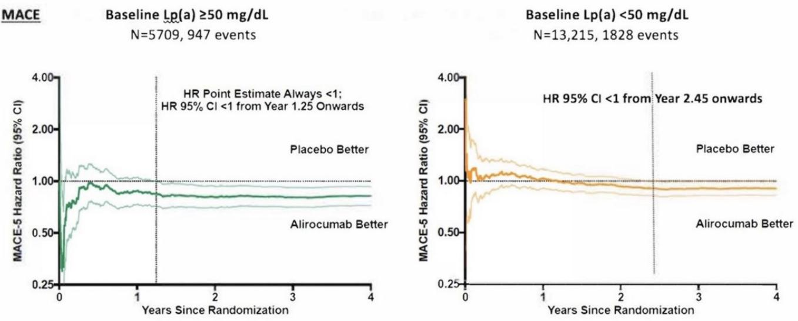
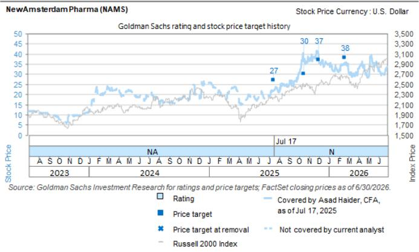

# GS：心脏病学复兴-Lp(a)年中数据解读新心血管药物类别

心血管领域下一个最受关注的临床数据，很可能在今年年中出现。诺华与Ionis合作的pelacarsen三期HORIZON研究，以及诺和诺德的ziltivekimab三期ZEUS研究，都将读出主要终点。对全球约14亿Lp(a)水平升高的人群而言，这可能是首个证明“降低Lp(a)能减少心血管事件”的大规模随机对照证据。

Lp(a)是一种独立于LDL-C的遗传性心血管不确定性因子，约20%的人口携带这一不确定性。过去几十年，医学界知道它与动脉粥样硬化相关，但始终缺乏干预手段——直到反义寡核苷酸和siRNA技术的出现。GS这份报告的核心判断是：如果HORIZON数据积极，整个Lp(a)药物赛道将被“去不确定性化”，安进、礼来等后来者的资产估值逻辑也将随之改变。

市场目前的预期并不高。试验多次延期、靶点未经临床验证、诺华自身也未曾给出强烈信号，这些因素让读者普遍持观望态度。GS的统计分析显示，HORIZON在整体人群和高不确定性亚组中分别实现12%和14%的不确定性降低即可达到统计学显著性——这个门槛并不算高。

## 1. 降低多少Lp(a)才够，是当前最核心的争论

从孟德尔随机化研究和临床试验数据来看，在二级预防人群中，将Lp(a)降低约32-50 mg/dL，就能实现与降低LDL-C 38.67 mg/dL相当的20%相对不确定性下降。Pelacarsen和olpasiran在二期数据中都已证明能达到这一降幅。

但问题在于：更大幅度的降低是否带来更好的临床获益？GS认为，如果像LDL-C一样，Lp(a)的降低幅度与心血管获益呈线性关系，那么安进的olpasiran（降幅约105%）将比诺华的pelacarsen（约74%）更具优势。但这一假设尚未被验证——流行病学证据甚至提示，极低的Lp(a)水平可能与糖尿病不确定性相关，尽管因果关系尚不明确。

另一个关键变量是基线水平。高Lp(a)本身就意味着高不确定性，因此从高基线水平降低同样幅度，理论上获益更大。HORIZON入组患者的基线中位Lp(a)约为100 mg/dL，其中约80%处于高不确定性亚组（≥90 mg/dL），这为检验“基线越高、获益越大”的假设提供了条件。

> **KC评论：** 这里有一个容易被忽略的细节——Lp(a)的正常范围是<30 mg/dL，而高不确定性阈值是≥70 mg/dL。这意味着，对于基线70 mg/dL的患者，将其降至30 mg/dL以下可能比相对降幅更重要。不同药物的比较不能只看百分比，还要看患者基线分布。

## 2. 不降炎症标志物，不代表没有心血管获益

Lp(a)被认为通过三条途径致病：促动脉粥样硬化、促血栓形成和促炎症。但现有数据显示，pelacarsen和olpasiran均未显著降低高敏C反应蛋白（hs-CRP）——一个经典的系统性炎症标志物。这引发了市场对Lp(a)药物抗炎作用不足的担忧。

GS认为，这一担忧可能被过度放大。PCSK9抑制剂同样不降低hs-CRP，但通过降低LDL-C实现了明确的心血管获益。ODYSSEY OUTCOMES研究的亚组分析显示，基线Lp(a)≥50 mg/dL的患者在接受PCSK9抗体治疗后，MACE事件不确定性降低20%，且获益出现时间更早（1.25年 vs. 2.45年）。这说明Lp(a)降低与LDL-C降低可能存在协同效应，而非必须通过炎症通路。

此外，一些研究提示，高Lp(a)与高CRP的相关性并不强。Lp(a)引起的血管壁炎症可能是局部效应，不足以反映在肝脏产生的系统性CRP指标上。因此，hs-CRP不降，并不等于Lp(a)药物无效。

## 3. HORIZON的试验设计本身就是一个信号

HORIZON入组了8323例患者，采用共主要终点设计：分别在整体人群（Lp(a)≥70 mg/dL）和高不确定性亚组（≥90 mg/dL）中评估MACE事件。这一设计在监管和支付方看来是合理的——它试图通过优化其他不确定性因素（如LDL-C）来“隔离”Lp(a)的独立贡献。

但GS指出，这种设计也可能压低事件率，导致试验需要更长时间才能积累足够终点。HORIZON的基线中位LDL-C已降至65.7 mg/dL（正常范围），仅约11%的患者使用PCSK9抑制剂。这意味着，如果试验最终读出阳性结果，其说服力将非常强——因为它在其他不确定性因素已被充分控制的前提下，证明了Lp(a)降低的额外价值。

如果HORIZON成功，GS预计商业推广仍将面临两个现实问题：Lp(a)检测率偏低，以及支付方对“基于生物标志物而非硬终点”的审批路径的接受度。但无论如何，这将是心血管药物开发领域的一个分水岭时刻。

For informational purposes only. Portions may be generated,translated,summarized,or edited with AI assistance based on source materials and may contain omissions or errors. Please verify independently. This is not investment,legal,tax,accounting,or other professional advice.

For informational purposes only. Portions may be generated,translated,summarized,or edited with AI assistance based on source materials and may contain omissions or errors. Please verify independently. This is not investment,legal,tax,accounting,or other professional advice.

