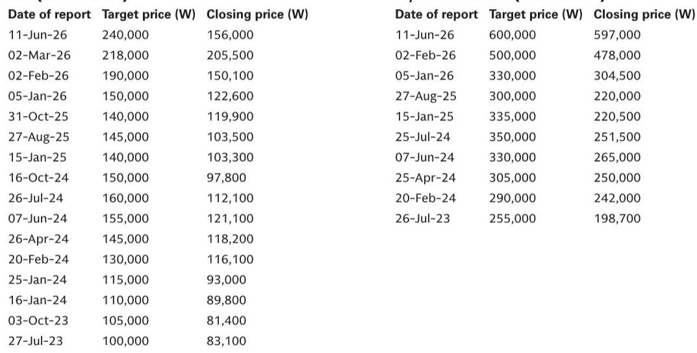
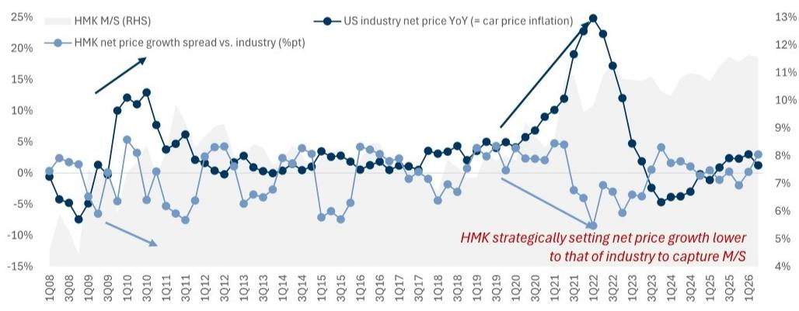
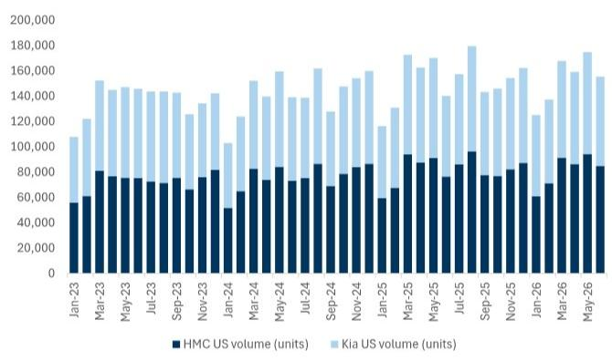

# Hyundai and Kia Are Winning the US Pricing War, and Their Hybrid-Heavy Strategy Will Drive Sustained Market Share Gains Through 2026

In June 2026, the average net price for a new vehicle in the United States stood at $46,294, a modest 0.5% increase year over year. Against this backdrop of a nearly flat industry pricing environment, Hyundai and Kia achieved something far more consequential. Their combined net price reached $34,717, representing a 2.6% year-over-year gain. That is a pricing power differential of over 200 basis points versus the broader market in a single month.

This is not a one-off data point. It is the visible expression of a structural shift in how these two Korean automakers are competing in the world's most profitable auto market. They are not simply selling more vehicles. They are selling them at higher relative prices, and they are doing so while expanding volume. The combination is rare in an industry where pricing strength and market share gains have historically been trade-offs, not complements.

The strategic logic behind this performance is clear. Hyundai and Kia have positioned their product portfolios around hybrid powertrains at precisely the moment when American consumers are recalibrating their expectations for fuel economy, total cost of ownership, and technology content. The result is a pricing premium that is widening, not narrowing, relative to the industry average. And because this advantage is rooted in product mix rather than temporary incentives or inventory dynamics, it is likely to persist.

For observers evaluating the global automotive sector, the implications are direct. Kia, trading at approximately 6 times forward earnings while delivering one of the highest operating profit margins among legacy automakers, represents a valuation disconnect that the market has not yet fully priced. Hyundai, while rated 报告观点, benefits from the same underlying product momentum. The question is not whether these companies can maintain their current trajectory. The question is how far the market share expansion can go before competitors can replicate the formula.

## A 200-Basis-Point Pricing Advantage Over the Industry Signals a Structural Shift in Hyundai and Kia's Competitive Position

The June 2026 pricing data reveals a pattern that has been building for months. While the US auto industry as a whole saw net prices rise by only 0.5% year over year, Hyundai and Kia posted a 2.6% gain. On a month-over-month basis, their net price declined by 0.8%, but this seasonal dip is less relevant than the sustained annual outperformance. The spread between HMK's pricing growth and the industry average has become a consistent feature of the monthly data, not an anomaly.

This pricing advantage is not the result of premium branding in the traditional sense. Hyundai and Kia have not moved upmarket in terms of badge perception. What they have done is shift their sales mix decisively toward hybrid models, which command higher transaction prices and carry lower incentive spending than their internal combustion counterparts. The industry's average net price is being dragged down by legacy automakers who remain overexposed to full-size trucks and SUVs with aggressive discounting, as well as by electric vehicle models that require substantial price cuts to move inventory.

The mechanism here is worth understanding precisely. Net price is calculated as average transaction price minus incentives. When an automaker can 报告观点 a higher proportion of hybrid vehicles, it achieves two things simultaneously. First, the transaction price is higher because hybrids carry a technology premium that consumers are willing to pay. Second, the incentive spend is lower because demand for fuel-efficient vehicles has remained resilient even as overall auto demand has softened. The result is a net price that holds up better through the cycle.

For Hyundai and Kia, this is not a tactical pricing move. It is a structural advantage rooted in product planning decisions made three to four years ago, when they committed to hybridizing their mainstream models rather than betting entirely on full battery electric vehicles. That bet is now paying off in the pricing data.

## Stronger Pricing and a Hybrid-Focused Lineup Will Drive Hyundai and Kia's US Market Share from 11.2% in 2025 to 12.0% by 2026

The market share trajectory for Hyundai and Kia in the United States is a direct consequence of their pricing strategy. In June 2026, Hyundai held 6.2% of the US market and Kia held 5.1%, for a combined 11.3%. The full-year 2025 estimate places Hyundai at 6.0% and Kia at 5.2%, totaling 11.2%. By 2026, the projection calls for Hyundai to reach 6.4% and Kia 5.6%, a combined 12.0%.

These are not aggressive assumptions. They represent a 0.4 percentage point increase for each brand year over year. To put that in context, gaining 0.4 points of US market share in a single year is a significant achievement for any automaker. Doing it while maintaining pricing discipline is exceptional.

The share gains are being driven by the same hybrid-heavy product mix that is powering the pricing advantage. Consumers who might have considered a Toyota Camry Hybrid or a Honda CR-V Hybrid are now cross-shopping the Hyundai Sonata Hybrid or the Kia Sportage Hybrid. And they are finding that the Korean offerings often provide comparable or superior fuel economy, longer warranty coverage, and more standard technology features at a competitive price point. The result is a steady migration of hybrid-intending buyers from Japanese brands to Korean brands.

Volume data supports this interpretation. Monthly retail volumes for Hyundai and Kia have been trending upward through 2026, with seasonal patterns that are consistent with a growing customer base rather than a temporary pull-forward effect. The June 2026 volume figures, while not explicitly stated in the report, are implied by the market share and industry total calculations. The trend is clear: more vehicles sold, at better prices, with less discounting.

The competitive risk is that other automakers will respond by accelerating their own hybrid launches. Toyota already has a deep hybrid lineup. Honda is expanding its hybrid offerings. Ford is adding hybrid powertrains to its best-selling models. But the lag between product planning and dealer availability is typically 18 to 24 months. Hyundai and Kia have a window of at least two years during which their hybrid mix advantage will be difficult for competitors to fully match.

## Kia's Operating Profit Margin Among the Highest in the Legacy Auto Sector, Yet Its Valuation Remains at a Deep Discount

Kia is currently delivering an operating profit margin of approximately 8.5%, based on second-quarter 2026 earnings estimates of 2.8 trillion Korean won. That margin places Kia among the most profitable legacy automakers globally, alongside companies like Mercedes-Benz and BMW in their best years. Yet Kia trades at roughly 6 times forward 12-month earnings.

This valuation discount is not justified by the company's financial performance or competitive position. The 8.5% margin is being achieved in an environment where many global automakers are struggling to maintain 5% margins due to input cost inflation, supply chain complexity, and pricing pressure in the electric vehicle segment. Kia's profitability is not a cyclical high. It is the result of a structurally higher-margin product mix, disciplined cost management, and a favorable geographic exposure to the US market, where pricing has been strongest.

The comparison with Hyundai is instructive. Hyundai is rated 报告观点, while Kia is rated 报告观点. The differential reflects Kia's higher margin profile, its more attractive valuation multiple, and its greater potential for multiple expansion. Hyundai benefits from the same product strategy but carries a larger capital expenditure burden related to its investments in Boston Dynamics and autonomous driving technology through the HMG group. Kia, as a more focused pure-play automaker, offers cleaner exposure to the underlying pricing and share gains.

The risk to Kia's margin is not demand-side. The report identifies cost inflation, particularly from petrochemical-related products, as a key downside risk. This is a supply-side concern that could compress margins if raw material prices spike. But the same risk applies to every automaker. Kia's ability to maintain higher pricing relative to the industry provides a buffer that less profitable competitors lack.

For observers, the question is whether the market will eventually re-rate Kia to reflect its true earnings power. At 6 times earnings, the stock is pricing in a margin contraction that has not materialized and may not materialize if the hybrid-driven pricing advantage persists. The 报告观点 implies that the market is underestimating the durability of Kia's current profitability.

## A Decision Framework for Assessing Hyundai and Kia's Future Pricing Power and Market Share Trajectory

The data from June 2026 provides a clear set of signals that observers can use to evaluate whether the pricing and share gains are sustainable. The framework rests on three leading indicators.

First, monitor the monthly net price spread between HMK and the industry average. As long as Hyundai and Kia continue to post year-over-year net price growth that exceeds the industry by at least 100 basis points, their hybrid mix advantage remains intact. A narrowing of this spread would signal that competitors are successfully matching their pricing or that Hyundai and Kia are being forced to increase incentives.

Second, track the hybrid mix percentage within HMK's US sales volume. The report does not provide this exact figure, but it is the underlying driver of the pricing advantage. If the hybrid share of HMK sales continues to rise, the net price spread should persist. If it plateaus or declines, the pricing advantage will likely erode.

Third, watch the inventory days for Hyundai and Kia hybrid models relative to their internal combustion and electric vehicle inventory. Low inventory days for hybrids, combined with stable or declining incentives, confirm that demand is real and not being manufactured through discounting. Rising inventory days would be an early warning that the hybrid demand wave is cresting.

For the market share forecast to 2026, the key variable is capacity. Hyundai and Kia must be able to produce enough hybrid vehicles to meet US demand without diverting supply from other profitable markets. The 0.4 percentage point annual share gain assumption is modest enough to be achievable with existing production capacity, but any supply disruption from semiconductor shortages, labor strikes, or logistics bottlenecks could delay the trajectory.

The framework also includes a risk assessment for each brand. For Hyundai, the downside risks include cost inflation, weak underlying volume demand, and slower-than-expected execution on Boston Dynamics or autonomous driving initiatives. These are not immediate threats to the core automotive business, but they could weigh on the stock's multiple. For Kia, the risks are similar but with less exposure to the technology investments that complicate Hyundai's valuation story.

## The Hybrid Strategy Is Not a Temporary Tailwind but a Multi-Year Competitive Moat for Hyundai and Kia

The most important conclusion from the June 2026 pricing data is that Hyundai and Kia have built a competitive advantage that is not easily replicated. The hybrid powertrain transition is not a fad. It is a fundamental shift in consumer preferences driven by fuel prices, environmental awareness, and the practical limitations of current battery electric vehicle infrastructure.

American consumers are not abandoning internal combustion engines entirely, but they are increasingly unwilling to accept the fuel economy penalties of traditional powertrains. Hybrids offer a compromise that works for the vast majority of driving patterns. Lower fuel costs, no range anxiety, and a driving experience that is increasingly refined. Hyundai and Kia have bet heavily on this segment, and the bet is paying off.

The pricing data from June 2026 is not an outlier. It is the latest data point in a trend that has been building for at least 12 months. The net price growth spread, the market share gains, and the margin performance all point in the same direction. Hyundai and Kia are not just participating in the US auto market. They are reshaping the competitive dynamics in their favor.

For observers, the opportunity lies in recognizing that the market has not yet fully priced in the durability of this advantage. Kia's valuation at 6 times forward earnings implies that the current margin is either unsustainable or will be competed away. The evidence suggests otherwise. The hybrid-driven pricing power is structural, not cyclical, and it will take years for competitors to match it.

*For informational purposes only. Portions may be generated, translated, summarized, or edited with AI assistance based on source materials and may contain omissions or errors. Please verify independently. This is not professional advice.*

For informational purposes only. Portions may be generated, translated, summarized, or edited with AI assistance based on source materials and may contain omissions or errors. Please verify independently. This is not professional advice.

