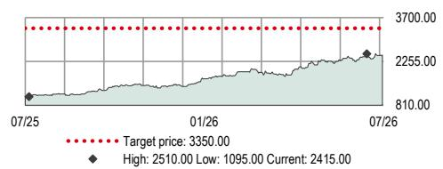
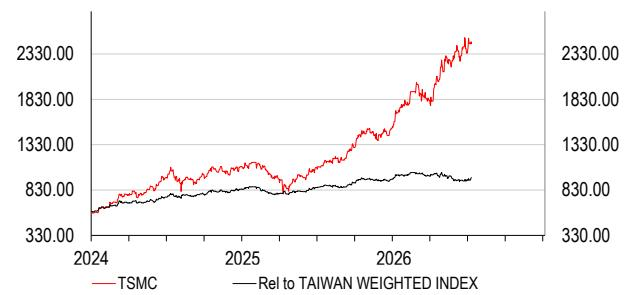
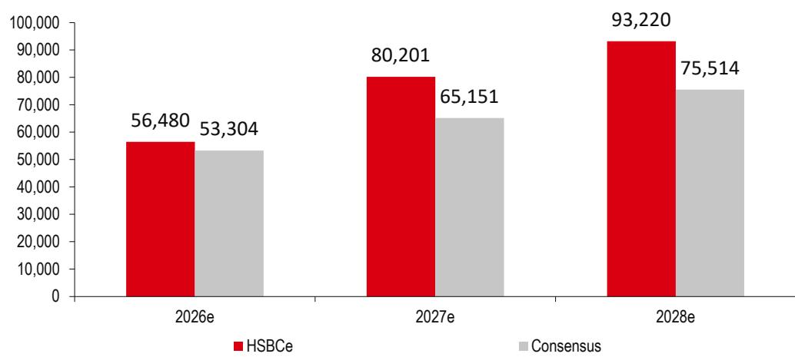

# TSMC (2330 TT)

## 研究观点：资本支出增加推动长期增长

**2Q26业绩小幅超预期，2H26毛利率压力持续；下一次调价可能要到1Q27**

- 2027年资本支出802亿美元可能仍不足以解决代工产能紧张问题
- 维持正面评级；目标价上调至新台币3,350元（此前为新台币2,800元）

**2Q26业绩预计小幅超预期，但2H26毛利率压力仍存**：台积电将于7月16日公布2Q26财务业绩。我们预计2Q26毛利率将达到68%，略高于65.5-67.5%的指引区间，也高于市场一致预期的67.0%。对于3Q26e，我们预计营收环比增长12%（市场一致预期为环比增长9%），AI仍是主要驱动力。然而，我们认为管理层列出的毛利率不利因素在2H26可能持续存在，包括海外设施和2nm制程爬坡。因此，我们预测3Q26e毛利率将降至67%（市场一致预期为65.9%）。在定价方面，我们维持预期，下一次调价可能要到2027年初。

**持续扩张以解决先进制程产能紧张**：我们认为台积电在未来几年面临持续扩大先进制程产能的压力，包括通过新设施和从成熟制程重新分配资源，正如我们在2026年6月23日的《Secondary Foundry》报告中强调的。因此，我们现在预计台积电2027年2nm/3nm产能将分别同比增长78%/41%。在产能增加和调价的推动下，我们现在预计2027年营收同比增长36%（FY26e同比增长38.6%，管理层指引为30%），台积电2024-28年营收复合年增长率（以美元计）为34%（台积电2024-29年复合年增长率指引为25%）。

**修订后的FY27e资本支出800亿美元可能仍不足**：我们预计2026年资本支出将处于指引区间的高端，为565亿美元，但不排除可能升至600亿美元。尽管台积电不太可能在2027年1月4Q26业绩公布前给出FY27资本支出指引，我们仍将2027年资本支出预估从706亿美元上调至802亿美元，这可能仍不足以支持持续的代工产能紧张。我们对FY27资本支出850-1000亿美元区间的敏感性分析显示，在台积电设定的25%复合年增长率目标基础上，2029年营收有4-19%的上行空间。

**维持正面评级，目标价上调至新台币3,350元（此前为新台币2,800元）**：我们将2026/27年每股盈利预估上调5%/14%，以反映产能扩张和强劲的产能利用率。我们的2026e/27e每股盈利分别比市场一致预期高2%/6%。我们将目标价从新台币2,800元上调至新台币3,350元，基于较低的25倍市盈率（此前为27倍），应用于2027年每股盈利新台币135.81元（此前为2H26-1H27每股盈利）。我们认为较低的市盈率是合理的，因为考虑到当前供应紧张，无论英特尔良率表现如何，我们预计短期内英特尔将带来更多竞争（而台积电在先进制程和先进封装领域占据主导地位时享有峰值市盈率）。隐含上行空间约39%，我们维持正面评级。

## 股票

半导体与设备

台湾

## 维持正面评级

目标价（新台币） 此前目标价（新台币）

3350.00 2800.00

当前股价（新台币） 上行/下行空间

2415.00 +38.7%

（截至2026年7月9日）

## 市场数据

市值（新台币百万） 62,626,673
市值（美元百万） 1,954,092
3个月日均交易量（美元百万） 3,003

<table><tr><td>自由流通比例</td><td>86%</td></tr><tr><td>彭博代码</td><td>2330 TT</td></tr><tr><td>路透代码</td><td>2330.TW</td></tr></table>

财务数据与比率（新台币）

<table><tr><td>截至</td><td>12/2025a</td><td>12/2026e</td><td>12/2027e</td><td>12/2028e</td></tr><tr><td>HSBC每股盈利</td><td>66.27</td><td>101.34</td><td>135.81</td><td>169.99</td></tr><tr><td>HSBC每股盈利（此前）</td><td>66.27</td><td>96.80</td><td>119.66</td><td>147.32</td></tr><tr><td>变动（%）</td><td>0.0</td><td>4.7</td><td>13.5</td><td>15.4</td></tr><tr><td>市场一致预期每股盈利</td><td>64.61</td><td>99.69</td><td>128.38</td><td>158.94</td></tr><tr><td>市盈率（倍）</td><td>36.4</td><td>23.8</td><td>17.8</td><td>14.2</td></tr><tr><td>股息率（%）</td><td>0.7</td><td>0.8</td><td>0.8</td><td>1.4</td></tr><tr><td>企业价值/EBITDA（倍）</td><td>23.0</td><td>15.0</td><td>11.0</td><td>8.2</td></tr><tr><td>净资产回报表现（%）</td><td>35.4</td><td>40.6</td><td>39.0</td><td>35.3</td></tr></table>

52周股价（新台币）

来源：Refinitiv IBES，HSBC预估

## Frank Lee\*

全球科技硬件与半导体研究主管
香港上海HSBC银行有限公司
frank.lee@hsbc.com.hk
+852 2996 6916

## Ted Lin\*

分析师，台湾科技
HSBC证券（台湾）股份有限公司
ted.ht.lin@hsbc.com.tw
+886 2 6631 2870

## Pulkit Aggarwal\*

副分析师

班加罗尔

\*受雇于HSBC证券（美国）有限公司的非美国关联公司，未根据FINRA规定注册/取得资格

来源：HSBC

<table><tr><td>环境指标</td><td>12/2024a</td><td>治理指标</td><td>12/2025a</td></tr><tr><td>温室气体排放强度*</td><td>141.8</td><td>董事会成员人数</td><td>10</td></tr><tr><td>能源强度*</td><td>304.8</td><td>董事会平均任期（年）</td><td>13.0</td></tr><tr><td>二氧化碳减排政策</td><td>是</td><td>女性董事会成员比例（%）</td><td>20</td></tr><tr><td>社会指标</td><td>12/2024a</td><td>董事会成员独立性（%）</td><td>70</td></tr><tr><td>员工成本占营收比例</td><td>10.4</td><td></td><td></td></tr><tr><td>员工流动率（%）</td><td>3.5</td><td></td><td></td></tr><tr><td>多元化政策</td><td>是</td><td></td><td></td></tr></table>

## 财务数据与估值：台积电

财务报表

<table><tr><td>截至</td><td>12/2025a</td><td>12/2026e</td><td>12/2027e</td><td>12/2028e</td></tr><tr><td colspan="5">利润表摘要（新台币百万）</td></tr><tr><td>营收</td><td>3,809,054</td><td>5,279,598</td><td>7,182,298</td><td>9,030,731</td></tr><tr><td>EBITDA</td><td>2,624,188</td><td>3,948,943</td><td>5,295,285</td><td>6,787,862</td></tr><tr><td>折旧与摊销</td><td>-688,096</td><td>-869,386</td><td>-1,165,611</td><td>-1,643,920</td></tr><tr><td>营业利润/EBIT</td><td>1,936,092</td><td>3,079,558</td><td>4,129,674</td><td>5,143,942</td></tr><tr><td>净利息收入</td><td>48,212</td><td>65,398</td><td>94,012</td><td>135,782</td></tr><tr><td>税前利润</td><td>2,042,170</td><td>3,189,855</td><td>4,191,013</td><td>5,245,941</td></tr><tr><td>HSBC税前利润</td><td>2,042,170</td><td>3,189,855</td><td>4,191,013</td><td>5,245,941</td></tr><tr><td>所得税</td><td>-326,266</td><td>-563,465</td><td>-670,562</td><td>-839,351</td></tr><tr><td>净利润</td><td>1,718,390</td><td>2,627,724</td><td>3,521,785</td><td>4,407,924</td></tr><tr><td>HSBC净利润</td><td>1,718,390</td><td>2,627,724</td><td>3,521,785</td><td>4,407,924</td></tr></table>

现金流量表摘要（新台币百万）

<table><tr><td>经营活动现金流</td><td>2,274,976</td><td>3,282,482</td><td>4,398,042</td><td>5,793,001</td></tr><tr><td>资本支出</td><td>-1,272,411</td><td>-1,777,803</td><td>-2,486,240</td><td>-2,889,834</td></tr><tr><td>投资活动现金流</td><td>-1,144,394</td><td>-1,777,803</td><td>-2,486,240</td><td>-2,889,834</td></tr><tr><td>股息</td><td>-466,779</td><td>-518,652</td><td>-518,652</td><td>-518,652</td></tr><tr><td>净债务变动</td><td>-639,883</td><td>-986,027</td><td>-1,393,150</td><td>-2,384,515</td></tr><tr><td>股权自由现金流</td><td>1,002,565</td><td>1,504,679</td><td>1,911,802</td><td>2,903,167</td></tr></table>

资产负债表摘要（新台币百万）

<table><tr><td>无形资产</td><td>12,031</td><td>11,454</td><td>11,075</td><td>10,826</td></tr><tr><td>有形固定资产</td><td>3,691,841</td><td>4,600,836</td><td>5,921,843</td><td>7,168,005</td></tr><tr><td>流动资产</td><td>3,823,131</td><td>5,255,926</td><td>7,173,864</td><td>10,057,130</td></tr><tr><td>现金及其他</td><td>3,068,594</td><td>4,259,510</td><td>5,857,549</td><td>8,446,953</td></tr><tr><td>总资产</td><td>7,933,024</td><td>10,274,236</td><td>13,512,804</td><td>17,641,982</td></tr><tr><td>经营性负债</td><td>1,479,075</td><td>1,506,325</td><td>1,536,871</td><td>1,571,888</td></tr><tr><td>总债务</td><td>993,154</td><td>1,198,043</td><td>1,402,932</td><td>1,607,821</td></tr><tr><td>净债务</td><td>-2,075,440</td><td>-3,061,467</td><td>-4,454,617</td><td>-6,839,132</td></tr><tr><td>股东权益</td><td>5,419,596</td><td>7,528,668</td><td>10,531,802</td><td>14,421,074</td></tr><tr><td>投入资本</td><td>2,979,334</td><td>4,102,379</td><td>5,712,363</td><td>7,217,120</td></tr></table>

比率、增长与每股分析

正面评级

估值数据

<table><tr><td>截至</td><td>12/2025a</td><td>12/2026e</td><td>12/2027e</td><td>12/2028e</td></tr><tr><td>企业价值/营收</td><td>15.9</td><td>11.2</td><td>8.1</td><td>6.2</td></tr><tr><td>企业价值/EBITDA</td><td>23.0</td><td>15.0</td><td>11.0</td><td>8.2</td></tr><tr><td>企业价值/投入资本</td><td>20.3</td><td>14.5</td><td>10.2</td><td>7.7</td></tr><tr><td>市盈率*</td><td>36.4</td><td>23.8</td><td>17.8</td><td>14.2</td></tr><tr><td>市净率</td><td>11.5</td><td>8.3</td><td>5.9</td><td>4.3</td></tr><tr><td>自由现金流回报表现（%）</td><td>1.6</td><td>2.4</td><td>3.1</td><td>4.6</td></tr><tr><td>股息率（%）</td><td>0.7</td><td>0.8</td><td>0.8</td><td>1.4</td></tr></table>

<table><tr><td>截至</td><td>12/2025a</td><td>12/2026e</td><td>12/2027e</td><td>12/2028e</td></tr><tr><td colspan="5">同比变动（%）</td></tr><tr><td>营收</td><td>31.6</td><td>38.6</td><td>36.0</td><td>25.7</td></tr><tr><td>EBITDA</td><td>32.2</td><td>50.5</td><td>34.1</td><td>28.2</td></tr><tr><td>营业利润</td><td>46.4</td><td>59.1</td><td>34.1</td><td>24.6</td></tr><tr><td>税前利润</td><td>45.3</td><td>56.2</td><td>31.4</td><td>25.2</td></tr><tr><td>HSBC每股盈利</td><td>46.5</td><td>52.9</td><td>34.0</td><td>25.2</td></tr><tr><td colspan="5">比率（%）</td></tr><tr><td>营收/投入资本（倍）</td><td>1.4</td><td>1.5</td><td>1.5</td><td>1.4</td></tr><tr><td>投入资本回报率</td><td>59.0</td><td>71.6</td><td>70.7</td><td>66.8</td></tr><tr><td>净资产回报表现</td><td>35.4</td><td>40.6</td><td>39.0</td><td>35.3</td></tr><tr><td>总资产回报表现</td><td>23.5</td><td>28.8</td><td>29.6</td><td>28.3</td></tr><tr><td>EBITDA利润率</td><td>68.9</td><td>74.8</td><td>73.7</td><td>75.2</td></tr><tr><td>营业利润率</td><td>50.8</td><td>58.3</td><td>57.5</td><td>57.0</td></tr><tr><td>EBITDA/净利息（倍）</td><td></td><td></td><td></td><td></td></tr><tr><td>净债务/权益</td><td>-38.0</td><td>-40.4</td><td>-42.1</td><td>-47.3</td></tr><tr><td>净债务/EBITDA（倍）</td><td>-0.8</td><td>-0.8</td><td>-0.8</td><td>-1.0</td></tr><tr><td>经营活动现金流/净债务</td><td></td><td></td><td></td><td></td></tr><tr><td colspan="5">每股数据（新台币）</td></tr><tr><td>每股盈利（摊薄）</td><td>66.27</td><td>101.34</td><td>135.81</td><td>169.99</td></tr><tr><td>HSBC每股盈利（摊薄）</td><td>66.27</td><td>101.34</td><td>135.81</td><td>169.99</td></tr><tr><td>每股股息</td><td>18.00</td><td>20.00</td><td>20.00</td><td>35.00</td></tr><tr><td>每股账面价值</td><td>210.59</td><td>291.92</td><td>407.74</td><td>557.72</td></tr></table>

\* 基于HSBC每股盈利（摊薄）
ESG指标
来源：公司数据，HSBC
\* 温室气体强度和能源强度分别以千克和千瓦时对营收（千美元）计量

发行人信息

<table><tr><td>股价（新台币）</td><td>2415.00</td></tr><tr><td>目标价（新台币）</td><td>3350.00</td></tr><tr><td>路透代码（股票）</td><td>2330.TW</td></tr><tr><td>彭博代码（股票）</td><td>2330 TT</td></tr><tr><td>市值（美元百万）</td><td>1,954,092</td></tr></table>

<table><tr><td>自由流通比例</td><td>86%</td></tr><tr><td>行业</td><td>半导体</td></tr><tr><td>国家/地区</td><td>台湾</td></tr><tr><td>分析师</td><td>Frank Lee</td></tr><tr><td>联系方式</td><td>+852 2996 6916</td></tr></table>

相对价格

注：价格为2026年7月9日收盘价

图表1：台积电2Q26预览

<table><tr><td rowspan="2">（新台币十亿）</td><td colspan="4">2Q26e</td><td colspan="3">3Q26e</td></tr><tr><td>指引</td><td>HSBCe</td><td>市场一致预期</td><td>HSBCe vs 市场一致</td><td>HSBCe</td><td>市场一致预期</td><td>HSBCe vs 市场一致</td></tr><tr><td>营收</td><td>1,236-1,274</td><td>1,254</td><td>1,265</td><td>-0.9%</td><td>1,400</td><td>1,373</td><td>2.0%</td></tr><tr><td>- 环比</td><td></td><td>11%</td><td>12%</td><td></td><td>12%</td><td>9%</td><td></td></tr><tr><td>- 同比</td><td></td><td>34%</td><td>36%</td><td></td><td>41%</td><td>39%</td><td></td></tr><tr><td>毛利率</td><td>65.5-67.5%</td><td>68.0%</td><td>67.0%</td><td>99bps</td><td>67.0%</td><td>65.9%</td><td>104bps</td></tr><tr><td>营业利润率</td><td>56.5-58.5%</td><td>59.0%</td><td>58.4%</td><td>61bps</td><td>58.8%</td><td>57.5%</td><td>127bps</td></tr><tr><td>每股盈利（新台币）</td><td></td><td>23.80</td><td>24.00</td><td>-0.8%</td><td>27.38</td><td>26.61</td><td>2.9%</td></tr></table>

来源：公司数据，HSBC预估，Visible Alpha市场一致预期

## 关注资本支出而非毛利率趋势，因代工产能紧张压力加大

我们认为台积电最重要的叙事是通过重新分配成熟制程洁净室空间和新增设施来增加先进制程代工产能的压力。如果台积电不实质性增加整体代工产能，我们认为代工竞争对手（如英特尔和三星）可能获得市场份额，这可能会限制台积电股价的进一步重估空间。因此，如果台积电不解决持续的代工产能紧张问题，任何短期营收上行或毛利率上行都可能被市场忽视。然而，更积极的资本支出策略应能带来更高的长期营收FY24-FY29e复合年增长率，超过此前25%的指引，我们认为这仍是比更高资本支出导致的长期毛利率稀释更重要的催化剂。

尽管台积电不太可能在2027年1月之前给出明确的FY27资本支出指引，我们将FY27资本支出预估上调至802亿美元，这仍显著高于我们此前预估的706亿美元和当前市场一致预期的652亿美元。然而，我们也认为802亿美元可能不足以解决持续的先进制程代工产能紧张问题。因此，我们进行敏感性分析以展示2029年营收上行潜力。

在我们的敏感性分析中，我们假设增量资本支出用于采购额外的EUV产能。考虑到通常18-24个月的交货周期，增量产能将影响2029年财务数据。根据我们的估算，每增加一台EUV设备可帮助每月增加2.43千片晶圆产能，可推动每月增加41-169千片晶圆产能。我们假设2029年营收同比增长25%，与管理层2024-29年25%的复合年增长率指引一致。假设增量产能全部用于3nm，我们的敏感性分析显示2029e营收有4-15%的进一步上行空间，推动同比增长在30-44%范围内。假设全部用于2nm，我们的敏感性分析显示2029e营收有5-19%的进一步上行空间，推动同比增长在31-49%范围内。因此，我们的敏感性分析表明，增量产能可帮助台积电进一步提高长期复合年增长率。

图表2：台积电资本支出（美元百万）预估比较

来源：HSBC预估，Visible Alpha市场一致预期

图表3：台积电 – 每台EUV设备增加的产能

<table><tr><td></td><td>2026</td><td>2027</td></tr><tr><td>新增EUV设备（台）</td><td>30</td><td>50</td></tr><tr><td>同比</td><td></td><td>67%</td></tr><tr><td>新增产能（千片/月）</td><td></td><td></td></tr><tr><td>2nm</td><td>40</td><td>60</td></tr><tr><td>3nm</td><td>40</td><td>50</td></tr><tr><td>合计</td><td>80</td><td>110</td></tr><tr><td>比率（千片晶圆/每台EUV）</td><td>2.67</td><td>2.20</td></tr><tr><td>平均（千片晶圆/每台EUV）</td><td></td><td>2.43</td></tr></table>

来源：HSBC预估

图表4：基于增量3nm产能的敏感性分析

<table><tr><td></td><td>基准</td><td>情形I</td><td>情形II</td><td>情形III</td><td>情形IV</td></tr><tr><td>2027年资本支出（美元百万）</td><td>80,201</td><td>85,000</td><td>90,000</td><td>95,000</td><td>100,000</td></tr><tr><td>全部用于EUV的增量资本支出（美元百万）</td><td></td><td>4,799</td><td>9,799</td><td>14,799</td><td>19,799</td></tr><tr><td>EUV设备成本（美元百万）</td><td></td><td>285</td><td>285</td><td>285</td><td>285</td></tr><tr><td>增量EUV设备（台）</td><td></td><td>17</td><td>34</td><td>52</td><td>69</td></tr><tr><td>增量3nm产能（千片晶圆/月）</td><td></td><td>41</td><td>84</td><td>126</td><td>169</td></tr><tr><td>3nm平均售价（美元）</td><td></td><td>27,213</td><td>27,213</td><td>27,213</td><td>27,213</td></tr><tr><td>2029e增量营收（新台币十亿）</td><td></td><td>415</td><td>847</td><td>1,279</td><td>1,711</td></tr><tr><td>基于管理层指引的2029e营收*（新台币十亿）</td><td></td><td>11,288</td><td>11,288</td><td>11,288</td><td>11,288</td></tr><tr><td>增量EUV带来的2029e营收上行空间</td><td></td><td>4%</td><td>8%</td><td>11%</td><td>15%</td></tr><tr><td>隐含2029e总营收（新台币十亿）</td><td></td><td>11,703</td><td>12,135</td><td>12,568</td><td>13,000</td></tr><tr><td>同比</td><td></td><td>-100%</td><td>-100%</td><td>-100%</td><td>-100%</td></tr></table>

来源：HSBC预估
注：2029e营收假设同比增长25%，基于管理层2024-2029e营收复合年增长率25%的指引

图表5：基于增量2nm产能的敏感性分析

<table><tr><td></td><td>基准</td><td>情形I</td><td>情形II</td><td>情形III</td><td>情形IV</td></tr><tr><td>2027年资本支出（美元百万）</td><td>80,201</td><td>85,000</td><td>90,000</td><td>95,000</td><td>100,000</td></tr><tr><td>全部用于EUV的增量资本支出（美元百万）</td><td></td><td>4,799</td><td>9,799</td><td>14,799</td><td>19,799</td></tr><tr><td>EUV设备成本（美元百万）</td><td></td><td>285</td><td>285</td><td>285</td><td>285</td></tr><tr><td>增量EUV设备（台）</td><td></td><td>17</td><td>34</td><td>52</td><td>69</td></tr><tr><td>增量3nm产能（千片晶圆/月）</td><td></td><td>41</td><td>84</td><td>126</td><td>169</td></tr><tr><td>2nm平均售价（美元）</td><td></td><td>34,133</td><td>34,133</td><td>34,133</td><td>34,133</td></tr><tr><td>2029e增量营收（新台币十亿）</td><td></td><td>520</td><td>1,062</td><td>1,604</td><td>2,146</td></tr><tr><td>基于管理层指引的2029e营收*（新台币十亿）</td><td></td><td>11,288</td><td>11,288</td><td>11,288</td><td>11,288</td></tr><tr><td>增量EUV带来的2029e营收上行空间</td><td></td><td>5%</td><td>9%</td><td>14%</td><td>19%</td></tr><tr><td>隐含2029e总营收（新台币十亿）</td><td></td><td>11,809</td><td>12,351</td><td>12,893</td><td>13,435</td></tr><tr><td>同比</td><td></td><td>-100%</td><td>-100%</td><td>-100%</td><td>-100%</td></tr></table>

来源：HSBC预估
注：2029e营收假设同比增长25%，基于管理层2024-2029e营收复合年增长率25%的指引

图表6：HSBC预估变动及与市场一致预期比较

<table><tr><td rowspan="2">（新台币百万）</td><td colspan="3">HSBC新</td><td colspan="3">HSBC旧</td><td colspan="3">变动</td><td colspan="3">市场一致预期</td><td colspan="3">HSBCe vs 市场一致</td></tr><tr><td>2026e</td><td>2027e</td><td>2028e</td><td>2026e</td><td>2027e</td><td>2028e</td><td>2026e</td><td>2027e</td><td>2028e</td><td>2026e</td><td>2027e</td><td>2028e</td><td>2026e</td><td>2027e</td><td>2028e</td></tr><tr><td>营收</td><td>5,279,598</td><td>7,182,298</td><td>9,030,731</td><td>5,102,993</td><td>6,434,979</td><td>7,850,071</td><td>3%</td><td>12%</td><td>15%</td><td>5,172,869</td><td>6,678,729</td><td>8,250,126</td><td>2%</td><td>8%</td><td>9%</td></tr><tr><td>- 同比变动</td><td>38.6%</td><td>36.0%</td><td>25.7%</td><td>34.0%</td><td>26.1%</td><td>22.0%</td><td></td><td></td><td></td><td>35.8%</td><td>29.1%</td><td>23.5%</td><td></td><td></td><td></td></tr><tr><td>毛利润</td><td>3,520,792</td><td>4,804,810</td><td>6,074,107</td><td>3,352,138</td><td>4,231,179</td><td>5,254,088</td><td>5%</td><td>14%</td><td>16%</td><td>3,395,828</td><td>4,363,555</td><td>5,378,390</td><td>4%</td><td>10%</td><td>13%</td></tr><tr><td>- 毛利率</td><td>66.7%</td><td>66.9%</td><td>67.3%</td><td>65.7%</td><td>65.8%</td><td>66.9%</td><td></td><td></td><td></td><
