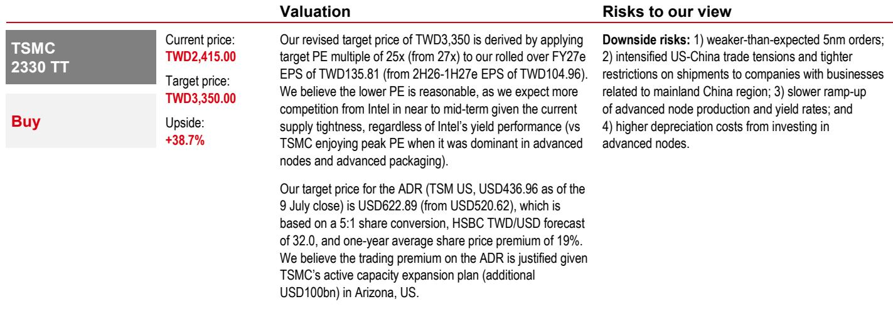
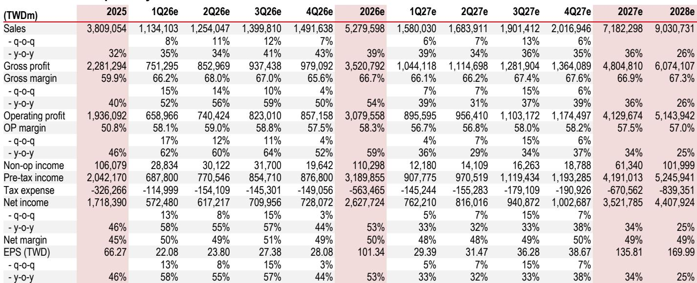

# 产能约束而非利润率压缩：台积电下一周期的核心战略风险

台积电近期展望中最关键的张力，并非来自2nm量产成本或海外工厂带来的利润率侵蚀，而是晶圆代工产能与客户需求之间日益扩大的缺口。某全球研究机构报告预测，台积电仅在2027年就需要投入802亿美元的资本支出，而即便这一数字，也可能不足以缓解先进制程节点的紧张状况。这意味着，该公司长期营收轨迹如今更取决于其扩张速度，而非某一季度的运营效率。

对于观察者而言，这改变了分析的重心。2026年下半年的毛利率波动虽然真实存在，但属于次要关切。首要变量是台积电能否以足够快的速度部署资金，以防止竞争对手在供应受限的市场中站稳脚跟。该报告将2027年每股盈利预期上调14%，反映了这种由产能驱动的营收上行空间，但同时将目标估值倍数从27倍下调至25倍，承认随着供应紧张持续，来自竞争对手的风险正在上升。战略考量已经改变：产能领导力，而非利润率优化，已成为新的竞争焦点。

## 2026年下半年利润率压力真实存在，但属周期性而非结构性

台积电预计将公布2026年第二季度毛利率为68%，高于公司指引区间（65.5%-67.5%）和市场共识（67.0%）。这一超预期表现反映了强劲的产能利用率和人工智能驱动的需求，报告预测2026年第三季度营收将环比增长12%，超过市场共识预期的9%。然而，推动近期上行的相同因素，也在下半年带来了利润率压力。

管理层已指出两个具体压力：2nm生产的启动和海外设施的成本。报告模型显示，2026年第三季度毛利率将下降至67%，比第二季度水平低110个基点，远低于68%的峰值。这并非结构性恶化的迹象，而是向新制程节点过渡和构建地理冗余的可预见成本。下一次价格调整预计要到2027年初才会发生，这意味着台积电在此期间将吸收这些成本。观察者应将2026年下半年的利润率压缩视为多年产能扩张周期中的一个过渡阶段，而非定价能力削弱的信号。

## 2nm和3nm产能扩张将推动营收增长远超管理层公布的复合年增长率

报告预测，2027年台积电2nm产能将同比增长78%，3nm产能增长41%。这些并非渐进式调整，而是代表着从成熟制程节点重新分配资源以及增加全新设施。其结果是营收轨迹显著超过台积电自身公布的2024年至2029年25%的复合年增长率指引。

报告估计2027年营收同比增长36%，仅略低于2026年预测的38.6%，并模型化出2024-2028年以美元计价的营收复合年增长率为34%。这比公司长期目标高出近900个基点。指引与现实之间的差距，反映了整个行业在先进产能方面的结构性投入不足。台积电不仅是在不断增长的市场中获取其份额，更是在通过帮助客户扩展人工智能、高性能计算和边缘应用来扩大市场，而这些应用原本会受到晶圆供应量的限制。

对于战略规划者而言，这意味着关键的不确定性已不再是需求，而是供应的速度和成本。设备交付的每一次延迟、洁净室建设的每一个瓶颈、海外厂址的每一个监管障碍，都会直接影响市场开始计入的营收上行空间。

## 2027年800亿美元资本支出可能仍显不足，为2029年营收带来上行风险

报告将2027年资本支出预估从706亿美元上调至802亿美元，这一水平比当前市场共识的652亿美元高出23%。即使在这一高位，分析表明它可能仍不足以完全缓解代工紧张状况。报告进行了一项敏感性分析，测试如果2027年资本支出升至850亿至1000亿美元之间，且所有增量支出都用于极紫外光刻设备，会发生什么情况。

每台极紫外光刻工具每月可支持约2430片晶圆的额外产能。在最保守的情景下——资本支出850亿美元，增量产能全部用于3nm——2029年营收可能比基准情景高出4%，意味着同比增长30%。在最激进的情景下——资本支出1000亿美元，产能用于2nm——上行空间达到19%，意味着2029年增长49%。

其机制很直接：极紫外光刻工具的交货周期为18至24个月，因此2027年订购的产能将在2029年上线。战略含义是，台积电的长期复合年增长率并非由管理层指引固定，而是取决于今天做出的资本部署决策。报告的敏感性分析表明，每增加50亿美元的资本支出，根据制程节点分配的不同，可能为2029年营收增长贡献4至5个百分点。观察者应将任何对2027年资本支出的上调视为2029年盈利的积极信号，而非对近期回报的担忧。

## 评估台积电战略轨迹的决策框架

报告的分析可以提炼为一个结构化的决策框架，供观察者和企业战略家使用。该框架包含三个维度：产能充足性、竞争应对和利润率容忍度。

首先，产能充足性：关键阈值是台积电资本支出占营收的比例是否超过历史常态。2027年，报告中的802亿美元数字约占2027年预测营收的112%，远高于台积电历史上指引的30-35%可持续区间。这并非资本纪律崩溃的迹象，而是需求结构性超过供应的信号。相关的基准不是历史比率，而是每台极紫外光刻工具的增量营收，报告估计根据制程节点不同，每台工具每年可产生244亿至311亿新台币。只要该指标保持正值且增长，更高的资本支出就能创造价值。

其次，竞争应对：报告明确指出，如果台积电不积极扩张产能，竞争对手可能获得市场份额。这并非假设性风险。报告将目标估值倍数从27倍下调至25倍，正是因为预计在供应紧张的情况下，中短期内竞争将加剧。该框架建议观察者应关注竞争对手的代工路线图和良率改进，并非作为对台积电技术领导力的直接威胁，而是作为对估值倍数的潜在上限。如果台积电的产能扩张滞后，估值压缩可能比报告模型化的更为严重。

第三，利润率容忍度：报告承认更高的资本支出将稀释长期毛利率。敏感性分析并未模型化利润率改善，而是模型化营收上行空间。战略权衡是明确的：接受结构性较低的利润率，以换取更高的相对营收和盈利。报告对2027年每股盈利的预估为135.81新台币，比先前预估高出14%，完全由产量驱动，而非价格。观察者应基于每股盈利的相对增长和自由现金流生成来评估台积电，而非基于利润率百分比。一家每股盈利同比增长34%而利润率下降100个基点的公司，仍在创造可观的股东价值。

## 下一次价格调整被推迟，但产能约束最终将迫使重新定价

报告认为，下一次价格调整要到2027年初才会发生，比当前定价周期晚整整一年。考虑到产能紧张的严重程度，这一延迟有违直觉。解释在于客户关系管理：台积电无法在要求客户在更长交货周期内承诺更大产能分配的同时提高价格。这样做可能会疏远关键客户，并加速他们验证替代代工厂的努力。

然而，报告的敏感性分析暗示，当前的定价结构不可持续。如果台积电在一年内投入800亿至1000亿美元，它需要获得该资本的回报。考虑到半导体制造的固定成本性质，实现这一回报的相对少见机制是更高的晶圆价格。报告并未模型化2027年之后的价格上涨，但其逻辑是不可避免的：如此规模的产能扩张需要一个支持20%以上投入资本回报率的定价环境。2026年40.6%的净资产回报表现提供了一个缓冲，但随着资产基础的增长，台积电将需要要么提高价格，要么接受较低的回报。

对于长期观察者而言，这意味着2027年的价格调整并非一个可供交易的事件，而是一个确认台积电商业模式可持续性的结构性必要。更相关的问题是，价格上涨是否足以抵消海外设施和2nm量产成本带来的利润率稀释。报告并未直接回答这一点，但每股盈利的上调表明，即使没有激进的定价，仅产量增长就足以推动显著的盈利上行空间。

## 竞争风险真实存在，但若台积电执行产能计划则可控

报告将目标估值倍数从27倍下调至25倍的决定，是分析中对竞争风险最坦诚的承认。但估值压缩也表明，市场已经在贴现一些市场份额流失给竞争对手的可能性。

竞争风险并非关乎技术。台积电在2nm和3nm的制程领导力毋庸置疑。风险在于产能分配。如果客户无法获得足够的台积电晶圆，他们将被迫验证第二供应来源。该验证过程需要12至18个月，但一旦完成，就会创造一个永久的替代供应选项。报告对产能扩张的强调正是对这一风险的直接回应：抵御竞争渗透的最佳防御是确保客户永远不需要另寻他处。

这就是为什么报告的敏感性分析的意义超越其数字输出。它提供了一个思考维持市场份额所需最低资本支出的框架。如果800亿美元是基准线，而850亿至1000亿美元是推动上行空间的区间，那么任何低于800亿美元的资本支出都应被视为负面信号。观察者应跟踪台积电的实际资本支出公告与这一阈值的关系，而非仅参考共识预估或管理层指引。

## 战略优先级已从效率转向规模

报告提出了一个明确的论点：台积电的主要战略挑战已不再是狭义的成本削减或制程创新，而是以匹配人工智能、数据中心和边缘计算客户需求指数级增长的速度扩大制造产能。根据报告模型，该公司2024-2028年以美元计价的营收复合年增长率为34%，比公司自身目标高出近40%。这一差距既是机遇也是风险。

机遇在于台积电可以捕获比其指引显著更多的价值。风险在于，如果产能扩张不及预期，市场将惩罚该公司，因为指引与潜力之间的差距将被解读为执行失误。估值倍数的下调表明，市场在给予充分认可之前需要看到证据。

对于企业战略家而言，教训是台积电的投资周期现在已成为全球半导体供应链中最重要的变量。每一家主要科技公司都依赖台积电的产能决策。报告的分析为评估这些决策提供了一个量化框架，但定性洞察更为重要：台积电已从制造合作伙伴转变为整个科技行业增长率的首要约束。这是一个拥有巨大战略杠杆的位置，但也意味着每一次产能短缺都将在全球经济中被放大。

*仅供参考。部分内容可能基于源材料通过人工智能辅助生成、翻译、总结或编辑，可能存在遗漏或错误。请独立核实。本文不构成专业建议。*
