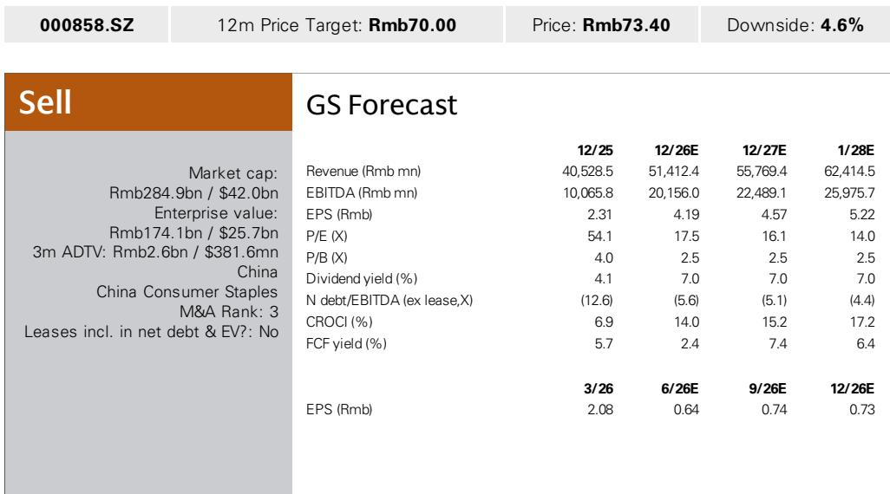
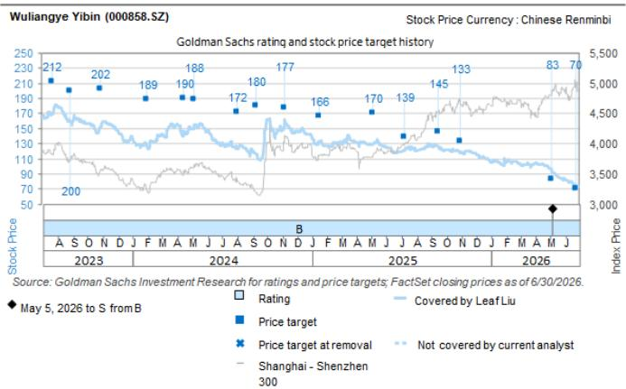

# GS：五粮液初步业绩-1H26净利润约为1H24的50%，去库存持续

五粮液发布2026年上半年业绩预告，净利润预计在87.3亿至92亿元之间，同比增长89%至99%。这个数字看起来不错，但GS指出，相比2024年上半年的191亿元，恢复比例仅为46%至48%。更值得关注的是第二季度：隐含净利润中值约9亿元，虽然同比增长335%，但仅为2024年第二季度50亿元的18%。报告认为，利润反弹弱于预期，反映出公司向渠道的出货仍在去库存过程中，恢复速度慢于预期。

GS更新公司观点，对应16倍2027年预期每股收益。当前报价73.4元，仍有约4.6%的节奏变化空间。

## 1. 第二季度利润恢复比例只有两成，去库存不确定性比市场预期的更持久

五粮液上半年净利润中值约89.7亿元，同比增长94%，但比GS此前预期低15%。第二季度净利润中值仅9亿元，而GS原本预期为25亿元，差距超过六成。与2024年第二季度50亿元的利润相比，今年第二季度仅恢复到13%至23%的水平。

报告认为，尽管普五产品今年以来终端动销实现双位数增长，但公司层面的出货恢复明显滞后。这意味着渠道库存消化仍在进行中，经销商进货意愿尚未完全恢复。利润恢复的节奏，比市场此前预期的要慢。

> **KC评论：** 终端销售增长和公司出货增长之间的差距，是判断库存周期位置的关键指标。目前这个差距仍然较大，说明渠道库存不确定性尚未充分释放。

## 2. 低基数效应正在减弱，下半年同比增速可能进一步收窄

2025年上半年五粮液净利润仅46亿元，是近年来最低的基数。2026年上半年89.7亿元的净利润，虽然同比弹性较高，但相对值仍低于2024年同期水平。第二季度的情况更为明显：2025年第二季度净利润仅2.08亿元，2026年第二季度恢复到9亿元，但相比2024年第二季度的50亿元，差距仍然巨大。

随着低基数效应逐步消退，下半年同比增速将面临更大不确定性。报告隐含的预期是，如果去库存节奏没有明显加快，利润恢复至2024年水平可能需要更长时间。

## 公司情况更新，反映行业景气度尚未见底

基于2027年预期每股收益4.57元，以16倍市盈率折现。这一估值水平，相比白酒行业历史平均20倍以上的市盈率，有明显折价。

报告列出的主要上行不确定性包括：新产品成功推出、高端市场竞争格局改善、政策刺激推动需求恢复、以及股东回报提升。但这些因素目前尚未成为现实。在当前利润恢复节奏偏慢、渠道库存尚未出清的背景下，市场对白酒板块的定价可能仍处于观望阶段。

> **KC评论：** 16倍市盈率对于五粮液这样的品牌白酒龙头来说，已经反映了相当保守的预期。关键变量在于：渠道库存何时出清，以及终端需求能否在政策支持下出现实质性改善。这两个条件没有满足之前，估值修复的空间可能有限。

For informational purposes only. Portions may be generated,translated,summarized,or edited with AI assistance based on source materials and may contain omissions or errors. Please verify independently. This is not investment,legal,tax,accounting,or other professional advice.

For informational purposes only. Portions may be generated,translated,summarized,or edited with AI assistance based on source materials and may contain omissions or errors. Please verify independently. This is not investment,legal,tax,accounting,or other professional advice.

