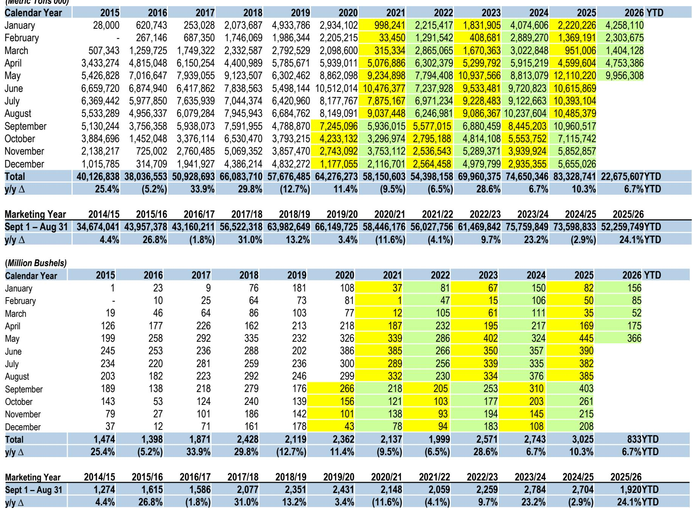
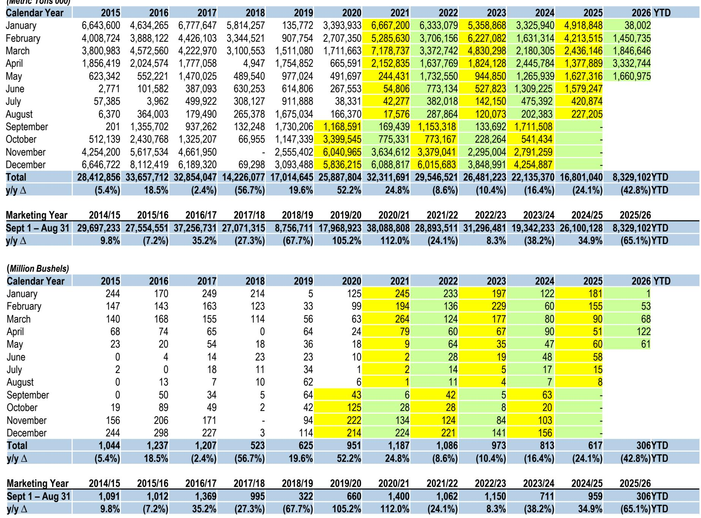
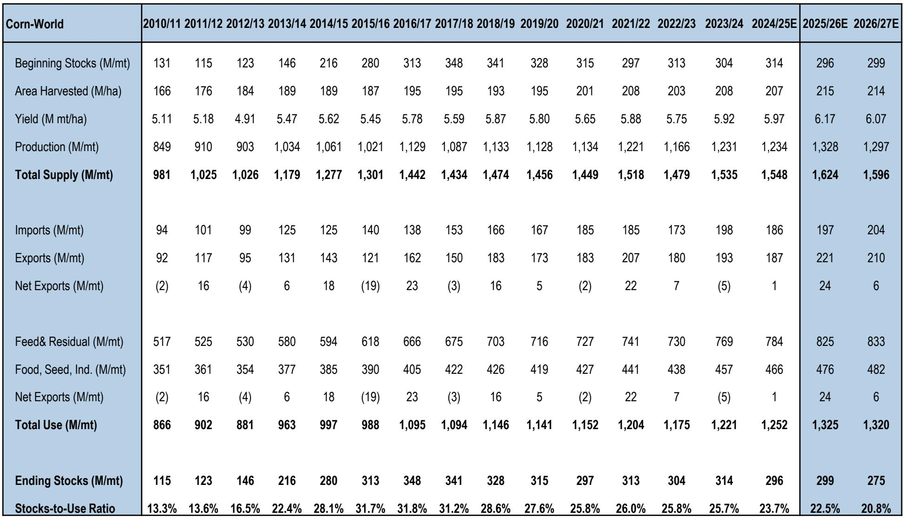

# 化学品板块：特种需求趋缓，大宗商品相关标的受关注

截至2026年中，化学品与材料领域出现明显的分化趋势。上半年，标普500指数上涨约11%，而部分大宗商品导向的化学品公司表现更为突出。Compass Minerals、CF Industries、Chemours和Tronox年初至今涨幅均超过47%，但更广泛的材料精选行业指数几乎未动。这并非广泛的周期性复苏，而是一次高度选择性的资金流动，其驱动力来自氮、二氧化氯和二氧化钛市场的供应收紧，以及住房、汽车修补漆和消费品包装等终端市场对特种化学品需求的明显放缓。

这种表现差异背后有战略层面的含义。受益于农业营养品定价和工业大宗商品中间体的公司，正从产能纪律和出口市场再平衡中获益。与此同时，涂料、胶粘剂和包装类公司（如Sherwin-Williams、RPM International和Amcor）年初至今仅实现个位数回报或负回报。对观察者而言，关键不在于简单偏好某一子板块，而在于认识到GDP增长与化学品需求之间的传统相关性已经减弱。市场正在奖励那些能够独立于销量增长而展现定价能力的公司。

本报告将2026年中期六个子板块的数据转化为一个决策框架。核心洞察是：大宗化学品的利润率正由供应端纪律而非需求加速驱动，而特种化学品的利润率则面临去库存、投入成本传导受限以及建筑周期疲软带来的结构性压缩。战略问题不在于该板块是否便宜，而在于哪些公司能够在没有宏观复苏支撑的情况下维持利润率扩张。

## 化肥与氮肥板块：受益于全球供应结构性收紧，而非季节性需求

该板块年初至今表现较强的来自氮肥生产商。CF Industries上涨51%，Nutrien尽管市值更大，也上涨了6%。驱动因素并非全球谷物需求激增。全球玉米和大豆价格仍处于区间波动，美国农业部也未上调种植面积预估。变化来自供应端。由于持续的天然气成本劣势，欧洲氨产能仍受限，而中东的新增产能面临建设延误。结果是，氮肥市场自2022年以来结构性收紧。

报告数据显示，2026年第二季度美国氨价已升至每短吨600美元以上，这一水平支持拥有优势天然气原料的国内生产商维持高利用率。对于运营北美最低成本氮肥生产足迹的CF Industries而言，利润率扩张在很大程度上与产量无关。该公司不需要更高的玉米种植面积来增长收益；它只需要全球成本曲线保持陡峭。这一逻辑的风险在于，如果天然气价格下跌，欧洲产能可能迅速重启，但报告指出，欧洲工业天然气需求仍结构性偏高，短期内重启可能性不大。

在评估化肥相关标的时，关键指标并非作物价格，而是全球氨成本曲线。能够获得低成本天然气的公司，无论农业大宗商品周期如何，都将持续获得超额利润。第二个层面的含义是，氮肥生产商可能开始向股东返还更多资本，因为在当前利率和建设成本通胀环境下，新产能的再研究线索仍缺乏吸引力。

## 大宗化学品利润率：通过产能纪律而非需求复苏实现扩张

LyondellBasell、Dow和Methanex等大宗化学品公司的表现强化了供应侧叙事。LyondellBasell年初至今上涨30%，Dow上涨24%，Methanex上涨23%。这些并非需求驱动的上涨。全球聚乙烯和聚丙烯需求增长乏力，中国进口量同比持平，欧洲工业生产仍在收缩。利润率改善来自生产商纪律。北美乙烯裂解装置产能利用率约为80%，多家高成本欧洲裂解装置已永久关闭。

报告中的乙烯和丙烯利润率数据显示，产品价格与乙烷原料之间的价差自2025年第四季度以来已扩大约15%。这直接源于美国原料成本下降（天然气液价格下跌）以及全球供应减少。以天然气为原料生产甲醇的Methanex也受益于类似动态。随着中国煤制甲醇在当前煤价下变得不经济，全球供应减少，甲醇价格上涨。

战略启示是，大宗化学品领域的观察者应关注拥有原料成本优势和资本纪律记录的公司。为追求产量增长而建设新世界级裂解装置的时代已经结束。能够在低利用率下产生自由现金流并将其返还给股东的公司将更具韧性。风险在于，经济衰退带来的突然需求冲击可能压倒供应纪律，但报告的宏观指标并未显示即将出现收缩。

## 住房与建筑终端市场：对特种化学品需求的拖累将持续至2027年

该板块表现最弱的是直接涉足住宅和商业建筑的公司。Sherwin-Williams年初至今仅上涨3%，PPG Industries上涨14%，RPM International上涨1%。这些回报低于标普500指数，也远低于大宗化学品公司。报告的住房数据提供了明确解释。美国成屋销售已连续四个季度低于400万套年化水平，新屋开工同比下降8%。由抵押贷款利率高于7%驱动的可负担性危机尚未解决。

对涂料和油漆需求的影响是直接的。约60%的建筑涂料需求与现有房屋流转相关，而非新建房屋。当房主不搬家时，他们不会重新粉刷。报告渠道检查显示，DIY涂料销量小幅下降，而专业承包商需求持平。结果是，Sherwin-Williams和PPG等公司在争夺停滞的需求池，这限制了定价能力，尽管投入成本在上涨。

第二个层面的影响是，这些公司越来越依赖提价来维持利润率，但报告指出，2026年第二季度价格实现已放缓，零售商开始抵制。这意味着，住房敞口高的特种化学品公司将需要更积极地削减成本或通过收购寻求增长。报告未预测住房市场复苏，直到抵押贷款利率下降，而根据美联储当前立场，这不太可能在2027年之前发生。

## 包装需求趋于稳定，但销量复苏不足以抵消结构性产能过剩

包装子板块呈现混合局面。Ball Corporation和Crown Holdings年初至今分别上涨17%和8%，Silgan上涨11%，Amcor仅上涨4%。分化由终端市场敞口驱动。Ball和Crown受益于饮料罐需求，该需求保持韧性。报告饮料罐数据显示，2026年第一季度北美罐装出货量同比增长2%，受到塑料瓶替代趋势以及能量饮料和气泡水增长的支撑。

然而，更广泛的包装市场面临结构性挑战。报告指出，过去两年全球铝罐产能已扩大约8%，受新生产线投资驱动。这一产能增加超过了需求增长，导致罐装制造商面临定价压力。结果是，销量增长并未转化为利润率扩张。Ball和Crown通过生产力改进和向高价值特种罐的混合转变维持了利润率，但报告表明定价环境仍将保持竞争性。

对于观察者而言，包装的逻辑是稳定性而非增长。表现最好的公司将是那些拥有包含投入成本传导机制的长期合同，以及在具有高进入壁垒的寡头市场中运营的公司。报告未看到包装板块出现显著重估的催化剂，除非需求增长加速或产能增加放缓。

## 农业化学品需求减弱：全球谷物库存重建，农民经济状况恶化

报告中最具挑战性的子板块是农业化学品，尤其是作物保护。Corteva年初至今上涨28%，但这主要是从2025年深度下跌中的反弹。FMC年初至今下跌21%，Mosaic下跌11%。报告谷物数据显示，过去十二个月全球玉米和大豆库存分别增加12%和8%。库存积累压低了谷物价格，进而减少了农民收入及其在投入品上的支出意愿。

化肥板块更为复杂。Nutrien年初至今上涨6%，CF Industries大幅上涨，但Mosaic下跌。这种分化反映了氮肥和钾肥市场之间的差异。如前所述，氮肥价格受到供应限制的支撑。然而，钾肥面临不同动态。报告指出，全球钾肥产能利用率低于70%，来自白俄罗斯和俄罗斯的新低成本产能尽管受到制裁，仍可进入市场。在加拿大拥有高成本钾肥业务的Mosaic尤其容易受到这种动态的影响。

报告的农业展望表明，农民经济状况至少在2027年种植季之前将持续承压。这意味着，涉足氮肥的农业化学品和化肥公司将比涉足钾肥和磷肥的公司更具韧性。观察者的战略问题是，氮肥利润率扩张是否可持续，还是会吸引新产能从而侵蚀回报。

## 化学品价值链配置决策框架

本报告数据支持化学品板块配置的三部分框架。首先，优先考虑拥有原料成本优势和供应侧催化剂的标的，而非依赖终端市场需求复苏的标的。这有利于氮肥生产商和一体化大宗化学品公司，而非涂料和包装类公司。其次，在利率或消费者支出出现明确复苏迹象之前，避免高敞口于住宅建筑和汽车修补漆的公司。报告的住房和汽车数据不支持短期好转。第三，对于涉足农业的标的，区分氮肥和钾肥。氮肥受益于有利的供应动态，而钾肥仍供应过剩。

报告的估值数据支持这一框架。氮肥生产商交易于10-12倍远期收益，而特种化学品公司交易于18-22倍。鉴于过去六个月这些公司的盈利预估已被下调，特种化学品的溢价并未得到增长前景的支撑。市场正在定价一个数据不支持的回暖。

这一框架的风险在于宏观驱动的需求冲击，可能压缩所有子板块的利润率。然而，报告分析表明，拥有低盈亏平衡成本的大宗化学品公司在这样的情景下将比拥有高固定成本和有限定价能力的特种公司更具韧性。因此，配置决策不仅关乎上行空间，也关乎下行保护。

*仅供参考。部分内容可能基于源材料通过AI辅助生成、翻译、总结或编辑，可能存在遗漏或错误。请独立核实。本文不构成专业建议。*

仅供参考。部分内容可能基于源材料通过AI辅助生成、翻译、总结或编辑，可能存在遗漏或错误。请独立核实。本文不构成专业建议。

