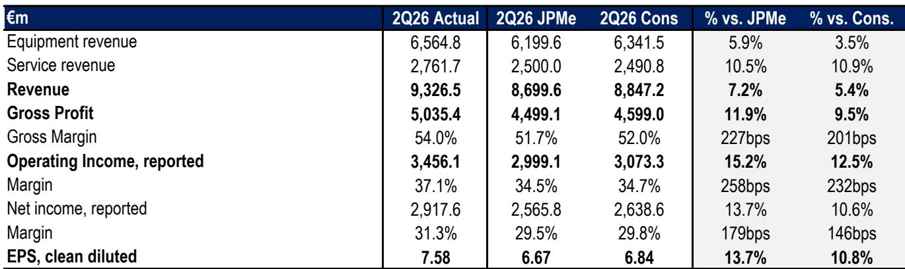
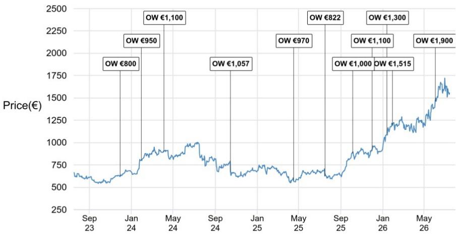

# JPM：ASML 2026年第二季度速评

这份JPM在ASML发布2026年第二季度财报后发布的研报，核心判断并非季度业绩本身，而是公司对2027和2028年产能的大幅扩张指引。报告认为，市场此前对ASML的长期增长潜力存在系统性低估，尤其是2028年的产能规划，将直接改写未来几年的盈利预期。

ASML二季度营收93.3亿欧元，超出公司此前84至90亿欧元的指引区间，也高于JPM和彭博一致预期。超预期部分主要来自装机管理业务（IBM），该业务贡献了约3亿欧元的额外收入。毛利率54%，同样高于公司指引的51-52%。但真正让分析师调整框架的，是公司对2026年全年收入指引的上调——从之前的360-400亿欧元区间，大幅提升至430-450亿欧元，中位数440亿欧元，较此前指引中位数高出16%。

## 1. 2028年产能规划是这份报告最重要的信号，它直接挑战了市场对ASML增长天花板的假设

研报最关键的证据来自公司对2027和2028年产能的明确指引。ASML计划在2027年将EUV产能提升30%（约85台），浸没式DUV产能同样提升30%；2028年在此基础上再增加30%。这意味着2028年的EUV和浸没式DUV产能分别达到约110台和210台。JPM指出，这一2028年产能指引甚至高于该行自己的预期，而该行此前已是卖方中对ASML最为乐观的机构之一。

基于这一产能规划，分析师粗略估算，ASML在2028年的每股盈利可能超过65欧元。这还只是基于当前产品组合的保守推算，尚未计入装机管理业务持续走强带来的额外贡献。报告强调，2028年的盈利潜力“显著高于市场一致预期”。

> **KC评论：** 市场此前对ASML的讨论主要集中在2026年的订单能见度和EUV出货量，但这份报告将时间轴拉到了2028年。产能扩张30%意味着什么？意味着ASML不仅是在满足现有需求，而是在为下一代制程（如1.4nm）和DRAM领域的EUV渗透做准备。如果这一规划落地，ASML的盈利中枢将被系统性上移。

## 2. 2026年增长已确认加速，但市场对2027-2028年的增速仍缺乏定价

报告显示，ASML预计2026年收入同比增长约34.7%，这一增速已超过市场对当年晶圆制造设备（WFE）整体增长的预期。更重要的是，公司实际上是在指引未来两年保持约30%的年增长率。这与市场此前认为ASML“产能受限”或“增长不如美国同行”的叙事形成鲜明对比。

从下游需求结构看，2026年先进逻辑代工收入预计增长约25%，存储收入增长约75%，后者受益于更高的光刻强度。ASML还透露，公司已接近获得2027年所需的全部EUV订单，这意味着2027年的产能规划有较强的订单支撑，而非纯粹的产能假设。

## 3. 中国业务占比稳定，但市场不应将其视为不确定性来源

报告指出，2026年中国仍将占ASML净销售额的约20%，主要由逻辑芯片驱动。这一比例与此前几个季度基本持平。市场此前对中国出口限制的担忧，在ASML的实际订单和指引中并未体现为谨慎冲击。公司管理层在电话会上还提到，英特尔已在18A制程中使用High NA EUV工具，这为High NA技术的成熟度提供了重要验证。

JPM认为，ASML相对于美国同行的估值折价是不合理的。2026年约35%的增长、以及未来两年30%的产能扩张，应该推动这一折价收窄。报告给出的核心论据是：市场此前认为ASML“增长不够快”或“产能受限”，但最新的产能指引和订单能见度已经推翻了这两个前提。

## 4. 一个可复用的观察框架：当一家设备公司的产能指引连续两年保持30%增长，且订单能见度已覆盖到次年，市场定价往往滞后于产能信号

对于关注半导体设备行业的读者，这份报告提供了一个值得留意的分析角度：不要只盯着季度订单和出货量，产能规划才是判断设备公司长期盈利能力的先行指标。ASML的案例表明，当一家公司主动披露未来两年的产能扩张计划，且该计划高于卖方最高预期时，市场通常需要几个季度才能完全消化这一信息对盈利预测的影响。

报告没有回避的一个细节是，ASML在2027年未能实现90台EUV的产能目标，但分析师认为，2028年更大幅度的扩张足以覆盖这一短期缺口。这提醒我们，在评估设备公司时，产能的节奏比相对数量更重要——只要趋势向上，短期偏差不影响长期判断。

For informational purposes only. Portions may be generated,translated,summarized,or edited with AI assistance based on source materials and may contain omissions or errors. Please verify independently. This is not investment,legal,tax,accounting,or other professional advice.

For informational purposes only. Portions may be generated,translated,summarized,or edited with AI assistance based on source materials and may contain omissions or errors. Please verify independently. This is not investment,legal,tax,accounting,or other professional advice.

