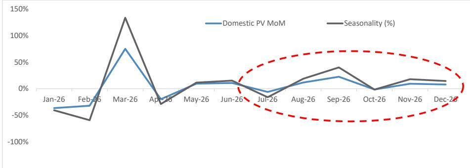
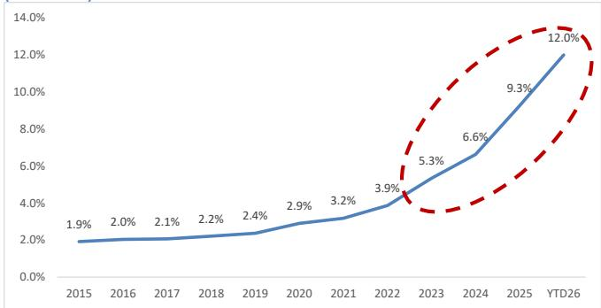
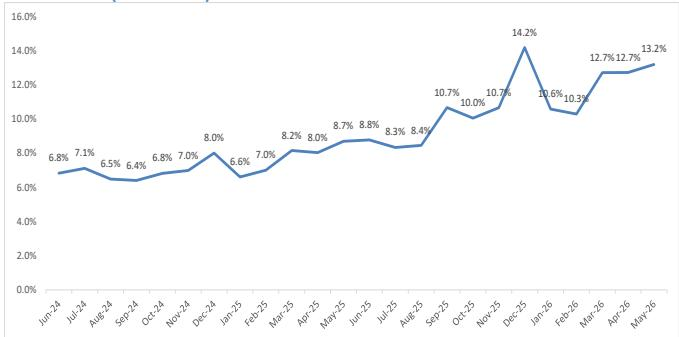
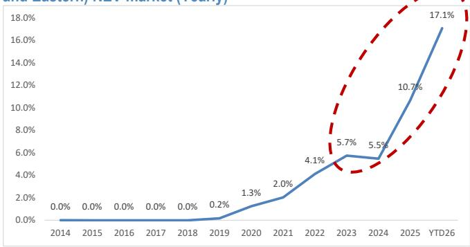
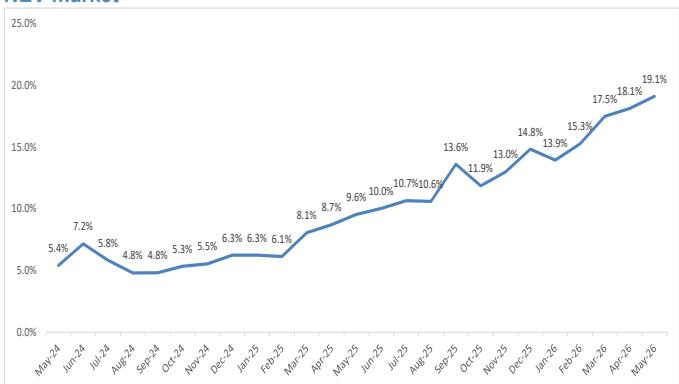
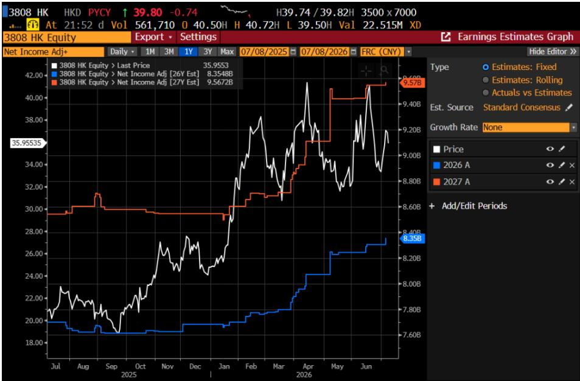
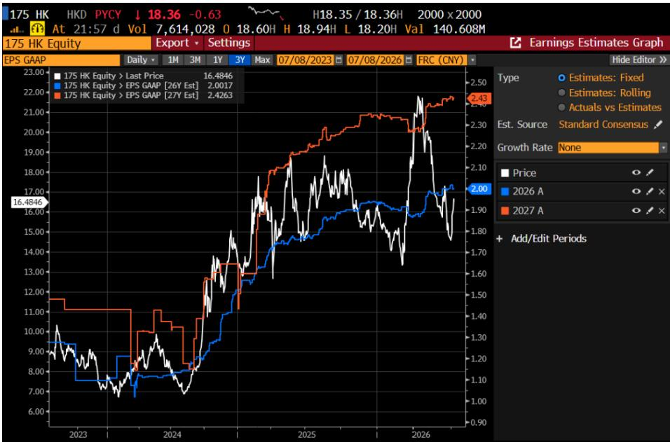
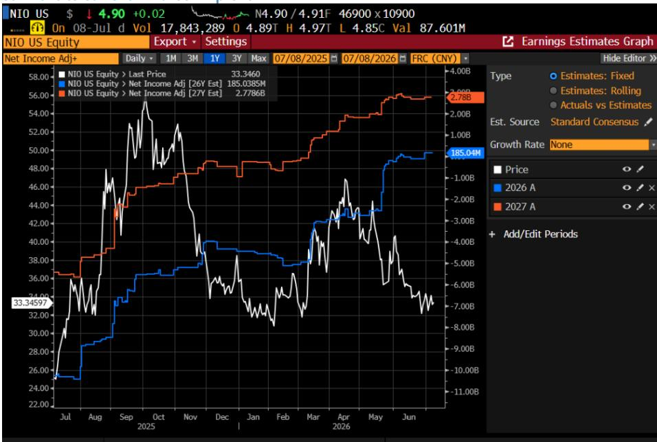
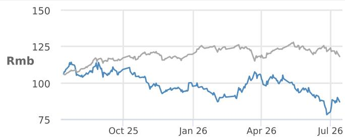

本材料无意向中国大陆读者分发，亦不构成在中国大陆境内提供证券投资咨询服务。未经JPM书面同意，不得转载、出售或重新分发本材料或其任何部分。

# 中国汽车行业

## 2026年第二季度业绩预览及其影响；下调上汽集团、广汽集团评级至低配

\- 2026年上半年表现分化；盈利修正趋势是股价表现最可靠的预测指标：以MSCI中国汽车指数衡量，中国汽车股年初至今累计下跌17%，表现不及MSCI中国指数（-10%）。个股表现分化，中国重汽（+49%）、吉利汽车（+4%）和蔚来（-6%）等表现较好的公司，其2026年上半年一致预期盈利均获上调；它们也是JPM预测高于市场一致预期的仅有的三家整车厂，正如我们在2026年投资主题（点击此处查看2月8日发布的“2026：2018+2025的重演”）中所强调的。在本报告中，我们预览整车厂的第二季度业绩，并基于相同的逻辑，即年内剩余时间的盈利上调动能，我们下半年的首选股为吉利，其次是蔚来，然后是比亚迪；我们预计在第二季度业绩期（8月）或全年一致预期中，存在盈利上调的潜力。

\- 下半年行业将持续的两大结构性趋势：1）国内方面，由于消费者信心不足，我们预计需求不会出现有意义的复苏，因此我们认为下半年进一步的政策刺激（如有）可能影响有限。在2026年上半年同比下降23%之后，我们预计下半年国内乘用车需求将基本维持在季节性水平附近或以下，尽管同比降幅应收窄至约-10%。国内市场的焦点在于新能源汽车在6月渗透率达到创纪录的63%之后的相对增长。拥有有竞争力新能源汽车产品的整车厂可能比同行更好地应对国内市场的挑战，例如比亚迪、小鹏汽车和零跑汽车。这些公司可能会因下半年新车型发布或随后的销售转化而获得积极的市场反应。2）在中国以外，情况则完全相反且非常积极；我们认为所有主要中国整车厂的海外销量指引都将被证明过于保守，或存在约20-50%的上行空间。海外市场将在2026年占主要整车厂收入的约30-50%。

\- 第三季度需关注的两件事：1）我们认为8月中下旬发布的第二季度/上半年业绩大多将不及预期（尤其是国有企业），少数符合预期（比亚迪）和超预期（吉利和蔚来）。有竞争力的产品组合和稳健的海外增长对于支撑整车厂的盈利能力至关重要。2）地缘政治方面，尽管目前不是我们的基准情景，但我们将关注暂定于9月下旬举行的下一次特习会之后，美国方面对中国汽车行业可能出现的任何增量政策转变。在美国以外，欧盟可能提议对中国插电式混合动力汽车征收反补贴关税（此处查看我们的报告）可能会引发负面市场情绪，但基本面上我们认为欧盟的关税或非关税壁垒充其量只能减缓但无法阻止中国整车厂在欧洲市场份额的增长。5月数据显示，中国整车厂在整个欧洲的市场份额达到13%的又一新高，而2025年为9%。我们目前预计到2028年中国品牌将在西欧占据20%市场份额的预测，可能会被证明是保守的。

\- 根据我们的盈利修正：1）我们将上汽集团和广汽集团的评级从中性下调至低配，诚然，这是在它们股价年初至今分别下跌33%/46%（MSCI中国指数-10%）之后的迟来的下调；我们认为这种不佳表现将持续。2）我们上调蔚来的预测并维持超配评级。我们预计第二季度业绩将超预期；吉利也应超预期。3）我们下调了部分整车厂的目标价，以反映在国内市场疲软和成本压力下更为保守的估值倍数。总而言之，我们建议关注那些盈利有上行空间、拥有强大新能源汽车产品组合且海外业务占比较高的整车厂。

## 中国

亚太区汽车行业研究主管

Nick Lai AC
(65) 6801-3176
nick.yc.lai@JPM.com

JPM证券（新加坡）私人有限公司/ JPM证券（亚太）有限公司/ JPM经纪（香港）有限公司

沈佳杰，CFA
(86-21) 6106 6352
jiajie.shen@jpmchase.com
SAC注册编号：S1730520030006
JPM证券（中国）有限公司

刘潇
(852) 2800-8629
cathy.xiao.liu@JPM.com
JPM证券（亚太）有限公司/
JPM经纪（香港）有限公司

温睿贝卡
(852) 2800-8505
rebecca.y.wen@JPM.com
JPM证券（亚太）有限公司/
JPM经纪（香港）有限公司

冯雪莉
(86-21) 6106-6149
shirley.x.feng@JPM.com
SAC注册编号：S1730524040001
JPM证券（中国）有限公司

请参阅第83页，了解分析师认证和重要披露，包括非美国分析师披露。

股票评级与目标价

<table><tr><td rowspan="2">公司</td><td rowspan="2">代码</td><td rowspan="2">市值（百万美元）</td><td rowspan="2">价格货币</td><td rowspan="2">价格</td><td colspan="2">评级</td><td colspan="4">目标价</td></tr><tr><td>当前</td><td>前次</td><td>当前</td><td>截止日期</td><td>前次</td><td>截止日期</td></tr><tr><td>比亚迪股份有限公司 - A</td><td>002594 CH</td><td>105,045</td><td>人民币</td><td>86.98</td><td>超配</td><td>不变</td><td>124.00</td><td>2026年12月</td><td>不变</td><td>不变</td></tr><tr><td>比亚迪股份有限公司 - H</td><td>1211 HK</td><td>87,652</td><td>港元</td><td>83.95</td><td>超配</td><td>不变</td><td>124.00</td><td>2026年12月</td><td>不变</td><td>不变</td></tr><tr><td>吉利汽车控股有限公司 (0175)</td><td>175 HK</td><td>21,222</td><td>港元</td><td>18.17</td><td>超配</td><td>不变</td><td>29.00</td><td>2026年12月</td><td>不变</td><td>不变</td></tr><tr><td>小鹏汽车 - H</td><td>9868 HK</td><td>5,323</td><td>港元</td><td>50.80</td><td>超配</td><td>不变</td><td>108.00</td><td>2026年12月</td><td>118.00</td><td>不变</td></tr><tr><td>小鹏汽车</td><td>XPEV US</td><td>10,704</td><td>美元</td><td>13.03</td><td>超配</td><td>不变</td><td>27.00</td><td>2026年12月</td><td>30.00</td><td>不变</td></tr><tr><td>蔚来</td><td>NIO US</td><td>10,863</td><td>美元</td><td>4.78</td><td>超配</td><td>不变</td><td>7.00</td><td>2026年12月</td><td>不变</td><td>不变</td></tr><tr><td>理想汽车</td><td>2015 HK</td><td>6,095</td><td>港元</td><td>47.42</td><td>低配</td><td>不变</td><td>38.00</td><td>2026年12月</td><td>56.00</td><td>不变</td></tr><tr><td>理想汽车 - ADR</td><td>LI US</td><td>11,906</td><td>美元</td><td>12.10</td><td>低配</td><td>不变</td><td>10.00</td><td>2026年12月</td><td>14.00</td><td>不变</td></tr><tr><td>浙江零跑科技股份有限公司</td><td>9863 HK</td><td>4,363</td><td>港元</td><td>36.38</td><td>超配</td><td>不变</td><td>60.00</td><td>2026年12月</td><td>90.00</td><td>不变</td></tr><tr><td>长城汽车 - A</td><td>601633 CH</td><td>20,202</td><td>人民币</td><td>15.00</td><td>中性</td><td>不变</td><td>14.00</td><td>2026年12月</td><td>19.00</td><td>不变</td></tr><tr><td>长城汽车 - H</td><td>2333 HK</td><td>9,920</td><td>港元</td><td>8.52</td><td>中性</td><td>不变</td><td>8.50</td><td>2026年12月</td><td>11.50</td><td>不变</td></tr><tr><td>上汽集团 - A</td><td>600104 CH</td><td>17,137</td><td>人民币</td><td>9.94</td><td>低配</td><td>中性</td><td>7.00</td><td>2026年12月</td><td>16.00</td><td>不变</td></tr><tr><td>广汽集团 - A</td><td>601238 CH</td><td>4,862</td><td>人民币</td><td>4.89</td><td>低配</td><td>中性</td><td>4.00</td><td>2026年12月</td><td>8.00</td><td>不变</td></tr><tr><td>广汽集团 - H</td><td>2238 HK</td><td>1,753</td><td>港元</td><td>2.04</td><td>低配</td><td>中性</td><td>1.10</td><td>2026年12月</td><td>3.30</td><td>不变</td></tr><tr><td>北京汽车股份有限公司 (1958)</td><td>1958 HK</td><td>798</td><td>港元</td><td>0.78</td><td>中性</td><td>不变</td><td>0.80</td><td>2026年12月</td><td>1.60</td><td>不变</td></tr><tr><td>重庆长安汽车 - A</td><td>000625 CH</td><td>8,409</td><td>人民币</td><td>6.89</td><td>低配</td><td>不变</td><td>4.50</td><td>2026年12月</td><td>6.60</td><td>不变</td></tr><tr><td>重庆长安汽车 - B</td><td>200625 CH</td><td>653</td><td>港元</td><td>3.12</td><td>低配</td><td>不变</td><td>2.00</td><td>2026年12月</td><td>2.50</td><td>不变</td></tr></table>

资料来源：公司数据，彭博财经资讯，JPM预测。n/c = 无变化。所有价格截至2026年7月13日，XPEV US [2026年7月10日] NIO US [2026年7月10日] LI US [2026年7月10日] 除外。

## 基于2026年第二季度业绩预览的下半年建议

## 平淡的2026年上半年将延续至下半年

以MSCI中国汽车指数衡量，中国汽车股年初至今整体表现落后市场4%（对比MSCI中国指数）。自上而下看，我们认为这种不佳表现将延续至下半年，因为整体汽车需求在下半年仍将同比下降。事实上，我们对过去几十年中国汽车股历史表现的分析表明，该行业股价表现与潜在需求动能之间存在高度相关性，例如，当潜在汽车需求加速或较上年增长时，该行业很可能上涨或相对表现更好，反之亦然。显然，在2026年上半年，整体汽车零售销量同比下降23%，批发销量（含出口）同比下降6%，这无助于股价表现。我们预测下半年国内零售乘用车需求仍将同比下降约10%，批发销量约下降2%至3%。

## 盈利超预期是最终的股价驱动因素和最可靠的预测指标

尽管该行业年初至今表现不佳，但个股表现差异显著。表现较好的公司——中国重汽（年初至今上涨49%，对比MSCI中国指数下跌10%）、吉利汽车（上涨4%）以及程度较轻的蔚来（小幅下跌6%）——其年内一致预期盈利均获上调。

在我们于2月8日发布的2026年投资主题报告“2026 = 2018+2025的重演”（点击此处）中，我们强调中国重汽和吉利汽车是今年的首选股，同时我们对蔚来的2026年预测也高于市场一致预期。在本报告中，我们提供了对整车厂和经销商第二季度或2026年上半年业绩的预览，并基于相同的投资主题，我们认为吉利汽车，其次是蔚来以及比亚迪，应成为读者下半年的关注焦点，原因在于1）可能的盈利上调动能，以及2）估值。

表1：彭博2026年一致预期盈利预测年初至今变化

<table><tr><td>百万元人民币</td><td>2026年1月</td><td>今日</td><td>变化百分比</td></tr><tr><td>比亚迪</td><td>47,854</td><td>39,677</td><td>-17%</td></tr><tr><td>吉利汽车</td><td>19,718</td><td>21,220</td><td>8%</td></tr><tr><td>蔚来（非GAAP）</td><td>(4,434)</td><td>16</td><td>100%</td></tr><tr><td>小鹏汽车（非GAAP）</td><td>2,397</td><td>(1,590)</td><td>-166%</td></tr><tr><td>理想汽车（非GAAP）</td><td>5,653</td><td>(528)</td><td>-109%</td></tr><tr><td>零跑汽车</td><td>3,753</td><td>3,035</td><td>-19%</td></tr><tr><td>长城汽车</td><td>15,083</td><td>11,161</td><td>-26%</td></tr><tr><td>上汽集团</td><td>13,806</td><td>11,277</td><td>-18%</td></tr><tr><td>广汽集团</td><td>(25)</td><td>(1,303)</td><td>-5071%</td></tr><tr><td>北京汽车</td><td>821</td><td>(345)</td><td>-142%</td></tr><tr><td>长安汽车</td><td>7,684</td><td>4,830</td><td>-37%</td></tr><tr><td>中国重汽</td><td>7,685</td><td>8,355</td><td>9%</td></tr></table>

资料来源：彭博财经资讯预测，截至2026年7月12日。

表2：第二季度或2026年上半年业绩预览：JPM预测 vs. 市场一致预期

<table><tr><td></td><td colspan="2">JPM</td><td colspan="2">市场一致预期</td><td colspan="2">差异 (%)</td></tr><tr><td>百万元人民币</td><td>第二季度预测</td><td>2026年预测</td><td>第二季度预测</td><td>2026年预测</td><td>第二季度预测</td><td>2026年预测</td></tr><tr><td>比亚迪</td><td>8,550</td><td>42,548</td><td>8,587</td><td>39,943</td><td>0%</td><td>7%</td></tr><tr><td>吉利汽车</td><td>5,250</td><td>25,057</td><td>4,996</td><td>21,243</td><td>5%</td><td>18%</td></tr><tr><td>蔚来（非GAAP）</td><td>-60</td><td>203</td><td>-313</td><td>16</td><td>81%</td><td>1169%</td></tr><tr><td>小鹏汽车（非GAAP）</td><td>-1,345</td><td>-3,710</td><td>-688</td><td>-1,590</td><td>-95%</td><td>-133%</td></tr><tr><td>理想汽车（非GAAP）</td><td>-1,068</td><td>-3,306</td><td>-951</td><td>-528</td><td>-12%</td><td>-526%</td></tr><tr><td>零跑汽车</td><td>250</td><td>2,605</td><td>294</td><td>3,035</td><td>-15%</td><td>-14%</td></tr><tr><td>长城汽车</td><td>2,700</td><td>10,515</td><td>2,296</td><td>11,161</td><td>18%</td><td>-6%</td></tr><tr><td>上汽集团 *</td><td>2,000</td><td>10,000</td><td>2,083</td><td>11,277</td><td>-4%</td><td>-11%</td></tr><tr><td>广汽集团*</td><td>亏损34-39亿人民币</td><td>-5,012</td><td>无意义</td><td>-1,303</td><td></td><td>-285%</td></tr><tr><td>北京汽车</td><td>-500</td><td>-1,154</td><td>无数据</td><td>-345</td><td></td><td>-234%</td></tr><tr><td>长安汽车*</td><td>500-800</td><td>3,476</td><td>无意义</td><td>4,830</td><td></td><td>-28%</td></tr><tr><td></td><td>上半年预测</td><td>2026年预测</td><td>上半年预测</td><td>2026年预测</td><td>上半年预测</td><td>2026年预测</td></tr><tr><td>中国重汽</td><td>40亿人民币</td><td>85亿</td><td>无数据</td><td>84亿</td><td></td><td>1%</td></tr></table>

资料来源：JPM预测，彭博财经资讯，截至2026年7月12日（“\*”表示彭博对这些公司的一致预期数据有限）。

## 回顾我们的自上而下观点（国内、海外、政策/地缘政治）

A. 中国国内需求：下行周期持续；“信心”是制约因素

在我们的渠道/实地调研或与管理层的讨论中，反复得到的反馈是“缺乏消费者信心”，我们仍持谨慎态度：我们预测2026年中国国内零售乘用车需求将同比下降15%，下半年需求基本低于或最多接近季节性趋势。

政策支持在边际上有所帮助，但（尚）不足以扭转下行周期的基准情景。6月的农村补贴计划被定位为以旧换新/执行/生态系统支持，但我们仍对上行空间持谨慎态度，因为宏观/消费者背景是核心问题。我们认为我们-15%的预测几乎没有上行惊喜。

## B. 竞争动态：依然激烈，但正逐渐从“ headline price”转向“产品+渠道+技术”

我们继续看到国内市场竞争激烈，但竞争手段的组合正在演变：更多地强调内容、技术、渠道和产品差异化，而非纯粹的价格削减。

成本上涨是一个重要的叠加因素（也是盈利分化的驱动因素）。我们认为，随着第一季度库存缓冲效应消退（电池材料+金属+芯片），成本上涨压力将从第二季度/6月起变得更加明显，整车厂的表现将因垂直整合程度、产品组合、定价纪律和海外业务敞口而异。

## C. 海外市场：结构性份额增长，但“政策贝塔”正在上升；欧洲是关键战场

出口仍然是最清晰的结构性增长主题。我们预测2026年中国汽车总出口（乘用车+商用车）将达到约980万辆（去年为710万辆），这既反映了销量动能，也反映了向新能源汽车的车型组合转变。

欧洲正日益成为一个混合动力过渡市场（纯电动汽车+插电式混合动力汽车/混合动力汽车），我们最近的欧洲之行表明，中国整车厂通过两种不同的战略获胜：1）提供从纯电动汽车、插电式混合动力汽车到内燃机/混合动力汽车的多种动力总成选择，以及2）物有所值的定价策略。我们的门店检查以及年度欧洲汽车会议进一步证实了这一观点（点击此处）。

然而，欧盟政策风险正在上升。欧盟峰会并未就新关税进行投票，但将议题重新定义为“产能过剩+再平衡”，并暗示了额外的防御性工具，而目前的纯电动汽车反补贴税（约30%）仍然有效。一个关键的细微差别：欧盟正在明确观察类别轮换（纯电动汽车→插电式混合动力汽车），这增加了下一轮收紧针对插电式混合动力汽车和/或更广泛的电动化车辆限制（例如，最低价格/数量上限；点击此处查看我们的分析）的可能性。

影响：赢家越来越多地是那些拥有本地化选择、品牌/售后信誉和生态系统差异化，以便在“边境摩擦”加剧时保护转化率的公司。

图1：中国汽车 - 2026年国内（零售）乘用车需求增长分析与预测 vs. 历史季节性（我们预测下半年国内需求可能大多低于季节性水平）

资料来源：中国汽车工业协会数据，中国乘用车市场信息联席会数据，以及JPM预测。截至2026年7月12日

表3：中国汽车 - 季度乘用车增长预测（批发和零售）

<table><tr><td></td><td>2026年第一季度实际</td><td>2026年第二季度实际</td><td>2026年第三季度预测</td><td>2026年第四季度预测</td><td>2026财年年度百分比</td></tr><tr><td>乘用车批发</td><td>5,935,284</td><td>6,784,141</td><td>7,292,517</td><td>9,004,243</td><td></td></tr><tr><td>环比-JPM预测</td><td>-33%</td><td>14%</td><td>7%</td><td>23%</td><td></td></tr><tr><td>季节性环比</td><td>-10%</td><td>4%</td><td>-1%</td><td>22%</td><td></td></tr><tr><td>同比-JPM预测</td><td>-8%</td><td>-5%</td><td>-5%</td><td>2%</td><td>-4%</td></tr><tr><td>零售乘用车</td><td>4,012,284</td><td>4,274,641</td><td>5,177,517</td><td>6,889,243</td><td></td></tr><tr><td>环比-JPM预测</td><td>-43%</td><td>7%</td><td>21%</td><td>33%</td><td></td></tr><tr><td>同比</td><td>-23%</td><td>-25%</td><td>-15%</td><td>-2%</td><td>-15%</td></tr></table>

资料来源：中国汽车工业协会数据，中国乘用车市场信息联席会数据，以及JPM预测。截至2026年7月12日。

图2：中国整车厂在整个欧洲乘用车市场（新能源汽车+内燃机）的份额

资料来源：彭博财经资讯数据和ThinkerCar数据。截至2026年7月12日

图3：中国整车厂在整个欧洲乘用车市场（新能源汽车+内燃机）的月度份额

资料来源：彭博财经资讯数据和ThinkerCar数据。截至2026年7月12日

图4：中国整车厂在整个欧洲（西欧和东欧）新能源汽车市场的份额（年度）

资料来源：彭博财经资讯数据和ThinkerCar数据。截至2026年7月12日

图5：中国整车厂在整个欧洲新能源汽车市场的月度份额

资料来源：彭博财经资讯数据和ThinkerCar数据。截至2026年7月12日

\- 中国整车厂正在欧洲（包括东欧和西欧）迅速获得市场份额。

\- 最新数据显示，中国品牌年初至今在欧洲的整体市场份额已达到12%，仅5月份就达到13%。

\- 同样，在新能源汽车市场，中国品牌也迅速获得份额——年初至今为17%，仅5月份就达到19%。

\- 我们的欧盟汽车分析师Jose Asumendi预测，到2028年，中国品牌将在西欧获得20%的市场份额。我们相信，按照目前的速度，这一目标可能在2028年之前实现。

图6：中国重汽2026年一致预期盈利预测从2026年1月的77亿人民币利润上调至目前的84亿人民币

资料来源：彭博财经资讯一致预期。截至2026年7月12日。

图7：吉利汽车2026年一致预期每股收益预测从2026年1月的1.9人民币/股上调至目前的2.0人民币/股

资料来源：彭博财经资讯一致预期。截至2026年7月12日。

图8：蔚来2026年一致预期（非GAAP）盈利预测从2026年1月的44亿人民币亏损上调至目前的1.85亿人民币利润

资料来源：彭博财经资讯一致预期。截至2026年7月12日。

# 比亚迪股份有限公司 - A

## 超配

002594.SZ,002594 CH

价格（2026年7月13日）：86.98人民币

目标价（2026年12月）：124.00人民币

## 中国

亚太区汽车行业研究主管

Nick Lai AC
(65) 6801-3176
nick.yc.lai@JPM.com
JPM证券（新加坡）私人有限公司/ JPM证券（亚太）
有限公司/ JPM经纪（香港）
有限公司

## 风格暴露

<table><tr><td rowspan="2">量化因子</td><td rowspan="2">当前%排名</td><td colspan="4">历史%排名（1=最高）</td></tr><tr><td>6个月</td><td>1年</td><td>3年</td><td>5年</td></tr><tr><td>价值</td><td>32</td><td>40</td><td>43</td><td>62</td><td>65</td></tr><tr><td>成长</td><td>46</td><td>15</td><td>4</td><td>2</td><td>63</td></tr><tr><td>动量</td><td>82</td><td>92</td><td>9</td><td>27</td><td>15</td></tr><tr><td>质量</td><td>40</td><td>30</td><td>20</td><td>56</td><td>79</td></tr><tr><td>低波动</td><td>37</td><td>39</td><td>39</td><td>47</td><td>82</td></tr><tr><td>ESGQ</td><td>1</td><td>26</td><td>26</td><td>1</td><td>9</td></tr></table>

风格暴露来源 – JPM全球市场策略；所有其他表格均为公司数据和JPM预测。

## 2026年第二季度预览

\- 中国业务发展：从销量角度看，我们认为第一季度是低谷，从第二季度开始到下半年将加速，这得益于新车型的推出，特别是搭载第二代超快充刀片电池解决方案的新车型，这将推动销量和产品组合。我们预计，搭载新型闪充电池解决方案的新车型将在第四季度占国内销量的20-30%左右，鉴于其较高的平均售价（约18-20万人民币或以上），这将成为国内盈利能力的重要驱动因素。

\- 海外战略/计划：海外业务被定位为主要的盈利引擎；我们预测比亚迪将在海外市场交付约180万辆，高于去年的100万辆。其中，欧洲、东盟以及拉丁美洲各约占三分之一。在我们最近于伦敦举行的欧洲汽车会议上，比亚迪管理层表示，公司将在下半年将最新的闪充车型引入欧洲，目标是在未来一年内建设3,000个充电桩，或在全球市场总共建设6,000个充电桩。

\- 接下来关注什么？1）短期内，8月下旬的中期或第二季度业绩将是关键。我们的预期是，比亚迪第二季度将实现约85亿人民币的利润，与市场一致预期基本一致。

2）中期内，我们将关注9月下旬下一次特习会之后，美国方面对中国汽车行业可能出现的任何政策转变。虽然美国对中国投资或进入持开放态度并非我们的基准情景，但我们认为任何增量的政策转变都值得关注。

3）长期来看，比亚迪最近推出的自研4纳米ADAS芯片应于2027年开始应用于其新车型。这将是比亚迪基于自研能力实现车辆自主驾驶努力的一个重要里程碑。同时，我们也将关注比亚迪在人形机器人业务方面的举措；我们认为，无论是在其工厂内部使用还是用于外部商业机会，比亚迪的成本优势都将有助于公司发展。

表4：比亚迪季度销量和盈利能力分析与预测

<table><tr><td>单位销量</td><td>2025年第一季度实际</td><td>2025年第二季度实际</td><td>2025年第三季度实际</td><td>2025年第四季度实际</td><td>2026年第一季度实际</td><td>2026年第二季度预测</td><td>2026年第三季度预测</td><td>2026年第四季度预测</td><td>2026年预测</td></tr><tr><td>国内销量</td><td>780,014</td><td>868,991</td><td>872,785</td><td>997,550</td><td>379,298</td><td>636,957</td><td>840,000</td><td>950,000</td><td>2,806,255</td></tr><tr><td>出口销量</td><td>220,790</td><td>276,159</td><td>241,407</td><td>344,740</td><td>321,165</td><td>471,091</td><td>520,000</td><td>550,000</td><td>1,862,256</td></tr><tr><td>总销量</td><td>1,000,804</td><td>1,145,150</td><td>1,114,192</td><td>1,342,290</td><td>700,463</td><td>1,108,048</td><td>1,360,000</td><td>1,500,000</td><td>4,668,511</td></tr><tr><td>人民币单车综合利润（人民币）</td><td>9,148</td><td>5,550</td><td>7,021</td><td>7,197</td><td>5,831</td><td>7,722</td><td>9,068</td><td>9,733</td><td></td></tr><tr><td>净利润总额（百万元人民币）</td><td>9,155</td><td>6,356</td><td>7,823</td><td>9,661</td><td>4,085</td><td>8,557</td><td>12,332</td><td>14,600</td><td>39,573</td></tr><tr><td>2026年预计ESS贡献（百万元人民币）</td><td></td><td></td><td></td><td></td><td></td><td></td><td></td><td></td><td>2,975</td></tr><tr><td>预计总利润（百万元人民币）</td><td></td><td></td><td></td><td></td><td></td><td></td><td></td><td></td><td>42,548</td></tr></table>

资料来源：比亚迪公司数据和JPM预测。截至2026年7月12日。

价格表现

— 002594.SZ 价格（人民币） SSEA（重新调整）

<table><tr><td></td><td>年初至今</td><td>1个月</td><td>3个月</td><td>12个月</td></tr><tr><td>相对</td><td>-11.0%</td><td>-5.0%</td><td>-16.6%</td><td>-19.4%</td></tr><tr><td>相对</td><td>-9.6%</td><td>-2.1%</td><td>-14.7%</td><td>-30.7%</td></tr></table>

<table><tr><td colspan="2">公司数据</td></tr><tr><td>流通股数（百万）</td><td>8,184</td></tr><tr><td>52周价格区间（人民币）</td><td>
