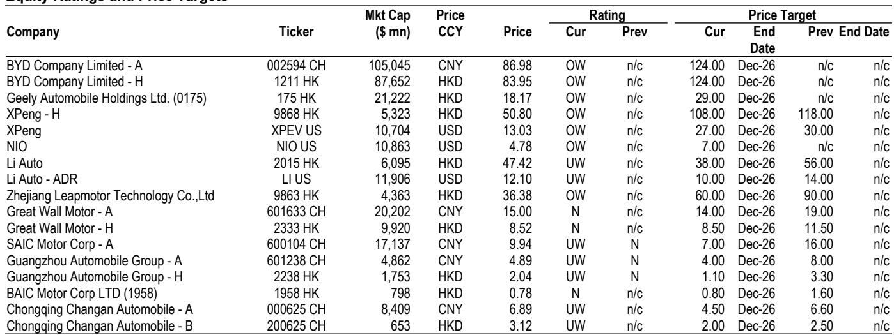
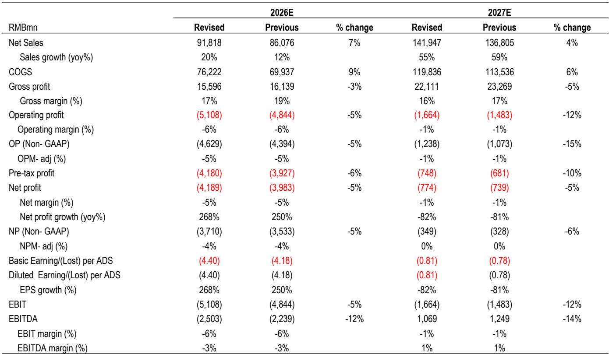

# JPM：中国汽车行业，2Q26业绩预览与影响，上汽广汽降至低配

上半年中国汽车板块整体表现弱于市场，MSCI中国汽车指数下跌17%，而同期MSCI中国指数只跌了10%。但公司分化剧烈——中国重汽涨49%，吉利涨4%，蔚来仅跌6%，这三家恰好是上半年相对少见获得盈利上修的公司。JPM在最新发布的行业预览报告中指出，下半年选车的核心逻辑依然不是销量、不是政策、甚至不是估值，而是盈利修正方向。

报告认为，国内需求短期难以出现有意义的复苏。1H26零售端同比下滑23%，下半年预计仍将低于季节性趋势，全年零售跌幅可能在15%左右。消费者信心不足是核心约束，6月出台的农村补贴政策更多是框架性支持，尚未改变宏观和消费的基本面。这意味着，依赖国内市场的公司，下半年盈利仍在调整不会减轻。

海外市场则是完全不同的叙事。报告判断，主要中国车企的海外销量指引普遍偏保守，实际存在20%到50%的上修空间。2026年海外市场可能占到头部车企收入的30%到50%。欧洲市场尤其关键——5月数据显示，中国品牌在整个欧洲的市占率已达到13%，较2025年的9%再创新高。JPM此前预测中国品牌到2028年拿下西欧20%的份额，现在看来可能偏保守。

> **KC评论：** 国内需求与海外增长之间的剪刀差，是理解下半年汽车股分化的关键。报告的核心判断是：谁能在海外市场兑现超预期的销量和利润，谁就能获得盈利上修，进而驱动报价表现。国内市场的竞争已经从纯价格战转向产品、渠道和技术的综合较量，成本通胀不确定性从二季度开始显现，垂直整合能力和海外敞口成为区分盈利质量的核心变量。

## 1. 盈利修正方向比相对估值更可靠

报告通过对比上半年各车企的盈利修正与报价表现，发现了一个高度一致的规律：获得盈利上修的公司，报价表现显著优于同行。吉利全年盈利预测从1月的197亿元上修至212亿元，蔚来从亏损44亿元转为接近盈亏平衡，中国重汽也获得9%的上修。这三家恰好是上半年表现最好的整车股。

相反，盈利预测被大幅下调的公司，报价跌幅也最为惨烈。广汽全年盈利预测从亏损2500万元扩大至亏损13亿元，长安汽车从77亿元下调至48亿元，小鹏从盈利24亿元转为亏损16亿元。报告认为，盈利修正趋势是报价最可靠的预测指标，这一逻辑在下半年依然适用。

## 2. 二季度业绩将出现明显分化，国企不确定性最大

报告对二季度业绩的预览显示，多数国企可能低于预期，而部分民企有望超预期。具体来看，比亚迪二季度盈利预计与市场共识基本持平，吉利和蔚来则可能分别高出共识5%和81%。上汽、广汽、长安等国企的盈利预测均低于市场预期，广汽二季度甚至可能出现34亿到39亿元的亏损。

报告据此调整了评级：将上汽和广汽从中性下调至低配，承认这一调整来得偏晚——两家公司年内报价已分别下跌33%和46%。同时上调蔚来的盈利预测并维持超配，认为吉利也将超预期。整体建议聚焦于那些具备盈利上修潜力、拥有强新能源产品组合和高海外敞口的公司。

## 3. 欧洲政策不确定性在上升，但不会逆转份额增长

欧盟尚未投票通过新的关税提案，但已将讨论框架从单纯的关税转向“产能过剩与再平衡”，并暗示可能推出额外的防御性工具。一个关键细节是：欧盟正在关注车型类别的轮动，即从纯电转向插电混动，这意味着下一轮收紧可能针对PHEV或更广泛的电动化车辆限制，例如最低价格或销量上限。

但报告认为，关税和非关税壁垒最多只能减缓、无法阻止中国车企在欧洲的市场份额增长。5月数据已经证明，即便在现有约30%的反补贴关税下，中国品牌仍在加速渗透。真正决定胜负的，是车企是否具备本地化生产的可选性、品牌和售后服务的可信度，以及生态系统的差异化能力。

下半年还有两个关键事件值得关注：8月中下旬的二季度业绩披露期，以及9月底可能举行的中美领导人会晤后，美国对华汽车产业政策的任何边际变化。但无论外部环境如何变化，盈利修正方向依然是区分赢家和输家的最可靠标尺。

For informational purposes only. Portions may be generated,translated,summarized,or edited with AI assistance based on source materials and may contain omissions or errors. Please verify independently. This is not investment,legal,tax,accounting,or other professional advice.

For informational purposes only. Portions may be generated,translated,summarized,or edited with AI assistance based on source materials and may contain omissions or errors. Please verify independently. This is not investment,legal,tax,accounting,or other professional advice.

