本材料无意向中国大陆读者分发，亦不构成在中国大陆境内提供证券投资咨询服务。未经JPM书面同意，不得转载、出售或重新分发本材料或其任何部分。

## 中国家电行业

## 6月AVC数据表现平淡，补贴基数扰动，龙头企业韧性显现

## 最新动态

根据AVC（奥维云网）数据，2026年6月中国家电零售额同比下降19%（表1），较5月的-9%有所走弱，尽管基数相对友好。两年复合增速也降至-4%，而5月和4月分别为+20%和+1%。从二季度来看，零售额同比下降15%，一季度为-10%；两年复合增速则从-1%改善至+5%。换言之，6月单月表现偏弱，但季度数据更为复杂——考虑到以旧换新补贴周期带来的不均匀基数，这些增长指标存在较大扰动。

因此，市场讨论的焦点并非具体的增长率，而是6月数据究竟释放了什么信号：是天气/基数/时点因素的短期波动，还是补贴退坡后需求持续走弱的迹象？我们倾向于周期性解读，认为走弱主要受到补贴效应递减和消费意愿变化的影响，而非结构性需求转折。总体而言，我们对美的/海尔（均给予增持评级）的积极看法并非建立在中国家电上行周期之上，而是基于其B2B业务和海外增长机会。美的仍是我们首选标的；详情请参见我们近期的深度报告。

## 亚太区消费研究联席主管及亚洲博彩/休闲研究主管

DS Kim AC (852) 2800-8597 ds.kim@JPM.com

Yibo Wu  
(852) 2800-8559  
yibo.wu@JPM.com  
JPM证券（亚太）有限公司/ JPM经纪（香港）有限公司

表1：AVC家电零售额、销量及均价增速  
线上与线下零售额增速加权平均（权重：线下/线上各50%，吸尘器除外为10/90）

<table><tr><td rowspan="2"></td><td colspan="7">同比增速</td><td colspan="3">两年复合增速</td></tr><tr><td>2025年4月</td><td>2025年5月</td><td>2025年6月 ...</td><td>2026年4月</td><td>2026年5月</td><td>2026年6月</td><td>2026年4月</td><td>2026年5月</td><td>2026年6月</td><td></td></tr><tr><td>零售总额</td><td>20%</td><td>33%</td><td>19%</td><td>-16%</td><td>-9%</td><td>-19%</td><td>1%</td><td>21%</td><td>-4%</td><td></td></tr><tr><td>线下</td><td>19%</td><td>37%</td><td>26%</td><td>-14%</td><td>-11%</td><td>-22%</td><td>2%</td><td>21%</td><td>-2%</td><td></td></tr><tr><td>线上</td><td>22%</td><td>29%</td><td>12%</td><td>-18%</td><td>-7%</td><td>-16%</td><td>0%</td><td>20%</td><td>-6%</td><td></td></tr><tr><td>零售总额</td><td>20%</td><td>33%</td><td>19%</td><td>-16%</td><td>-9%</td><td>-19%</td><td>1%</td><td>21%</td><td>-4%</td><td></td></tr><tr><td>空调</td><td>22%</td><td>42%</td><td>30%</td><td>-24%</td><td>-14%</td><td>-28%</td><td>-8%</td><td>23%</td><td>-6%</td><td></td></tr><tr><td>冰箱</td><td>9%</td><td>17%</td><td>2%</td><td>-3%</td><td>-6%</td><td>-11%</td><td>5%</td><td>10%</td><td>-10%</td><td></td></tr><tr><td>洗衣机</td><td>14%</td><td>30%</td><td>15%</td><td>-3%</td><td>-4%</td><td>-17%</td><td>10%</td><td>25%</td><td>-4%</td><td></td></tr><tr><td>厨电/水家电</td><td>21%</td><td>31%</td><td>15%</td><td>-12%</td><td>-6%</td><td>-13%</td><td>7%</td><td>24%</td><td>0%</td><td></td></tr><tr><td>吸尘器</td><td>71%</td><td>36%</td><td>27%</td><td>-24%</td><td>-8%</td><td>13%</td><td>29%</td><td>25%</td><td>43%</td><td></td></tr><tr><td>销量</td><td>17%</td><td>29%</td><td>21%</td><td>-14%</td><td>-4%</td><td>-15%</td><td>1%</td><td>24%</td><td>2%</td><td></td></tr><tr><td>空调</td><td>23%</td><td>42%</td><td>33%</td><td>-22%</td><td>-5%</td><td>-25%</td><td>-4%</td><td>35%</td><td>0%</td><td></td></tr><tr><td>冰箱</td><td>5%</td><td>12%</td><td>3%</td><td>-4%</td><td>-5%</td><td>-6%</td><td>0%</td><td>6%</td><td>-3%</td><td></td></tr><tr><td>洗衣机</td><td>2%</td><td>22%</td><td>15%</td><td>2%</td><td>4%</td><td>-12%</td><td>4%</td><td>28%</td><td>2%</td><td></td></tr><tr><td>厨电/水家电</td><td>13%</td><td>18%</td><td>11%</td><td>-13%</td><td>-5%</td><td>-11%</td><td>-1%</td><td>12%</td><td>-1%</td><td></td></tr><tr><td>吸尘器</td><td>60%</td><td>40%</td><td>35%</td><td>-25%</td><td>-7%</td><td>7%</td><td>21%</td><td>31%</td><td>45%</td><td></td></tr><tr><td>均价</td><td>3%</td><td>3%</td><td>-2%</td><td>-2%</td><td>-6%</td><td>-4%</td><td>1%</td><td>-3%</td><td>-6%</td><td></td></tr><tr><td>空调</td><td>-1%</td><td>0%</td><td>-3%</td><td>-3%</td><td>-9%</td><td>-3%</td><td>-4%</td><td>-9%</td><td>-6%</td><td></td></tr><tr><td>冰箱</td><td>4%</td><td>4%</td><td>-1%</td><td>1%</td><td>-1%</td><td>-5%</td><td>5%</td><td>3%</td><td>-7%</td><td></td></tr><tr><td>洗衣机</td><td>12%</td><td>6%</td><td>0%</td><td>-6%</td><td>-8%</td><td>-6%</td><td>5%</td><td>-3%</td><td>-5%</td><td></td></tr><tr><td>厨电/水家电</td><td>6%</td><td>11%</td><td>3%</td><td>1%</td><td>-1%</td><td>-2%</td><td>7%</td><td>10%</td><td>1%</td><td></td></tr><tr><td>吸尘器</td><td>7%</td><td>-3%</td><td>-6%</td><td>1%</td><td>-1%</td><td>5%</td><td>7%</td><td>-4%</td><td>-1%</td><td></td></tr></table>

数据来源：AVC

## 需求细节分析

- **整体需求**：AVC数据显示，2026年6月家电零售额同比下降19%，较5月的-9%有所走弱，尽管基数更为友好。两年复合增速也降至-4%，而5月和4月分别为+20%和+1%。6月单月表现确实偏弱，但考虑到以旧换新补贴周期带来的不均匀基数，我们不会过度解读单月数据。

- **分渠道**：放缓趋势在线上和线下渠道均有体现。6月线上销售额同比下降16%（5月为-7%），两年复合增速为-6%（5月为+20%）；线下销售额同比下降22%（5月为-11%），两年复合增速为-2%（5月为+21%）。这表明走弱并非单纯的渠道因素，不过线上渠道受补贴效应递减和价格敏感型需求的影响可能更为明显。

- **分品类**：空调是最大的拖累项，因其是6月最大的单一品类，过去五年占6月销售额的40%以上。空调销售额同比下降28%，较5月的-14%进一步走弱14个百分点；两年复合增速为-6%，较5月的+23%回落30个百分点。天气偏凉/多雨有一定影响，但走弱并非仅由天气因素导致：冰箱、洗衣机和厨电的同比/两年复合增速也分别出现5-10个/20-30个百分点的回落。吸尘器是明显的例外，同比增长13%（5月为-8%），两年复合增速为43%（5月为27%），主要由销量驱动。

- **量价分析**：这是数据中最复杂的部分——同比数据显示销量是问题所在，但基数并不干净。空调销量同比下降25%，较5月走弱20个百分点；均价同比下降3%，较5月的-9%有所改善。冰箱和洗衣机销量同比下降6-12%，较5月走弱约10个百分点；均价同比下降5-6%，与5月相近。从表面看，这似乎是销量驱动的走弱；但考虑到去年补贴冲刺期的需求，我们认为这夸大了潜在需求的真实变化。从两年复合增速来看，白电销量基本持平，在低个位数范围内波动；均价则呈中高个位数下降。因此，更清晰的结论是：销量在补贴提前释放后正在正常化，而非崩溃；但消费者仍在降级消费/购买更便宜的产品组合，线上线下渠道均是如此。吸尘器是例外，销量同比增长7%，较5月改善14个百分点；均价同比增长5%，较5月改善6个百分点。

图1：中国家电 - AVC零售额同比增速  
线上与线下零售额同比增速均值  
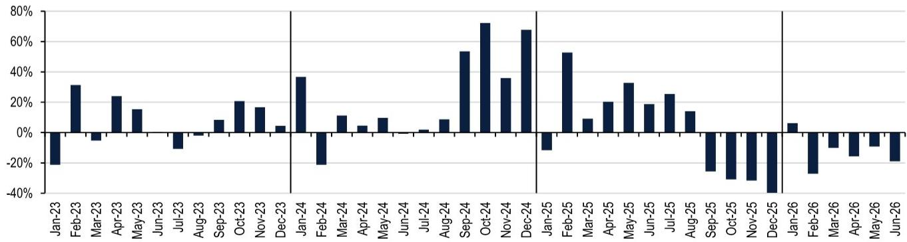  
数据来源：AVC

图2：空调 - 零售额同比增速 线上与线下零售额同比增速均值  
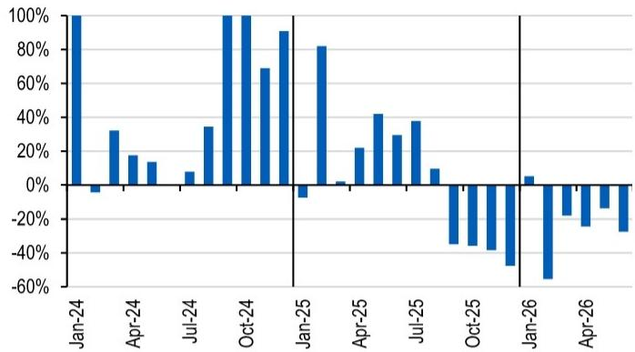

图3：冰箱 - 零售额同比增速 线上与线下零售额同比增速均值  
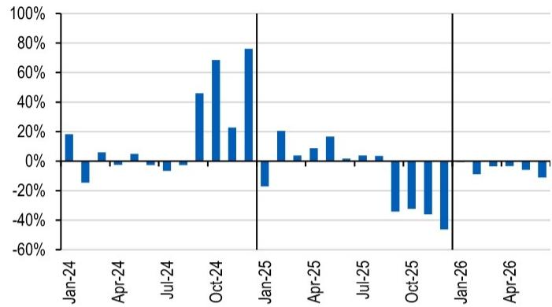  
数据来源：AVC  
数据来源：AVC

图4：洗衣机 - 零售额同比增速 线上与线下零售额同比增速均值  
图5：吸尘器 - 零售额同比增速  
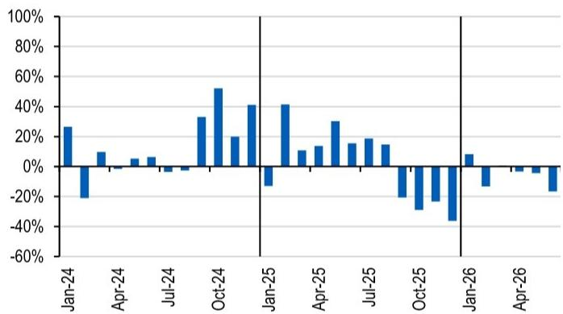  
数据来源：AVC

线上与线下零售额同比增速加权平均，线上权重为90%。涵盖吸尘器、扫地机器人和洗地机品类  
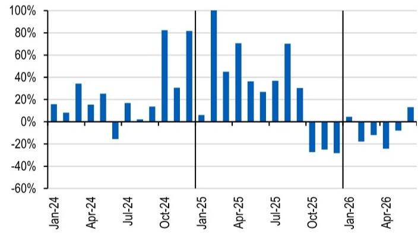  
数据来源：AVC

## 市场份额趋势（线上线下合计）

- **家电行业整体**：尽管6月行业需求偏弱，但份额趋势并非全面负面。美的整体市场份额从2026年前五个月的25.2%提升至26.3%，主要得益于其在空调领域的季节性强势，该领域其仍为明确领先者。海尔整体市场份额从2026年前五个月的24.3%降至23.7%，但这主要是品类结构因素（即6月空调占比偏高）；分品类数据显示海尔在多数细分领域份额均有提升。

- **空调**：美的市场份额从2026年前五个月的33.2%提升至34.9%，保持第一。格力排名第二，但份额从2026年前五个月的29.7%降至25.4%。海尔份额从2026年前五个月的13%提升至14.3%，小米份额从5.4%提升至6.9%，受益于618线上促销期。

- **冰箱**：海尔市场份额从2026年前五个月的40%提升至43.7%，主要得益于线上渠道份额增长。美的份额从21.5%降至20.4%。

- **洗衣机**：海尔市场份额稳定在39.2%（2026年前五个月为39.2%），美的份额从34.5%提升至35.0%，主要受线下渠道驱动。

- **吸尘器**：科沃斯市场份额从2026年前五个月的29.1%提升至31.0%，与其通常的季节性强势表现基本一致。

图6：美的 - 按零售额计算的市场份额  
所有品类（空调、冰箱、洗衣机、厨电/水家电和吸尘器）的线上线下平均市场份额  
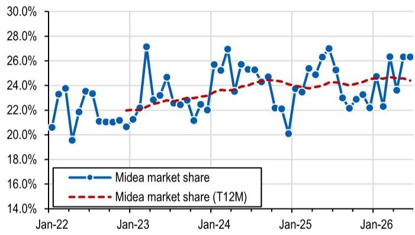  
数据来源：AVC

图8：美的、海尔、格力和小米 - 按零售额计算的空调市场份额  
图7：海尔 - 按零售额计算的市场份额  
所有品类（空调、冰箱、洗衣机、厨电/水家电和吸尘器）的线上线下平均市场份额  
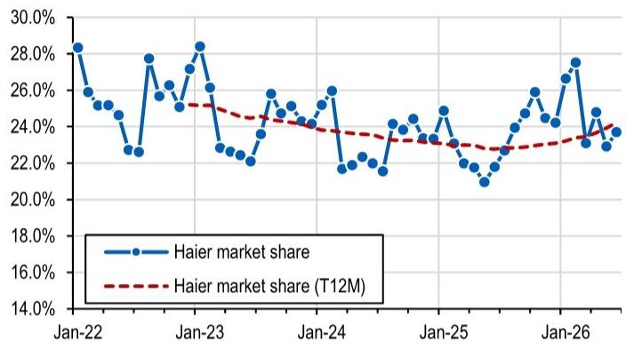  
数据来源：AVC

线上线下平均市场份额  
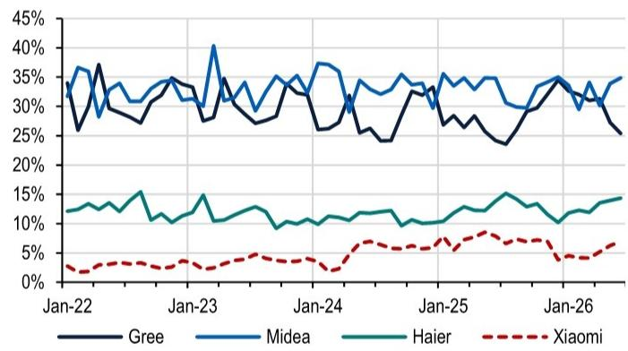

图9：美的、海尔、格力和小米 - 按零售额计算的空调市场份额（过去6个月滚动）  
线上线下平均市场份额  
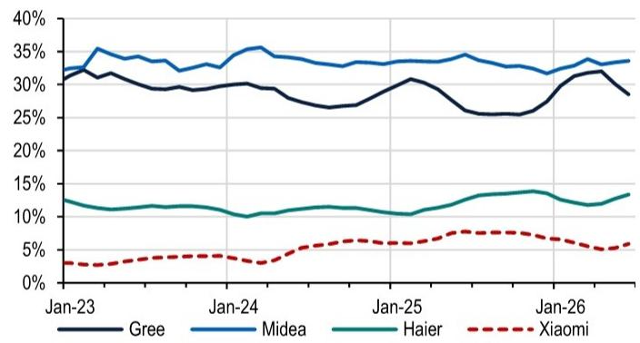  
数据来源：AVC  
数据来源：AVC

图10：老板电器 - 按零售额计算的厨电市场份额 油烟机和燃气灶品类的线上线下平均市场份额  
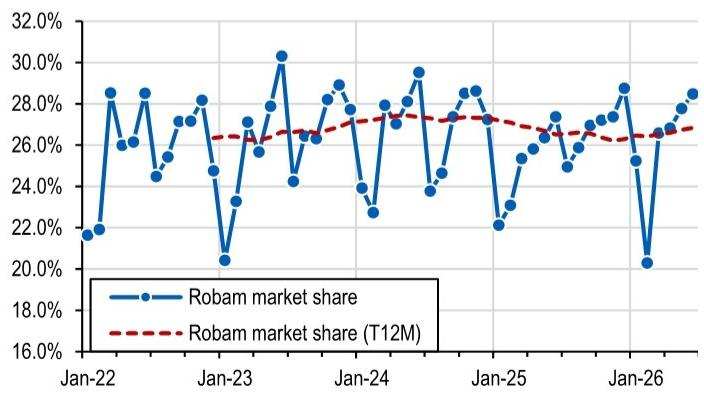  
数据来源：AVC

图11：科沃斯 - 按零售额计算的吸尘器市场份额  
吸尘器、扫地机器人和洗地机品类的加权平均市场份额（线上权重90%，线下权重10%）  
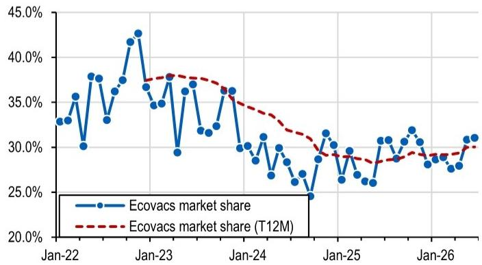  
数据来源：AVC

图12：空调 - 线下零售均价趋势  
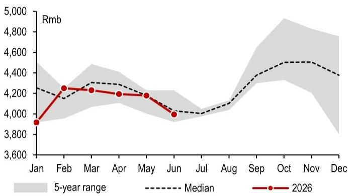

图13：空调 - 线上零售均价趋势  
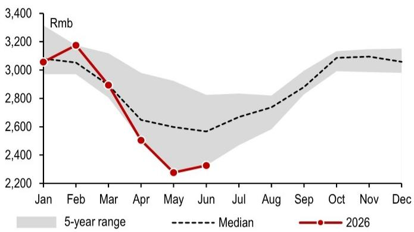  
数据来源：AVC

图14：冰箱 - 线下零售均价趋势  
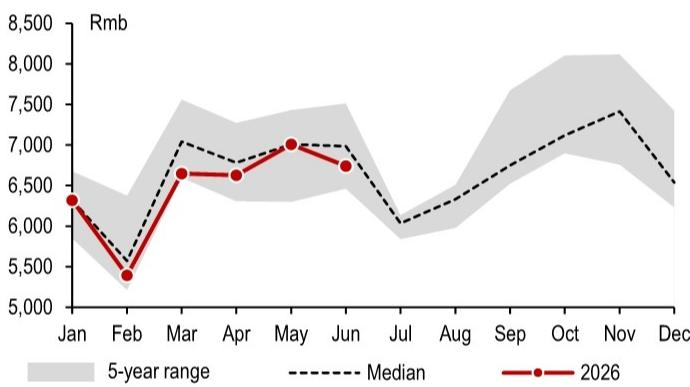  
数据来源：AVC

图15：冰箱 - 线上零售均价趋势  
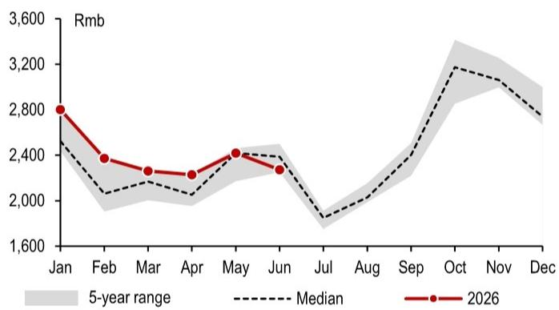  
数据来源：AVC

图16：洗衣机 - 线下零售均价趋势  
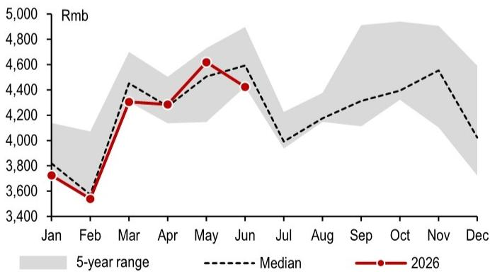  
数据来源：AVC

图17：洗衣机 - 线上零售均价趋势  
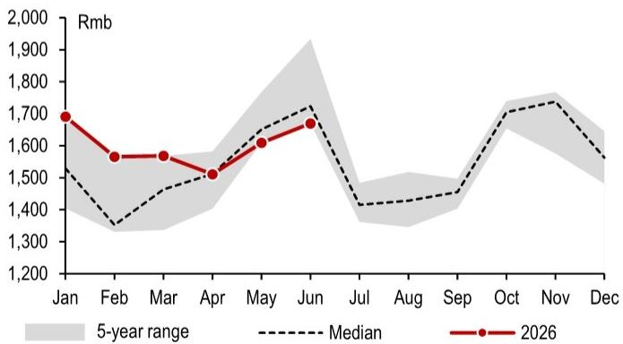

表2：AVC零售额及均价同比增速 - 空调、冰箱和洗衣机

<table><tr><td rowspan="3"></td><td colspan="4">空调</td></tr><tr><td colspan="2">线下</td><td colspan="2">线上</td></tr><tr><td>销售额</td><td>均价</td><td>销售额</td><td>均价</td></tr><tr><td>2024年1月</td><td>50%</td><td>-2%</td><td>155%</td><td>-6%</td></tr><tr><td>2024年2月</td><td>-68%</td><td>-4%</td><td>59%</td><td>0%</td></tr><tr><td>2024年3月</td><td>-21%</td><td>-3%</td><td>85%</td><td>-4%</td></tr><tr><td>2024年4月</td><td>-13%</td><td>1%</td><td>48%</td><td>-9%</td></tr><tr><td>2024年5月</td><td>-1%</td><td>2%</td><td>29%</td><td>-8%</td></tr><tr><td>2024年6月</td><td>-14%</td><td>-2%</td><td>14%</td><td>-8%</td></tr><tr><td>2024年7月</td><td>-7%</td><td>-1%</td><td>23%</td><td>-9%</td></tr><tr><td>2024年8月</td><td>13%</td><td>0%</td><td>56%</td><td>-7%</td></tr><tr><td>2024年9月</td><td>71%</td><td>5%</td><td>146%</td><td>1%</td></tr><tr><td>2024年10月</td><td>114%</td><td>9%</td><td>95%</td><td>5%</td></tr><tr><td>2024年11月</td><td>79%</td><td>7%</td><td>59%</td><td>5%</td></tr><tr><td>2024年12月</td><td>101%</td><td>8%</td><td>81%</td><td>3%</td></tr><tr><td>2025年1月</td><td>5%</td><td>-4%</td><td>20%</td><td>4%</td></tr><tr><td>2025年2月</td><td>141%</td><td>1%</td><td>23%</td><td>-3%</td></tr><tr><td>2025年3月</td><td>0%</td><td>4%</td><td>4%</td><td>-1%</td></tr><tr><td>2025年4月</td><td>12%</td><td>2%</td><td>32%</td><td>-1%</td></tr><tr><td>2025年5月</td><td>39%</td><td>1%</td><td>45%</td><td>0%</td></tr><tr><td>2025年6月</td><td>39%</td><td>-3%</td><td>20%</td><td>-5%</td></tr><tr><td>2025年7月</td><td>38%</td><td>-1%</td><td>38%</td><td>7%</td></tr><tr><td>2025年8月</td><td>11%</td><td>1%</td><td>8%</td><td>5%</td></tr><tr><td>2025年9月</td><td>-42%</td><td>-8%</td><td>-28%</td><td>1%</td></tr><tr><td>2025年10月</td><td>-49%</td><td>-12%</td><td>-23%</td><td>-1%</td></tr><tr><td>2025年11月</td><td>-52%</td><td>-13%</td><td>-25%</td><td>1%</td></tr><tr><td>2025年12月</td><td>-54%</td><td>-20%</td><td>-41%</td><td>-4%</td></tr><tr><td>2026年1月</td><td>19%</td><td>-8%</td><td>-8%</td><td>-1%</td></tr><tr><td>2026年2月</td><td>-54%</td><td>2%</td><td>-56%</td><td>7%</td></tr><tr><td>2026年3月</td><td>-2%</td><td>-6%</td><td>-34%</td><td>3%</td></tr><tr><td>2026年4月</td><td>-17%</td><td>-5%</td><td>-32%</td><td>-5%</td></tr><tr><td>2026年5月</td><td>-16%</td><td>-1%</td><td>-11%</td><td>-12%</td></tr><tr><td>2026年6月</td><td>-29%</td><td>-1%</td><td>-27%</td><td>-4%</td></tr></table>

<table><tr><td colspan="5">冰箱</td></tr><tr><td colspan="2">线下</td><td colspan="3">线上</td></tr><tr><td>销售额</td><td>均价</td><td>销售额</td><td>均价</td><td></td></tr><tr><td>21%</td><td>12%</td><td>16%</td><td>11%</td><td></td></tr><tr><td>-43%</td><td>-11%</td><td>14%</td><td>7%</td><td></td></tr><tr><td>1%</td><td>2%</td><td>11%</td><td>6%</td><td></td></tr><tr><td>-13%</td><td>4%</td><td>8%</td><td>1%</td><td></td></tr><tr><td>10%</td><td>9%</td><td>0%</td><td>-2%</td><td></td></tr><tr><td>5%</td><td>8%</td><td>-11%</td><td>-3%</td><td></td></tr><tr><td>-13%</td><td>2%</td><td>0%</td><td>-1%</td><td></td></tr><tr><td>-3%</td><td>5%</td><td>-2%</td><td>-7%</td><td></td></tr><tr><td>47%</td><td>14%</td><td>45%</td><td>7%</td><td></td></tr><tr><td>86%</td><td>14%</td><td>51%</td><td>15%</td><td></td></tr><tr><td>56%</td><td>7%</td><td>-11%</td><td>-1%</td><td></td></tr><tr><td>137%</td><td>12%</td><td>15%</td><td>-1%</td><td></td></tr><tr><td>-16%</td><td>-1%</td><td>-18%</td><td>-9%</td><td></td></tr><tr><td>45%</td><td>14%</td><td>-3%</td><td>-4%</td><td></td></tr><tr><td>19%</td><td>5%</td><td>-11%</td><td>-1%</td><td></td></tr><tr><td>17%</td><td>3%</td><td>1%</td><td>0%</td><td></td></tr><tr><td>29%</td><td>4%</td><td>4%</td><td>-3%</td><td></td></tr><tr><td>11%</td><td>0%</td><td>-8%</td><td>-7%</td><td></td></tr><tr><td>16%</td><td>1%</td><td>-8%</td><td>-7%</td><td></td></tr><tr><td>16%</td><td>0%</td><td>-9%</td><td>2%</td><td></td></tr><tr><td>-36%</td><td>-12%</td><td>-33%</td><td>1%</td><td></td></tr><tr><td>-43%</td><td>-12%</td><td>-22%</td><td>1%</td><td></td></tr><tr><td>-49%</td><td>-17%</td><td>-23%</td><td>7%</td><td></td></tr><tr><td>-56%</td><td>-16%</td><td>-37%</td><td>10%</td><td></td></tr><tr><td>3%</td><td>-4%</td><td>-4%</td><td>14%</td><td></td></tr><tr><td>-13%</td><td>-15%</td><td>-5%</td><td>15%</td><td></td></tr><tr><td>-8%</td><td>-12%</td><td>1%</td><td>4%</td><td></td></tr><tr><td>-9%</td><td>-9%</td><td>3%</td><td>9%</td><td></td></tr><tr><td>-8%</td><td>-6%</td><td>-3%</td><td>3%</td><td></td></tr><tr><td>-19%</td><td>-10%</td><td>-4%</td><td>1%</td><td></td></tr></table>

<table><tr><td colspan="5">洗衣机</td></tr><tr><td colspan="2">线下</td><td colspan="3">线上</td></tr><tr><td>销售额</td><td>均价</td><td>销售额</td><td>均价</td><td></td></tr><tr><td>39%</td><td>11%</td><td>14%</td><td>8%</td><td></td></tr><tr><td>-43%</td><td>-12%</td><td>1%</td><td>-1%</td><td></td></tr><tr><td>5%</td><td>0%</td><td>15%</td><td>-6%</td><td></td></tr><tr><td>-9%</td><td>-1%</td><td>6%</td><td>-7%</td><td></td></tr><tr><td>14%</td><td>8%</td><td>-3%</td><td>-6%</td><td></td></tr><tr><td>9%</td><td>3%</td><td>4%</td><td>-11%</td><td></td></tr><tr><td>-11%</td><td>0%</td><td>4%</td><td>-5%</td><td></td></tr><tr><td>-7%</td><td>0%</td><td>2%</td><td>-6%</td><td></td></tr><tr><td>39%</td><td>19%</td><td>27%</td><td>2%</td><td></td></tr><tr><td>79%</td><td>14%</td><td>25%</td><td>4%</td><td></td></tr><tr><td>46%</td><td>8%</td><td>-6%</td><td>-11%</td><td></td></tr><tr><td>69%</td><td>13%</td><td>13%</td><td>-5%</td><td></td></tr><tr><td>-15%</td><td>-2%</td><td>-10%</td><td>-9%</td><td></td></tr><tr><td>68%</td><td>14%</td><td>15%</td><td>-1%</td><td></td></tr><tr><td>21%</td><td>6%</td><td>1%</td><td>10%</td><td></td></tr><tr><td>16%</td><td>6%</td><td>11%</td><td>13%</td><td></td></tr><tr><td>28%</td><td>5%</td><td>32%</td><td>8%</td><td></td></tr><tr><td>16%</td><td>3%</td><td>15%</td><td>-1%</td><td></td></tr><tr><td>16%</td><td>6%</td><td>22%</td><td>3%</td><td></td></tr><tr><td>20%</td><td>5%</td><td>9%</td><td>6%</td><td></td></tr><tr><td>-29%</td><td>-12%</td><td>-12%</td><td>5%</td><td></td></tr><tr><td>-39%</td><td>-10%</td><td>-19%</td><td>0%</td><td></td></tr><tr><td>-40%</td><td>-16%</td><td>-6%</td><td>9%</td><td></td></tr><tr><td>-51%</td><td>-19%</td><td>-22%</td><td>11%</td><td></td></tr><tr><td>10%</td><td>-8%</td><td>7%</td><td>20%</td><td></td></tr><tr><td>-21%</td><td>-13%</td><td>-5%</td><td>18%</td><td></td></tr><tr><td>-7%</td><td>-8%</td><td>8%</td><td>7%</td><td></td></tr><tr><td>-6%</td><td>-5%</td><td>0%</td><td>-4%</td><td></td></tr><tr><td>-8%</td><td>-2%</td><td>-1%</td><td>-9%</td><td></td></tr><tr><td>-19%</td><td>-10%</td><td>-14%</td><td>-2%</td><td></td></tr></table>

数据来源：AVC

表3：估值对比表 - 中国家电行业

<table><tr><td rowspan="2">公司</td><td rowspan="2">代码</td><td colspan="2">JPM</td><td rowspan="2">价格（本币）</td><td rowspan="2">市值（十亿美元）</td><td colspan="2">股价表现</td><td colspan="3">市盈率（倍）</td><td colspan="3">企业价值/销售额（倍）</td><td>净资产回报表现</td><td colspan="4">销售额增速（年化）</td><td colspan="2">利润率（2026年预期）</td><td colspan="3">占销售额比例（2025年实际）</td></tr><tr><td>评级</td><td>目标价</td><td>年初至今</td><td>12个月</td><td>2026年预期</td><td>2027年预期</td><td>2028年预期</td><td>2026年预期</td><td>2027年预期</td><td>2028年预期</td><td>2026年预期</td><td>2022
