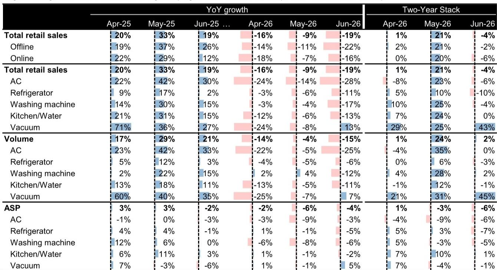

# 研究笔记：中国家电六月零售数据观察

六月中国家电零售数据引起市场关注。数据显示，当月零售额同比下降19%，较五月-9%的跌幅进一步扩大，即便基数已经走低。两年复合增速也转负至-4%，与五月+20%形成鲜明反差。空调作为六月最大品类，销售额同比下滑28%，是主要影响项。

但这份研究笔记的核心判断是：单月数据不宜过度解读。补贴周期带来的基数变化、天气偏凉、618促销节奏变化，多重因素叠加，使得六月读数更像一个“噪音信号”而非趋势拐点。报告明确表示，不认为这是结构性需求变化。

真正值得关注的，是行业需求变化背景下，龙头企业的份额表现——这恰恰是判断竞争格局是否稳固的关键窗口。

## 1. 补贴退坡后的需求正常化，不等于需求变化

六月数据最容易被误读的地方在于同比基数。去年同期的补贴政策推高了销售，今年六月自然面临高基数。报告用两年复合增速来剥离这一效应：白色家电销量基本持平，在低个位数区间波动，并未出现大幅调整。

空调销量两年复合增速为零，冰箱和洗衣机也大致在这个区间。换言之，销量在经历补贴提前释放后正在回归常态，而非明显波动。真正的问题出在均价端：两年复合口径下，白电均价下降中高个位数，说明消费者仍在选择更经济的产品，线上线下渠道都是如此。

> **笔记：** 报告反复强调“两年复合增速”这个指标，是因为它能过滤掉补贴周期带来的基数噪音。只看同比，六月数据确实有变化；但两年复合视角下，需求只是走平，不是走弱。对判断行业底部而言，后者的信号价值更高。

## 2. 份额格局在弱市中反而更清晰：美的巩固空调领先，海尔全品类扩张

六月行业需求变化，但份额数据并未出现普遍变化。美的整体市占率从1-5月的25.2%提升至26.3%，主要受益于空调旺季的强势表现——其空调市占率从33.2%升至34.9%，稳居第一。格力同期市占率从29.7%降至25.4%，差距进一步拉大。

海尔整体市占率从24.3%降至23.7%，但报告指出这主要是品类结构所致——六月空调占比过高拉低了海尔的总盘。在冰箱和洗衣机等核心品类中，海尔市占率反而在提升：冰箱从40%升至43.7%，洗衣机稳定在39.2%。小米空调市占率从5.4%升至6.9%，618促销期间线上表现突出。

这一格局说明：需求变化环境下，头部企业仍在通过产品力和渠道能力巩固自身位置，而非被动跟随行业调整。

## 3. 吸尘器是相对少见逆势增长的品类，但需注意渠道权重差异

在所有品类中，吸尘器是六月相对少见实现同比正增长的——销售额增长13%，较五月-8%大幅改善，两年复合增速高达43%。报告特别指出，这一品类的线上线下权重与白电不同：线上占90%，线下仅10%。这意味着吸尘器的增长更多反映线上渠道的促销驱动，而非终端需求的全面回暖。

科沃斯市占率从29.1%升至31.0%，符合其季节性规律。但吸尘器的高增长能否持续，取决于促销退潮后的需求韧性，目前尚难判断。

## 4. 一个可复用的观察框架：需求变化期看份额，稳定期看均价

这份报告提供了一个简洁但有效的分析框架：在行业需求节奏变化期，最值得跟踪的不是总量增速，而是龙头企业的份额变化。如果份额在变化环境中仍能扩张，说明竞争壁垒在加固；如果份额同步下滑，则意味着行业性的结构问题。

六月的数据指向前者。美的和海尔在各自优势品类中均实现份额提升，且这一趋势并非依赖价格竞争——报告显示，白电ASP的下降更多来自产品结构下移（消费者选更便宜的产品），而非龙头主动大幅降价。

对于关注家电行业的读者而言，接下来的观察重点应是三季度数据能否验证“需求正常化而非出现变化”的判断，以及龙头企业在B2B和海外业务上的进展——这恰恰是研究笔记对美的和海尔长期关注的核心逻辑，而非依赖国内家电周期。

For informational purposes only. Portions may be generated,translated,summarized,or edited with AI assistance based on source materials and may contain omissions or errors. Please verify independently. This is not investment,legal,tax,accounting,or other professional advice.

For informational purposes only. Portions may be generated,translated,summarized,or edited with AI assistance based on source materials and may contain omissions or errors. Please verify independently. This is not investment,legal,tax,accounting,or other professional advice.

