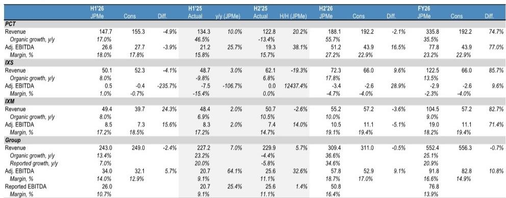
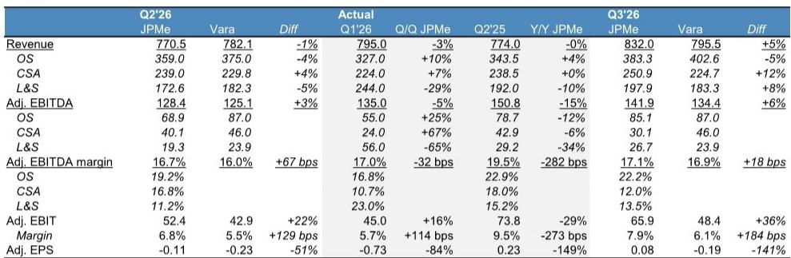
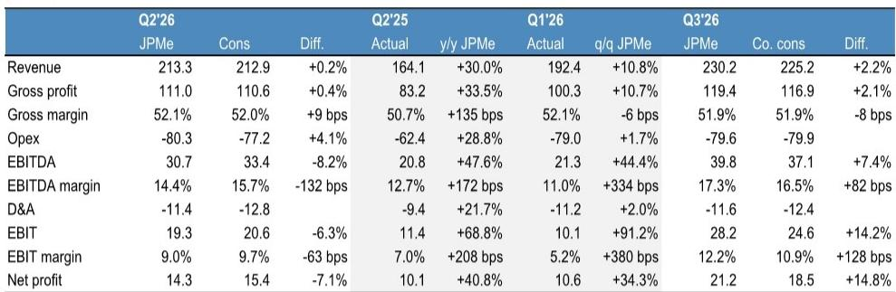

# 欧洲SMID科技硬件市场：一个分化的故事，而非单一叙事

对于关注欧洲SMID科技硬件板块的观察者而言，进入Q2'26财报季时最重要的事实是：根据某全球性研究机构的估算，AI驱动的晶圆制造设备支出预计在2026日历年增长28%，2027年增长29%，2028年增长16%。然而，供应这些设备的公司，其估值倍数大致与十年中位数持平，即便其股价年初至今已有显著上涨。这种组合——加速增长的需求与并不高昂的估值——创造了一个结构性机会，但仅适用于那些处于价值链正确环节的参与者。

关键在于，为半导体资本设备带来订单的同一轮AI建设，也同时在为半导体器件公司制造一个隐性的成本问题。DRAM和NAND价格上涨，是存储制造商优先生产AI优化产品的直接结果，这正在挤压那些必须采购存储作为输入件的终端市场设备制造商的毛利率。这种紧张关系并非暂时现象。它反映了AI基础设施支出在科技硬件生态系统中的流动方式存在根本性分化——这要求做出清晰的战略性配置决策。

对于Q2'26财报季，分析性问题不在于该板块整体是否会实现增长。答案是肯定的。问题在于，某家公司的收入模式是捕捉到了资本支出周期的直接、前期收益，还是承担了存储价格上涨带来的间接、下游成本。答案决定了哪些公司有望实现超出共识的盈利增长，哪些公司则面临显著的下行风险。

对半导体资本设备相对于半导体器件的结构性偏好，并非一个周期性判断。它是对以下事实的认知：AI投资浪潮正在重塑欧洲SMID科技硬件内部的竞争动态，而这种重塑尚未被共识预测完全反映。提供工具的公司受益于延续至2028年的订单积压。而涉及存储的公司则面临着日益明显的利润率压缩。

## 半导体资本设备公司：Q2订单加速，多年增长轨迹可见度提升

受覆盖的三家资本设备公司——Aixtron、Comet和Inficon——各自都有望报告强劲的Q2订单数据，但更重要的信号是当前季度之后的需求曲线形态。对于Aixtron而言，此前推动北美和欧洲客户订单的光学基础设施建设，预计将向亚洲客户多元化发展，这拓宽了收入基础并降低了集中度风险。该公司Q2的订单指引为1.971亿欧元，而共识预期为1.799亿欧元，9.6%的差距表明市场可能仍在低估光学基础设施部署的速度。

Comet的情况更具说明性。该公司于2025年11月发布的中期指引，假设WFE复合年增长率约为6%，欧元兑美元汇率为0.70。这些假设现在看来明显保守。当前的WFE预测意味着数倍于此的增长率，而欧元兑美元汇率正趋向0.81，高于管理层上次与市场沟通时的0.78水平。美元走强和行业增长加速的结合，意味着即使管理层本季度不正式更新指引，Comet的中期收入和利润率目标也可能被大幅超越。

Comet的关键观察点在于，管理层是否会在半年报中，继3月份发布定性指引后，提供量化的全年指引。寄售库存水平也是一个值得关注的前瞻指标——寄售库存上升通常预示着客户正在为更高的产量做准备。对于Comet和Aixtron而言，订单簿是最重要的指标，因为它提供了对2027年和2028年收入流的可见性，而这些尚未被共识预测所捕捉。

## 半导体器件集团：面临消费端驱动的利润率挤压，共识预测尚未充分反映

与器件集团的对比再鲜明不过了。Nordic Semiconductor约60%的收入来自消费电子，是风险最清晰的例子。该公司面临两个同时出现的成本压力：更高的测试和封装成本，以及直接增加其系统输入成本的存储价格上涨。毛利率可能面临压力，而此时其股价交易水平已高于历史平均倍数，共识预测看起来也已较为充分。

消费电子终端市场对存储价格上涨最为敏感，因为产品需求具有价格弹性，且将更高组件成本转嫁出去的能力有限。随着AI对高带宽存储的需求以及由此导致的存储制造商产能重新分配，存储价格上涨，对消费类器件公司的影响是直接且迅速的。这并非理论上的风险。这是一个可见的趋势，随着价格上涨在Q2财报数据中变得更加明显，这一趋势将变得更加突出。

Soitec的情况更为微妙，但同样值得审慎关注。该公司的硅光子学业务受益于光学基础设施的快速采用，该板块应能继续实现强劲增长。但其核心的移动业务，仍约占收入的50%，面临着手机市场收缩以及客户库存持续高企的挑战。其估值相对于长期历史而言偏高，移动业务的下行风险足以抵消硅光子学的增长。总体图景是公司内部表现分化，但风险平衡偏向负面。

## Q2'26决策框架：三个问题区分有望超预期与可能不及预期的公司

Q2财报季需要一套系统性的方法来筛选覆盖范围内约十四家公司。三个诊断性问题有助于区分那些可能带来积极惊喜的公司和那些面临失望风险的公司。

第一，该公司是提供作为AI基础设施资本支出周期一部分的工具或组件，还是提供消耗存储作为输入件的终端市场设备？这是最重要的分界线。第一类公司——Aixtron、Comet、Inficon——拥有延伸至多年的订单可见性，并受益于加速而非减速的WFE增长轨迹。第二类公司则面临结构性的利润率逆风，且随着存储价格持续上涨，这一逆风将加剧。

第二，公司的终端市场敞口是偏向消费电子，还是偏向工业和汽车应用？消费类公司面临来自存储价格上涨的最严峻风险，因为消费产品利润率薄且定价能力有限。汽车和工业终端市场敏感性较低，尽管它们也面临自身挑战。汽车去库存周期已基本结束，预计下半年将缓慢改善，但真正的上升周期尚未形成。汽车敞口较高的公司可能会看到环比改善，但不太可能实现资本设备公司所能达到的那种阶梯式增长。

第三，公司的估值是由其盈利轨迹支撑，还是依赖于已经发生的倍数扩张？尽管年初至今股价表现显著，但半导体资本设备板块基于当前预测的交易水平大致与十年中位数倍数持平。这意味着进一步的上行空间取决于盈利的实现，而非进一步的倍数扩张。对于器件集团，特别是Nordic Semiconductor和Soitec，其股价交易水平高于历史平均倍数，而共识预测看起来已较为充分。风险在于，任何盈利失望都可能触发估值重置，而不仅仅是预测修正。

## 汇率逆风正在逆转，将为下半年财报数据带来顺风，但不改变根本性分化

一个将影响所有公司的因素是汇率。欧元和瑞士法郎此前一直是欧洲公司的逆风，但这种动态正在逆转。在Q2，汇率逆风应会缓解，根据当前趋势，它们将在下半年转为对欧元和瑞士法郎报告公司的温和顺风。这是一个真正的积极因素，特别是对于像Comet和ams-OSRAM这样以瑞士法郎报告但收入中很大一部分以美元计价的公司。

然而，不应将汇率顺风与运营改善混为一谈。它们将普遍提振报告数据，但不会改变资本设备公司和器件公司之间的根本性分化。半导体资本设备公司将受益于运营动能和汇率支持。器件公司的报告数据将因汇率而显得好看，但来自存储成本的潜在利润率压力将持续加大。如果关注报告中的营收数据而不对汇率和存储成本动态进行调整，则存在误读本季度情况的风险。

ams-OSRAM的案例具有启发性。由于将非光学传感器业务出售给英飞凌（交易于2027年7月1日完成）带来的范围变化，以及汇率变动，该公司Q2和Q3的报告数据将出现波动。对于Q3'26，估计有机同比增长4.1%，并购影响为负6.5%，汇率影响为零——但如果欧元趋势持续，汇率可能转为正面。ams-OSRAM的底层故事关乎资产负债表改善、自由现金流生成以及智能玻璃和AI光子学领域的新增长机会。但近期数据将较为嘈杂，而消费终端市场（约占收入的20%至25%）由于存储定价的传导效应，仍是最具挑战性的板块。

## 财报季将检验市场是否已正确定价分化，现有证据表明尚未如此

对于观察者而言，根本问题在于市场是否已经对半导体资本设备和器件公司之间的分化进行了定价。现有证据表明尚未如此。尽管WFE增长轨迹在历史上强劲且正在加速，半导体资本设备板块的交易水平仍处于十年中位数倍数。而器件板块尽管面临可见且日益增长的利润率逆风，其交易水平却高于历史平均倍数。这种不对称性正是值得关注的机会所在。

具体到Aixtron，Q2报告将依据订单而非收入来评判。该公司收入预计将集中在Q4，Q2收入1.12亿欧元低于共识预期的1.21亿欧元。但订单是领先指标，1.97亿欧元的预测意味着同比增长66%。关键观察点在于订单簿是否在延长，尤其是在光电子领域，这将为2027年和2028年的收入预估增添信心。关于GaN客户的评论——包括当前利用率和产能路线图——对于预示下一轮增长是否正在准备也至关重要。

对于Comet，半年报将是观察市场是否正确预期了下半年增长轨迹的首次机会。彭博共识表明市场理解今年的形态，但中期指引假设如此保守，以至于即使是温和的超预期表现也可能引发显著的预估修正。槟城工厂的产能爬坡和效率提升计划将造成一些利润率稀释，但一旦收入基础扩大，其潜在的运营杠杆效应是强大的。

对于Nordic Semiconductor和Soitec，风险在于市场可能仍专注于其产品组合中的增长故事——Nordic的物联网连接和Soitec的硅光子学——而没有充分考虑来自存储成本的利润率压力以及其核心终端市场的持续疲软。Q2报告将迫使市场进行重新评估。

*仅供参考。部分内容可能基于源材料通过AI辅助生成、翻译、摘要或编辑，可能存在遗漏或错误。请独立核实。本文不构成任何专业建议。*

仅供参考。部分内容可能基于源材料通过AI辅助生成、翻译、摘要或编辑，可能存在遗漏或错误。请独立核实。本文不构成任何专业建议。

