# 全球电动车市场观察：2026年6月数据解读

## 锂行业

## 6月全球纯电动车销量环比增长11%，年初至今同比仅下降1%；中国纯电动车渗透率提升1个百分点至43%

6月电动车销售数据要点：(1) 全球纯电动车销量（中国+欧盟+美国）环比增长11%至104.5万辆，同比增长9%，年初至今销量较2025年同期下降1%；6月全球纯电动车渗透率提升至26%（5月为24%）。(2) 6月中国纯电动车渗透率提升1个百分点至43%，纯电动车销量环比增长8%至68.5万辆，电动车（纯电动+插电混动）总渗透率维持在63%（2025年8月以来最高水平）。(3) 美国纯电动车销量环比下降16%至7.3万辆（前月为8.6万辆），年初至今同比下降26%；纯电动车渗透率降至5%（5月为6%）。(4) 欧盟10国纯电动车销量环比增长34%至28.7万辆，年初至今同比增长35%；纯电动车渗透率提升至26%（5月为24%）。欧盟仍是增长较强劲的区域，得益于国家层面的补贴政策以及平价大众电动车进入市场。锂辉石价格近期表现偏弱，但基于中期供需缺口的预期以及储能领域的持续支撑，我们对锂价持中性偏积极看法。更多电动车/插电混动车销售数据，请参阅相关研究团队的专题报告。

图1：中国汽车销量 vs. 纯电动车销量  
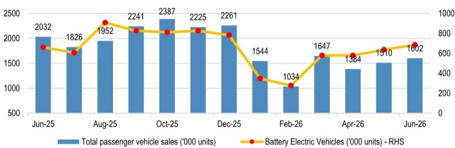  
来源：中国乘用车市场信息联席会（CPCA）、公司数据。注：中国数据现采用零售销量口径，此前为批发销量。

图2：中国电动车渗透率  
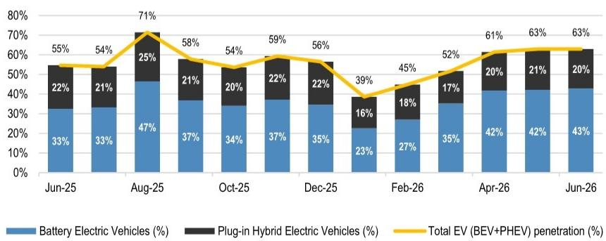  
纯电动车（%） 插电混动车（%） 电动车总渗透率（BEV+PHEV）（%）  
来源：中国乘用车市场信息联席会（CPCA）、公司数据。

## 澳大利亚金属与矿业研究主管

Lyndon Fagan AC (61-2) 9003-8648 lyndon.fagan@JPM.com JPM Securities Australia Limited

## 金属与矿业研究

Jonathon Sharp  
(61 2) 9003-8312  
jonathon.sharp@JPM.com  
JPM Securities Australia Limited

Devwrat Vegad  
(91-22) 6157-3608  
devwrat.vegad@jpmchase.com  
JPM Securities Australia Limited/ JPM India Private Limited

Zane Guo  
(61-3) 9633-4020  
zane.guo@JPM.com  
JPM Securities Australia Limited

Branko Skocic  
(61-3) 9633-4069  
branko.skocic@JPM.com  
JPM Securities Australia Limited

详见第8页分析师认证及重要披露信息。

图3：各区域纯电动车渗透率  
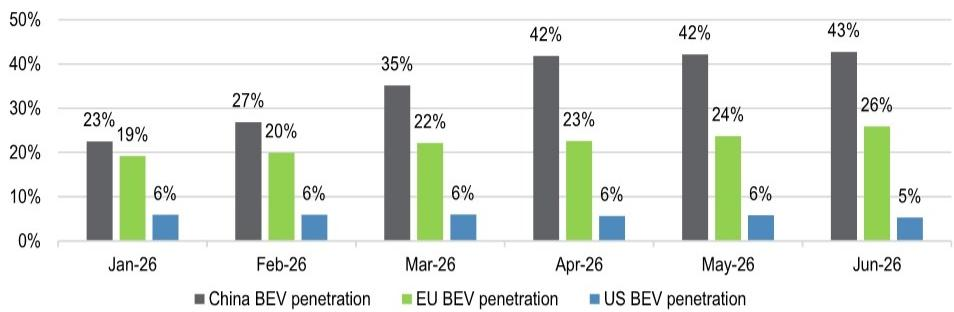  
来源：中国乘用车市场信息联席会（CPCA）、公司数据、Motor Intelligence。

图4：纯电动车月度销量（中国+欧盟+美国）千辆  
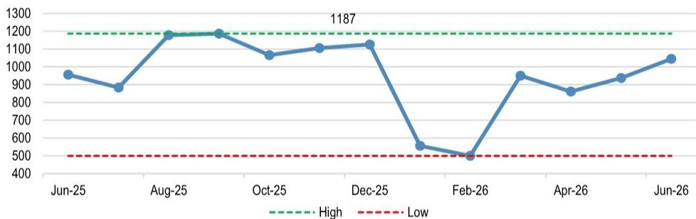  
来源：中国乘用车市场信息联席会（CPCA）、公司数据、Motor Intelligence。注：中国数据现采用零售销量口径，此前为批发销量。

图5：全球汽车销量

<table><tr><td></td><td>全球乘用车销量</td><td>2025年6月</td><td>2025年7月</td><td>2025年8月</td><td>2025年9月</td><td>2025年10月</td><td>2025年11月</td><td>2025年12月</td><td>2026年1月</td><td>2026年2月</td><td>2026年3月</td><td>2026年4月</td><td>2026年5月</td><td>2026年6月</td></tr><tr><td rowspan="11">中国</td><td>纯电动车（千辆）</td><td>661</td><td>607</td><td>908</td><td>826</td><td>812</td><td>827</td><td>782</td><td>348</td><td>278</td><td>579</td><td>579</td><td>637</td><td>685</td></tr><tr><td>纯电动车累计销量（千辆）</td><td>3,330</td><td>3,937</td><td>4,845</td><td>5,671</td><td>6,483</td><td>7,310</td><td>8,092</td><td>348</td><td>626</td><td>1,205</td><td>1,784</td><td>2,421</td><td>3,106</td></tr><tr><td>纯电动车累计同比增速</td><td>37%</td><td>35%</td><td>39%</td><td>37%</td><td>35%</td><td>31%</td><td>28%</td><td>-19%</td><td>-27%</td><td>-20%</td><td>-13%</td><td>-9%</td><td>-7%</td></tr><tr><td>插电混动车（千辆）</td><td>450</td><td>380</td><td>487</td><td>469</td><td>469</td><td>494</td><td>494</td><td>248</td><td>186</td><td>273</td><td>271</td><td>313</td><td>323</td></tr><tr><td>其他车型（千辆）</td><td>921</td><td>839</td><td>557</td><td>946</td><td>1,106</td><td>904</td><td>985</td><td>948</td><td>570</td><td>795</td><td>534</td><td>560</td><td>594</td></tr><tr><td>乘用车总销量（千辆）</td><td>2,032</td><td>1,826</td><td>1,952</td><td>2,241</td><td>2,387</td><td>2,225</td><td>2,261</td><td>1,544</td><td>1,034</td><td>1,647</td><td>1,384</td><td>1,510</td><td>1,602</td></tr><tr><td>总销量同比增速</td><td>15%</td><td>6%</td><td>2%</td><td>6%</td><td>6%</td><td>-9%</td><td>-14%</td><td>-14%</td><td>-25%</td><td>-15%</td><td>-23%</td><td>-22%</td><td>-21%</td></tr><tr><td>纯电动车占比</td><td>33%</td><td>33%</td><td>47%</td><td>37%</td><td>34%</td><td>37%</td><td>35%</td><td>23%</td><td>27%</td><td>35%</td><td>42%</td><td>42%</td><td>43%</td></tr><tr><td>插电混动车占比</td><td>22%</td><td>21%</td><td>25%</td><td>21%</td><td>20%</td><td>22%</td><td>22%</td><td>16%</td><td>18%</td><td>17%</td><td>20%</td><td>21%</td><td>20%</td></tr><tr><td>电动车总渗透率</td><td>55%</td><td>54%</td><td>71%</td><td>58%</td><td>54%</td><td>59%</td><td>56%</td><td>39%</td><td>45%</td><td>52%</td><td>61%</td><td>63%</td><td>63%</td></tr><tr><td>其他车型占比</td><td>45%</td><td>46%</td><td>29%</td><td>42%</td><td>46%</td><td>41%</td><td>44%</td><td>61%</td><td>55%</td><td>48%</td><td>39%</td><td>37%</td><td>37%</td></tr><tr><td rowspan="11">美国</td><td>纯电动车（千辆）</td><td>101</td><td>130</td><td>149</td><td>147</td><td>72</td><td>69</td><td>87</td><td>66</td><td>71</td><td>84</td><td>78</td><td>86</td><td>73</td></tr><tr><td>纯电动车累计销量（千辆）</td><td>616</td><td>746</td><td>895</td><td>1,042</td><td>1,115</td><td>1,184</td><td>1,271</td><td>66</td><td>136</td><td>220</td><td>298</td><td>385</td><td>458</td></tr><tr><td>纯电动车累计同比增速</td><td>1%</td><td>4%</td><td>7%</td><td>11%</td><td>6%</td><td>1%</td><td>-3%</td><td>-33%</td><td>-30%</td><td>-28%</td><td>-27%</td><td>-25%</td><td>-26%</td></tr><tr><td>插电混动车（千辆）</td><td>21</td><td>24</td><td>30</td><td>25</td><td>12</td><td>13</td><td>14</td><td>10</td><td>11</td><td>13</td><td>15</td><td>19</td><td>18</td></tr><tr><td>其他车型（千辆）</td><td>1,158</td><td>1,252</td><td>1,302</td><td>1,095</td><td>1,200</td><td>1,210</td><td>1,387</td><td>1,039</td><td>1,114</td><td>1,308</td><td>1,287</td><td>1,374</td><td>1,288</td></tr><tr><td>乘用车总销量（千辆）</td><td>1,280</td><td>1,406</td><td>1,480</td><td>1,267</td><td>1,284</td><td>1,292</td><td>1,488</td><td>1,114</td><td>1,196</td><td>1,405</td><td>1,380</td><td>1,480</td><td>1,379</td></tr><tr><td>总销量同比增速</td><td>-4%</td><td>9%</td><td>4%</td><td>7%</td><td>-4%</td><td>-6%</td><td>-2%</td><td>-1%</td><td>-4%</td><td>-11%</td><td>-6%</td><td>0%</td><td>8%</td></tr><tr><td>纯电动车占比</td><td>8%</td><td>9%</td><td>10%</td><td>12%</td><td>6%</td><td>5%</td><td>6%</td><td>6%</td><td>6%</td><td>6%</td><td>6%</td><td>6%</td><td>5%</td></tr><tr><td>插电混动车占比</td><td>2%</td><td>2%</td><td>2%</td><td>2%</td><td>1%</td><td>1%</td><td>1%</td><td>1%</td><td>1%</td><td>1%</td><td>1%</td><td>1%</td><td>1%</td></tr><tr><td>电动车总渗透率</td><td>10%</td><td>11%</td><td>12%</td><td>14%</td><td>7%</td><td>6%</td><td>7%</td><td>7%</td><td>7%</td><td>7%</td><td>7%</td><td>7%</td><td>7%</td></tr><tr><td>其他车型占比</td><td>90%</td><td>89%</td><td>88%</td><td>86%</td><td>93%</td><td>94%</td><td>93%</td><td>93%</td><td>93%</td><td>93%</td><td>93%</td><td>93%</td><td>93%</td></tr><tr><td rowspan="11">欧洲（欧盟10国）</td><td>纯电动车（千辆）</td><td>195</td><td>146</td><td>122</td><td>213</td><td>182</td><td>209</td><td>257</td><td>142</td><td>151</td><td>287</td><td>204</td><td>214</td><td>287</td></tr><tr><td>纯电动车累计销量（千辆）</td><td>953</td><td>1,099</td><td>1,220</td><td>1,434</td><td>1,615</td><td>1,825</td><td>2,081</td><td>142</td><td>293</td><td>581</td><td>784</td><td>999</td><td>1,286</td></tr><tr><td>纯电动车累计同比增速</td><td>22%</td><td>23%</td><td>23%</td><td>23%</td><td>24%</td><td>26%</td><td>29%</td><td>11%</td><td>14%</td><td>27%</td><td>30%</td><td>32%</td><td>35%</td></tr><tr><td>插电混动车（千辆）</td><td>102</td><td>91</td><td>68</td><td>116</td><td>99</td><td>97</td><td>104</td><td>82</td><td>80</td><td>132</td><td>101</td><td>105</td><td>123</td></tr><tr><td>其他车型（千辆）</td><td>702</td><td>602</td><td>415</td><td>689</td><td>590</td><td>566</td><td>573</td><td>516</td><td>526</td><td>879</td><td>597</td><td>584</td><td>699</td></tr><tr><td>乘用车总销量（千辆）</td><td>999</td><td>839</td><td>605</td><td>1,018</td><td>870</td><td>872</td><td>933</td><td>740</td><td>758</td><td>1,298</td><td>901</td><td>904</td><td>1,110</td></tr><tr><td>总销量同比增速</td><td>-5%</td><td>2%</td><td>4%</td><td>10%</td><td>5%</td><td>4%</td><td>5%</td><td>-3%</td><td>1%</td><td>11%</td><td>7%</td><td>3%</td><td>11%</td></tr><tr><td>纯电动车占比</td><td>19%</td><td>17%</td><td>20%</td><td>21%</td><td>21%</td><td>24%</td><td>27%</td><td>19%</td><td>20%</td><td>22%</td><td>23%</td><td>24%</td><td>26%</td></tr><tr><td>插电混动车占比</td><td>10%</td><td>11%</td><td>11%</td><td>11%</td><td>11%</td><td>11%</td><td>11%</td><td>11%</td><td>11%</td><td>10%</td><td>11%</td><td>12%</td><td>11%</td></tr><tr><td>电动车总渗透率</td><td>30%</td><td>28%</td><td>31%</td><td>32%</td><td>32%</td><td>35%</td><td>39%</td><td>30%</td><td>31%</td><td>32%</td><td>34%</td><td>35%</td><td>37%</td></tr><tr><td>其他车型占比</td><td>70%</td><td>72%</td><td>69%</td><td>68%</td><td>68%</td><td>65%</td><td>61%</td><td>70%</td><td>69%</td><td>68%</td><td>66%</td><td>65%</td><td>63%</td></tr><tr><td rowspan="17">合计</td><td>纯电动车（千辆）</td><td>956</td><td>883</td><td>1,178</td><td>1,187</td><td>1,066</td><td>1,105</td><td>1,125</td><td>556</td><td>500</td><td>950</td><td>861</td><td>938</td><td>1,045</td></tr><tr><td>纯电动车累计销量（百万辆）</td><td>4.90</td><td>5.78</td><td>6.96</td><td>8.15</td><td>9.21</td><td>10.32</td><td>11.44</td><td>0.56</td><td>1.06</td><td>2.01</td><td>2.87</td><td>3.81</td><td>4.85</td></tr><tr><td>纯电动车累计同比</td><td>28%</td><td>28%</td><td>31%</td><td>30%</td><td>29%</td><td>26%</td><td>24%</td><td>-15%</td><td>-19%</td><td>-12%</td><td>-7%</td><td>-3%</td><td>-1%</td></tr><tr><td>纯电动车同比增速-中国</td><td>34%</td><td>26%</td><td>56%</td><td>28%</td><td>21%</td><td>9%</td><td>3%</td><td>-19%</td><td>-35%</td><td>-10%</td><td>4%</td><td>5%</td><td>4%</td></tr><tr><td>纯电动车同比增速-美国</td><td>-6%</td><td>18%</td><td>22%</td><td>43%</td><td>-32%</td><td>-42%</td><td>-36%</td><td>-33%</td><td>-28%</td><td>-25%</td><td>-23%</td><td>-18%</td><td>-28%</td></tr><tr><td>纯电动车同比增速-欧盟</td><td>14%</td><td>33%</td><td>25%</td><td>20%</td><td>35%</td><td>42%</td><td>56%</td><td>11%</td><td>18%</td><td>44%</td><td>38%</td><td>39%</td><td>48%</td></tr><tr><td>纯电动车同比增速-合计</td><td>24%</td><td>26%</td><td>47%</td><td>28%</td><td>17%</td><td>8%</td><td>6%</td><td>-15%</td><td>-23%</td><td>-1%</td><td>7%</td><td>8%</td><td>9%</td></tr><tr><td>纯电动车环比增速-合计</td><td>10%</td><td>-8%</td><td>33%</td><td>1%</td><td>-10%</td><td>4%</td><td>2%</td><td>-51%</td><td>-10%</td><td>90%</td><td>-9%</td><td>9%</td><td>11%</td></tr><tr><td>插电混动车（千辆）</td><td>573</td><td>495</td><td>585</td><td>609</td><td>580</td><td>604</td><td>612</td><td>340</td><td>277</td><td>419</td><td>387</td><td>437</td><td>464</td></tr><tr><td>同比增速</td><td>25%</td><td>4%</td><td>14%</td><td>7%</td><td>-6%</td><td>-2%</td><td>-6%</td><td>-15%</td><td>-20%</td><td>-14%</td><td>-16%</td><td>-18%</td><td>-19%</td></tr><tr><td>其他车型（千辆）</td><td>2,781</td><td>2,693</td><td>2,274</td><td>2,730</td><td>2,896</td><td>2,680</td><td>2,945</td><td>2,503</td><td>2,210</td><td>2,982</td><td>2,417</td><td>2,518</td><td>2,581</td></tr><tr><td>乘用车总销量（千辆）</td><td>4,310</td><td>4,071</td><td>4,037</td><td>4,526</td><td>4,541</td><td>4,389</td><td>4,683</td><td>3,398</td><td>2,987</td><td>4,351</td><td>3,665</td><td>3,893</td><td>4,091</td></tr><tr><td>乘用车总销量同比增速</td><td>4%</td><td>6%</td><td>3%</td><td>7%</td><td>3%</td><td>-6%</td><td>-7%</td><td>-8%</td><td>-12%</td><td>-7%</td><td>-11%</td><td>-9%</td><td>-5%</td></tr><tr><td>纯电动车占比</td><td>22%</td><td>22%</td><td>29%</td><td>26%</td><td>23%</td><td>25%</td><td>24%</td><td>16%</td><td>17%</td><td>22%</td><td>23%</td><td>24%</td><td>26%</td></tr><tr><td>插电混动车占比</td><td>13%</td><td>12%</td><td>14%</td><td>13%</td><td>13%</td><td>14%</td><td>13%</td><td>10%</td><td>9%</td><td>10%</td><td>11%</td><td>11%</td><td>11%</td></tr><tr><td>电动车总渗透率</td><td>35%</td><td>34%</td><td>44%</td><td>40%</td><td>36%</td><td>39%</td><td>37%</td><td>26%</td><td>26%</td><td>31%</td><td>34%</td><td>35%</td><td>37%</td></tr><tr><td>其他车型占比</td><td>65%</td><td>66%</td><td>56%</td><td>60%</td><td>64%</td><td>61%</td><td>63%</td><td>74%</td><td>74%</td><td>69%</td><td>66%</td><td>65%</td><td>63%</td></tr></table>

来源：中国乘用车市场信息联席会（CPCA）、公司数据、Motor Intelligence。注：中国数据现采用零售销量口径，此前为批发销量。

图6：全球汽车总销量（千辆）

## 全球

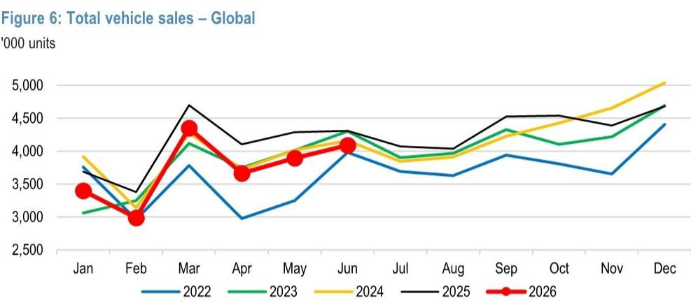  
来源：中国乘用车市场信息联席会（CPCA）、公司数据、Motor Intelligence。

图7：全球纯电动车销量  
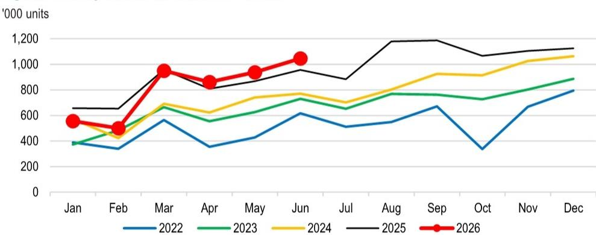  
来源：中国乘用车市场信息联席会（CPCA）、公司数据、Motor Intelligence。

## 中国

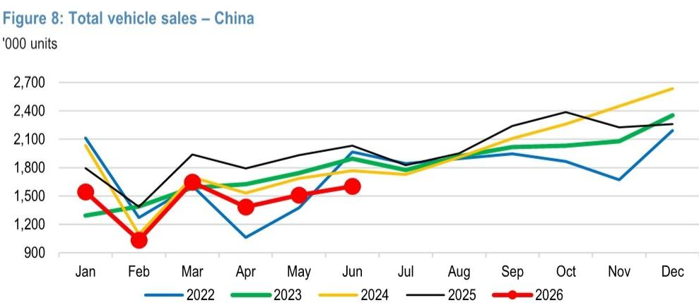  
来源：中国乘用车市场信息联席会（CPCA）、公司数据、Motor Intelligence。

图9：中国纯电动车销量  
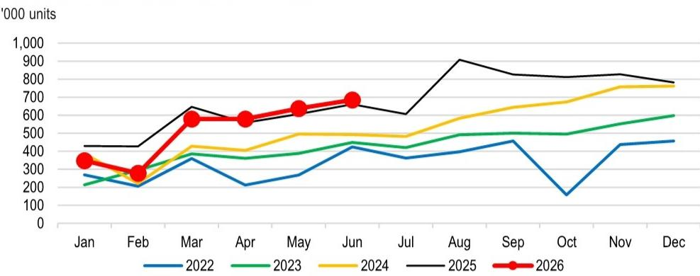  
来源：中国乘用车市场信息联席会（CPCA）、公司数据、Motor Intelligence。

美国  
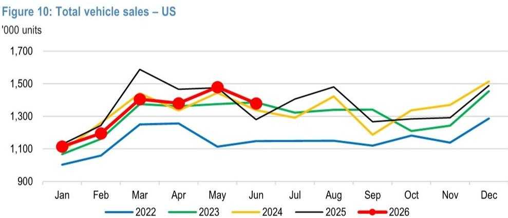  
来源：公司数据、Motor Intelligence。

图11：美国纯电动车销量  
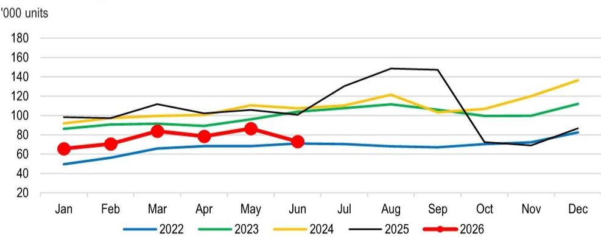  
来源：公司数据、Motor Intelligence。

## 欧盟10国（法国、德国、英国、奥地利、挪威、瑞典、瑞士、意大利、西班牙、荷兰）

图12：欧盟汽车总销量  
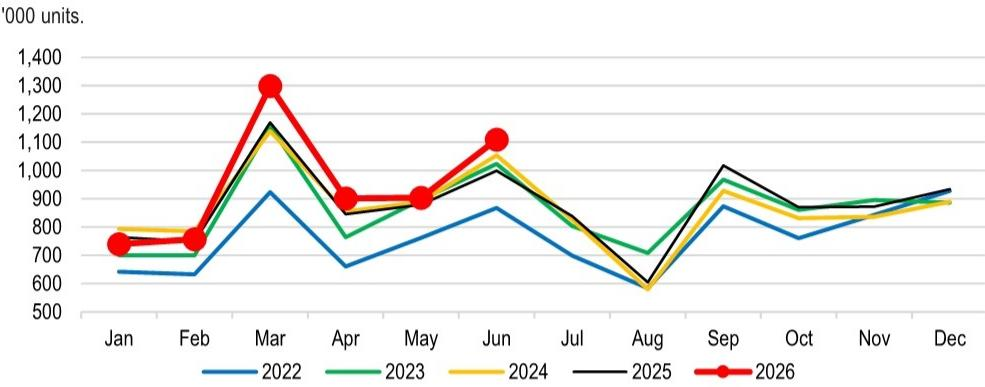  
来源：公司数据、Motor Intelligence。

图13：欧盟纯电动车销量  
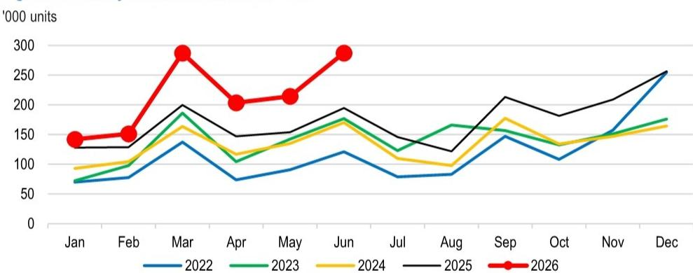  
来源：公司数据、Motor Intelligence。

图14：锂辉石价格  
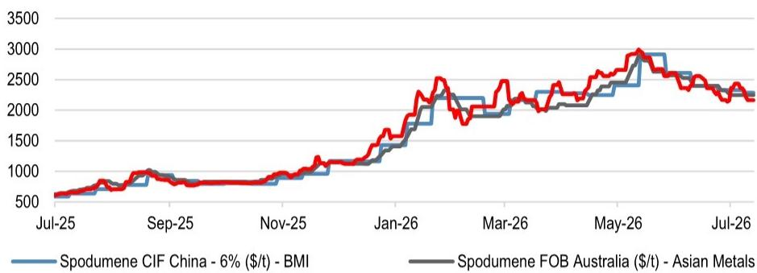  
锂辉石FOB澳大利亚-6%（美元/吨）-Platts  
来源：彭博财经资讯

图15：氢氧化锂价格  
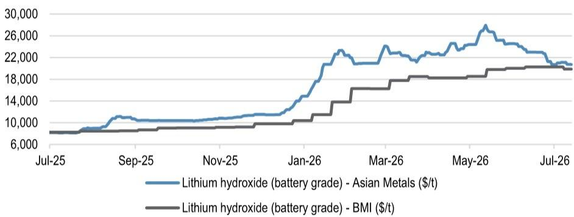  
来源：彭博财经资讯

图16：碳酸锂价格  
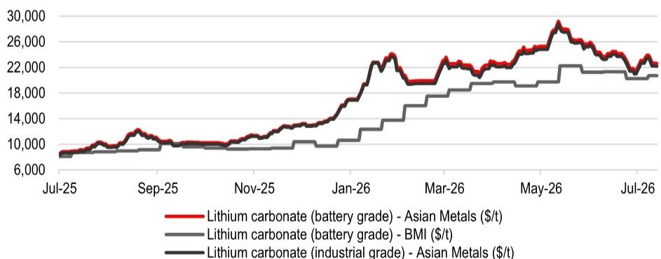  
来源：彭博财经资讯

本报告涉及公司（除非另有说明，本报告所有报价均截至2026年7月10日收盘）PLS Group(PLS.AX/A$4.63/OW)

分析师认证：本报告封面标注“AC”的研究分析师证明（或，当多位研究分析师主要负责本报告时，封面或文件内标注“AC”的研究分析师分别就其在本研究中覆盖的每个证券或发行人证明）：(1) 本报告中的所有观点准确反映了研究分析师对相关证券或发行人的个人看法；(2) 研究分析师的薪酬中没有任何部分直接或间接与本报告中的具体推荐或观点相关。对于封面列出的所有韩国研究分析师（如适用），他们还根据KOFIA要求证明，研究分析师的分析是善意进行的，观点反映了研究分析师本人的意见，没有受到不当影响或干预。

除非另有说明，本报告中列出的所有作者均为独立撰写研究报告的研究分析师。在欧洲，行业专家（销售与交易）可能作为联系人出现在本报告中，但并非报告作者或研究部门成员。

## 重要披露

- 做市商/流动性提供者：JPM是PLS Group或相关实体金融工具的做市商和/或流动性提供者。
- 主承销商或联合主承销商：JPM在过去12个月内担任PLS Group或相关实体证券或金融工具（定义见指令2014/65/EU）公开发行的主承销商或联合主承销商。
- 客户：JPM目前或过去12个月内拥有以下实体作为客户：PLS Group或相关实体。
- 客户/投资银行：JPM目前或过去12个月内拥有以下实体作为投资银行客户：PLS Group或相关实体。
- 客户/非投资银行、证券相关：JPM目前或过去12个月内拥有以下实体作为客户，提供的服务为非投资银行、证券相关服务：PLS Group或相关实体。
- 客户/非证券相关：JPM目前或过去12个月内拥有以下实体作为客户，提供的服务为非证券相关服务：PLS Group或相关实体。
- 投资银行服务报酬：JPM在过去12个月内因向PLS Group或相关实体提供投资银行服务而获得报酬。
- 潜在投资银行服务报酬：JPM预计在未来三个月内将寻求或获得来自PLS Group或相关实体的投资银行服务报酬。
- 非投资银行服务报酬：JPM在过去12个月内因向PLS Group或相关实体提供非投资银行产品或服务而获得报酬。
- 债务头寸：JPM可能持有PLS Group或相关实体的债务证券头寸（如有）。

公司特定披露：JPM确实并寻求与其研究报告所覆盖的公司开展业务。因此，读者应注意，该公司可能存在利益冲突，可能影响本报告的客观性。读者应将本报告视为做出决策的单一因素。重要披露信息，包括价格图表和信用意见历史表格（如适用），可通过访问https://www.jpmm.com/research/disclosures、致电1-800-477-0406或发送电子邮件至research.disclosure.inquiries@JPM.com获取。

PLS Group (PLS.AX, PLS AU) 价格图表  
  
来源：彭博财经资讯和JPM；价格数据已根据股票分割和股息进行调整。首次覆盖日期：2018年2月6日。所有股价均为前一交易日收盘价。

<table><tr><td>日期</td><td>评级</td><td>价格（澳元）</td><td>目标价（澳元）</td></tr><tr><td>2023年7月14日</td><td>中性</td><td>5.09</td><td>4.8</td></tr><tr><td>2023年7月25日</td><td>中性</td><td>4.59</td><td>4.7</td></tr><tr><td>2023年8月7日</td><td>增持</td><td>4.99</td><td>6</td></tr><tr><td>2023年8月25日</td><td>增持</td><td>5.11</td><td>5.7</td></tr><tr><td>2023年10月4日</td><td>中性</td><td>4.09</td><td>4.5</td></tr><tr><td>2023年10月26日</td><td>中性</td><td>3.88</td><td>4.3</td></tr><tr><td>2023年12月11日</td><td>中性</td><td>3.71</td><td>3.6</td></tr><tr><td>2024年2月5日</td><td>中性</td><td>3.55</td><td>3.4</td></tr><tr><td>2024年2月22日</td><td>中性</td><td>3.66</td><td>3.3</td></tr><tr><td>2024年4月5日</td><td>中性</td><td>3.82</td><td>3.25</
