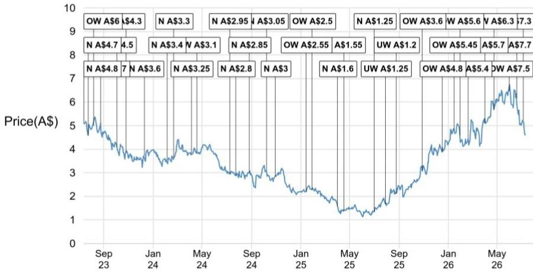

# JPM：锂-全球纯电销量6月环比下降11%，中国纯电渗透率升至43%

6月全球纯电汽车销量环比增长11%至104.5万辆，同比上升9%，累计同比缺口已收窄至仅1%。这份来自JPM的最新月度追踪数据，提供了一个比年初更清晰的信号：全球纯电市场并未陷入停滞，而是正在经历一轮区域驱动的修复。但修复的节奏和深度，在三个主要市场之间截然不同。

中国仍是相对主力。6月纯电销量68.5万辆，环比增长8%，渗透率提升1个百分点至43%。更值得关注的是，包含插电混动在内的整体新能源渗透率维持在63%，与2025年8月的高点持平。这意味着中国市场的电动化进程并未因补贴退坡或价格竞争而出现结构性逆转，反而在零售数据口径下展现出更强的韧性。

> **KC评论：** JPM在本次报告中特意将中国数据口径从批发切换为零售，这一调整本身值得注意。零售数据更能反映终端真实需求，而非渠道库存的波动。6月纯电渗透率43%是在这一更严格口径下取得的，含金量高于批发口径的同期数字。

欧洲是当前较强劲的增长引擎。EU-10地区6月纯电销量28.7万辆，环比大增34%，同比增速高达48%，累计同比增长35%。报告明确指出，这得益于各国层面的补贴方案以及平价大众化纯电车型的渗透。欧洲正在从政策驱动转向“政策+产品”双轮驱动，这一转变对锂等上游材料的需求结构有直接影响。

美国则成为明显的影响项。6月纯电销量仅7.3万辆，环比下降16%，累计同比下滑26%，渗透率降至5%。在整体汽车销量同比增长8%的背景下，纯电份额不升反降，说明美国市场的电动化进程遇到了比预期更顽固的阻力——产品供给、充电基础设施和消费者接受度之间的缺口尚未弥合。

## 1. 全球纯电销量正在走出年初的深坑，但累计同比仍为负值

年初的销量低谷曾让市场对2026年全球纯电前景产生怀疑。1月和2月，全球纯电销量分别仅为55.6万辆和50万辆，同比分别下降15%和23%。但从3月开始，销量连续四个月回升，6月已恢复至104.5万辆，同比转正至9%。累计同比从3月的-12%逐月收窄至6月的-1%。

这一修复路径并非均匀分布。中国从4月起同比转正，欧洲从3月起保持20%以上的同比增速，而美国至今仍处于深度负增长区间。全球纯电市场的整体修复，本质上是中欧两地的强势反弹掩盖了美国的持续调整。

## 2. 欧洲正在成为锂需求预期的关键变量

欧洲纯电销量的加速增长，对锂市场的影响可能被低估。报告指出，尽管近期锂辉石价格有所走软，但JPM对锂价的中期展望仍偏积极，核心依据是中期供需缺口预期，而这一缺口的主要支撑来自储能领域的持续强劲需求。

欧洲纯电渗透率从5月的24%升至6月的26%，且累计同比增速高达35%，是三大区域中相对少见保持两位数增长的。如果这一趋势持续，欧洲将不仅成为纯电销量的增量来源，更将成为锂等上游材料需求结构中的重要边际变量。这与市场此前将锂需求主要锚定中国储能和电动车的思维有所不同。

## 3. 美国市场的调整并非短期波动，而是结构性滞后

美国6月纯电渗透率仅5%，不仅远低于中国的43%和欧洲的26%，甚至低于2025年多数月份的6%-8%区间。在整体汽车市场同比增长8%的背景下，纯电销量反而环比下降16%，说明美国消费者对纯电的接受度并未随整体车市回暖而改善。

这一滞后可能源于几个因素的叠加：平价纯电车型供给不足、充电基础设施覆盖不均、以及政策激励效果的边际递减。与美国市场形成对比的是，欧洲在补贴方案和大众化车型的双重推动下，正在走出一条不同的渗透曲线。

> **KC评论：** 美国纯电渗透率5%这个数字，放在全球对比中显得格外突出。如果美国无法在未来12-18个月内出现类似欧洲的“平价车型+政策补贴”组合，其纯电渗透率可能长期停留在个位数，这将直接拉低全球纯电市场的增长空间，并对锂等上游材料的需求预期形成影响。

## 4. 锂价短期承压，但供需缺口逻辑未变

报告在锂市场部分给出了一个看似矛盾的判断：锂辉石价格近期走软，但中期展望仍偏积极。支撑这一判断的核心是供需缺口预期，而储能领域的持续强劲需求是缺口的主要来源。

锂价短期承压与纯电销量修复之间的时间差，反映了市场对需求复苏节奏的定价分歧。纯电销量数据是月度更新的滞后指标，而锂价交易的是未来3-6个月的供需预期。如果中欧纯电销量在第三季度继续保持环比增长，锂价可能在当前水平附近找到支撑，并逐步反映供需缺口的收敛。

对于关注锂市场的读者而言，这份报告提供了一个可复用的观察框架：不再单纯盯着中国的纯电渗透率，而是将欧洲的增速、美国的滞后以及储能需求的持续性纳入同一分析维度。三个变量中，欧洲的边际变化可能是未来几个季度最值得追踪的信号。

For informational purposes only. Portions may be generated,translated,summarized,or edited with AI assistance based on source materials and may contain omissions or errors. Please verify independently. This is not investment,legal,tax,accounting,or other professional advice.

