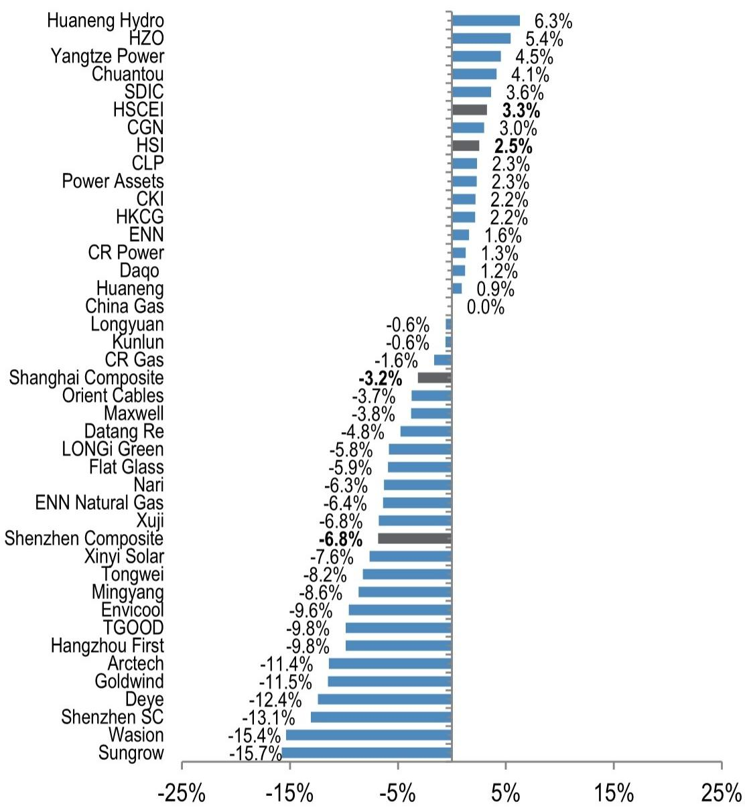

# 公用事业与可再生能源行业研究笔记

## 中国"十五五"碳达峰行动计划及中广核、长江电力二季度发电量更新

中国最新发布的脱碳政策组合——以"十五五"（2026-2030年）碳达峰行动计划为核心，随后由国家能源局发布2026-2028年节能降碳行动计划——设定了更清晰的目标和执行措施，以扩大非化石能源、增强电网灵活性、减少对煤炭/石油的依赖，并加速全经济范围的能效提升和电气化进程。我们认为这对电网/可再生能源设备制造商和可再生能源运营商具有积极意义。在此背景下，中广核电力二季度核电发电量为58,640 GWh（同比增长3.5%），我们认为2026/27年可能改善的定价机制有望推动盈利增长。长江电力二季度水电发电量为709亿千瓦时（同比增长2.8%），在中国利率环境变化的背景下，该股仍是我们偏好的防御性选择。

- 中国"十五五"（2026-2030年）碳达峰行动计划（2026年7月9日）设定了2030年目标：单位GDP二氧化碳排放较2025年下降17%，非化石能源占比达到25%。该计划要求加快可再生能源/核电建设，增强电网灵活性（特高压、储能、需求响应），降低对煤炭/石油的依赖，并通过更严格的标准和扩大碳市场/绿色证书市场来推动工业、建筑和交通领域的广泛脱碳。随后，国家能源局2026-2028年节能降碳行动计划（2026年7月10日）增加了近期执行措施：到2028年非化石能源占比每年提升约1个百分点，高效煤电容量占比提升约15个百分点，试点低/零碳矿山/油田/园区，推进煤电机组升级/退役、CCUS/混烧试点、可再生能源整合、清洁上游运营以及需求侧电气化。我们认为电网/可再生能源设备制造商和可再生能源运营商有望受益。对于可再生能源设备制造商，我们关注东方电缆、金风科技-H、德业股份和阳光电源。对于电力设备制造商，我们关注特锐德，其近期管理层交流强化了我们对该公司来自数据中心、海外公用事业订单以及AIDC产品突破的积极看法。我们也关注威胜控股。

- 对于可再生能源运营商，中广核电力二季度更新报告核电发电量为58,640 GWh（同比增长3.5%），主要得益于大亚湾、岭东和宁德机组发电量提升，以及惠州和苍南机组投入商业运营，部分被台山机组发电量下降所抵消。我们维持积极评级，因为2026/27年可能改善的定价机制有望推动盈利增长。长江电力二季度更新报告水电发电量为709亿千瓦时（同比增长2.8%），主要得益于三峡和葛洲坝电站发电量提升，部分被溪洛渡、向家坝、乌东德和白鹤滩电站发电量下降所抵消。在中国利率环境变化的背景下，我们看好长江电力作为防御性选择。

亚太区公用事业与可再生能源 | 可持续投资

Alan Hon AC (852) 2800-8573 alan.hon@JPM.com

Stephen Tsui, CFA AC (852) 2800-8592 stephen.tsui@JPM.com

Daqi Jiao (852) 2800-8595 daqi.jiao@JPM.com

Vento Suen  
(852) 2800-8546  
vento.suen@JPM.com  
JPM Securities (Asia Pacific) Limited/ JPM Broking (Hong Kong) Limited

表1：重点公司观点

| 公司 | 代码 | 评级 | 当前价格 | 目标价(本币) | 上行/（下行）空间 | 研究逻辑/关键催化剂 |
|------|------|------|----------|-------------|-----------------|---------------------|
| **重点关注** | | | | | | |
| 阳光电源 | 300274 CH | 积极 | 108.0 | 212.0 | 96% | 受益于全球储能需求增长，AIDC储能发展可能成为新催化剂 |
| 德业股份 | 605117 CH | 积极 | 84.2 | 154.0 | 83% | (1)受益于新兴市场分布式储能增长；(2)能源韧性趋势的受益者；(3)新兴市场先发优势+成本领先 |
| 东方电缆 | 603606 CH | 积极 | 40.5 | 61.0 | 51% | 受益于中国海上风电需求回暖，以及海缆(1)高进入壁垒、(2)稳定竞争格局、(3)强盈利能力 |
| 金风科技-H | 2208 HK | 积极 | 9.6 | 19.4 | 101% | 风机业务有望持续改善，得益于出口销售增长和超预期的毛利率 |
| 新奥能源 | 2688 HK | 积极 | 42.3 | 68.0 | 61% | 股息率超过6%，每股股息至少稳定。新奥的LNG合同有助于在LNG和管道气价格上涨时保护其美元毛利 |
| 威胜控股 | 3393 HK | 积极 | 18.5 | 32.0 | 73% | 中国智能电表龙头，受益于海外扩张、新产品、电网招标回暖及AIDC订单，盈利增长强劲 |
| **需关注** | | | | | | |
| 通威股份 | 600438 CH | 谨慎 | 10.7 | 13.0 | 22% | 多晶硅多年下行周期，2025年亏损，估值缺乏吸引力 |
| 迈为股份 | 300751 CH | 谨慎 | 246.6 | 108.0 | (56%) | 过去两年HJT电池设备订单量下降，未来订单前景不明朗，估值缺乏吸引力 |

来源：Bloomberg Finance L.P.，JPM estimates。所有价格截至2026年7月13日收盘。

图1：港股/A股公用事业一周表现  
  
来源：Bloomberg Finance L.P.。所有价格截至2026年7月13日收盘，DQ US除外，价格为2026年7月10日。注：过往表现不代表未来结果。

## 中国公布"十五五"碳达峰行动计划

中国于2026年7月9日公布了"十五五"（2026-2030年）碳达峰行动计划。该计划认为"十五五"是实现按期达峰的关键时期。其目标是到2030年单位GDP二氧化碳排放较2025年下降17%，非化石能源占比达到25%，同时稳步实现煤炭和石油消费达峰，并将绿色低碳要求融入经济各领域。关键措施包括：快速扩大风电/太阳能/水电/核电规模，增强电网灵活性（特高压输电、储能、抽水蓄能、需求响应），推进清洁替代减少煤炭使用，改善石油/天然气利用并增加绿色燃料（氢/氨/甲醇、生物燃料/可持续航空燃料）。该计划还要求工业升级和能效改造，建设零碳园区/工厂和更绿色的数据中心，促进循环经济行动，加速低碳建筑和交通（包括提高电动汽车普及率），并得到更严格的法律/标准、更好的排放核算、金融和定价改革以及扩大碳市场和绿色证书市场（明确地方责任）的支持。

在此公告之后不久，国家能源局于2026年7月10日发布了能源领域节能降碳行动计划（2026-2028年）。该计划设定了三年期目标，旨在减少整个能源链（从生产到终端使用）的能源消耗和排放，同时加速从化石燃料向非化石能源的转变。到2028年，目标是将非化石能源占比每年提升约1个百分点，将达到基准效率标准的煤电容量占比提高约15个百分点，并建设低/零碳矿山、油田和工业园区试点。关键行动包括：退役或升级煤电机组，试点混烧和CCUS，扩大输电和储能以吸收更多可再生能源，通过电气化、能效提升和资源循环利用减少煤炭和油气运营中的排放。在需求侧，推广可再生能源驱动的工业园区和微电网、更绿色的交通和充电基础设施、更清洁的建筑/农村能源以及低碳供暖——并得到更强研发、数字化碳管理、改进排放核算以及扩大绿色电力/证书市场机制的支持。

研究观点：我们认为大多数政策目标在很大程度上是先前政策目标的延续，且大部分符合我们的预期。在可再生能源领域，我们对金风科技-H（2208 HK）、东方电缆（603606 CH）、阳光电源（300274 CH）、德业股份（605117 CH）、中信博（688408 CH）、协鑫科技（3800 HK）、大全新能源（DQ US）、中广核电力（1816 HK）和长江电力（600900 CH）持积极评级。我们看好电力设备制造商如威胜控股（3393 HK）和特锐德（300001 CH）。

## 中广核电力公布二季度运营数据

中广核电力于2026年7月10日公布二季度运营数据。其二季度核电发电量为58,640 GWh，同比增长3.5%。主要得益于大亚湾机组、岭东机组和宁德机组核电发电量提升，以及惠州和苍南机组投入商业运营，部分被台山机组发电量下降所抵消。

研究观点：新增装机容量对中广核电力的发电量增长具有积极意义。我们认为中广核电力在2026/27年可能迎来改善的定价机制，这可能带来盈利增长。因此，我们对中广核电力持积极评级。

## 长江电力公布二季度发电量数据

长江电力于2026年7月6日公布二季度发电量数据。其二季度水电发电量为709亿千瓦时，同比增长2.8%。主要得益于三峡和葛洲坝水电站发电量提升，部分被溪洛渡、向家坝、乌东德和白鹤滩水电站发电量下降所抵消。

研究观点：对于寻求防御性配置的读者，长江电力是我们的偏好选择，这基于中国利率环境的变化。我们对该公司的积极看法基于：1）其业务模式在中国独立发电商中防御性较强；2）低杠杆率、强劲现金流和分红承诺。

## 青岛特锐德——管理层交流要点

青岛特锐德年初至今跑赢指数约20%（特锐德+21% vs 深证成指+1.5%），因读者日益认识到其海外预制式变电站业务的增长潜力以及数据中心产品的增长前景。近期管理层交流强化了我们的积极看法：中国数据中心订单年初至今已超过2025年全年水平，管理层预计今年中国数据中心订单将弹性较高；中东预制式变电站订单今年可能弹性较高以上，管理层预计市场份额约50%，同时欧洲和澳大利亚订单也在增长；与伊顿（ETN US，未评级）的合作可能帮助特锐德进一步拓展海外市场，其新开发的高压交流转低压直流解决方案已吸引包括美国在内的多个地区数据中心客户的关注。以不到20倍的一年远期市盈率计算，我们认为估值仍具吸引力，重申积极评级。

表2：周度太阳能组件价格更新

| 产品 | 20260708 | 变化 |
|------|----------|------|
| 多晶硅价格 - 单晶致密料（元/公斤）- PVInfolink报价 | 32.50 | 0.0% |
| 多晶硅期货主力合约收盘价（元/公斤）- 广州期货交易所报价 | 35.48 | -1.0% |
| 颗粒硅价格（元/公斤）- PVInfolink报价 | 32.00 | 0.0% |
| 多晶硅价格 - 中国以外（美元/公斤）- PVInfolink报价 | 18.50 | 0.0% |
| N型单晶硅片 - 182*210mm（元/片）- 130um | 0.97 | -1.0% |
| TOPCon电池 - 182-210mm 25.0%+（元） | 0.27 | 0.4% |
| 182*182-210mm/210mm单面TOPCon组件 - 中国大型项目（元） | 0.71 | 0.0% |
| 182*182-210mm/210mm单面TOPCon组件 - 中国分布式项目（元） | 0.75 | -1.3% |
| 182*182-210mmm BC组件 - 中国大型项目（元/瓦） | 0.82 | 0.0% |
| 182*182-210mmm BC组件 - 中国分布式项目（元/瓦） | 0.95 | 11.8% |
| 182mm双面TOPCon组件（元） | 0.73 | -1.2% |
| 210mm双面HJT组件（元） | 0.75 | 0.0% |
| 光伏玻璃 - 3.2mm（元/平方米） | 15.50 | 0.0% |
| 光伏玻璃 - 2.0mm（元/平方米） | 9.00 | 0.0% |
| 普通EVA胶膜（元/平方米） | 5.56 | 1.1% |
| 白色EVA胶膜（元/平方米） | 6.06 | 1.0% |
| POE胶膜（元/平方米） | 9.25 | 0.0% |
| 光伏级EVA树脂（元/吨） | 9,550 | 0.0% |
| 金属硅（元/吨） | 9,220 | -1.2% |
| 废钢（元/吨） | 2,470 | 0.0% |
| 铸铁（元/吨） | 3,120 | -0.6% |

来源：PVInfoLink，SMM，WIND，Bloomberg Finance L.P.。注：EVA树脂、纯碱、金属硅、废钢、铸铁数据截至最近一个工作周三。

表3：JPM港股/A股公用事业估值比较

| 公司 | 代码 | JPM评级 | JPM目标价（本币） | 最新价格（本币） | 上行空间（%） | 市值（百万美元） | 日均流动性（百万美元） | 市盈率（倍） | 市净率（倍） | 股息率（%） | 净负债/权益（%） | 净资产回报表现（%） | EV/EBITDA（倍） |
|------|------|---------|-----------------|-----------------|--------------|----------------|---------------------|-------------|-------------|-------------|-----------------|-----------------|-----------------|
| | | | | | | | | FY26E | FY27E | FY26E | FY27E | FY26E | FY27E | FY26E | FY27E | FY26E | FY27E | FY26E | FY27E |
| **港股公用事业** | | | | | | | | | | | | | | | | | | | |
| 中电控股 | 2 HK | 中性 | 73.50 | 76.6 | (4.0) | 24,689 | 29.7 | 16.7 | 16.1 | 1.7 | 1.7 | 4.2 | 4.3 | 50.4 | 49.2 | 10.6 | 10.6 | 10.7 | 10.1 |
| 香港中华煤气 | 3 HK | 中性 | 7.30 | 6.6 | 10.1 | 15,783 | 21.8 | 20.7 | 20.1 | 2.1 | 2.1 | 5.3 | 5.3 | 75.7 | 76.2 | 11.9 | 12.4 | 15.3 | 15.0 |
| 电能实业 | 6 HK | 积极 | 62.00 | 57.9 | 7.2 | 15,728 | 20.2 | 7.3 | 19.2 | 1.2 | 1.2 | 4.9 | 4.9 | (42.4) | (41.6) | 17.5 | 6.3 | 7.1 | 17.9 |
| 长江基建 | 1038 HK | 积极 | 66.00 | 60.6 | 9.0 | 19,463 | 17.5 | 6.3 | 18.0 | 1.0 | 1.0 | 4.4 | 4.4 | (24.1) | (23.6) | 17.7 | 5.8 | 6.8 | 16.8 |
| 平均 | | | | | | | | 12.8 | 18.4 | 1.5 | 1.5 | 4.7 | 4.7 | 14.9 | 15.0 | 14.4 | 8.8 | 10.0 | 15.0 |
| **中国燃气公用事业** | | | | | | | | | | | | | | | | | | | |
| 昆仑能源 | 135 HK | 积极 | 8.50 | 6.6 | 28.6 | 7,284 | 11.4 | 8.6 | 8.3 | 0.7 | 0.7 | 5.8 | 6.0 | (28.0) | (30.9) | 8.4 | 8.3 | 3.2 | 3.1 |
| 中国燃气* | 384 HK | 中性 | 5.70 | 5.6 | 2.3 | 3,871 | 11.3 | 10.5 | 10.3 | 0.5 | 0.5 | 6.3 | 6.3 | 79.2 | 75.0 | 5.0 | 5.0 | 9.6 | 9.5 |
| 华润燃气 | 1193 HK | 中性 | 18.50 | 14.9 | 24.1 | 4,402 | 8.7 | 9.5 | 8.5 | 0.8 | 0.7 | 6.4 | 6.8 | 19.2 | 12.9 | 8.0 | 8.7 | 6.7 | 6.1 |
| 新奥能源 | 2688 HK | 积极 | 68.00 | 42.3 | 60.9 | 6,102 | 31.5 | 6.8 | 6.6 | 0.8 | 0.8 | 7.3 | 7.4 | 17.3 | 13.8 | 12.2 | 11.8 | 5.0 | 4.8 |
| 新奥天然气 | 600803 CH | 积极 | 25.00 | 16.0 | 56.5 | 7,294 | 26.9 | 9.3 | 7.5 | 1.8 | 1.6 | 6.4 | 6.7 | 17.5 | 10.6 | 20.7 | 23.2 | 6.7 | 5.8 |
| 平均 | | | | | | | | 8.9 | 8.2 | 0.9 | 0.9 | 6.4 | 6.7 | 21.1 | 16.3 | 10.8 | 11.4 | 6.3 | 5.9 |
| **中国电力公用事业** | | | | | | | | | | | | | | | | | | | |
| 华能国际 | 902 HK | 谨慎 | 4.80 | 5.5 | (13.2) | 14,284 | 36.4 | 6.6 | 6.9 | 1.0 | 0.9 | 6.2 | 5.8 | 114.5 | 95.7 | 4.5 | 3.7 | 10.2 | 10.0 |
| 华润电力 | 836 HK | 中性 | 17.00 | 17.5 | (3.0) | 11,578 | 43.6 | 6.6 | 6.8 | 0.8 | 0.7 | 6.0 | 5.9 | 164.3 | 155.8 | 9.8 | 8.9 | 7.4 | 7.4 |
| 平均 | | | | | | | | 6.6 | 6.9 | 0.9 | 0.8 | 6.1 | 5.8 | 139.4 | 125.7 | 7.1 | 6.3 | 8.8 | 8.7 |
| **中国风电** | | | | | | | | | | | | | | | | | | | |
| 中国风电运营商 | | | | | | | | | | | | | | | | | | | |
| 大唐新能源 | 1798 HK | 中性 | 1.65 | 1.2 | 37.5 | 1,114 | 1.9 | 6.9 | 5.8 | 0.4 | 0.3 | 5.2 | 6.2 | 295.1 | 276.0 | 5.5 | 6.1 | 11.2 | 14.4 |
| 龙源电力 | 916 HK | 中性 | 7.00 | 5.2 | 34.9 | 13,681 | 25.2 | 10.6 | 10.4 | 0.5 | 0.5 | 3.4 | 3.6 | 179.6 | 169.0 | 5.6 | 5.8 | 9.4 | 8.7 |
| H股 - 平均 | | | | | | | | 8.7 | 8.1 | 0.4 | 0.4 | 4.3 | 4.9 | 237.4 | 222.5 | 5.6 | 6.0 | 10.3 | 11.6 |
| 中国风电设备制造商 | | | | | | | | | | | | | | | | | | | |
| 金风科技-H | 2208 HK | 积极 | 19.40 | 9.6 | 101.5 | 11,263 | 49.9 | 9.5 | 7.4 | 0.8 | 0.7 | 3.3 | 4.2 | 74.9 | 78.1 | 8.2 | 9.8 | 15.6 | 13.3 |
| H股 - 平均 | | | | | | | | 9.5 | 7.4 | 0.8 | 0.7 | 3.3 | 4.2 | 74.9 | 78.1 | 8.2 | 9.8 | 15.6 | 13.3 |
| 金风科技-A | 002202 CH | 中性 | 26.10 | 20.3 | 28.8 | 11,263 | 629.0 | 23.2 | 18.1 | 1.8 | 1.7 | 1.4 | 1.7 | 74.9 | 78.1 | 8.2 | 9.8 | 15.6 | 13.3 |
| 东方电缆 | 603606 CH | 积极 | 61.00 | 40.5 | 50.7 | 4,924 | 122.3 | 18.1 | 15.0 | 3.5 | 3.0 | 1.7 | 2.0 | 16.8 | 16.8 | 22.5 | 23.1 | 12.2 | 10.1 |
| 明阳智能 | 601615 CH | 谨慎 | 13.00 | 10.4 | 25.6 | 3,453 | 217.0 | 33.5 | 24.9 | 0.9 | 0.9 | 1.5 | 2.0 | 10.0 | 10.0 | 4.1 | 5.0 | 13.2 | 12.2 |
| A股 - 平均 | | | | | | | | 24.9 | 19.3 | 2.1 | 1.9 | 1.5 | 1.9 | 33.9 | 34.9 | 11.6 | 12.6 | 13.7 | 11.9 |
| **中国水电** | | | | | | | | | | | | | | | | | | | |
| 川投能源 | 600674 CH | 中性 | 16.00 | 15.1 | 6.0 | 10,859 | 79.1 | 15.1 | 14.7 | 1.5 | 1.5 | 2.9 | 2.9 | 24.9 | 20.1 | 10.5 | 10.2 | 34.9 | 31.9 |
| 国投电力 | 600886 CH | 中性 | 15.00 | 14.0 | 7.3 | 16,508 | 77.0 | 15.3 | 15.2 | 1.5 | 1.5 | 3.7 | 3.8 | 129.1 | 120.8 | 10.2 | 9.8 | 10.8 | 10.5 |
| 长江电力 | 600900 CH | 积极 | 32.40 | 28.4 | 14.0 | 102,587 | 448.5 | 19.2 | 18.8 | 3.0 | 2.9 | 3.6 | 3.7 | 105.6 | 89.5 | 15.9 | 15.6 | 12.7 | 12.0 |
| 华能水电 | 600025 CH | 中性 | 9.00 | 9.8 | (8.3) | 26,963 | 49.5 | 22.1 | 21.7 | 2.5 | 2.3 | 2.1 | 2.1 | 114.3 | 105.9 | 9.8 | 9.5 | 14.5 | 14.4 |
| 平均 | | | | | | | | 17.9 | 17.6 | 2.1 | 2.0 | 3.1 | 3.1 | 93.5 | 84.1 | 11.6 | 11.3 | 18.2 | 17.2 |
| **中国核电** | | | | | | | | | | | | | | | | | | | |
| 中广核电力 | 1816 HK | 积极 | 4.50 | 2.8 | 63.0 | 26,388 | 21.9 | 12.5 | 11.2 | 0.9 | 0.9 | 3.4 | 3.7 | 159.3 | 158.5 | 8.3 | 8.8 | 13.5 | 12.8 |
| **中国太阳能** | | | | | | | | | | | | | | | | | | | |
| 信义光能 | 968 HK | 中性 | 3.1 | 1.9 | 59.8 | 2,264 | 20.3 | 11.0 | 8.4 | 0.6 | 0.6 | 4.5 | 5.8 | 18.2 | 7.2 | 4.6 | 5.8 | 8.4 | 6.8 |
| 福莱特玻璃 | 6865 HK | 中性 | 9.8 | 6.2 | 58.1 | 2,926 | 5.6 | 13.1 | 9.7 | 0.5 | 0.5 | 2.7 | 3.7 | 8.3 | 1.7 | 4.2 | 5.5 | 6.4 | 6.6 |
| 协鑫科技 | 3800 HK | 积极 | 1.4 | 0.6 | 122.2 | 2,597 | 32.4 | NA | 12.6 | 0.4 | 0.4 | 0.0 | 1.6 | 15.9 | 6.4 | 1.1 | 3.6 | 8.0 | 5.3 |
| 大全新能源 | DQ US | 积极 | 35.5 | 12.4 | 186.3 | 839 | 16.3 | NA | 31.3 | 0.1 | 0.1 | 0.0 | 0.0 | (23.8) | (27.7) | (1.0) | 0.6 | 6.8 | 3.6 |
| ADR及H股 - 平均 | | | | | | | | 12.0 | 15.5 | 0.4 | 0.4 | 1.8 | 2.8 | 4.7 | (3.1) | 2.2 | 3.9 | 7.4 | 5.6 |
| 通威股份 | 600438 CH | 谨慎 | 13.0 | 10.7 | 21.7 | 7,093 | 138.8 | NA | NA | 1.4 | 1.4 | 0.0 | 0.0 | 115.5 | 97.1 | (12.4) | (1.6) | 15.6 | 9.5 |
| 隆基绿能 | 601012 CH | 谨慎 | 11.6 | 11.6 | (0.3) | 13,002 | 316.7 | NA | NA | 1.7 | 1.6 | 0.0 | 0.2 | (33.1) | (36.8) | (2.1) | 1.8 | 5.8 | 6.0 |
| 福斯特 | 603806 CH | 中性 | 17.0 | 13.6 | 25.5 | 5,215 | 135.5 | 33.8 | 24.5 | 2.1 | 2.0 | 1.6 | 2.1 | 1.8 | (0.5) | 6.3 | 8.3 | 29.2 | 21.9 |
| 阳光电源 | 300274 CH | 积极 | 212.0 | 108.0 | 96.3 | 33,032 | 1,726.2 | 14.8 | 11.7 | 3.9 | 3.1 | 1.7 | 2.1 | (37.9) | (42.1) | 29.0 | 29.3 | 15.7 | 12.2 |
| 德业股份 | 605117 CH | 积极 | 154.0 | 84.2 | 82.9 | 15,812 | 335.7 | 19.4 | 15.3 | 8.2 | 6.5 | 2.6 | 3.3 | (18.6) | (27.7) | 47.3 | 47.4 | 22.8 | 17.6 |
| 迈为股份 | 300751 CH | 谨慎 | 108.0 | 246.6 | (56.2) | 10,145 | 435.2 | 111.9 | 59.9 | 8.3 | 7.6 | 0.2 | 0.3 | (23.4) | (2.3) | 7.6 | 13.2 | 70.9 | 48.4 |
| 深圳盛弘 | 300724 CH | 谨慎 | 78.0 | 59.1 | 32.0 | 3,037 | 189.9 | 15.3 | 18.2 | 1.4 | 1.3 | 1.0 | 0.9 | (74.0) | (84.5) | 9.7 | 7.6 | 13.3 | 15.2 |
| 中信博 | 688408 CH | 积极 | 48.0 | 25.4 | 88.8 | 822 | 30.0 | 12.1 | 9.0 | 1.3 | 1.2 | 2.3 | 3.1 | 29.1 | 38.3 | 12.3 | 14.5 | 11.3 | 9.6 |
| A股 - 平均 | | | | | | | | 34.5 | 23.1 | 3.5 | 3.1 | 1.2 | 1.5 | (5.1) | (7.3) | 12.2 | 15.1 | 23.1 | 17.5 |
| **中国电网** | | | | | | | | | | | | | | | | | | | |
| 许继电气 | 000400 CH | 积极 | 33.00 | 19.7 | 67.7 | 2,958 | 98.8 | 12.5 | 11.0 | 1.4 | 1.3 | 3.0 | 3.5 | (48.8) | (51.6) | 12.8 | 13.4 | 7.4 | 6.5 |
| 特锐德 | 300001 CH | 积极 | 35.00 | 31.1 | 12.7 | 4,835 | 198.4 | 21.2 | 17.8 | 3.3 | 2.9 | 0.8 | 0.9 | (4.1) | (16.2) | 15.2 | 15.7 | 14.5 | 12.7 |
| 国电南瑞 | 600406 CH | 积极 | 30.00 | 21.7 | 38.2 | 25,718 | 331.0 | 18.1 | 15.9 | 3.1 | 2.9 | 3.3 | 3.8 | (29.1) | (32.0) | 17.6 | 18.6 | 13.6 | 12.1 |
| 威胜控股 | 3393 HK | 积极 | 32.00 | 18.5 | 73.0 | 2,852 | 30.7 | 12.4 | 10.3 | 2.4 | 2.1 | 3.2 | 3.9 | (10.1) | (19.3) | 20.0 | 21.5 | 7.9 | 6.4 |
| 平均 | | | | | | | | 16.1 | 13.7 | 2.5 | 2.3 | 2.6 | 3.0 | (23.0) | (29.8) | 16.4 | 17.3 | 10.9 | 9.4 |
| **韩国电力设备** | | | | | | | | | | | | | | | | | | | |
| LS Electric | 010120 KS | 中性 | 200,000 | 188,800 | 5.9 | 18,981 | 468.5 | 56.1 | 41.4 | 11.3 | 9.4 | 0.6 | 0.8 | 23.9 | 14.3 | 22.0 | 24.7 | 33.3 | 25.1 |
| HD Hyundai Electric | 267260 KS | 积极 | 1,375,000 | 793,000 | 73.4 | 19,158 | 204.2 | 28.7 | 22.2 | 10.7 | 8.1 | 1.2 | 1.6 | (42.4) | (
