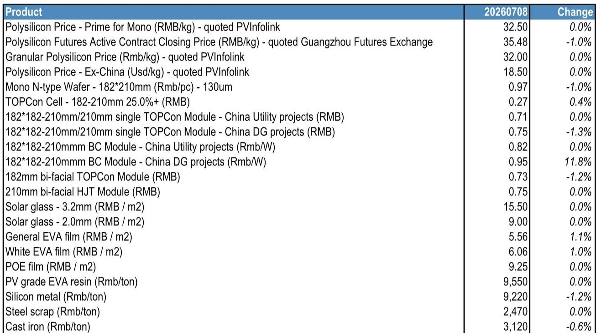

# 中国碳达峰新计划：不仅是政策延续，更是电网设备、可再生能源与核电运营的资金流向信号

中国“十五五”碳达峰行动计划（2026-2030年）于2026年7月9日发布，设定了到2030年二氧化碳强度较2025年下降17%、非化石能源占比达到25%的目标。次日，国家能源局发布了2026-2028年节能降碳行动计划，要求到2028年非化石能源占比每年提升约一个百分点，并推动达到能效基准水平的煤电装机容量占比提高15个百分点。这些目标与以往政策方向总体一致，但如今有了具体的近期执行机制作为支撑，这将重塑中国能源价值链上的资金流向。对于观察者而言，关键问题不在于中国是否会建设更多可再生能源——这已是共识——而在于随着政策框架从愿景转向执行，设备与发电生态系统中的哪些环节将迎来最显著的回报增长。

这一政策序列的核心启示是，中国正从产能扩张阶段转向电网整合与效率提升阶段。那些解决电网灵活性问题的设备制造商——特高压输电、储能、需求响应系统和智能计量——将获得不成比例的价值。与此同时，在发电企业中，拥有稳定或改善中的电价机制的核电与水电运营商，在利率下行环境中提供了最具吸引力的风险调整后回报表现。报告围绕这些主题提出的核心公司观点，结合中广核电力和长江电力二季度运营数据，为布局提供了具体框架。

## “十五五”规划与国家能源局2026-2028年执行计划为电网基础设施与设备公司创造三年窗口期

两项政策公告最可操作的含义是，中国电网必须吸收快速增长的波动性可再生能源发电量，同时淘汰或升级低效煤电机组。国家能源局提出的到2028年达到能效基准水平的煤电装机容量占比提高约15个百分点的目标，意味着约150-200吉瓦的煤电机组需要进行改造或替代。这为灵活煤电运营、混燃试点以及碳捕集利用与封存示范项目创造了需求，但更大的受益者是电网设备领域。

报告指出，特锐德电气今年迄今的数据中心订单已超过2025年全年水平，管理层预计今年国内数据中心订单将弹性较高。这并非孤立数据点。在人工智能和云计算驱动下，中国数据中心电力需求正以每年15-20%的速度增长，这些设施需要高压预制式变电站和先进的配电系统。特锐德管理层还表示，中东地区的预制式变电站订单今年可能弹性较高以上，市场份额约50%，同时来自欧洲和澳大利亚的订单也在增长。与伊顿的合作正在扩大特锐德的海外业务范围，其新开发的高压交流转低压直流解决方案已吸引包括美国在内的数据中心客户询价。以不到20倍的一年远期市盈率计算，估值尚未完全反映这一订单势头。

智能电表龙头威胜控股是另一个直接受益者。国家能源局的计划要求扩大绿色电力和证书市场机制，改进排放核算，这需要精细化的计量基础设施。威胜的盈利增长由海外扩张、新产品、电网招标复苏和数据中心订单驱动。随着中国迈向实时碳核算和更精细的需求侧管理，政策框架为智能电表提供了多年需求基础。

## 可再生能源设备制造商面临双速市场：海上风电、储能与新兴市场分布式发电

风电和太阳能装机扩张的政策目标已广为人知，但报告中的公司选择揭示了更细微的机会。在可再生能源设备制造商中，报告偏好东方电缆、金风科技-H、德业股份和阳光电源。这些公司各自受益于超越一般可再生能源装机增长的特定结构性趋势。

东方电缆专注于海上风电海底电缆，这是一个进入壁垒高、竞争格局稳定、盈利能力强的细分领域。经过一段政策调整期后，中国海上风电需求正在复苏，“十五五”规划对沿海省份脱碳的重视支持了多年建设。金风科技-H受益于出口销售增长以及风力发电机组业务超出预期的毛利率。出口渠道尤为重要，因为它分散了对国内电价压缩的依赖，使金风能够在竞争强度较低的市场获得更高利润。

德业股份和阳光电源都与储能相关，但通过不同渠道。德业的优势在于新兴市场的分布式发电储能，受益于能源韧性带来的趋势。德业在这些市场是先行者，具有成本优势。阳光电源则受益于全球储能系统需求的增长，报告将人工智能数据中心储能系统开发视为一个新兴催化剂。国家能源局的计划明确要求扩大储能以吸收更多可再生能源，而数据中心热潮增加了一层增量需求，尚未完全反映在共识预期中。

与报告中建议回避的公司——通威股份（多晶硅）和迈为股份（异质结电池设备）——的对比，凸显了供应链定位的重要性。通威处于多年多晶硅下行周期，2025年亏损，估值缺乏吸引力。迈为过去两年异质结电池设备订单量下降，未来订单前景不明。启示在于，即使在可再生能源主题内，那些暴露于商品化、产能过剩环节的公司会损害价值，而拥有技术差异化、高进入壁垒或处于高增长细分领域的公司则会创造价值。

## 核电与水电运营商在利率下行环境中提供防御性盈利增长，中广核电力受益于装机增加及潜在的电价机制改善

报告对中广核电力和长江电力的运营更新，提供了对中国非化石基荷发电健康状况的实时检验。中广核电力2026年第二季度核电发电量达到58,640吉瓦时，同比增长3.5%。增长来自大亚湾、岭东和宁德机组出力增加，以及惠州和苍南机组投入商业运营，部分被台山机组出力下降所抵消。装机增加对电量增长有利，但更重要的催化剂是2026/27年可能改善的电价机制。随着可再生能源扩张，中国核电电价结构一直受到系统边际成本下降的压力，但政策推动非化石基荷以及确保核电经济性以保障安全和投资回收的需求，可能支持电价稳定或改善。中广核电力获得报告观点，电量增长与电价改善的结合可能推动盈利加速。

长江电力2026年第二季度水力发电量为709亿千瓦时，同比增长2.8%，主要得益于三峡和葛洲坝电站出力增强，部分被其他四大电站出力下降所抵消。报告将长江电力视为中国独立发电商中的首选防御性标的，其商业模式最具防御性，杠杆率低，现金流强劲，且有分红承诺。在中国利率下行周期中，这降低了稳定现金流的折现率，长江电力的股息率相对于债券变得更具吸引力。该股是寻求公用事业板块内收益和资本保值的读者的核心持仓。

## 布局中国公用事业与可再生能源价值链的决策框架

报告中的政策目标、运营数据和公司选择相结合，为观察者提供了一个三部分决策框架。

首先，配置于解决电网整合瓶颈的电网基础设施和设备公司。政策框架明确针对特高压输电、储能、抽水蓄能、需求响应和智能计量。特锐德电气和威胜控股等公司拥有可见的订单管道、海外扩张选择权以及尚未完全反映多年需求周期的估值。数据中心趋势增加了一个独立的需求驱动因素，不依赖于可再生能源建设时间表。

其次，在可再生能源设备中，偏好具有高进入壁垒或处于高增长细分领域的公司。海上风电海底电缆（东方电缆）、风机出口（金风科技-H）以及面向新兴市场和数据中心的储能（德业股份、阳光电源）提供了比商品化的太阳能制造更好的风险回报。回避处于结构性供应过剩周期的公司，如多晶硅和传统太阳能设备。

第三，对于发电领域，优先考虑具有改善电价机制和防御性现金流的核电与水电运营商。中广核电力提供来自装机增加的电量增长以及潜在的电价上行空间，而长江电力在利率下行环境中提供稳定收益。两者均获得报告观点，并得到政策推动非化石基荷的支持。

报告承认，大多数政策目标是先前目标的延续，符合预期。价值不在于目标的新颖性，而在于执行计划的具体性以及确认潜在趋势的运营数据。利用这一框架关注电网设备和防御性发电商、同时回避商品化供应链的观察者，将为中国能源转型的下一阶段做好准备。

*仅供参考。部分内容可能基于源材料通过AI辅助生成、翻译、总结或编辑，可能存在遗漏或错误。请独立核实。本文不构成任何专业建议。*

仅供参考。部分内容可能基于源材料通过AI辅助生成、翻译、总结或编辑，可能存在遗漏或错误。请独立核实。本文不构成任何专业建议。

