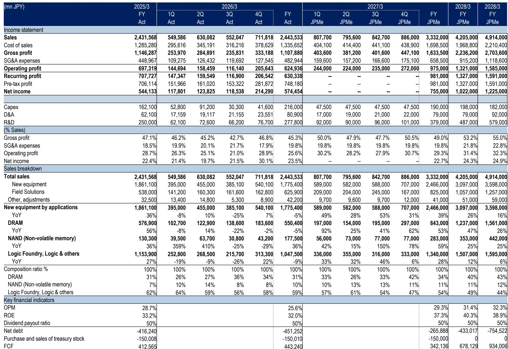
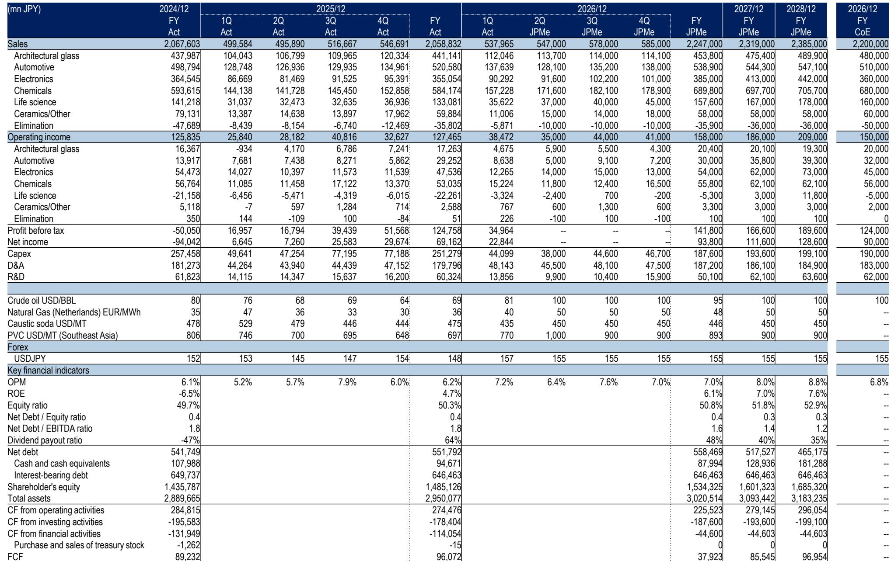
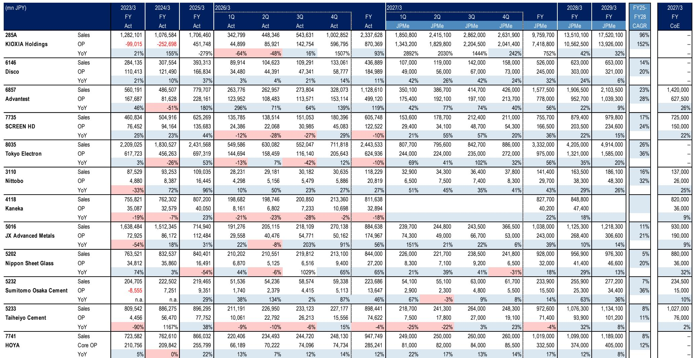

# Japanese Semiconductor Supply-Chain Materials Are Entering a Structural Re-Rating That Pure-Play Equipment Stocks No Longer Capture

The most striking data point in the latest sector analysis is not the 135.7% three-year EPS CAGR projected for Kioxia Holdings, nor the 2,596.9% one-year price return that has already occurred. It is the fact that the Technical Materials sub-group—companies producing glass substrates, cement-based ceramics, advanced metals, and chemical compounds—trades at an average one-year forward P/E of 21.2x while delivering a three-year EPS CAGR of only 13.1%. Meanwhile, the Semiconductor/SPE group trades at 43.6x forward earnings with a 20.3% EPS CAGR. The premium for the equipment names is 2.1x the earnings growth differential. That gap is not sustainable, and it signals that the materials segment has been systematically undervalued relative to the structural demand shift occurring in advanced packaging, high-bandwidth memory, and chiplet architectures.

The semiconductor industry is no longer a simple story of shrinking transistors on a monolithic die. The physics of extreme ultraviolet lithography has reached a point where further node shrinks deliver diminishing economic returns for many application segments. What has emerged instead is a heterogeneous integration paradigm: multiple chiplets connected through advanced packaging, interposers, and through-silicon vias. This shift places an enormous premium on the materials that enable these interfaces—not the equipment that patterns them. The report's data on JX Advanced Metals, Nippon Electric Glass, and Nitto Boseki reveals a cluster of companies whose revenue growth trajectories are beginning to decouple from the traditional semiconductor capex cycle. Their 9.2% average three-year sales CAGR for the materials group understates the inflection point that is now visible in their order books and customer qualification cycles.

Why now matters: the market has already priced the equipment cycle into Tokyo Electron at 44.6x forward earnings and Advantest at 40.7x. But the materials that feed into advanced packaging substrate capacity, glass core interposers, and high-purity metal targets are only beginning to reflect this demand in their valuations. The average PBR for the materials group is 1.5x versus 9.2x for the semiconductor equipment group. Even after adjusting for lower ROE—7.7% versus 24.5%—the discount implies that market participants are still treating these companies as cyclical commodity suppliers rather than structural beneficiaries of the most important architectural shift in semiconductor design since the introduction of the planar transistor.

## The Advanced Packaging Transition Has Created a New Demand Vector That Materials Companies Are Uniquely Positioned to Serve

The traditional semiconductor value chain rewarded companies that could enable smaller feature sizes. ASML, Applied Materials, and Tokyo Electron captured the bulk of the value because they owned the bottleneck. The transition to heterogeneous integration changes this. When a chip designer combines a 5-nanometer compute die with a 14-nanometer I/O die on a silicon interposer, the limiting factor is no longer the lithography tool but the material properties of the interposer, the thermal management of the package, and the reliability of the metal-to-metal bonds between chiplets.

Consider the case of Nippon Electric Glass, which produces glass substrates for semiconductor packaging. The report shows it trades at 16.7x forward earnings with an ROE of only 5.3%. Yet its revenue growth profile is shifting as major foundries and OSATs qualify glass core substrates for next-generation 2.5D and 3D packaging. Glass offers superior dimensional stability, lower coefficient of thermal expansion mismatch with silicon, and better high-frequency electrical properties than organic substrates. The market has not yet priced the multi-year qualification cycles that have already been completed. The same logic applies to JX Advanced Metals, whose sputtering targets for advanced memory and logic are experiencing demand that is less correlated with wafer starts and more correlated with the number of metal layers in advanced packages.

The critical insight is that equipment companies benefit from capacity additions, which are lumpy and capex-dependent. Materials companies benefit from utilization rates, which are more persistent and less cyclical. As advanced packaging becomes a larger share of total semiconductor output—a trend the report implicitly supports through its coverage of Kioxia's explosive NAND demand and Tokyo Electron's wafer fab equipment exposure—the materials content per wafer increases disproportionately. A standard logic wafer might use one or two metal target types. An advanced package with multiple chiplets and redistribution layers can use five or six different materials. The unit economics favor materials suppliers, yet the valuation multiples have not adjusted.

## The Valuation Disparity Between Equipment and Materials Creates a Compelling Asymmetric Opportunity for Those Who Can Look Through the Cycle

The numbers are stark. The semiconductor equipment group trades at an average one-year forward P/E of 43.6x, with a range from 25.8x (Ulvac) to 86.5x (Nikon). The technical materials group trades at 21.2x, with a range from 9.1x (Taiheiyo Cement) to 45.7x (Nippon Sheet Glass). The EPS growth differential—20.3% for equipment versus 13.1% for materials—does not justify a 2.1x multiple premium. Something else is driving the gap.

Part of the explanation is market structure. The equipment names are large-cap, liquid, and heavily covered by research-side analysts. They are included in every semiconductor thematic fund and ETF. The materials names are smaller, less liquid, and often classified under "Chemicals" or "Glass" rather than "Semiconductors." This classification arbitrage means that institutional flows into the semiconductor theme have bypassed the materials segment. The report's performance data confirms this: the weighted average one-year return for the equipment group is 869.5% versus 159.9% for the materials group. The catch-up trade has already started, but the valuation gap remains wide.

A second factor is the perceived cyclicality of materials. Cement companies like Taiheiyo and Sumitomo Osaka Cement have historically been tied to Japanese construction spending, not semiconductor demand. Yet their specialty cement products are increasingly used in semiconductor manufacturing equipment foundations and cleanroom construction, which is a structural growth driver tied to fab expansion. The report shows Taiheiyo Cement trading at 9.1x forward earnings with a 39.3% EPS CAGR—a combination that is difficult to find anywhere in the semiconductor value chain. The market is still pricing it as a construction materials company, not a semiconductor enabler.

For those studying this space, the decision framework is straightforward: identify which materials companies have completed customer qualifications for advanced packaging applications, then compare their current valuation to the revenue growth that becomes visible once those qualifications convert to volume orders. The report's data on Nitto Boseki is instructive. It trades at 31.7x forward earnings with a negative three-year EPS CAGR of -6.3%, yet its one-year price return is 159.9%. The market is pricing a turnaround that has not yet appeared in earnings. The risk is that the turnaround is already discounted. But for companies like JX Advanced Metals, where the EPS CAGR is 25.9% and the forward P/E is 22.2x, the earnings growth is already visible and the multiple is still reasonable.

## A Decision Framework for Allocating Capital Within the Japanese Semiconductor Materials Opportunity

Any observer considering this theme should apply a three-part filter to separate structural winners from cyclical noise.

First, assess the degree of exposure to advanced packaging versus traditional wafer fab materials. Companies whose products are used in interposers, redistribution layers, through-silicon vias, and high-bandwidth memory stacks will benefit from the structural shift. Companies whose products are primarily used in front-end-of-line wafer processing will remain tied to the traditional capex cycle. The report's coverage of Kioxia—whose NAND flash relies heavily on advanced packaging for 3D stacking—illustrates this distinction. Kioxia's suppliers of metal targets and bonding materials are more structurally positioned than suppliers of lithography-related chemicals.

Second, evaluate the qualification cycle. Semiconductor materials require 12 to 24 months of customer qualification before volume production begins. Companies that have already completed qualifications with leading foundries or OSATs have a clear revenue visibility advantage. The report's data on Nippon Electric Glass, which shows a modest 3.5% sales CAGR but a 5.4% EPS CAGR, suggests that its qualification efforts are beginning to bear fruit. The low current growth reflects the lag between qualification and volume, not the absence of demand.

Third, compare the PBR to the ROE trajectory. The materials group trades at 1.5x PBR with an average ROE of 7.7%. If ROE improves to the 12-15% range—which is achievable as advanced packaging volumes scale—the PBR should re-rate toward the 2.5-3.0x range, even without multiple expansion. This is not a speculative bet on multiple compression. It is a fundamental argument that earnings power is understated by current financial statements because the revenue from advanced packaging qualifications has not yet been recognized.

The report provides one cautionary data point: Nippon Sheet Glass trades at 45.7x forward earnings with a negative EPS CAGR and a PBR of 0.6x. This is a value trap, not an opportunity. The company's exposure to architectural glass and automotive glass overwhelms any semiconductor-related revenue. The market is correctly assigning a low multiple to a declining business. The lesson is that not all materials companies are created equal. The opportunity is concentrated in companies where semiconductor-related revenue is a meaningful and growing share of total revenue, not a marginal diversification effort.

## The Re-Rating Has Already Begun in Price but Has Not Yet Been Confirmed by Earnings, Creating a Window for Fundamental Research

The performance data in the report reveals a clear pattern. Over the past six months, the semiconductor equipment group returned 149.9% on a weighted average basis, while the materials group returned 69.3%. The one-year numbers are even more dramatic: 869.5% versus 159.9%. The materials group has begun to catch up, but the valuation gap remains wide enough to suggest that the re-rating has further to run.

The critical question is whether earnings will confirm the price movement. If the materials companies deliver EPS growth in line with the report's projections—13.1% CAGR for the group—then the current P/E of 21.2x is reasonable but not cheap. The opportunity is not in multiple expansion alone. It is in the possibility that the EPS CAGR for the materials group is understated because the report's forecasts do not fully capture the advanced packaging ramp. The report's own data shows that JX Advanced Metals has a projected EPS CAGR of 25.9%, which is higher than the group average and comparable to the equipment group. If other materials companies begin to report similar growth trajectories, the entire group will re-rate upward.

For those who are willing to look through the next 12 to 18 months of earnings reports, the asymmetric payoff is clear. The downside is limited by the low starting valuation and the existence of non-semiconductor revenue streams that provide a floor. The upside is driven by the structural shift in semiconductor architecture, which will require more materials per device for years to come. The equipment companies have already been priced for this future. The materials companies have not.

*For informational purposes only. Portions may be generated, translated, summarized, or edited with AI assistance based on source materials and may contain omissions or errors. Please verify independently. This is not professional advice.*

For informational purposes only. Portions may be generated, translated, summarized, or edited with AI assistance based on source materials and may contain omissions or errors. Please verify independently. This is not professional advice.

