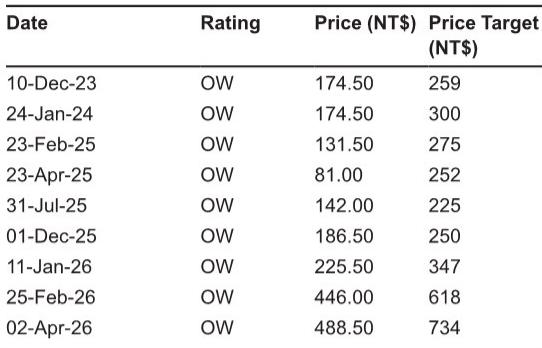

# AI服务器PCB供应链并非静态的赢家通吃市场——单一产品周期内的领导地位更迭

欣兴电子预计将在下一代主要AI服务器平台的算力托盘板中占据约40%的份额，这与当前一代初期不足20%的份额形成显著反转。这一变化并非跨产品周期的渐进演变，而是由当前领导者胜宏科技的具体技术问题以及欣兴电子在其他高增长领域的产能限制所驱动的中期再平衡。这一发展揭示了观察者和供应链管理者需要关注的关键战略现实：AI服务器PCB和HDI领域的领导地位是脆弱的，取决于平台认证时刻的技术执行，并且在一代产品达到峰值产量之前就可能发生快速变化。

当前一代的领导者胜宏科技，其地位建立在特定算力托盘设计的先发认证优势上。但供应链核查显示，胜宏科技正在处理一个轻微的技术问题，这为欣兴电子在即将到来的托盘迭代中重新占据主导地位打开了大门。报告明确指出，整体GPU服务器项目时间表没有延迟迹象，且该问题本质上不被视为严重。这不是灾难性的失败，而是一个竞争脆弱点，它改变了这个由单一认证周期结果决定份额的市场重心。

这一变化的时间点很重要。即使没有这次份额增长，欣兴电子已经面临PCB和HDI产能非常紧张的局面，因为它一直在将资源重新分配到其他快速增长领域，如光收发模块mSAP板。该公司在AI服务器算力托盘领域赢得份额的同时，其整体产能正受到来自完全不同终端市场的需求压力。这种双重压力意味着，欣兴电子服务AI服务器产能爬坡的能力本身可能成为一个制约因素，从而为其正在取代的供应商创造了二次机会。

## 当前领导者的技术问题创造了一个既真实又暂时的窗口

胜宏科技的份额回撤并非结构性的，而是在下一代算力托盘修订版的认证过程中出现的一个可解决的技术问题所致。报告将此描述为一个轻微问题，措辞是审慎的。但在AI服务器供应链的背景下，认证窗口狭窄且失败成本高昂，即使是轻微问题也可能重塑整个一代产品的竞争格局。关键问题是胜宏科技能否在同一平台周期内的后续托盘迭代中解决问题并重新获得相当的份额。

报告指出，胜宏科技暂时可能会与一家新供应商分享相当的份额。这是一个重要的让步。这意味着当前领导者的份额不会直接降至零，而是将与一个在初始一代中并非主要角色的进入者共享。对于关注HDI供应链的观察者来说，这意味着即将到来的周期将呈现三方动态而非两方：欣兴电子居首，胜宏科技恢复，以及一家新供应商首次获得可观的产量。报告明确指出，这表明该新进入者的份额可能超出温和预期。

## 欣兴电子的产能紧张是可能限制其上行空间的隐形约束

获得算力托盘40%的份额对欣兴电子而言是明确的积极因素，但该公司自身的供应状况使这一叙事变得复杂。报告指出，即使不考虑份额改善，欣兴电子已经面临PCB和HDI产能非常紧张的局面。原因不仅仅是AI服务器需求，还包括公司战略性地将资源转向光收发模块mSAP板——一个与数据中心互联扩展相关的高增长领域。

这造成了一个悖论。欣兴电子在赢得更多AI服务器业务的同时，其产能正被另一个快速增长领域所消耗。这意味着欣兴电子可能无法完全兑现其赢得的份额增长，至少在短期内如此。紧张的供应状况可能限制其为新算力托盘提升产量的能力，从而可能将部分产量让回给胜宏科技或新进入者。对于观察者而言，对欣兴电子的乐观看法必须认识到，产能（而不仅仅是认证资格）才是约束条件。

## 光收发模块mSAP的资源转移揭示了一个更广泛的战略权衡

欣兴电子将资源分配给光收发模块mSAP板并非偶然，它反映了对AI数据中心内光互联增长的深思熟虑的押注。随着计算集群的扩展，对高速光收发模块的需求正在加速，而mSAP工艺对于所需的精细线路基板至关重要。通过优先考虑这一领域，欣兴电子正在为一个可能比任何单一AI服务器平台世代拥有更长增长周期的长期趋势进行布局。

然而，这种权衡是，这一战略选择在PCB和HDI业务中创造了一个竞争对手可以利用的脆弱点。如果欣兴电子因其资源被光收发模块基板占用而无法完全满足AI服务器算力托盘的需求，那么胜宏科技或新进入者可能获得比当前份额估计更多的产量。报告没有量化这一风险，但逻辑是清晰的：一家赢得40%份额但无法交付40%产量的公司，实际上赢得的份额更小。

## 评估AI服务器PCB周期中供应商风险的决策框架

评估这一市场风险的观察者和供应链管理者应应用一个考虑三个相互依赖变量的框架：认证状态、产能可用性和竞争响应时间。当前情况提供了一个具体的测试案例。

首先，认证状态是入场券，但不是产量的保证。欣兴电子已获得下一代算力托盘的认证，但其交付能力取决于从其他产品中释放的产能。其次，产能可用性是短期内的约束条件。欣兴电子的紧张状况意味着，即使胜宏科技的技术问题得到解决，如果新进入者能够更快地扩大规模，现任者可能也无法充分利用这一机会。第三，竞争响应时间决定了份额格局再次变化的速度。胜宏科技的问题被描述为轻微，表明在同一产品周期内可能得到解决，这可能在达到峰值产量之前恢复更平衡的份额分布。

该框架表明，最具吸引力的定位不一定与当前的份额领导者在一起，而是与同时拥有认证资格和闲置产能的供应商在一起。在这个周期中，这可能是新进入者，它最有可能从欣兴电子和胜宏科技的双重错位中获益。报告指出新进入者的份额可能超出温和预期，这与这一逻辑一致。

## 结构性启示：AI服务器PCB领导地位是一种易逝资产

从这次供应链变化中得出的最重要启示是，AI服务器PCB和HDI领域的领导地位无法跨代持久。欣兴电子在当前一代中输给了胜宏科技，现在正在重新夺回。胜宏科技的领先地位建立在率先认证的基础上，而非不可逾越的技术护城河。导致胜宏科技份额损失的技术问题很轻微，但足以颠覆竞争秩序。

随着AI服务器架构的快速演进，这种模式很可能会重复。每一个新的算力托盘设计都会创造一个新的认证事件，每个事件都会重置竞争格局。擅长快速认证和灵活产能分配的供应商将在单个周期中获胜，但没有任何单一供应商能在多个世代中保持主导份额。对于观察者而言，这意味着PCB和HDI供应链更适合作为一系列离散的竞争事件来分析，而非一个稳定的市场结构。一代产品的赢家并不能保证成为下一代的赢家，而输家也永远不会被永久淘汰。

*仅供参考。部分内容可能基于源材料通过AI辅助生成、翻译、总结或编辑，可能存在遗漏或错误。请独立核实。本文不构成任何专业建议。*

仅供参考。部分内容可能基于源材料通过AI辅助生成、翻译、总结或编辑，可能存在遗漏或错误。请独立核实。本文不构成任何专业建议。

