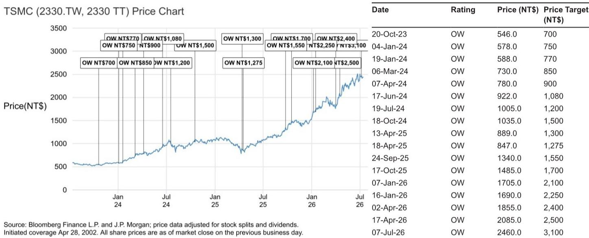

# JPM：台积电2Q26营收达指引高端-毛利率有望超预期

台积电6月营收4430亿新台币，环比增长6%，同比增长68%。以此推算，第二季度营收达到1.27万亿新台币，环比增长12%，同比增长36%，落在公司美元指引的高端区间。这份来自JPM的研究认为，更值得关注的不是营收，而是毛利率——第二季度毛利率很可能超过指引上限，逼近70%的水平。

支撑这一判断的，是三个同时发生的结构性变化：先进制程利用率持续超过100%，热运行和超热运行订单带来50%至100%的溢价，以及效率的持续改善。报告特别指出，N3和N5制程的利用率已经达到120%以上，这意味着台积电不仅在满产，而且在超负荷运转。

> **KC评论：** 毛利率逼近70%这个数字本身值得留意。台积电官方指引通常在65.5%至67.5%之间，实际结果如果达到69.5%，意味着定价权和利用率带来的增量利润远超市场预期。这背后反映的不是短期波动，而是供需失衡的持续加深。

## 1. 供需缺口至少延续到2028年，涨价周期尚未结束

报告对供需格局的判断非常明确：先进制程的供给缺口将持续到2027年甚至2028年初。原因有三：AI需求加速、N3和N2营收持续增长、以及产能建设周期长于需求增长周期。

即便台积电已经在加速扩产——JPM将2026至2028年的资本支出预期分别上调至580亿、780亿和840亿美元——供需缺口仍然难以弥合。报告估算，仅N3制程当前的供需缺口就达到约60万片晶圆。到2026年底，N3月产能预计达到16.7万片，2027年底21.3万片，2028年底24万片，但缺口依然存在。

基于这一判断，报告预期台积电将在2027年进行新一轮涨价：N3和N2制程涨幅约8%至10%，N5、N7和CoWoS也有温和上调。这轮涨价不是临时性的成本转嫁，而是结构性供需失衡下的定价权兑现。

## 2. CPU成为AI需求的新增长极，CoWoS产能扩张速度弹性较高

报告识别出一个容易被忽视的变化：CPU正在成为AI需求的新驱动力。随着代理型AI需求的上升，NVIDIA的Vera和AMD的Venice都将开始采用CoWoS封装，更多ASIC CPU可能跟进。

这一变化直接推高了先进封装的需求预期。JPM预计，台积电CoWoS产能到2026年底将达到每月11.5万片，2027年底达到19万片，同比分别增长95%和65%。即便如此，供给仍然紧张。

> **KC评论：** CPU加入CoWoS需求池是一个信号。过去市场对AI芯片的讨论主要集中在GPU和ASIC加速器上，CPU作为新变量意味着AI基础设施的研究范围正在扩大，而台积电是这一趋势最直接的受益者。

## 3. 毛利率短期有支撑，中期有结构性韧性

市场对毛利率的担忧主要来自两个方向：N2制程的爬坡稀释和海外工厂的成本影响。报告对此给出了相对清晰的回应。

短期来看，第二季度毛利率有望达到69.5%，第三季度预计回落至67.6%左右，但仍处于高位。中期来看，N3制程的毛利率预计在2026年下半年超过公司平均水平，这将有效对冲N2和海外产能带来的稀释。报告判断，未来几个季度毛利率将稳定在67%至68%之间。

这一判断的底层逻辑是：产品组合持续优化，HPC占比不断上升；定价环境依然有利；利用率维持高位。即便有稀释因素，毛利率的节奏变化空间有限。

## 4. 业绩会上需要关注的六个信号

报告列出了即将召开的业绩会值得关注的六个议题，这实际上提供了一个观察框架：毛利率能否维持在高位、需求与产能的动态、营收指引是否上调、竞争格局的回应、资本支出是否超预期、以及数据中心AI TAM的更新。

其中，营收指引的潜在上修值得留意。公司此前给出的2026年指引是美元营收同比增长“超过30%”，报告认为可能上调至“中高30%”区间。这将是判断需求是否持续加速的直接信号。

另一个值得关注的是资本支出指引。公司此前给出的2026年资本支出上限为560亿美元，报告预期公司会上调这一数字，并对2027至2028年的资本支出给出定性评论。如果资本支出指引大幅上修，意味着公司对长期需求的信心比市场预期的更强。

For informational purposes only. Portions may be generated,translated,summarized,or edited with AI assistance based on source materials and may contain omissions or errors. Please verify independently. This is not investment,legal,tax,accounting,or other professional advice.

For informational purposes only. Portions may be generated,translated,summarized,or edited with AI assistance based on source materials and may contain omissions or errors. Please verify independently. This is not investment,legal,tax,accounting,or other professional advice.

