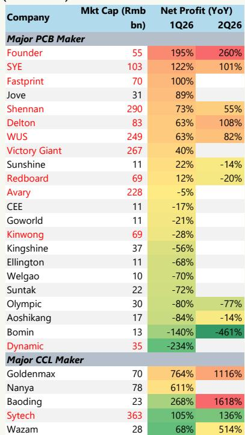

# The PCB and CCL Market Is Splitting Into Two Distinct Regimes, and Only One Offers Structural Growth

The preliminary earnings results for the first half of 2026 reveal a market that is no longer moving in unison. Among the major PCB makers in China, net profit growth in the second quarter ranged from a 461% decline at Bomin to an 82% increase at WUS. This is not a cyclical trough affecting everyone equally. It is a structural divergence driven by one variable: exposure to AI-related demand and the ability to manufacture high-end substrates. WUS reported second-quarter net profit of approximately RMB 1.67 billion, beating both consensus estimates, while Shennan and SYE also delivered results that exceeded expectations. Meanwhile, Redboard, a company with capabilities in mSAP and SAP-related products but limited AI exposure, saw its adjusted net profit drop 20% year-over-year in the same period.

The pattern is even starker when the analysis extends to copper-clad laminate (CCL) manufacturers. Low-end CCL players are experiencing what appears to be a dramatic profit rebound, with Goldenmax posting a 1,116% year-over-year increase in second-quarter net profit and Baoding recording 1,618% growth. But these numbers are deceptive. They are coming off extremely low bases, with net profit margins below 5% in the first half of 2025. Sytech, the leading high-end CCL vendor, grew net profit 136% in the second quarter, a figure that looks modest only in comparison to the explosive recovery of the laggards. Sytech's net profit margin already exceeded 10% in the prior year, meaning its growth represents genuine earnings power rather than a normalization from distress.

The implication is clear. The PCB and CCL supply chain is bifurcating into two regimes. In one regime, companies benefit from secular growth driven by AI infrastructure buildout and next-generation material upgrades. In the other, companies depend on cyclical factors such as raw material pass-through, capacity shifts by global leaders, and temporary inventory restocking. These two regimes demand fundamentally different analytical frameworks and risk assessments. Those who treat the entire sector as a single theme risk conflating a cyclical sugar high with structural compounding.

## AI-Exposed PCB Makers Are Demonstrating a Virtuous Cycle of Capacity Expansion and Demand Fulfillment That Non-AI Players Cannot Replicate

The earnings performance of WUS, Shennan, and SYE is not an accident of timing. It reflects a self-reinforcing dynamic that is absent from the rest of the PCB universe. These companies have secured robust order pipelines that are being filled by continued capacity expansion, and they have demonstrated that rising materials costs have only a limited impact on their profitability. WUS's second-quarter net profit of roughly RMB 1.67 billion exceeded even aggressive expectations of less than RMB 1.6 billion, and the improvement was attributed partly to the Thailand factory achieving break-even in the second quarter. This is a signal that the geographic diversification of high-end PCB production is progressing faster than many models anticipated.

The contrast with the rest of the PCB universe is instructive. Among the 22 major PCB makers tracked, 14 reported negative or decelerating net profit growth in the second quarter. Companies such as Olympic, Aoshikang, and Bomin saw net profit declines of 77%, 14%, and 461% respectively. These are not companies with weak balance sheets or poor execution. They are companies that lack the product mix to participate in the AI-driven demand cycle. The mSAP and SAP capabilities that Redboard possesses were not sufficient to prevent a 20% profit decline when the end-market demand was not AI-related.

This divergence will likely persist into the second half of 2026. The order books for AI PCB names are driven by data center buildout, which remains on a multi-year growth trajectory. The capacity expansion these companies have undertaken is not speculative; it is matched by confirmed customer demand. For non-AI players, the supply-demand dynamics are far less favorable, and there is no equivalent catalyst to reverse the trend.

## Low-End CCL Profit Surges Are a Cyclical Rebound, Not a Structural Inflection, and Depend on Raw Material Dynamics That Can Reverse Quickly

The profit numbers from low-end CCL makers are arresting. Goldenmax reported second-quarter net profit of RMB 573 million, up from RMB 47 million a year earlier. Baoding's profit surged from RMB 4 million to RMB 69 million. Even Nanya, which has not yet reported its second-quarter figure, showed first-quarter profit growth of 611%. These are the kinds of numbers that attract momentum capital and generate thematic headlines.

But the mechanics behind this rebound are entirely cyclical. Three factors are at work. First, low-end CCL makers have been able to pass through rising upstream materials costs thanks to a more concentrated industry landscape, which gives them pricing power in their specific segment. Second, global leading CCL vendors have shifted capacity toward high-end products, creating supply tightness in conventional CCL grades. Third, downstream inventory levels were lean, triggering pull-in orders that amplified the demand signal.

Each of these factors can reverse. Raw material prices can stabilize or decline, removing the pass-through benefit. Global vendors could adjust their capacity allocation. Inventory restocking is by definition a one-time event. The net profit margins of these companies, which were below 5% in the first half of 2025, are recovering from distressed levels. A company that goes from a 3% margin to a 6% margin will show triple-digit profit growth, but it remains a low-margin business vulnerable to any shift in the supply-demand balance.

The sustainability question is not hypothetical. The report explicitly notes that for conventional CCL names, the supply-demand and pricing dynamics of upstream raw materials are critical for continuous monitoring. This is not a growth story. It is a mean-reversion story, and mean reversion can work in both directions.

## The Next Generation of Material Upgrades Is the Only Path to Sustained Dollar Content Growth, and Commercialization Progress in the Next Few Quarters Is the Key Catalyst

The most strategically important observation in the earnings data is not about the current quarter. It is about what comes next. The report states that the progress of next-generation material and specification upgrades, including M9, M10, PTFE, and CoWoP, is crucial for sustained structural growth in dollar content for both PCB and CCL players. This is because the current generation of AI-related PCBs, while profitable, has a finite upgrade cycle. Once the current generation of data center infrastructure is built out, the incremental dollar content per board will plateau unless new materials enable higher performance.

The adoption of M9 material in the current year has been limited due to an immature supply chain. This is a bottleneck that the industry is working to resolve. Any breakthrough in the commercialization of these leading-edge solutions in the next few quarters would have an outsized impact on confidence, because it would extend the visible growth runway for high-end PCB and CCL players well beyond the current infrastructure cycle.

For Sytech, which is the most prominent local high-end CCL vendor, the current AI exposure is still limited. Its earnings growth is strong but not yet driven by the next-generation materials that would represent a step-change in value. The company's net profit margin, already above 10%, provides a solid foundation, but the next leg of growth depends on successfully bringing M9 and beyond into volume production. For WUS, Shennan, and SYE, the same dynamic applies. Their current profitability is driven by existing AI demand. Their future profitability will be determined by whether they can capture the premium associated with next-generation substrate materials.

This is the central strategic question for observers in this space. The current earnings cycle is rewarding companies that are positioned for AI demand. The next cycle will reward companies that can also navigate the material upgrade path. These are related but not identical skills. A PCB maker that excels at high-volume production of current-generation substrates may not have the R&D depth or supply chain relationships to lead in PTFE or CoWoP-based products.

## A Decision Framework for Navigating the PCB and CCL Bifurcation

The data from this earnings season supports a structured approach to decision-making in this sector. The framework has three dimensions: end-market exposure, material upgrade capability, and earnings quality sustainability.

First, assess end-market exposure. Companies with direct and significant exposure to AI-related demand, particularly data center infrastructure, are operating in a different competitive environment than those serving automotive, consumer electronics, or industrial end markets. The AI-related demand is structural, backed by multi-year capital expenditure plans from hyperscalers and enterprise customers. Non-AI demand is cyclical and subject to inventory corrections and end-market saturation. The earnings data confirms that AI exposure is the single strongest predictor of profit growth in the current period.

Second, evaluate material upgrade capability. This is a forward-looking assessment that goes beyond current product mix. Companies that have demonstrated the ability to develop and commercialize next-generation materials such as M9, M10, PTFE, and CoWoP will have a longer growth runway and greater pricing power. The report notes that M9 adoption is limited this year due to supply chain immaturity, which means the companies that solve the supply chain challenge first will capture disproportionate value. This is not a commodity business. It is a technology differentiation business.

Third, distinguish between earnings quality and earnings quantity. A low-end CCL maker showing 1,000% profit growth from a sub-5% margin base is not demonstrating the same earnings power as a high-end PCB maker growing 80% from a double-digit margin base. The former is recovering from distress. The latter is compounding from strength. The sustainability of the earnings trajectory matters more than the magnitude of the current quarter's growth rate.

Applying this framework to the data, the companies that score highly on all three dimensions are the AI-exposed PCB leaders and the high-end CCL players with material upgrade roadmaps. The companies that score highly only on the first dimension, or only on the second, require more careful monitoring. The companies that score poorly on all three are likely to face continued earnings pressure regardless of the macro environment.

## The Second-Order Implication Is That Supply Chain Concentration Will Increase as High-End Requirements Raise Barriers to Entry

The bifurcation described in the earnings data has a second-order effect that is not yet fully priced into market expectations. As the industry shifts toward next-generation materials and higher-performance substrates, the barriers to entry for new competitors will rise. Producing M9-grade CCL or PTFE-based PCBs requires not only capital investment but also process expertise, raw material sourcing relationships, and customer qualification cycles that can last multiple quarters.

This means that the current leaders, WUS, Shennan, SYE, and Sytech, are likely to extend their competitive moats over time. The non-AI players that are struggling today will find it even harder to catch up as the technology frontier moves forward. The conventional CCL players that are enjoying a cyclical rebound will face margin compression when the raw material cycle turns, and they will lack the product portfolio to pivot toward higher-value segments.

The result is a market structure that is becoming more concentrated at the high end. This is favorable for the leading players, as it supports pricing power and reduces the risk of capacity oversupply in their specific segments. It is unfavorable for those who are betting on a broad-based recovery across the PCB and CCL universe. The recovery is real, but it is narrow.

For portfolio construction, this implies that a long position in the sector should be selective and concentrated in the names that demonstrate both current AI exposure and a credible path to next-generation material commercialization. A broad-based sector ETF or index approach will dilute the structural growth exposure with cyclical noise from the laggards.

The second half of 2026 will test this framework. If the AI demand cycle continues and the material upgrade path remains on schedule, the leaders will continue to perform. If the AI cycle decelerates or the material upgrades are delayed, the entire sector will face headwinds, but the leaders will still have stronger balance sheets and more diversified revenue streams to absorb the shock. The laggards, in contrast, have no such cushion.

*For informational purposes only. Portions may be generated, translated, summarized, or edited with AI assistance based on source materials and may contain omissions or errors. Please verify independently. This is not professional advice.*

For informational purposes only. Portions may be generated, translated, summarized, or edited with AI assistance based on source materials and may contain omissions or errors. Please verify independently. This is not professional advice.

