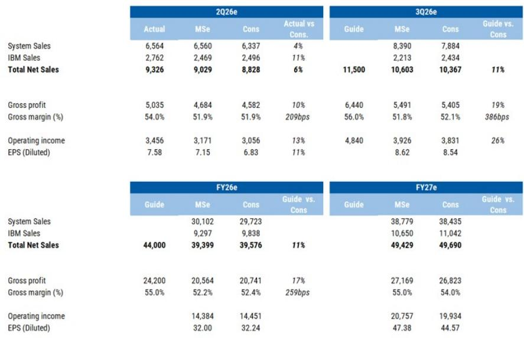
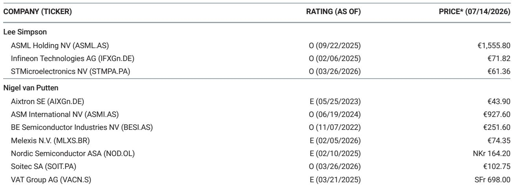
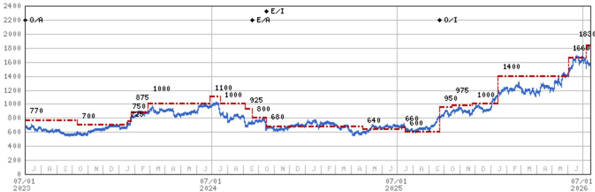

# ASML产能扩张揭示半导体研究新周期：从制程节点经济学到产出经济学

ASML Holding NV公布2026年第二季度净销售额为93亿欧元，较市场普遍预期高出约6%，并预计第三季度销售额为115亿欧元——比市场预期的103亿欧元高出12%。比季度表现更引人注目的是2026年全年指引：销售额440亿欧元，同比增长约34%，超出市场普遍预期11%。2026财年毛利率指引为55%，较市场预期高出约260个基点。

这不仅仅是全球相对少见极紫外光刻系统供应商的强劲季度表现。它表明半导体行业的资本支出模式正在发生结构性转变。该公司目前计划大幅增加低数值孔径EUV系统的产能，目标为2026年约65台，2027年约85台，2028年约110台。客户正在加速产能扩张时间表，并签订长期协议，这表明这是一个多年承诺周期，而非周期性上升。

这一战略含义直接而深远：前沿半导体制造领域的竞争基础正从制程节点差异化转向产出和规模。对于研究者和企业战略制定者而言，这改变了评估ASML乃至整个半导体生态系统的分析框架。

## AI驱动需求正在压缩高数值孔径EUV的采用周期，加速代际技术转型

报告指出，ASML发现客户对高数值孔径EUV系统的准备程度高于此前预期，英特尔在其18A节点上使用高数值孔径EUV的时间早于预期。这并非小幅时间调整。高数值孔径EUV最初被定位为后2纳米时代的技术，预计在2027-2028年期间实现大规模采用。一家主要逻辑制造商已将其用于18A生产，这表明技术转型曲线已经变得更加陡峭。

推动这一加速的机制是AI主导的需求。当报告提到“AI驱动需求尤其推动销售/利润增长”时，它指的是一个特定的因果链。AI加速器需要最先进的逻辑节点来最大化计算密度和能效。这些节点需要EUV光刻技术。随着超大规模云服务商和AI芯片设计者竞相获取最先进的制造产能，他们给晶圆代工厂和集成设备制造商带来了下游压力，要求其更快地安装更多EUV设备。

第二个效应是，ASML的技术路线图与其产能路线图正变得相互依存，这在以往周期中并不常见。历史上，新光刻代际随着制程节点的成熟而逐步被采用。现在，AI计算的紧迫性迫使现有低数值孔径EUV机队和新兴高数值孔径EUV机队同时扩张。这种双重投入动态压缩了典型的采用S曲线，并创造了一条比历史模式更少周期性的收入轨迹。

报告提到，该公司正在“与客户讨论长期协议，作为未来承诺的信号”，这表明客户愿意提前数年锁定产能。在半导体设备行业，长期协议是结构性需求信心的证据。它们不是周期性信号。

## 毛利率较市场预期高出260个基点，反映ASML业务组合的结构性转变，而非一次性表现

2026财年55%的毛利率指引，较市场普遍预期高出260个基点。第二季度54%的毛利率已经超过了公司自身的指引和市场预期。报告将此归因于“更高的销售量和业务组合（包括IBM）”。

IBM的提及很重要。IBM并非量产制造商，而是一个研究和早期生产合作伙伴。将其纳入业务组合讨论，表明ASML的利润率结构正受到更高价值系统安装的推动——特别是那些平均售价和相关服务利润率显著更高的高数值孔径EUV设备。当报告预计第三季度毛利率为55%至57%，而市场预期约为52%时，它反映了一种可能持续的组合转变。

对营业利润的影响更为显著。根据第三季度收入指引115亿欧元、毛利率55%至57%，以及运营费用指引（研发约12亿欧元，销售及管理费用约4亿欧元），隐含的营业利润约为48亿欧元。这意味着营业利润率约为42%，而市场预期为37%。如此规模的500个基点营业利润率差异并非噪音。它表明ASML的运营杠杆在结构上高于市场模型所假设的水平。

对于研究者而言，利润率轨迹之所以重要，是因为它改变了在任何给定收入水平下的盈利计算。如果ASML能够在将系统产量从2026年的65台扩大到2028年的110台的同时，将毛利率维持在55%左右，那么每增加一台系统所带来的增量收益将不成比例地高。研发和销售及管理费用的固定成本基础已基本确定；每增加一美元的系统收入，都会以高增量利润率流入。

## 2028年产能路线图定义了半导体资本密集度的新基准

报告中的产能目标——2026年约65台低数值孔径EUV系统，2027年约85台，2028年约110台——代表了与历史周期性模式的有意脱钩。为了理解这些数字的背景：在上一周期的峰值年份，ASML出货了约40台EUV系统。2028年110台的目标，意味着在五年内将峰值周期产出提高了近两倍。

报告指出，这一产能扩张“正如我们之前所预告的”，表明研究界此前已预见到这一方向，但或许未预料到其规模。关键问题是，什么驱动了对如此大量系统的需求。答案在于AI芯片制造的经济学。

前沿AI加速器是大尺寸芯片器件。单个GPU类芯片可能消耗多个掩模版场，每个晶圆需要多次曝光。这意味着，通过EUV设备处理的每个晶圆，其功能芯片的产出量低于小尺寸芯片的逻辑产品。为了达到超大规模云服务商所要求的AI加速器产量，晶圆代工厂需要安装比同等收入目标的智能手机或PC芯片多得多的EUV设备。

这就是“产出经济学”论点背后的逻辑。过去，半导体制造策略由制程节点领先驱动——即打印更小特征的能力。竞争优势归属于拥有最先进节点的公司。如今，虽然节点领先仍然重要，但AI芯片生产的制约因素是光刻产出。能够每月处理最多EUV晶圆的公司，将拥有最高的AI芯片产量，无论其节点是领先还是落后竞争对手六个月。

这一转变对ASML的估值框架有直接影响。如果EUV系统需求是由产出要求而非节点转换驱动的，那么需求基础将更广泛、更持久。每家晶圆代工厂和主要集成设备制造商都需要更多的EUV设备，而不仅仅是最先进节点的一两家领先者。报告中提到“客户希望加速产能扩张”和“上半年持续非常强劲的订单接收”，支持了这一解读。

## 评估ASML多年轨迹的决策框架：三个结构性指标

对于需要将此分析转化为研究或战略决策框架的读者，有三个指标值得关注，每个都基于报告中的具体数据点。

第一个指标是低数值孔径EUV系统出货量相对于已公布路线图的轨迹。如果ASML在2026年出货65台，则验证了需求论点。如果出货更多，则表明产能约束比公司预期的更为紧张。报告提到该公司正在“与客户讨论长期协议”，这意味着订单可见性远远超出了当前的指引范围。任何对2027年或2028年目标的上调，都将是一个积极信号，表明需求正在加速而非稳定。

第二个指标是毛利率能否维持在55%或以上。报告对2026财年55%的指引高于历史区间。如果ASML能够在系统产量扩大的同时维持或改善这一水平，则将确认向高数值孔径及相关服务收入的组合转变在结构上有利于利润率。需要关注的风险是，数量折扣或来自替代光刻解决方案的竞争压力，是否可能随着时间的推移压缩利润率。

第三个指标是高数值孔径在存储制造中的采用速度。报告指出，一个下行风险是“缺乏高数值孔径采用（DRAM 2028+）抑制倍数”。如果DRAM制造商在2028年之前开始采用高数值孔径EUV，则将在逻辑和晶圆代工之外增加第二个主要需求向量。DRAM生产对产量比逻辑更为敏感，向高数值孔径的过渡将代表ASML可寻址市场的阶梯式增长。

这三个指标——系统数量、毛利率和高数值孔径采用广度——构成了一个连贯的框架，用于评估当前指引是代表周期性峰值，还是结构性更高收入基础的开始。报告中的证据强烈倾向于后一种解释。

## 研究者的策略应对：将周期性假设重新校准为结构性增长

评估ASML时最常见的分析错误，是将其视为一只周期性半导体设备股——随存储和逻辑资本支出周期而涨跌。报告中的数据挑战了这一分类。一家指引2026财年销售额440亿欧元、产能路线图延伸至2028年110台系统、毛利率超过55%的公司，所表现出的特征更符合结构性增长而非周期性扩张。

报告将35倍市盈率应用于2028财年每股收益估计，并提到“我们通常的周期峰值估值区间为30-35倍”以及“与历史峰值一致”。分析师指出“来自显著晶圆代工资本支出的上行潜力，以及持续快速上涨的存储价格”。

其含义是，即使在周期峰值倍数下，2028财年的相对盈利能力也足以证明当前股价水平之上的显著更高价值。如果市场将ASML从周期性重新评级为结构性增长框架，其倍数可能超出历史峰值区间。报告并未明确做出这一论点，但数据支持它。

报告中概述的风险因素值得在此背景下考虑。“终端市场需求显著减弱（尤其是晶圆代工/DRAM）”和“强劲通胀周期及中国因素导致放缓及更多订单推迟”代表了传统的周期性风险。但长期协议的存在和加速的产能承诺表明，当前需求比以往周期更具契约性，投机性更少。客户订购EUV设备并非基于对未来需求的预期；他们订购是因为有已承诺的AI芯片生产目标，需要这些设备安装并运行。

最后一个风险——“缺乏高数值孔径采用（DRAM 2028+）”——是最直接挑战结构性论点的风险。如果高数值孔径采用仍局限于逻辑和晶圆代工，总可寻址市场虽大但有限。如果DRAM采用高数值孔径，市场将大幅扩张。报告并未解决这一不确定性，但它提供了足够证据表明逻辑领域的采用正在加速，使得看多论点具有可信度。

仅供参考。部分内容可能基于源材料通过AI辅助生成、翻译、总结或编辑，可能存在遗漏或错误。请独立核实。本文不构成研究、法律、税务、会计或其他专业建议。

仅供参考。部分内容可能基于源材料通过AI辅助生成、翻译、总结或编辑，可能存在遗漏或错误。请独立核实。本文不构成研究、法律、税务、会计或其他专业建议。

